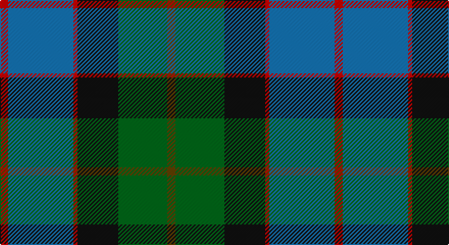

This page is one **sett** — a single exact thread-count. It belongs to the [tartan](/setts/dy2g12k10r1b16r2/)
(the same proportion at any scale), whose colour order is pattern [GGKRBR](/stripes/ggkrbr/).

Part of the [MacWilliam](/tartans/macwilliam/) tartan — the named design grouping this sett with its other cloths.

Sourced from tartans-authority.  It is a [6 stripe tartan](/stripes/stripes6/).

Original link http://www.tartansauthority.com/tartan-ferret/display/1418/

## Register references

External register numbers recorded for this tartan.

- Scottish Tartans Authority (ITI): 1418

## Thread count
R/8 B64 R4 K40 G48 T/8

One full sett is **328 threads**.

## Palette

Palette: <strong>Tartan Register</strong>
<table><thead><tr><th>Colour</th><th>Threads</th><th>Shade</th><th>Base</th><th>OKLCh</th></tr></thead><tbody><tr><td>R/</td><td style="text-align:right;font-variant-numeric:tabular-nums">8</td><td><code style="background-color:#C80000;">#C80000</code> <small style="color:#888">#C80000</small></td><td>R <code style="background-color:#CC0000;">#CC0000</code></td><td><small style="color:#888">oklch(52.3% 0.215 29.2)</small></td></tr><tr><td>B</td><td style="text-align:right;font-variant-numeric:tabular-nums">64</td><td><code style="background-color:#1474B4;">#1474B4</code> <small style="color:#888">#1474B4</small></td><td>B <code style="background-color:#2A418A;">#2A418A</code></td><td><small style="color:#888">oklch(54.0% 0.129 245.1)</small></td></tr><tr><td>R</td><td style="text-align:right;font-variant-numeric:tabular-nums">4</td><td><code style="background-color:#C80000;">#C80000</code> <small style="color:#888">#C80000</small></td><td>R <code style="background-color:#CC0000;">#CC0000</code></td><td><small style="color:#888">oklch(52.3% 0.215 29.2)</small></td></tr><tr><td>K</td><td style="text-align:right;font-variant-numeric:tabular-nums">40</td><td><code style="background-color:#101010;">#101010</code> <small style="color:#888">#101010</small></td><td>K <code style="background-color:#000000;">#000000</code></td><td><small style="color:#888">oklch(17.3% 0.000 89.9)</small></td></tr><tr><td>G</td><td style="text-align:right;font-variant-numeric:tabular-nums">48</td><td><code style="background-color:#006818;">#006818</code> <small style="color:#888">#006818</small></td><td>G <code style="background-color:#006100;">#006100</code></td><td><small style="color:#888">oklch(45.0% 0.142 145.0)</small></td></tr><tr><td>T/</td><td style="text-align:right;font-variant-numeric:tabular-nums">8</td><td><code style="background-color:#604000;">#604000</code> <small style="color:#888">#604000</small></td><td>G <code style="background-color:#006100;">#006100</code></td><td><small style="color:#888">oklch(39.8% 0.083 76.8)</small></td></tr></tbody></table>

# Sample pattern

## Compared to the master

This cloth is one sett of its design; the master sett (the exemplar the design is anchored on) is below for comparison.

<figure style="margin:0"><figcaption style="color:#888;font-size:smaller">this sett</figcaption></figure>
<figure style="margin:0"><figcaption style="color:#888;font-size:smaller"><a href="/setts/dy2g12k10r1b16r2b16r1/">master sett →</a></figcaption></figure>

## Nearest tartans

The nearest existing variants by ΔTartan distance, with this tartan at the top so the swatches line up against it.

ΔTartan

Tartan

Sett

—

<a href="/ttd/edit/#slug=dy2g12k10r1b16r2~x4">MacWilliam (Clan)</a> <a class="nn-out" href="/variants/s6/dy2g12k10r1b16r2~x4/" title="open its dictionary page">↗</a>

0.75

<a href="/ttd/edit/#slug=g2b22r2k21g23ly2~x2&amp;base=dy2g12k10r1b16r2~x4">Royal Ashburn Golf Club</a> <a class="nn-out" href="/variants/s6/g2b22r2k21g23ly2~x2/" title="open its dictionary page">↗</a>

0.79

<a href="/ttd/edit/#slug=g3db12w1k12g13r2g2~x2&amp;base=dy2g12k10r1b16r2~x4">Paterson (Personal)</a> <a class="nn-out" href="/variants/s7/g3db12w1k12g13r2g2~x2/" title="open its dictionary page">↗</a>

0.81

<a href="/ttd/edit/#slug=t3db18k20g20k1ly3~x2&amp;base=dy2g12k10r1b16r2~x4">Smith, Sir William (?)</a> <a class="nn-out" href="/variants/s6/t3db18k20g20k1ly3~x2/" title="open its dictionary page">↗</a>

0.84

<a href="/ttd/edit/#slug=g3db12w1k12g13r2g2~x4&amp;base=dy2g12k10r1b16r2~x4">MacFadzean/MacPhedran</a> <a class="nn-out" href="/variants/s7/g3db12w1k12g13r2g2~x4/" title="open its dictionary page">↗</a>

0.86

<a href="/ttd/edit/#slug=r3k2g20k10b20ly2~x2&amp;base=dy2g12k10r1b16r2~x4">MacLeod of Assynt</a> <a class="nn-out" href="/variants/s6/r3k2g20k10b20ly2~x2/" title="open its dictionary page">↗</a>

0.86

<a href="/ttd/edit/#slug=db31g2k20ly2gi24~x2&amp;base=dy2g12k10r1b16r2~x4">Landels (Personal)</a> <a class="nn-out" href="/variants/s5/db31g2k20ly2gi24~x2/" title="open its dictionary page">↗</a>

0.94

<a href="/ttd/edit/#slug=r5t3g24db24r4ly2~x2&amp;base=dy2g12k10r1b16r2~x4">Canine All Dogs</a> <a class="nn-out" href="/variants/s6/r5t3g24db24r4ly2~x2/" title="open its dictionary page">↗</a>

0.95

<a href="/ttd/edit/#slug=b11k4g4m1g4k1r1~x4&amp;base=dy2g12k10r1b16r2~x4">Ednie (Personal)</a> <a class="nn-out" href="/variants/s7/b11k4g4m1g4k1r1~x4/" title="open its dictionary page">↗</a>

0.95

<a href="/ttd/edit/#slug=k2dg12k12r1db12w2~x2&amp;base=dy2g12k10r1b16r2~x4">Russell or Mitchell or Hunter or Galbraith</a> <a class="nn-out" href="/variants/s6/k2dg12k12r1db12w2~x2/" title="open its dictionary page">↗</a>

0.98

<a href="/ttd/edit/#slug=dy2g12k10r1db16r2~x2&amp;base=dy2g12k10r1b16r2~x4">MacWilliam Clan Tartan</a> <a class="nn-out" href="/variants/s6/dy2g12k10r1db16r2~x2/" title="open its dictionary page">↗</a>

## Neighbour map

Every grey dot is one of 14360 variants placed by the first two principal components of the ΔTartan feature space (44% of its variance). Red is this tartan; blue dots are its nearest — click one to open its page.

<svg viewBox="0 0 640 380" role="img" style="max-width:100%;height:auto;border:1px solid #e0e0e0;border-radius:4px;display:block" xmlns="http://www.w3.org/2000/svg"><image href="/nn/cloud.v1.png" width="640" height="380"/><a href="/variants/s6/g2b22r2k21g23ly2~x2/"><circle cx="175.5" cy="200.3" r="4" fill="#3465a4"><title>Royal Ashburn Golf Club</title></circle></a><a href="/variants/s7/g3db12w1k12g13r2g2~x2/"><circle cx="200.7" cy="195.4" r="4" fill="#3465a4"><title>Paterson (Personal)</title></circle></a><a href="/variants/s6/t3db18k20g20k1ly3~x2/"><circle cx="179.8" cy="185.0" r="4" fill="#3465a4"><title>Smith, Sir William (?)</title></circle></a><a href="/variants/s7/g3db12w1k12g13r2g2~x4/"><circle cx="193.7" cy="188.3" r="4" fill="#3465a4"><title>MacFadzean/MacPhedran</title></circle></a><a href="/variants/s6/r3k2g20k10b20ly2~x2/"><circle cx="169.4" cy="203.8" r="4" fill="#3465a4"><title>MacLeod of Assynt</title></circle></a><a href="/variants/s5/db31g2k20ly2gi24~x2/"><circle cx="218.6" cy="214.6" r="4" fill="#3465a4"><title>Landels (Personal)</title></circle></a><a href="/variants/s6/r5t3g24db24r4ly2~x2/"><circle cx="218.5" cy="189.0" r="4" fill="#3465a4"><title>Canine All Dogs</title></circle></a><a href="/variants/s7/b11k4g4m1g4k1r1~x4/"><circle cx="212.9" cy="195.3" r="4" fill="#3465a4"><title>Ednie (Personal)</title></circle></a><a href="/variants/s6/k2dg12k12r1db12w2~x2/"><circle cx="180.5" cy="212.1" r="4" fill="#3465a4"><title>Russell or Mitchell or Hunter or Galbraith</title></circle></a><a href="/variants/s6/dy2g12k10r1db16r2~x2/"><circle cx="214.2" cy="201.6" r="4" fill="#3465a4"><title>MacWilliam Clan Tartan</title></circle></a><circle cx="193.3" cy="192.3" r="5" fill="#c00000"/></svg>

ID: /variants/s6/dy2g12k10r1b16r2~x4/
