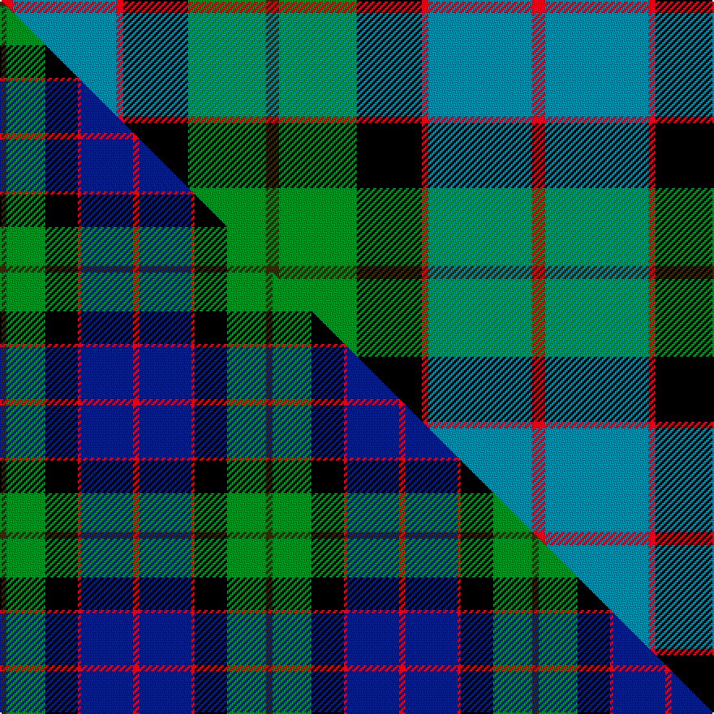

This is one **variant** — a specific cloth: this exact thread count and colourway, with its own
provenance below. It is one weaving of the [sett](/tartans/m/ma/macwilliam-2/) (the scale-free proportion — the
same cloth at any scale or shade), whose colour order is pattern [GGKRBR](/stripes/ggkrbr/).

Part of the [MacWilliam](/tartans/m/ma/macwilliam-2/) tartan — the named design grouping this sett with its other cloths.

Sourced from tartans-authority.  It is a [6 stripe tartan](/stripes/stripes6/).

Original link <code>http://www.tartansauthority.com/tartan-ferret/display/1418/</code> — retired · [Internet Archive copy](https://web.archive.org/web/*/http://www.tartansauthority.com/tartan-ferret/display/1418/*)

Dataset <small>— provenance for this record, inherited from the source manifest</small>

<dl class="dataset-prov">
<dt>source</dt><dd><a href="/sources/tartans-authority/">Scottish Tartans Authority</a></dd>
<dt>data captured from</dt><dd><a href="https://github.com/thetartan/tartan-database/blob/master/data/tartans-authority/data.csv">https://github.com/thetartan/tartan-database/blob/master/data/tartans-authority/data.csv</a></dd>
<dt>data date</dt><dd>1880 <small>(this record)</small></dd>
<dt>licence</dt><dd><a href="https://creativecommons.org/licenses/by-nc-nd/4.0/">CC BY-NC-ND 4.0</a></dd>
</dl>

Capture chain <small>— the hands this data passed through, oldest first; each capture carries its own licence</small>

<ol class="capture-chain">
<li><a href="https://www.tartansauthority.com/">Scottish Tartans Authority</a> <small>the heritage body’s archive — its tartan-ferret record browser is retired; dead record links are shown unlinked, with an Internet Archive copy (ITI numbers are not SRT references)</small></li>
<li><a href="https://github.com/thetartan/tartan-database">thetartan/tartan-database</a> <small>2016-2017</small> · <a href="https://creativecommons.org/licenses/by-nc-nd/4.0/">CC BY-NC-ND 4.0</a> <small>Levko Kravets's frozen compilation — the capture we vendored, and where its CC licence text came from</small></li>
<li>this dictionary <small>captured 2026-06-10 · commit 5bf86c7566</small> <small>each re-capture is a git commit to data/sources</small></li>
</ol>

## Register references

External register numbers recorded for this tartan.

- Scottish Tartans Authority (ITI): 1418

## Thread count
R/8 T64 R4 K40 G48 DY/8

One full sett is **328 threads**.

## Palette
<table><thead><tr><th>Colour</th><th>Shade</th><th>OKLCh</th></tr></thead><tbody><tr><td>T</td><td><code style="background-color:#00879F;">#00879F</code> <small style="color:#888">#00879F</small></td><td><small style="color:#888">oklch(57.4% 0.102 216.1)</small></td></tr><tr><td>G</td><td><code style="background-color:#008B2A;">#008B2A</code> <small style="color:#888">#008B2A</small></td><td><small style="color:#888">oklch(55.4% 0.170 145.9)</small></td></tr><tr><td>K</td><td><code style="background-color:#000000;">#000000</code> <small style="color:#888">#000000</small></td><td><small style="color:#888">oklch(0.0% 0.000 0.0)</small></td></tr><tr><td>R</td><td><code style="background-color:#D60020;">#D60020</code> <small style="color:#888">#D60020</small></td><td><small style="color:#888">oklch(55.2% 0.224 25.5)</small></td></tr><tr><td>DY</td><td><code style="background-color:#3A2B0D;">#3A2B0D</code> <small style="color:#888">#3A2B0D</small></td><td><small style="color:#888">oklch(30.0% 0.049 82.0)</small></td></tr></tbody></table>

# Sample pattern

## Compared to the master

This cloth is one sett of its design; the master sett (the exemplar the design is anchored on) is below for comparison.

Its **ΔTartan distance** from the master is **0.17** — the same measure the nearest-tartans table ranks by (0 is identical; a re-scale of the same cloth is near 0, a recolour or a different proportion further).

<figure class="master-compare" style="margin:0">

this sett
master sett ★

<figcaption style="color:#888;font-size:smaller">One weave of this sett against the <a href="/setts/dy2g12k10r1db16r2/">master sett ★</a>, split on the diagonal: a shared proportion runs seamlessly across it with only the shades shifting; a different proportion breaks on it.</figcaption>
</figure>

## Nearest tartan variants

The nearest existing variants by ΔTartan distance, with this cloth at the top so the swatches line up against it.

ΔTartan

Threads

Variant

Sett

—

328

<a href="/variants/s6/dy2g12k10r1t16r2~x4/">MacWilliam (Clan)</a>

<a href="/ttd/edit/#slug=dy2g12k10r1db16r2~x2&amp;base=dy2g12k10r1t16r2~x4" title="compare in the TTD">0.17</a>

164

<a href="/variants/s6/dy2g12k10r1db16r2~x2/">MacWilliam Clan Tartan</a>

<a href="/ttd/edit/#slug=r2db16r1k10g12o2~x2&amp;base=dy2g12k10r1t16r2~x4" title="compare in the TTD">0.42</a>

164

<a href="/variants/s6/r2db16r1k10g12o2~x2/">MacWilliam</a>

<a href="/ttd/edit/#slug=w3b22r3k22g22y2~x2&amp;base=dy2g12k10r1t16r2~x4" title="compare in the TTD">0.77</a>

286

<a href="/variants/s6/w3b22r3k22g22y2~x2/">Morris of Balgonie</a>

<a href="/ttd/edit/#slug=r1g14k14r2db14lb1~x2&amp;base=dy2g12k10r1t16r2~x4" title="compare in the TTD">0.97</a>

180

<a href="/variants/s6/r1g14k14r2db14lb1~x2/">Wilson's No.221</a>

<a href="/ttd/edit/#slug=r3db22k11g32ly3~x2&amp;base=dy2g12k10r1t16r2~x4" title="compare in the TTD">1.09</a>

272

<a href="/variants/s5/r3db22k11g32ly3~x2/">Cultoquhey (Corporate)</a>

<a href="/ttd/edit/#slug=r3db22k11g32y3~x2&amp;base=dy2g12k10r1t16r2~x4" title="compare in the TTD">1.09</a>

272

<a href="/variants/s5/r3db22k11g32y3~x2/">Cultoquhey Hotel</a>

<a href="/ttd/edit/#slug=w2db20r3k10g20lo2~x2&amp;base=dy2g12k10r1t16r2~x4" title="compare in the TTD">1.13</a>

220

<a href="/variants/s6/w2db20r3k10g20lo2~x2/">Morris of Eddergoll (Personal)</a>

<a href="/ttd/edit/#slug=db18r3k9r3g23y3~x2&amp;base=dy2g12k10r1t16r2~x4" title="compare in the TTD">1.38</a>

194

<a href="/variants/s6/db18r3k9r3g23y3~x2/">Royal College of Physicians (Corp)</a>

<a href="/ttd/edit/#slug=y2g23k21r2t22g2~x2&amp;base=dy2g12k10r1t16r2~x4" title="compare in the TTD">1.43</a>

280

<a href="/variants/s6/y2g23k21r2t22g2~x2/">Royal Ashburn Golf Club</a>

<a href="/ttd/edit/#slug=k6r3g30ly10db30w3~x2&amp;base=dy2g12k10r1t16r2~x4" title="compare in the TTD">1.49</a>

310

<a href="/variants/s6/k6r3g30ly10db30w3~x2/">Turnbull of Thornton (Personal)</a>

## Neighbour map

Every grey dot is one of 13662 variants placed by the first two principal components of the ΔTartan feature space (42% of its variance). Red is this tartan; blue dots are its nearest — click one to open its page. The map is a flat projection of a many-dimensional space — [how to read it](/posts/neighbourhood-maps/).

<svg viewBox="0 0 640 380" role="img" style="max-width:100%;height:auto;border:1px solid #e0e0e0;border-radius:4px;display:block" xmlns="http://www.w3.org/2000/svg"><image href="/nn/cloud.v1.png" width="640" height="380"/><a href="/variants/s6/dy2g12k10r1db16r2~x2/"><circle cx="156.0" cy="169.0" r="4" fill="#3465a4"><title>MacWilliam Clan Tartan</title></circle></a><a href="/variants/s6/r2db16r1k10g12o2~x2/"><circle cx="153.1" cy="167.8" r="4" fill="#3465a4"><title>MacWilliam</title></circle></a><a href="/variants/s6/w3b22r3k22g22y2~x2/"><circle cx="81.6" cy="168.7" r="4" fill="#3465a4"><title>Morris of Balgonie</title></circle></a><a href="/variants/s6/r1g14k14r2db14lb1~x2/"><circle cx="125.0" cy="171.0" r="4" fill="#3465a4"><title>Wilson's No.221</title></circle></a><a href="/variants/s5/r3db22k11g32ly3~x2/"><circle cx="183.6" cy="194.2" r="4" fill="#3465a4"><title>Cultoquhey (Corporate)</title></circle></a><a href="/variants/s5/r3db22k11g32y3~x2/"><circle cx="188.5" cy="195.3" r="4" fill="#3465a4"><title>Cultoquhey Hotel</title></circle></a><a href="/variants/s6/w2db20r3k10g20lo2~x2/"><circle cx="109.4" cy="169.0" r="4" fill="#3465a4"><title>Morris of Eddergoll (Personal)</title></circle></a><a href="/variants/s6/db18r3k9r3g23y3~x2/"><circle cx="138.0" cy="195.9" r="4" fill="#3465a4"><title>Royal College of Physicians (Corp)</title></circle></a><a href="/variants/s6/y2g23k21r2t22g2~x2/"><circle cx="135.3" cy="180.5" r="4" fill="#3465a4"><title>Royal Ashburn Golf Club</title></circle></a><a href="/variants/s6/k6r3g30ly10db30w3~x2/"><circle cx="119.9" cy="168.2" r="4" fill="#3465a4"><title>Turnbull of Thornton (Personal)</title></circle></a><circle cx="148.7" cy="170.9" r="5" fill="#c00000"/><text x="320" y="376" text-anchor="middle" font-size="11" fill="#999">ground</text><text x="11" y="190" text-anchor="middle" font-size="11" fill="#999" transform="rotate(-90 11 190)">complexity</text></svg>

ID: /variants/s6/dy2g12k10r1t16r2~x4/
