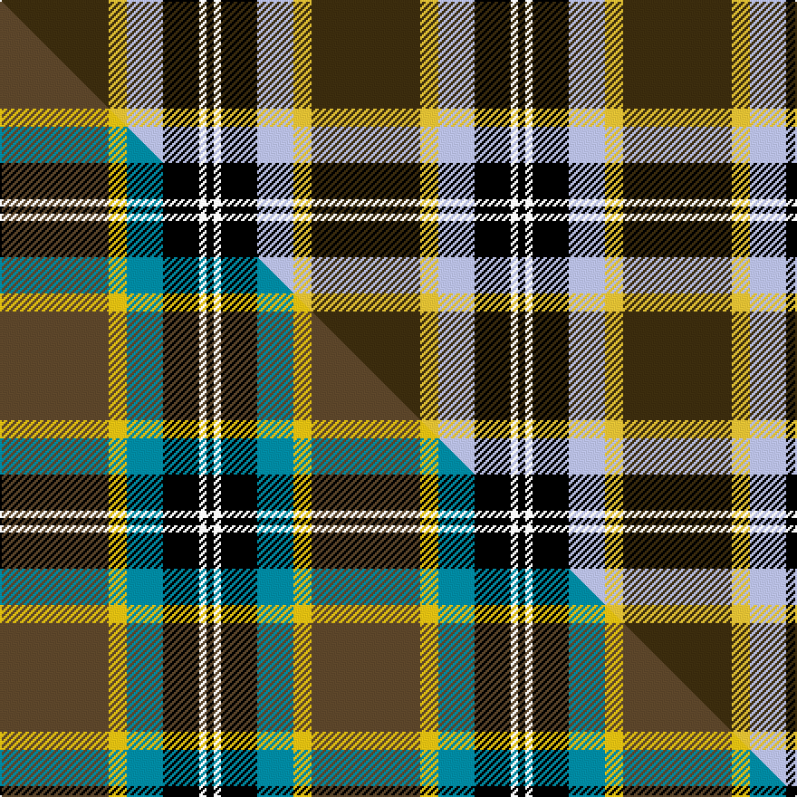

This page is one **sett** — a single exact thread-count. It belongs to the [tartan](/setts/dy30ly5lb10k10w2k2/)
(the same proportion at any scale), whose colour order is pattern [GYWKWK](/stripes/gywkwk/).

Part of the [Bryan Wedding](/tartans/bryan-wedding/) tartan — the named design grouping this sett with its other cloths.

Sourced from tartans-authority.  It is a [6 stripe tartan](/stripes/stripes6/).

Original link [https://www.tartanregister.gov.uk/tartanDetails.aspx?ref=10502](https://www.tartanregister.gov.uk/tartanDetails.aspx?ref=10502)

Dataset <small>— provenance for this record, inherited from the source manifest</small>

<dl class="dataset-prov">
<dt>source</dt><dd><a href="/sources/tartans-authority/">Scottish Tartans Authority</a></dd>
<dt>data captured from</dt><dd><a href="https://github.com/thetartan/tartan-database/blob/master/data/tartans-authority/data.csv">https://github.com/thetartan/tartan-database/blob/master/data/tartans-authority/data.csv</a></dd>
<dt>data date</dt><dd>pre 2011 <small>(this record)</small></dd>
<dt>licence</dt><dd><a href="https://creativecommons.org/licenses/by-nc-nd/4.0/">CC BY-NC-ND 4.0</a></dd>
</dl>

Capture chain <small>— the hands this data passed through, oldest first; each capture carries its own licence</small>

<ol class="capture-chain">
<li><a href="https://www.tartansauthority.com/">Scottish Tartans Authority</a> <small>the heritage body's archive — its tartan-ferret record browser is retired (links repaired to the SRT, above)</small></li>
<li><a href="https://github.com/thetartan/tartan-database">thetartan/tartan-database</a> <small>2016-2017</small> · <a href="https://creativecommons.org/licenses/by-nc-nd/4.0/">CC BY-NC-ND 4.0</a> <small>Levko Kravets's frozen compilation — the capture we vendored, and where its CC licence text came from</small></li>
<li>this dictionary <small>captured 2026-06-10 · commit 5bf86c7566</small> <small>each re-capture is a git commit to data/sources</small></li>
</ol>

## Register references

External register numbers recorded for this tartan.

- Scottish Register of Tartans: [10502](https://www.tartanregister.gov.uk/tartanDetails?ref=10502)
- Scottish Tartans Authority (ITI): 10502

## Thread count
DY/60 LY10 LB20 K20 W4 K/4

One full sett is **172 threads**.

## Palette
<table><thead><tr><th>Colour</th><th>Shade</th><th>OKLCh</th></tr></thead><tbody><tr><td>LB</td><td><code style="background-color:#B5BBDE;">#B5BBDE</code> <small style="color:#888">#B5BBDE</small></td><td><small style="color:#888">oklch(79.9% 0.050 277.6)</small></td></tr><tr><td>K</td><td><code style="background-color:#000000;">#000000</code> <small style="color:#888">#000000</small></td><td><small style="color:#888">oklch(0.0% 0.000 0.0)</small></td></tr><tr><td>DY</td><td><code style="background-color:#3A2B0D;">#3A2B0D</code> <small style="color:#888">#3A2B0D</small></td><td><small style="color:#888">oklch(30.0% 0.049 82.0)</small></td></tr><tr><td>W</td><td><code style="background-color:#F7F7F7;">#F7F7F7</code> <small style="color:#888">#F7F7F7</small></td><td><small style="color:#888">oklch(97.6% 0.000 89.9)</small></td></tr><tr><td>LY</td><td><code style="background-color:#DCBC32;">#DCBC32</code> <small style="color:#888">#DCBC32</small></td><td><small style="color:#888">oklch(80.0% 0.150 95.2)</small></td></tr></tbody></table>

# Sample pattern

## Compared to the master

This cloth is one sett of its design; the master sett (the exemplar the design is anchored on) is below for comparison.

Its **ΔTartan distance** from the master is **0.15** — the same measure the nearest-tartans table ranks by (0 is identical; a re-scale of the same cloth is near 0, a recolour or a different proportion further).

<figure class="master-compare" style="margin:0">

this sett
master sett ★

<figcaption style="color:#888;font-size:smaller">One weave of this sett against the <a href="/setts/dy30ly5t10k10w2k2/">master sett ★</a>, split on the diagonal: a shared proportion runs seamlessly across it with only the shades shifting; a different proportion breaks on it.</figcaption>
</figure>

## Nearest tartan variants

The nearest existing variants by ΔTartan distance, with this cloth at the top so the swatches line up against it.

ΔTartan

Threads

Variant

Sett

—

172

<a href="/variants/s6/dy30ly5lb10k10w2k2~x2/">Bryan Wedding (Personal)</a>

<a href="/ttd/edit/#slug=w2k11y11lb3k1r1~x2&amp;base=dy30ly5lb10k10w2k2~x2" title="compare in the TTD">1.53</a>

110

<a href="/variants/s6/w2k11y11lb3k1r1~x2/">Cornish National Small Set Tartan</a>

<a href="/ttd/edit/#slug=w2k11y11db3k1r1~x2&amp;base=dy30ly5lb10k10w2k2~x2" title="compare in the TTD">1.53</a>

110

<a href="/variants/s6/w2k11y11db3k1r1~x2/">Cornish National #2</a>

<a href="/ttd/edit/#slug=w5k26y26lb7k3r3~x2&amp;base=dy30ly5lb10k10w2k2~x2" title="compare in the TTD">1.55</a>

264

<a href="/variants/s6/w5k26y26lb7k3r3~x2/">Cornish, National</a>

<a href="/ttd/edit/#slug=w5k26dy26lb7k3r3~x2&amp;base=dy30ly5lb10k10w2k2~x2" title="compare in the TTD">1.55</a>

264

<a href="/variants/s6/w5k26dy26lb7k3r3~x2/">Cornish National District Tartan</a>

<a href="/ttd/edit/#slug=w5k26ly26lb7k3r3~x2&amp;base=dy30ly5lb10k10w2k2~x2" title="compare in the TTD">1.55</a>

264

<a href="/variants/s6/w5k26ly26lb7k3r3~x2/">Cornish National (District)</a>

<a href="/ttd/edit/#slug=y4k4lb5t24y2k24w4~x2&amp;base=dy30ly5lb10k10w2k2~x2" title="compare in the TTD">1.70</a>

252

<a href="/variants/s7/y4k4lb5t24y2k24w4~x2/">Mina Perhonen</a>

<a href="/ttd/edit/#slug=dy30ly5t10k10w2k2~x2~dy1602083&amp;base=dy30ly5lb10k10w2k2~x2" title="compare in the TTD">1.70</a>

172

<a href="/variants/s6/dy30ly5t10k10w2k2~x2~dy1602083/">Bryan Wedding (Personal)</a>

<a href="/ttd/edit/#slug=r4k2lb10k10y28k3~x2&amp;base=dy30ly5lb10k10w2k2~x2" title="compare in the TTD">1.72</a>

214

<a href="/variants/s6/r4k2lb10k10y28k3~x2/">Thomson Camel (Jedburgh Mill)</a>

<a href="/ttd/edit/#slug=r10w2k10w10dy35k5~x2&amp;base=dy30ly5lb10k10w2k2~x2" title="compare in the TTD">1.84</a>

258

<a href="/variants/s6/r10w2k10w10dy35k5~x2/">Loch Ness</a>

<a href="/ttd/edit/#slug=k3w3k3y10r1~x6&amp;base=dy30ly5lb10k10w2k2~x2" title="compare in the TTD">1.95</a>

216

<a href="/variants/s5/k3w3k3y10r1~x6/">(6) Burberry</a>

## Neighbour map

Every grey dot is one of 13621 variants placed by the first two principal components of the ΔTartan feature space (42% of its variance). Red is this tartan; blue dots are its nearest — click one to open its page.

<svg viewBox="0 0 640 380" role="img" style="max-width:100%;height:auto;border:1px solid #e0e0e0;border-radius:4px;display:block" xmlns="http://www.w3.org/2000/svg"><image href="/nn/cloud.v1.png" width="640" height="380"/><a href="/variants/s6/w2k11y11lb3k1r1~x2/"><circle cx="158.6" cy="161.8" r="4" fill="#3465a4"><title>Cornish National Small Set Tartan</title></circle></a><a href="/variants/s6/w2k11y11db3k1r1~x2/"><circle cx="163.4" cy="163.0" r="4" fill="#3465a4"><title>Cornish National #2</title></circle></a><a href="/variants/s6/w5k26y26lb7k3r3~x2/"><circle cx="147.3" cy="173.3" r="4" fill="#3465a4"><title>Cornish, National</title></circle></a><a href="/variants/s6/w5k26dy26lb7k3r3~x2/"><circle cx="154.3" cy="174.4" r="4" fill="#3465a4"><title>Cornish National District Tartan</title></circle></a><a href="/variants/s6/w5k26ly26lb7k3r3~x2/"><circle cx="139.3" cy="172.4" r="4" fill="#3465a4"><title>Cornish National (District)</title></circle></a><a href="/variants/s7/y4k4lb5t24y2k24w4~x2/"><circle cx="158.5" cy="154.9" r="4" fill="#3465a4"><title>Mina Perhonen</title></circle></a><a href="/variants/s6/dy30ly5t10k10w2k2~x2~dy1602083/"><circle cx="227.3" cy="154.7" r="4" fill="#3465a4"><title>Bryan Wedding (Personal)</title></circle></a><a href="/variants/s6/r4k2lb10k10y28k3~x2/"><circle cx="219.7" cy="164.4" r="4" fill="#3465a4"><title>Thomson Camel (Jedburgh Mill)</title></circle></a><a href="/variants/s6/r10w2k10w10dy35k5~x2/"><circle cx="214.8" cy="157.5" r="4" fill="#3465a4"><title>Loch Ness</title></circle></a><a href="/variants/s5/k3w3k3y10r1~x6/"><circle cx="203.6" cy="195.3" r="4" fill="#3465a4"><title>(6) Burberry</title></circle></a><circle cx="213.1" cy="148.6" r="5" fill="#c00000"/><text x="320" y="376" text-anchor="middle" font-size="11" fill="#999">ground</text><text x="11" y="190" text-anchor="middle" font-size="11" fill="#999" transform="rotate(-90 11 190)">complexity</text></svg>

ID: /variants/s6/dy30ly5lb10k10w2k2~x2/
