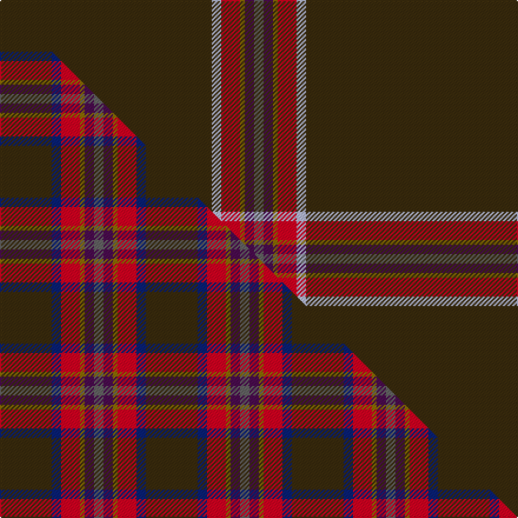

This is one **variant** — a specific cloth: this exact thread count and colourway, with its own
provenance below. It is one weaving of the [sett](/setts/dy45lb2r4y1dp2n2/) (the scale-free proportion — the
same cloth at any scale or shade), whose colour order is pattern [BBGRWG](/stripes/bbgrwg/).

Part of the [Windy Meadows](/tartans/windy-meadows/) tartan — the named design grouping this sett with its other cloths.

Sourced from tartans-authority.  It is a [6 stripe tartan](/stripes/stripes6/).

Original link [https://www.tartanregister.gov.uk/tartanDetails.aspx?ref=10299](https://www.tartanregister.gov.uk/tartanDetails.aspx?ref=10299)

Dataset <small>— provenance for this record, inherited from the source manifest</small>

<dl class="dataset-prov">
<dt>source</dt><dd><a href="/sources/tartans-authority/">Scottish Tartans Authority</a></dd>
<dt>data captured from</dt><dd><a href="https://github.com/thetartan/tartan-database/blob/master/data/tartans-authority/data.csv">https://github.com/thetartan/tartan-database/blob/master/data/tartans-authority/data.csv</a></dd>
<dt>data date</dt><dd>5th Oct. 2010 <small>(this record)</small></dd>
<dt>licence</dt><dd><a href="https://creativecommons.org/licenses/by-nc-nd/4.0/">CC BY-NC-ND 4.0</a></dd>
</dl>

Capture chain <small>— the hands this data passed through, oldest first; each capture carries its own licence</small>

<ol class="capture-chain">
<li><a href="https://www.tartansauthority.com/">Scottish Tartans Authority</a> <small>the heritage body's archive — its tartan-ferret record browser is retired (links repaired to the SRT, above)</small></li>
<li><a href="https://github.com/thetartan/tartan-database">thetartan/tartan-database</a> <small>2016-2017</small> · <a href="https://creativecommons.org/licenses/by-nc-nd/4.0/">CC BY-NC-ND 4.0</a> <small>Levko Kravets's frozen compilation — the capture we vendored, and where its CC licence text came from</small></li>
<li>this dictionary <small>captured 2026-06-10 · commit 5bf86c7566</small> <small>each re-capture is a git commit to data/sources</small></li>
</ol>

## Register references

External register numbers recorded for this tartan.

- Scottish Register of Tartans: [10299](https://www.tartanregister.gov.uk/tartanDetails?ref=10299)
- Scottish Tartans Authority (ITI): 10299

## Thread count
DY/180 LB8 R16 Y4 DP8 N/8

One full sett is **260 threads**.

## Palette
<table><thead><tr><th>Colour</th><th>Shade</th><th>OKLCh</th></tr></thead><tbody><tr><td>R</td><td><code style="background-color:#D60020;">#D60020</code> <small style="color:#888">#D60020</small></td><td><small style="color:#888">oklch(55.2% 0.224 25.5)</small></td></tr><tr><td>LB</td><td><code style="background-color:#B5BBDE;">#B5BBDE</code> <small style="color:#888">#B5BBDE</small></td><td><small style="color:#888">oklch(79.9% 0.050 277.6)</small></td></tr><tr><td>DP</td><td><code style="background-color:#4B0B4F;">#4B0B4F</code> <small style="color:#888">#4B0B4F</small></td><td><small style="color:#888">oklch(30.1% 0.125 325.4)</small></td></tr><tr><td>N</td><td><code style="background-color:#636363;">#636363</code> <small style="color:#888">#636363</small></td><td><small style="color:#888">oklch(50.0% 0.000 89.9)</small></td></tr><tr><td>DY</td><td><code style="background-color:#3A2B0D;">#3A2B0D</code> <small style="color:#888">#3A2B0D</small></td><td><small style="color:#888">oklch(30.0% 0.049 82.0)</small></td></tr><tr><td>Y</td><td><code style="background-color:#8B6E00;">#8B6E00</code> <small style="color:#888">#8B6E00</small></td><td><small style="color:#888">oklch(55.1% 0.113 90.4)</small></td></tr></tbody></table>

# Sample pattern

## Compared to the master

This cloth is one sett of its design; the master sett (the exemplar the design is anchored on) is below for comparison.

Its **ΔTartan distance** from the master is **0.74** — the same measure the nearest-tartans table ranks by (0 is identical; a re-scale of the same cloth is near 0, a recolour or a different proportion further).

<figure class="master-compare" style="margin:0">

this sett
master sett ★

<figcaption style="color:#888;font-size:smaller">One weave of this sett against the <a href="/setts/dy11db2r4y1dp2n2/">master sett ★</a>, split on the diagonal: a shared proportion runs seamlessly across it with only the shades shifting; a different proportion breaks on it.</figcaption>
</figure>

## Nearest tartan variants

The nearest existing variants by ΔTartan distance, with this cloth at the top so the swatches line up against it.

ΔTartan

Threads

Variant

Sett

—

260

<a href="/variants/s6/dy45lb2r4y1dp2n2~x4/">Windy Meadows (Fashion)</a>

<a href="/ttd/edit/#slug=o2r1dp30w1y2~x2&amp;base=dy45lb2r4y1dp2n2~x4" title="compare in the TTD">1.20</a>

136

<a href="/variants/s5/o2r1dp30w1y2~x2/">Wedding</a>

<a href="/ttd/edit/#slug=y2k3dr31w1~x4&amp;base=dy45lb2r4y1dp2n2~x4" title="compare in the TTD">1.50</a>

284

<a href="/variants/s4/y2k3dr31w1~x4/">Riddick Furya</a>

<a href="/ttd/edit/#slug=k100r1n10db10y2~x2&amp;base=dy45lb2r4y1dp2n2~x4" title="compare in the TTD">1.50</a>

288

<a href="/variants/s5/k100r1n10db10y2~x2/">Forand (Personal)</a>

<a href="/ttd/edit/#slug=w2dr45y3dg8db8w2~x2&amp;base=dy45lb2r4y1dp2n2~x4" title="compare in the TTD">2.13</a>

264

<a href="/variants/s6/w2dr45y3dg8db8w2~x2/">Glencross (Moniaive) (Personal)</a>

<a href="/ttd/edit/#slug=w2dr45y3db8dg8w2~x2&amp;base=dy45lb2r4y1dp2n2~x4" title="compare in the TTD">2.13</a>

264

<a href="/variants/s6/w2dr45y3db8dg8w2~x2/">Glencross (Moniaive) (Personal)</a>

<a href="/ttd/edit/#slug=n44dg12db1r6~x2&amp;base=dy45lb2r4y1dp2n2~x4" title="compare in the TTD">2.82</a>

152

<a href="/variants/s4/n44dg12db1r6~x2/">Heslop Lurdenlaw by Kelso</a>

<a href="/ttd/edit/#slug=n88dy3ly2k2lb1~x2&amp;base=dy45lb2r4y1dp2n2~x4" title="compare in the TTD">2.98</a>

206

<a href="/variants/s5/n88dy3ly2k2lb1~x2/">Eternity, Dedicated 2 Weddings</a>

<a href="/ttd/edit/#slug=dy45k5dy28k5o5w2do6~x2&amp;base=dy45lb2r4y1dp2n2~x4" title="compare in the TTD">3.58</a>

282

<a href="/variants/s7/dy45k5dy28k5o5w2do6~x2/">Leiato of American Samoa (Personal)</a>

<a href="/ttd/edit/#slug=y6dy14db10dy58g3dy8w2&amp;base=dy45lb2r4y1dp2n2~x4" title="compare in the TTD">3.73</a>

194

<a href="/variants/s7/y6dy14db10dy58g3dy8w2/">Kozmyk (Corporate)</a>

<a href="/ttd/edit/#slug=dr80lo2dr6dy12ly1dy1ly2t2~x2&amp;base=dy45lb2r4y1dp2n2~x4" title="compare in the TTD">3.77</a>

260

<a href="/variants/s8/dr80lo2dr6dy12ly1dy1ly2t2~x2/">Alegre-Wood (Personal)</a>

## Neighbour map

Every grey dot is one of 13621 variants placed by the first two principal components of the ΔTartan feature space (42% of its variance). Red is this tartan; blue dots are its nearest — click one to open its page.

<svg viewBox="0 0 640 380" role="img" style="max-width:100%;height:auto;border:1px solid #e0e0e0;border-radius:4px;display:block" xmlns="http://www.w3.org/2000/svg"><image href="/nn/cloud.v1.png" width="640" height="380"/><a href="/variants/s5/o2r1dp30w1y2~x2/"><circle cx="593.3" cy="114.8" r="4" fill="#3465a4"><title>Wedding</title></circle></a><a href="/variants/s4/y2k3dr31w1~x4/"><circle cx="590.4" cy="135.8" r="4" fill="#3465a4"><title>Riddick Furya</title></circle></a><a href="/variants/s5/k100r1n10db10y2~x2/"><circle cx="539.8" cy="83.1" r="4" fill="#3465a4"><title>Forand (Personal)</title></circle></a><a href="/variants/s6/w2dr45y3dg8db8w2~x2/"><circle cx="445.4" cy="150.9" r="4" fill="#3465a4"><title>Glencross (Moniaive) (Personal)</title></circle></a><a href="/variants/s6/w2dr45y3db8dg8w2~x2/"><circle cx="448.1" cy="152.7" r="4" fill="#3465a4"><title>Glencross (Moniaive) (Personal)</title></circle></a><a href="/variants/s4/n44dg12db1r6~x2/"><circle cx="580.7" cy="195.0" r="4" fill="#3465a4"><title>Heslop Lurdenlaw by Kelso</title></circle></a><a href="/variants/s5/n88dy3ly2k2lb1~x2/"><circle cx="626.0" cy="109.7" r="4" fill="#3465a4"><title>Eternity, Dedicated 2 Weddings</title></circle></a><a href="/variants/s7/dy45k5dy28k5o5w2do6~x2/"><circle cx="491.9" cy="142.7" r="4" fill="#3465a4"><title>Leiato of American Samoa (Personal)</title></circle></a><a href="/variants/s7/y6dy14db10dy58g3dy8w2/"><circle cx="587.3" cy="155.9" r="4" fill="#3465a4"><title>Kozmyk (Corporate)</title></circle></a><a href="/variants/s8/dr80lo2dr6dy12ly1dy1ly2t2~x2/"><circle cx="626.0" cy="114.0" r="4" fill="#3465a4"><title>Alegre-Wood (Personal)</title></circle></a><circle cx="593.2" cy="94.2" r="5" fill="#c00000"/><text x="320" y="376" text-anchor="middle" font-size="11" fill="#999">ground</text><text x="11" y="190" text-anchor="middle" font-size="11" fill="#999" transform="rotate(-90 11 190)">complexity</text></svg>

ID: /variants/s6/dy45lb2r4y1dp2n2~x4/
