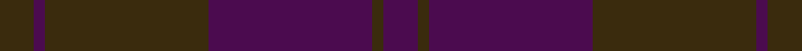

This page is one **sett** — a single exact thread-count. It belongs to the [tartan](/setts/dy6dp2dy29dp29dy2dp6/)
(the same proportion at any scale), whose colour order is pattern [BGBGBG](/stripes/bgbgbg/).

Sourced from register-of-tartans.  It is a [6 stripe tartan](/stripes/stripes6/).

Original link https://www.tartanregister.gov.uk/tartanDetails.aspx?ref=1603

## Register references

External register numbers recorded for this tartan.

- Scottish Register of Tartans: [1603](https://www.tartanregister.gov.uk/tartanDetails.aspx?ref=1603)
- Scottish Tartans World Register: 600

## Thread count
DY/12 DP4 DY58 DP58 DY4 DP/12

One full sett is **272 threads**.

## Palette
<table><thead><tr><th>Colour</th><th>Shade</th><th>OKLCh</th></tr></thead><tbody><tr><td>DP</td><td><code style="background-color:#4B0B4F;">#4B0B4F</code> <small style="color:#888">#4B0B4F</small></td><td><small style="color:#888">oklch(30.1% 0.125 325.4)</small></td></tr><tr><td>DY</td><td><code style="background-color:#3A2B0D;">#3A2B0D</code> <small style="color:#888">#3A2B0D</small></td><td><small style="color:#888">oklch(30.0% 0.049 82.0)</small></td></tr></tbody></table>

# Sample pattern

ID: /variants/s6/dy6dp2dy29dp29dy2dp6~x2/
