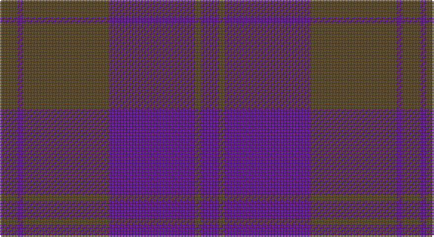

This page is one **sett** — a single exact thread-count. It belongs to the [tartan](/setts/dy6dp2dy29dp29dy2dp6/)
(the same proportion at any scale), whose colour order is pattern [BGBGBG](/stripes/bgbgbg/).

Part of the [Harmony 11](/tartans/harmony-11/) tartan — the named design grouping this sett with its other cloths.

Sourced from register-of-tartans.  It is a [6 stripe tartan](/stripes/stripes6/).

Original link https://www.tartanregister.gov.uk/tartanDetails.aspx?ref=1603

## Also known as

This cloth is also recorded under:

- Harmony 11 #2
- Harmony, 11

## Register references

External register numbers recorded for this tartan.

- Scottish Register of Tartans: [1603](https://www.tartanregister.gov.uk/tartanDetails.aspx?ref=1603)
- Scottish Tartans World Register: 600

## Thread count
T/12 P4 T58 P58 T4 P/12

One full sett is **272 threads**.

## Palette

Palette: <strong>Tartan Register</strong>
<table><thead><tr><th>Colour</th><th>Threads</th><th>Shade</th><th>Base</th><th>OKLCh</th></tr></thead><tbody><tr><td>T/</td><td style="text-align:right;font-variant-numeric:tabular-nums">12</td><td><code style="background-color:#503C14;">#503C14</code> <small style="color:#888">#503C14</small></td><td>G <code style="background-color:#006100;">#006100</code></td><td><small style="color:#888">oklch(37.0% 0.062 81.8)</small></td></tr><tr><td>P</td><td style="text-align:right;font-variant-numeric:tabular-nums">4</td><td><code style="background-color:#5A008C;">#5A008C</code> <small style="color:#888">#5A008C</small></td><td>B <code style="background-color:#2A418A;">#2A418A</code></td><td><small style="color:#888">oklch(37.0% 0.191 306.3)</small></td></tr><tr><td>T</td><td style="text-align:right;font-variant-numeric:tabular-nums">58</td><td><code style="background-color:#503C14;">#503C14</code> <small style="color:#888">#503C14</small></td><td>G <code style="background-color:#006100;">#006100</code></td><td><small style="color:#888">oklch(37.0% 0.062 81.8)</small></td></tr><tr><td>P</td><td style="text-align:right;font-variant-numeric:tabular-nums">58</td><td><code style="background-color:#5A008C;">#5A008C</code> <small style="color:#888">#5A008C</small></td><td>B <code style="background-color:#2A418A;">#2A418A</code></td><td><small style="color:#888">oklch(37.0% 0.191 306.3)</small></td></tr><tr><td>T</td><td style="text-align:right;font-variant-numeric:tabular-nums">4</td><td><code style="background-color:#503C14;">#503C14</code> <small style="color:#888">#503C14</small></td><td>G <code style="background-color:#006100;">#006100</code></td><td><small style="color:#888">oklch(37.0% 0.062 81.8)</small></td></tr><tr><td>P/</td><td style="text-align:right;font-variant-numeric:tabular-nums">12</td><td><code style="background-color:#5A008C;">#5A008C</code> <small style="color:#888">#5A008C</small></td><td>B <code style="background-color:#2A418A;">#2A418A</code></td><td><small style="color:#888">oklch(37.0% 0.191 306.3)</small></td></tr></tbody></table>

# Sample pattern

## Compared to the master

This cloth is one sett of its design; the master sett (the exemplar the design is anchored on) is below for comparison.

<figure style="margin:0"><figcaption style="color:#888;font-size:smaller">this sett</figcaption></figure>
<figure style="margin:0"><figcaption style="color:#888;font-size:smaller"><a href="/setts/dy6dg2dy29dg29dy2dg6/">master sett →</a></figcaption></figure>

## Nearest tartans

The nearest existing variants by ΔTartan distance, with this tartan at the top so the swatches line up against it.

ΔTartan

Tartan

Sett

—

<a href="/ttd/edit/#slug=dy6dp2dy29dp29dy2dp6~x2">Harmony 11</a> <a class="nn-out" href="/variants/s6/dy6dp2dy29dp29dy2dp6~x2/" title="open its dictionary page">↗</a>

1.42

<a href="/ttd/edit/#slug=do3db3do3db27do40ly3&amp;base=dy6dp2dy29dp29dy2dp6~x2">Keeper of the Quaich Corporate Tartan</a> <a class="nn-out" href="/variants/s6/do3db3do3db27do40ly3/" title="open its dictionary page">↗</a>

1.44

<a href="/ttd/edit/#slug=o6p2o29p29o2p6~x2&amp;base=dy6dp2dy29dp29dy2dp6~x2">Harmony, 11</a> <a class="nn-out" href="/variants/s6/o6p2o29p29o2p6~x2/" title="open its dictionary page">↗</a>

1.50

<a href="/ttd/edit/#slug=dr30db10dr3db30m3~x2&amp;base=dy6dp2dy29dp29dy2dp6~x2">Feniston (Personal)</a> <a class="nn-out" href="/variants/s5/dr30db10dr3db30m3~x2/" title="open its dictionary page">↗</a>

1.52

<a href="/ttd/edit/#slug=db13n6r51db51n5~x2&amp;base=dy6dp2dy29dp29dy2dp6~x2">Hillsdale (Corporate?)</a> <a class="nn-out" href="/variants/s5/db13n6r51db51n5~x2/" title="open its dictionary page">↗</a>

1.64

<a href="/ttd/edit/#slug=db50do4db12do23ly4do4~x2&amp;base=dy6dp2dy29dp29dy2dp6~x2">Sligo, County</a> <a class="nn-out" href="/variants/s6/db50do4db12do23ly4do4~x2/" title="open its dictionary page">↗</a>

1.68

<a href="/ttd/edit/#slug=db8k39db8k39db87r6&amp;base=dy6dp2dy29dp29dy2dp6~x2">Largan (?)</a> <a class="nn-out" href="/variants/s6/db8k39db8k39db87r6/" title="open its dictionary page">↗</a>

1.70

<a href="/ttd/edit/#slug=db4r1db18r18db1r1w1~x2&amp;base=dy6dp2dy29dp29dy2dp6~x2">St. Mildreds Check (School)</a> <a class="nn-out" href="/variants/s7/db4r1db18r18db1r1w1~x2/" title="open its dictionary page">↗</a>

1.73

<a href="/ttd/edit/#slug=dt6r1dt24r28dt1r4~x2&amp;base=dy6dp2dy29dp29dy2dp6~x2">Mary Erskine School, The</a> <a class="nn-out" href="/variants/s6/dt6r1dt24r28dt1r4~x2/" title="open its dictionary page">↗</a>

1.80

<a href="/ttd/edit/#slug=db2k11db5k1db5k1~x6&amp;base=dy6dp2dy29dp29dy2dp6~x2">Gagetown (School)</a> <a class="nn-out" href="/variants/s6/db2k11db5k1db5k1~x6/" title="open its dictionary page">↗</a>

1.81

<a href="/ttd/edit/#slug=lo3dy33db24dy2db2dy2~x2&amp;base=dy6dp2dy29dp29dy2dp6~x2">Keepers of the Quaich</a> <a class="nn-out" href="/variants/s6/lo3dy33db24dy2db2dy2~x2/" title="open its dictionary page">↗</a>

## Neighbour map

Every grey dot is one of 14360 variants placed by the first two principal components of the ΔTartan feature space (44% of its variance). Red is this tartan; blue dots are its nearest — click one to open its page.

<svg viewBox="0 0 640 380" role="img" style="max-width:100%;height:auto;border:1px solid #e0e0e0;border-radius:4px;display:block" xmlns="http://www.w3.org/2000/svg"><image href="/nn/cloud.v1.png" width="640" height="380"/><a href="/variants/s6/do3db3do3db27do40ly3/"><circle cx="457.4" cy="239.2" r="4" fill="#3465a4"><title>Keeper of the Quaich Corporate Tartan</title></circle></a><a href="/variants/s6/o6p2o29p29o2p6~x2/"><circle cx="474.1" cy="259.4" r="4" fill="#3465a4"><title>Harmony, 11</title></circle></a><a href="/variants/s5/dr30db10dr3db30m3~x2/"><circle cx="424.9" cy="285.5" r="4" fill="#3465a4"><title>Feniston (Personal)</title></circle></a><a href="/variants/s5/db13n6r51db51n5~x2/"><circle cx="386.6" cy="268.1" r="4" fill="#3465a4"><title>Hillsdale (Corporate?)</title></circle></a><a href="/variants/s6/db50do4db12do23ly4do4~x2/"><circle cx="472.0" cy="248.4" r="4" fill="#3465a4"><title>Sligo, County</title></circle></a><a href="/variants/s6/db8k39db8k39db87r6/"><circle cx="429.8" cy="255.6" r="4" fill="#3465a4"><title>Largan (?)</title></circle></a><a href="/variants/s7/db4r1db18r18db1r1w1~x2/"><circle cx="422.2" cy="196.0" r="4" fill="#3465a4"><title>St. Mildreds Check (School)</title></circle></a><a href="/variants/s6/dt6r1dt24r28dt1r4~x2/"><circle cx="494.4" cy="233.1" r="4" fill="#3465a4"><title>Mary Erskine School, The</title></circle></a><a href="/variants/s6/db2k11db5k1db5k1~x6/"><circle cx="413.4" cy="281.1" r="4" fill="#3465a4"><title>Gagetown (School)</title></circle></a><a href="/variants/s6/lo3dy33db24dy2db2dy2~x2/"><circle cx="440.4" cy="221.2" r="4" fill="#3465a4"><title>Keepers of the Quaich</title></circle></a><circle cx="452.0" cy="259.4" r="5" fill="#c00000"/></svg>

ID: /variants/s6/dy6dp2dy29dp29dy2dp6~x2/
