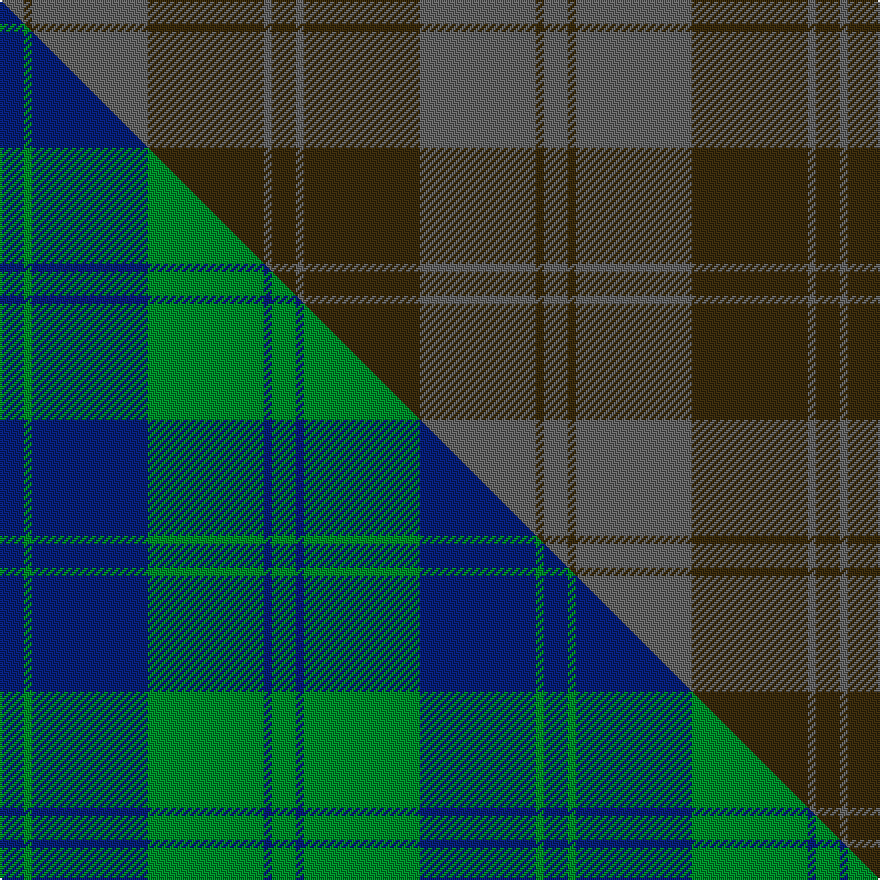

This is one **variant** — a specific cloth: this exact thread count and colourway, with its own
provenance below. It is one weaving of the [sett](/tartans/h/ha/harmony-12/) (the scale-free proportion — the
same cloth at any scale or shade), whose colour order is pattern [BGBGBG](/stripes/bgbgbg/).

Part of the [Harmony 12](/tartans/h/ha/harmony-12/) tartan — the named design grouping this sett with its other cloths.

Sourced from register-of-tartans.  It is a [6 stripe tartan](/stripes/stripes6/).

Original link [https://www.tartanregister.gov.uk/tartanDetails.aspx?ref=1606](https://www.tartanregister.gov.uk/tartanDetails.aspx?ref=1606)

Dataset <small>— provenance for this record, inherited from the source manifest</small>

<dl class="dataset-prov">
<dt>source</dt><dd><a href="/sources/register-of-tartans/">Scottish Register of Tartans</a></dd>
<dt>data captured from</dt><dd><a href="https://github.com/thetartan/tartan-database/blob/master/data/register-of-tartans/data.csv">https://github.com/thetartan/tartan-database/blob/master/data/register-of-tartans/data.csv</a></dd>
<dt>data date</dt><dd>2017-01-06 <small>(dataset default)</small></dd>
<dt>licence</dt><dd><a href="https://www.tartanregister.gov.uk/copyright">Crown copyright</a></dd>
</dl>

Capture chain <small>— the hands this data passed through, oldest first; each capture carries its own licence</small>

<ol class="capture-chain">
<li><a href="https://www.tartanregister.gov.uk/">Scottish Register of Tartans</a> · <a href="https://www.tartanregister.gov.uk/copyright">Crown copyright</a> <small>the living register — still published by National Records of Scotland</small></li>
<li><a href="https://github.com/thetartan/tartan-database">thetartan/tartan-database</a> <small>2016-2017</small> · <a href="https://creativecommons.org/licenses/by-nc-nd/4.0/">CC BY-NC-ND 4.0</a> <small>Levko Kravets's frozen compilation — the capture we vendored, and where its CC licence text came from</small></li>
<li>this dictionary <small>captured 2026-06-10 · commit 5bf86c7566</small> <small>each re-capture is a git commit to data/sources</small></li>
</ol>

## Register references

External register numbers recorded for this tartan.

- Scottish Register of Tartans: [1606](https://www.tartanregister.gov.uk/tartanDetails.aspx?ref=1606)
- Scottish Tartans World Register: 1305

## Thread count
N/12 DY4 N58 DY58 N4 DY/12

One full sett is **272 threads**.

## Palette
<table><thead><tr><th>Colour</th><th>Shade</th><th>OKLCh</th></tr></thead><tbody><tr><td>N</td><td><code style="background-color:#636363;">#636363</code> <small style="color:#888">#636363</small></td><td><small style="color:#888">oklch(50.0% 0.000 89.9)</small></td></tr><tr><td>DY</td><td><code style="background-color:#3A2B0D;">#3A2B0D</code> <small style="color:#888">#3A2B0D</small></td><td><small style="color:#888">oklch(30.0% 0.049 82.0)</small></td></tr></tbody></table>

# Sample pattern

## Compared to the master

This cloth is one sett of its design; the master sett (the exemplar the design is anchored on) is below for comparison.

Its **ΔTartan distance** from the master is **9.49** — the same measure the nearest-tartans table ranks by (0 is identical; a re-scale of the same cloth is near 0, a recolour or a different proportion further).

<figure class="master-compare" style="margin:0">

this sett
master sett ★

<figcaption style="color:#888;font-size:smaller">One weave of this sett against the <a href="/setts/db6g2db29g29db2g6/">master sett ★</a>, split on the diagonal: a shared proportion runs seamlessly across it with only the shades shifting; a different proportion breaks on it.</figcaption>
</figure>

## Nearest tartan variants

The nearest existing variants by ΔTartan distance, with this cloth at the top so the swatches line up against it.

ΔTartan

Threads

Variant

Sett

—

272

<a href="/variants/s6/dy6n2dy29n29dy2n6~x2/">Harmony 12 #2</a>

<a href="/ttd/edit/#slug=dy8n29dy8y3dy8n8y3~x2&amp;base=dy6n2dy29n29dy2n6~x2" title="compare in the TTD">2.04</a>

246

<a href="/variants/s7/dy8n29dy8y3dy8n8y3~x2/">Lister (Misty Mountain)</a>

<a href="/ttd/edit/#slug=db5n15dy4n4dy24n4dy4db5&amp;base=dy6n2dy29n29dy2n6~x2" title="compare in the TTD">3.25</a>

120

<a href="/variants/s8/db5n15dy4n4dy24n4dy4db5/">Daks-Simpson (Muted Skye)</a>

<a href="/ttd/edit/#slug=dy8n29dy8ly3dy8n8ly3~x2~dy3908078-ly8117093&amp;base=dy6n2dy29n29dy2n6~x2" title="compare in the TTD">3.89</a>

246

<a href="/variants/s7/dy8n29dy8ly3dy8n8ly3~x2~dy3908078-ly8117093/">Lister (Name)</a>

<a href="/ttd/edit/#slug=n3dg1n10dg4dy10n2~x4&amp;base=dy6n2dy29n29dy2n6~x2" title="compare in the TTD">3.97</a>

220

<a href="/variants/s6/n3dg1n10dg4dy10n2~x4/">Rob Roy (Film) (Corporate)</a>

## Neighbour map

Every grey dot is one of 13662 variants placed by the first two principal components of the ΔTartan feature space (42% of its variance). Red is this tartan; blue dots are its nearest — click one to open its page. The map is a flat projection of a many-dimensional space — [how to read it](/posts/neighbourhood-maps/).

<svg viewBox="0 0 640 380" role="img" style="max-width:100%;height:auto;border:1px solid #e0e0e0;border-radius:4px;display:block" xmlns="http://www.w3.org/2000/svg"><image href="/nn/cloud.v1.png" width="640" height="380"/><a href="/variants/s7/dy8n29dy8y3dy8n8y3~x2/"><circle cx="498.2" cy="285.1" r="4" fill="#3465a4"><title>Lister (Misty Mountain)</title></circle></a><a href="/variants/s8/db5n15dy4n4dy24n4dy4db5/"><circle cx="424.3" cy="292.4" r="4" fill="#3465a4"><title>Daks-Simpson (Muted Skye)</title></circle></a><a href="/variants/s7/dy8n29dy8ly3dy8n8ly3~x2~dy3908078-ly8117093/"><circle cx="471.5" cy="277.9" r="4" fill="#3465a4"><title>Lister (Name)</title></circle></a><a href="/variants/s6/n3dg1n10dg4dy10n2~x4/"><circle cx="470.5" cy="308.6" r="4" fill="#3465a4"><title>Rob Roy (Film) (Corporate)</title></circle></a><circle cx="545.6" cy="283.5" r="5" fill="#c00000"/><text x="320" y="376" text-anchor="middle" font-size="11" fill="#999">ground</text><text x="11" y="190" text-anchor="middle" font-size="11" fill="#999" transform="rotate(-90 11 190)">complexity</text></svg>

ID: /variants/s6/dy6n2dy29n29dy2n6~x2/
