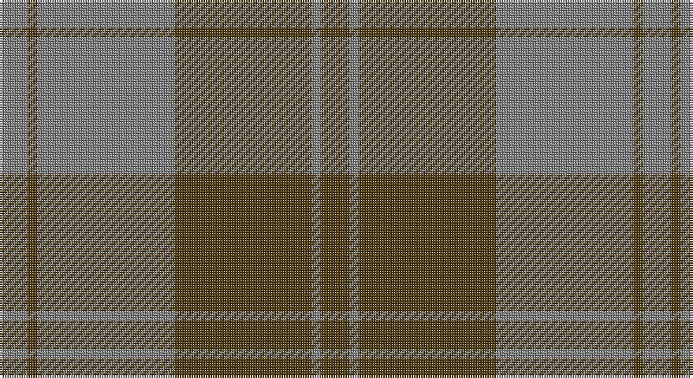

This page is one **sett** — a single exact thread-count. It belongs to the [tartan](/setts/dy6y2dy29y29dy2y6/)
(the same proportion at any scale), whose colour order is pattern [GGGGGG](/stripes/gggggg/).

Part of the [Harmony 12](/tartans/harmony-12/) tartan — the named design grouping this sett with its other cloths.

Sourced from register-of-tartans.  It is a [6 stripe tartan](/stripes/stripes6/).

Original link https://www.tartanregister.gov.uk/tartanDetails.aspx?ref=1606

## Also known as

This cloth is also recorded under:

- Harmony 12 #2
- Harmony, 12

## Register references

External register numbers recorded for this tartan.

- Scottish Register of Tartans: [1606](https://www.tartanregister.gov.uk/tartanDetails.aspx?ref=1606)
- Scottish Tartans World Register: 1305

## Thread count
N/12 T4 N58 T58 N4 T/12

One full sett is **272 threads**.

## Palette

Palette: <strong>Tartan Register</strong>
<table><thead><tr><th>Colour</th><th>Threads</th><th>Shade</th><th>Base</th><th>OKLCh</th></tr></thead><tbody><tr><td>N/</td><td style="text-align:right;font-variant-numeric:tabular-nums">12</td><td><code style="background-color:#808080;">#808080</code> <small style="color:#888">#808080</small></td><td>G <code style="background-color:#006100;">#006100</code></td><td><small style="color:#888">oklch(60.0% 0.000 89.9)</small></td></tr><tr><td>T</td><td style="text-align:right;font-variant-numeric:tabular-nums">4</td><td><code style="background-color:#503C14;">#503C14</code> <small style="color:#888">#503C14</small></td><td>G <code style="background-color:#006100;">#006100</code></td><td><small style="color:#888">oklch(37.0% 0.062 81.8)</small></td></tr><tr><td>N</td><td style="text-align:right;font-variant-numeric:tabular-nums">58</td><td><code style="background-color:#808080;">#808080</code> <small style="color:#888">#808080</small></td><td>G <code style="background-color:#006100;">#006100</code></td><td><small style="color:#888">oklch(60.0% 0.000 89.9)</small></td></tr><tr><td>T</td><td style="text-align:right;font-variant-numeric:tabular-nums">58</td><td><code style="background-color:#503C14;">#503C14</code> <small style="color:#888">#503C14</small></td><td>G <code style="background-color:#006100;">#006100</code></td><td><small style="color:#888">oklch(37.0% 0.062 81.8)</small></td></tr><tr><td>N</td><td style="text-align:right;font-variant-numeric:tabular-nums">4</td><td><code style="background-color:#808080;">#808080</code> <small style="color:#888">#808080</small></td><td>G <code style="background-color:#006100;">#006100</code></td><td><small style="color:#888">oklch(60.0% 0.000 89.9)</small></td></tr><tr><td>T/</td><td style="text-align:right;font-variant-numeric:tabular-nums">12</td><td><code style="background-color:#503C14;">#503C14</code> <small style="color:#888">#503C14</small></td><td>G <code style="background-color:#006100;">#006100</code></td><td><small style="color:#888">oklch(37.0% 0.062 81.8)</small></td></tr></tbody></table>

# Sample pattern

## Compared to the master

This cloth is one sett of its design; the master sett (the exemplar the design is anchored on) is below for comparison.

<figure style="margin:0"><figcaption style="color:#888;font-size:smaller">this sett</figcaption></figure>
<figure style="margin:0"><figcaption style="color:#888;font-size:smaller"><a href="/setts/db6g2db29g29db2g6/">master sett →</a></figcaption></figure>

## Nearest tartans

The nearest existing variants by ΔTartan distance, with this tartan at the top so the swatches line up against it.

ΔTartan

Tartan

Sett

—

<a href="/ttd/edit/#slug=dy6y2dy29y29dy2y6~x2">Harmony 12 #2</a> <a class="nn-out" href="/variants/s6/dy6y2dy29y29dy2y6~x2/" title="open its dictionary page">↗</a>

1.55

<a href="/ttd/edit/#slug=n6k16n6k16n45k4~x2&amp;base=dy6y2dy29y29dy2y6~x2">Grey Spirit Fashion Tartan</a> <a class="nn-out" href="/variants/s6/n6k16n6k16n45k4~x2/" title="open its dictionary page">↗</a>

1.63

<a href="/ttd/edit/#slug=lo3dy33db24dy2db2dy2~x2&amp;base=dy6y2dy29y29dy2y6~x2">Keepers of the Quaich</a> <a class="nn-out" href="/variants/s6/lo3dy33db24dy2db2dy2~x2/" title="open its dictionary page">↗</a>

1.64

<a href="/ttd/edit/#slug=r24dg2r2dg20r25dg2r2dg2r2dg20~x2&amp;base=dy6y2dy29y29dy2y6~x2">Donachie of Brockloch (Clan)</a> <a class="nn-out" href="/variants/s10/r24dg2r2dg20r25dg2r2dg2r2dg20~x2/" title="open its dictionary page">↗</a>

1.79

<a href="/ttd/edit/#slug=t3dg1t10dg4dy10t2~x4&amp;base=dy6y2dy29y29dy2y6~x2">Rob Roy (Film) (Corporate)</a> <a class="nn-out" href="/variants/s6/t3dg1t10dg4dy10t2~x4/" title="open its dictionary page">↗</a>

1.79

<a href="/ttd/edit/#slug=dy8o29dy8ly3dy8o8ly3~x2&amp;base=dy6y2dy29y29dy2y6~x2">Lister (Name)</a> <a class="nn-out" href="/variants/s7/dy8o29dy8ly3dy8o8ly3~x2/" title="open its dictionary page">↗</a>

1.87

<a href="/ttd/edit/#slug=r30y3db5y21r3y21db2~x2&amp;base=dy6y2dy29y29dy2y6~x2">Scottish Piping Soc. of London (Corp</a> <a class="nn-out" href="/variants/s7/r30y3db5y21r3y21db2~x2/" title="open its dictionary page">↗</a>

1.94

<a href="/ttd/edit/#slug=dy3db3dy3db27dy40y3&amp;base=dy6y2dy29y29dy2y6~x2">Keeper of the Quaich</a> <a class="nn-out" href="/variants/s6/dy3db3dy3db27dy40y3/" title="open its dictionary page">↗</a>

1.94

<a href="/ttd/edit/#slug=k3y3k3y21dy21k3y1~x2&amp;base=dy6y2dy29y29dy2y6~x2">Granite City (Silver Granite) Fashion Tartan</a> <a class="nn-out" href="/variants/s7/k3y3k3y21dy21k3y1~x2/" title="open its dictionary page">↗</a>

1.95

<a href="/ttd/edit/#slug=dg42o10dg3r10o3~x2&amp;base=dy6y2dy29y29dy2y6~x2">Glen Trool (Fashion)</a> <a class="nn-out" href="/variants/s5/dg42o10dg3r10o3~x2/" title="open its dictionary page">↗</a>

2.01

<a href="/ttd/edit/#slug=dg37dy9dg3r9dy3~x2&amp;base=dy6y2dy29y29dy2y6~x2">Glen Trool District Tartan</a> <a class="nn-out" href="/variants/s5/dg37dy9dg3r9dy3~x2/" title="open its dictionary page">↗</a>

## Neighbour map

Every grey dot is one of 14360 variants placed by the first two principal components of the ΔTartan feature space (44% of its variance). Red is this tartan; blue dots are its nearest — click one to open its page.

<svg viewBox="0 0 640 380" role="img" style="max-width:100%;height:auto;border:1px solid #e0e0e0;border-radius:4px;display:block" xmlns="http://www.w3.org/2000/svg"><image href="/nn/cloud.v1.png" width="640" height="380"/><a href="/variants/s6/n6k16n6k16n45k4~x2/"><circle cx="460.0" cy="269.0" r="4" fill="#3465a4"><title>Grey Spirit Fashion Tartan</title></circle></a><a href="/variants/s6/lo3dy33db24dy2db2dy2~x2/"><circle cx="440.4" cy="221.2" r="4" fill="#3465a4"><title>Keepers of the Quaich</title></circle></a><a href="/variants/s10/r24dg2r2dg20r25dg2r2dg2r2dg20~x2/"><circle cx="449.3" cy="235.3" r="4" fill="#3465a4"><title>Donachie of Brockloch (Clan)</title></circle></a><a href="/variants/s6/t3dg1t10dg4dy10t2~x4/"><circle cx="334.1" cy="266.3" r="4" fill="#3465a4"><title>Rob Roy (Film) (Corporate)</title></circle></a><a href="/variants/s7/dy8o29dy8ly3dy8o8ly3~x2/"><circle cx="361.3" cy="234.3" r="4" fill="#3465a4"><title>Lister (Name)</title></circle></a><a href="/variants/s7/r30y3db5y21r3y21db2~x2/"><circle cx="389.5" cy="219.5" r="4" fill="#3465a4"><title>Scottish Piping Soc. of London (Corp</title></circle></a><a href="/variants/s6/dy3db3dy3db27dy40y3/"><circle cx="471.9" cy="248.1" r="4" fill="#3465a4"><title>Keeper of the Quaich</title></circle></a><a href="/variants/s7/k3y3k3y21dy21k3y1~x2/"><circle cx="396.0" cy="224.6" r="4" fill="#3465a4"><title>Granite City (Silver Granite) Fashion Tartan</title></circle></a><a href="/variants/s5/dg42o10dg3r10o3~x2/"><circle cx="466.7" cy="241.0" r="4" fill="#3465a4"><title>Glen Trool (Fashion)</title></circle></a><a href="/variants/s5/dg37dy9dg3r9dy3~x2/"><circle cx="476.5" cy="258.8" r="4" fill="#3465a4"><title>Glen Trool District Tartan</title></circle></a><circle cx="441.8" cy="256.1" r="5" fill="#c00000"/></svg>

ID: /variants/s6/dy6y2dy29y29dy2y6~x2/
