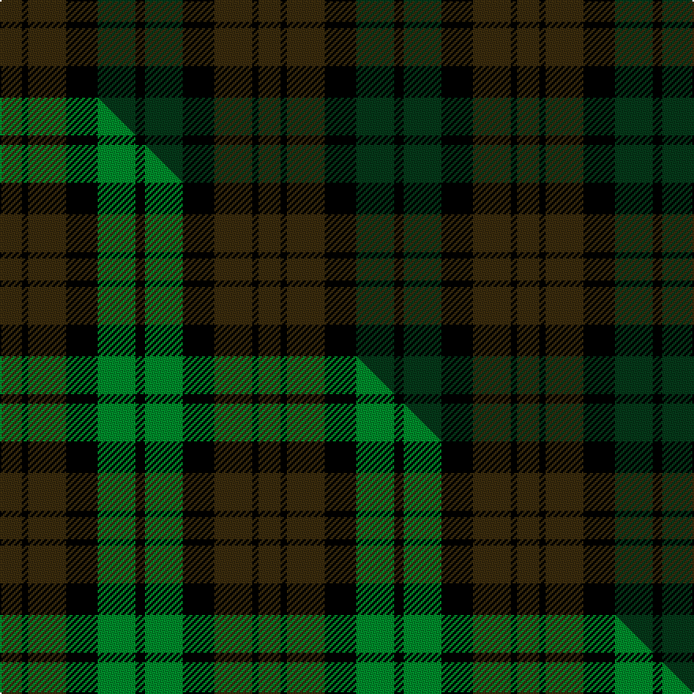

This is one **variant** — a specific cloth: this exact thread count and colourway, with its own
provenance below. It is one weaving of the [sett](/tartans/b/br/brown-watch-3/) (the scale-free proportion — the
same cloth at any scale or shade), whose colour order is pattern [GKGKGK](/stripes/gkgkgk/).

Part of the [Brown Watch](/tartans/b/br/brown-watch-3/) tartan — the named design grouping this sett with its other cloths.

Sourced from tartans-authority.  It is a [6 stripe tartan](/stripes/stripes6/).

Original link <code>http://www.tartansauthority.com/tartan-ferret/display/7812/</code> — retired · [Internet Archive copy](https://web.archive.org/web/*/http://www.tartansauthority.com/tartan-ferret/display/7812/*)

Dataset <small>— provenance for this record, inherited from the source manifest</small>

<dl class="dataset-prov">
<dt>source</dt><dd><a href="/sources/tartans-authority/">Scottish Tartans Authority</a></dd>
<dt>data captured from</dt><dd><a href="https://github.com/thetartan/tartan-database/blob/master/data/tartans-authority/data.csv">https://github.com/thetartan/tartan-database/blob/master/data/tartans-authority/data.csv</a></dd>
<dt>data date</dt><dd>pre 1986 <small>(this record)</small></dd>
<dt>licence</dt><dd><a href="https://creativecommons.org/licenses/by-nc-nd/4.0/">CC BY-NC-ND 4.0</a></dd>
</dl>

Capture chain <small>— the hands this data passed through, oldest first; each capture carries its own licence</small>

<ol class="capture-chain">
<li><a href="https://www.tartansauthority.com/">Scottish Tartans Authority</a> <small>the heritage body’s archive — its tartan-ferret record browser is retired; dead record links are shown unlinked, with an Internet Archive copy (ITI numbers are not SRT references)</small></li>
<li><a href="https://github.com/thetartan/tartan-database">thetartan/tartan-database</a> <small>2016-2017</small> · <a href="https://creativecommons.org/licenses/by-nc-nd/4.0/">CC BY-NC-ND 4.0</a> <small>Levko Kravets's frozen compilation — the capture we vendored, and where its CC licence text came from</small></li>
<li>this dictionary <small>captured 2026-06-10 · commit 5bf86c7566</small> <small>each re-capture is a git commit to data/sources</small></li>
</ol>

## Register references

External register numbers recorded for this tartan.

- Scottish Tartans Authority (ITI): 7812

## Thread count
DY/14 K4 DY24 K20 DG24 K/6

One full sett is **164 threads**.

## Palette
<table><thead><tr><th>Colour</th><th>Shade</th><th>OKLCh</th></tr></thead><tbody><tr><td>DG</td><td><code style="background-color:#053819;">#053819</code> <small style="color:#888">#053819</small></td><td><small style="color:#888">oklch(30.0% 0.075 151.3)</small></td></tr><tr><td>DY</td><td><code style="background-color:#3A2B0D;">#3A2B0D</code> <small style="color:#888">#3A2B0D</small></td><td><small style="color:#888">oklch(30.0% 0.049 82.0)</small></td></tr><tr><td>K</td><td><code style="background-color:#000000;">#000000</code> <small style="color:#888">#000000</small></td><td><small style="color:#888">oklch(0.0% 0.000 0.0)</small></td></tr></tbody></table>

# Sample pattern

## Compared to the master

This cloth is one sett of its design; the master sett (the exemplar the design is anchored on) is below for comparison.

Its **ΔTartan distance** from the master is **0.13** — the same measure the nearest-tartans table ranks by (0 is identical; a re-scale of the same cloth is near 0, a recolour or a different proportion further).

<figure class="master-compare" style="margin:0">

this sett
master sett ★

<figcaption style="color:#888;font-size:smaller">One weave of this sett against the <a href="/setts/dy7k2dy12k10g12k3/">master sett ★</a>, split on the diagonal: a shared proportion runs seamlessly across it with only the shades shifting; a different proportion breaks on it.</figcaption>
</figure>

## Nearest tartan variants

The nearest existing variants by ΔTartan distance, with this cloth at the top so the swatches line up against it.

ΔTartan

Threads

Variant

Sett

—

164

<a href="/variants/s6/dy7k2dy12k10dg12k3~x2/">Brown Watch (single) (Fashion)</a>

<a href="/ttd/edit/#slug=dy7k2dy12k10g12k3~x2&amp;base=dy7k2dy12k10dg12k3~x2" title="compare in the TTD">0.13</a>

164

<a href="/variants/s6/dy7k2dy12k10g12k3~x2/">Brown Watch (single tramlines)</a>

<a href="/ttd/edit/#slug=k1dy4dg1k1dg1k1dy1~x10&amp;base=dy7k2dy12k10dg12k3~x2" title="compare in the TTD">1.67</a>

180

<a href="/variants/s7/k1dy4dg1k1dg1k1dy1~x10/">McCanna NW Htg (Personal)</a>

<a href="/ttd/edit/#slug=k1do4dg1k1dg1k1do1~x14&amp;base=dy7k2dy12k10dg12k3~x2" title="compare in the TTD">3.01</a>

252

<a href="/variants/s7/k1do4dg1k1dg1k1do1~x14/">McCanna NW (Olympia, USA) Hunting (Personal)</a>

<a href="/ttd/edit/#slug=k1dg6k6db6k1db1~x4~dg1605139-db1004274&amp;base=dy7k2dy12k10dg12k3~x2" title="compare in the TTD">3.77</a>

160

<a href="/variants/s6/k1dg6k6db6k1db1~x4~dg1605139-db1004274/">Black Watch (smallest sett)</a>

<a href="/ttd/edit/#slug=dg7db1dg1k4dp4k1~x4&amp;base=dy7k2dy12k10dg12k3~x2" title="compare in the TTD">3.87</a>

112

<a href="/variants/s6/dg7db1dg1k4dp4k1~x4/">MacArthur of Milton Hunting</a>

## Neighbour map

Every grey dot is one of 13656 variants placed by the first two principal components of the ΔTartan feature space (42% of its variance). Red is this tartan; blue dots are its nearest — click one to open its page. The map is a flat projection of a many-dimensional space — [how to read it](/posts/neighbourhood-maps/).

<svg viewBox="0 0 640 380" role="img" style="max-width:100%;height:auto;border:1px solid #e0e0e0;border-radius:4px;display:block" xmlns="http://www.w3.org/2000/svg"><image href="/nn/cloud.v1.png" width="640" height="380"/><a href="/variants/s6/dy7k2dy12k10g12k3~x2/"><circle cx="184.2" cy="264.8" r="4" fill="#3465a4"><title>Brown Watch (single tramlines)</title></circle></a><a href="/variants/s7/k1dy4dg1k1dg1k1dy1~x10/"><circle cx="320.9" cy="279.5" r="4" fill="#3465a4"><title>McCanna NW Htg (Personal)</title></circle></a><a href="/variants/s7/k1do4dg1k1dg1k1do1~x14/"><circle cx="316.8" cy="276.5" r="4" fill="#3465a4"><title>McCanna NW (Olympia, USA) Hunting (Personal)</title></circle></a><a href="/variants/s6/k1dg6k6db6k1db1~x4~dg1605139-db1004274/"><circle cx="217.7" cy="252.5" r="4" fill="#3465a4"><title>Black Watch (smallest sett)</title></circle></a><a href="/variants/s6/dg7db1dg1k4dp4k1~x4/"><circle cx="262.2" cy="241.6" r="4" fill="#3465a4"><title>MacArthur of Milton Hunting</title></circle></a><circle cx="277.5" cy="295.3" r="5" fill="#c00000"/><text x="320" y="376" text-anchor="middle" font-size="11" fill="#999">ground</text><text x="11" y="190" text-anchor="middle" font-size="11" fill="#999" transform="rotate(-90 11 190)">complexity</text></svg>

ID: /variants/s6/dy7k2dy12k10dg12k3~x2/
