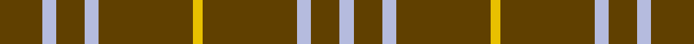

This is one **variant** — a specific cloth: this exact thread count and colourway, with its own
provenance below. It is one weaving of the [sett](/setts/dy9lb3dy6lb3dy20ly2/) (the scale-free proportion — the
same cloth at any scale or shade), whose colour order is pattern [GWGWGYGWGW](/stripes/gwgwgygwgw/).

Part of the [Oman, Sultanate of / Oliver dress](/tartans/o/om/oman-sultanate-of-oliver-dress/) tartan — the named design grouping this sett with its other cloths.

Sourced from register-of-tartans.  It is a [10 stripe tartan](/stripes/stripes10/).

Original link [https://www.tartanregister.gov.uk/tartanDetails.aspx?ref=3245](https://www.tartanregister.gov.uk/tartanDetails.aspx?ref=3245)

Dataset <small>— provenance for this record, inherited from the source manifest</small>

<dl class="dataset-prov">
<dt>source</dt><dd><a href="/sources/register-of-tartans/">Scottish Register of Tartans</a></dd>
<dt>data captured from</dt><dd><a href="https://github.com/thetartan/tartan-database/blob/master/data/register-of-tartans/data.csv">https://github.com/thetartan/tartan-database/blob/master/data/register-of-tartans/data.csv</a></dd>
<dt>data date</dt><dd>1960 <small>(this record)</small></dd>
<dt>licence</dt><dd><a href="https://www.tartanregister.gov.uk/copyright">Crown copyright</a></dd>
</dl>

Capture chain <small>— the hands this data passed through, oldest first; each capture carries its own licence</small>

<ol class="capture-chain">
<li><a href="https://www.tartanregister.gov.uk/">Scottish Register of Tartans</a> · <a href="https://www.tartanregister.gov.uk/copyright">Crown copyright</a> <small>the living register — still published by National Records of Scotland</small></li>
<li><a href="https://github.com/thetartan/tartan-database">thetartan/tartan-database</a> <small>2016-2017</small> · <a href="https://creativecommons.org/licenses/by-nc-nd/4.0/">CC BY-NC-ND 4.0</a> <small>Levko Kravets's frozen compilation — the capture we vendored, and where its CC licence text came from</small></li>
<li>this dictionary <small>captured 2026-06-10 · commit 5bf86c7566</small> <small>each re-capture is a git commit to data/sources</small></li>
</ol>

## Register references

External register numbers recorded for this tartan.

- Scottish Register of Tartans: [3245](https://www.tartanregister.gov.uk/tartanDetails.aspx?ref=3245)
- Scottish Tartans Authority (ITI): 717
- Scottish Tartans World Register: 717

## Thread count
DY/18 LB6 DY12 LB6 DY40 LY4 DY40 LB6 DY12 LB/6

One full sett is **276 threads**.

## Palette
<table><thead><tr><th>Colour</th><th>Shade</th><th>OKLCh</th></tr></thead><tbody><tr><td>LB</td><td><code style="background-color:#B5BBDE;">#B5BBDE</code> <small style="color:#888">#B5BBDE</small></td><td><small style="color:#888">oklch(79.9% 0.050 277.6)</small></td></tr><tr><td>DY</td><td><code style="background-color:#604000;">#604000</code> <small style="color:#888">#604000</small></td><td><small style="color:#888">oklch(39.8% 0.083 76.8)</small></td></tr><tr><td>LY</td><td><code style="background-color:#E8C000;">#E8C000</code> <small style="color:#888">#E8C000</small></td><td><small style="color:#888">oklch(81.9% 0.168 93.7)</small></td></tr></tbody></table>

# Sample pattern

## Nearest tartan variants

The nearest existing variants by ΔTartan distance, with this cloth at the top so the swatches line up against it.

ΔTartan

Threads

Variant

Sett

—

276

<a href="/variants/s6/dy9lb3dy6lb3dy20ly2~x2~dy1603076-ly3307090/">Oman, Sultanate of / Oliver dress</a>

<a href="/ttd/edit/#slug=lb50do4lb12do23y4do4~x2&amp;base=dy9lb3dy6lb3dy20ly2~x2~dy1603076-ly3307090" title="compare in the TTD">0.80</a>

280

<a href="/variants/s6/lb50do4lb12do23y4do4~x2/">Sligo</a>

<a href="/ttd/edit/#slug=lb15do15lb15do80r6&amp;base=dy9lb3dy6lb3dy20ly2~x2~dy1603076-ly3307090" title="compare in the TTD">1.78</a>

241

<a href="/variants/s5/lb15do15lb15do80r6/">Coca Cola (Corporate)</a>

<a href="/ttd/edit/#slug=db1o5db1o5db2w1~x4&amp;base=dy9lb3dy6lb3dy20ly2~x2~dy1603076-ly3307090" title="compare in the TTD">2.29</a>

112

<a href="/variants/s6/db1o5db1o5db2w1~x4/">Tokharian</a>

<a href="/ttd/edit/#slug=do12y6do2lo1~x4&amp;base=dy9lb3dy6lb3dy20ly2~x2~dy1603076-ly3307090" title="compare in the TTD">2.37</a>

116

<a href="/variants/s4/do12y6do2lo1~x4/">Loch Garth</a>

<a href="/ttd/edit/#slug=dy9lb3dy6lb3dy20y2~x2&amp;base=dy9lb3dy6lb3dy20ly2~x2~dy1603076-ly3307090" title="compare in the TTD">3.15</a>

150

<a href="/variants/s6/dy9lb3dy6lb3dy20y2~x2/">Oman Sultanate of.. Regimental Tartan</a>

<a href="/ttd/edit/#slug=dg9lb3dg6lb3dg20y2~x2&amp;base=dy9lb3dy6lb3dy20ly2~x2~dy1603076-ly3307090" title="compare in the TTD">3.72</a>

150

<a href="/variants/s6/dg9lb3dg6lb3dg20y2~x2/">Oman, Sultanate of..</a>

## Neighbour map

Every grey dot is one of 13656 variants placed by the first two principal components of the ΔTartan feature space (42% of its variance). Red is this tartan; blue dots are its nearest — click one to open its page. The map is a flat projection of a many-dimensional space — [how to read it](/posts/neighbourhood-maps/).

<svg viewBox="0 0 640 380" role="img" style="max-width:100%;height:auto;border:1px solid #e0e0e0;border-radius:4px;display:block" xmlns="http://www.w3.org/2000/svg"><image href="/nn/cloud.v1.png" width="640" height="380"/><a href="/variants/s6/lb50do4lb12do23y4do4~x2/"><circle cx="408.8" cy="212.2" r="4" fill="#3465a4"><title>Sligo</title></circle></a><a href="/variants/s5/lb15do15lb15do80r6/"><circle cx="454.7" cy="199.2" r="4" fill="#3465a4"><title>Coca Cola (Corporate)</title></circle></a><a href="/variants/s6/db1o5db1o5db2w1~x4/"><circle cx="370.8" cy="257.6" r="4" fill="#3465a4"><title>Tokharian</title></circle></a><a href="/variants/s4/do12y6do2lo1~x4/"><circle cx="497.0" cy="266.6" r="4" fill="#3465a4"><title>Loch Garth</title></circle></a><a href="/variants/s6/dy9lb3dy6lb3dy20y2~x2/"><circle cx="529.5" cy="232.4" r="4" fill="#3465a4"><title>Oman Sultanate of.. Regimental Tartan</title></circle></a><a href="/variants/s6/dg9lb3dg6lb3dg20y2~x2/"><circle cx="522.8" cy="237.7" r="4" fill="#3465a4"><title>Oman, Sultanate of..</title></circle></a><circle cx="538.9" cy="220.0" r="5" fill="#c00000"/><text x="320" y="376" text-anchor="middle" font-size="11" fill="#999">ground</text><text x="11" y="190" text-anchor="middle" font-size="11" fill="#999" transform="rotate(-90 11 190)">complexity</text></svg>

ID: /variants/s6/dy9lb3dy6lb3dy20ly2~x2~dy1603076-ly3307090/
