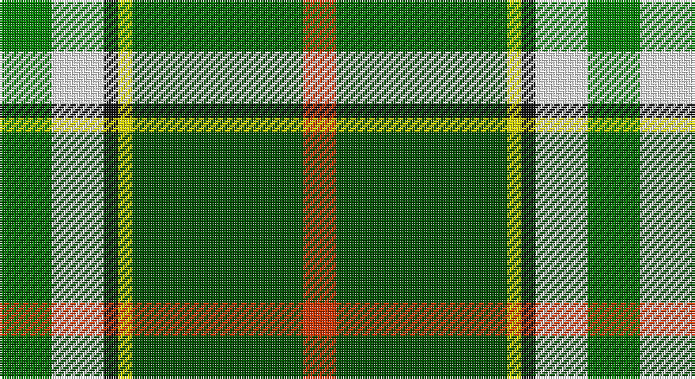

This page is one **sett** — a single exact thread-count. It belongs to the [tartan](/setts/g11w11k3ly3dg36r7/)
(the same proportion at any scale), whose colour order is pattern [GWKYGR](/stripes/gwkygr/).

Sourced from register-of-tartans.  It is a [6 stripe tartan](/stripes/stripes6/).

Original link https://www.tartanregister.gov.uk/tartanDetails.aspx?ref=10161

## Register references

External register numbers recorded for this tartan.

- Scottish Register of Tartans: [10161](https://www.tartanregister.gov.uk/tartanDetails.aspx?ref=10161)

## Thread count
Ga/22 W22 K6 Y6 G72 DO/14

One full sett is **248 threads**.

## Palette

Palette: <strong>Tartan Register</strong> <small style="color:#888">(2 of 6 colours)</small>
<table><thead><tr><th>Colour</th><th>Threads</th><th>Shade</th><th>Base</th><th>OKLCh</th></tr></thead><tbody><tr><td>Ga/</td><td style="text-align:right;font-variant-numeric:tabular-nums">22</td><td><code style="background-color:#008000;">#008000</code> <small style="color:#888">#008000</small></td><td>G <code style="background-color:#006100;">#006100</code></td><td><small style="color:#888">oklch(52.0% 0.177 142.5)</small></td></tr><tr><td>W</td><td style="text-align:right;font-variant-numeric:tabular-nums">22</td><td><code style="background-color:#FFFFFF;">#FFFFFF</code> <small style="color:#888">#FFFFFF</small></td><td>W <code style="background-color:#F7F7F7;">#F7F7F7</code></td><td><small style="color:#888">oklch(100.0% 0.000 89.9)</small></td></tr><tr><td>K</td><td style="text-align:right;font-variant-numeric:tabular-nums">6</td><td><code style="background-color:#101010;">#101010</code> <small style="color:#888">#101010</small></td><td>K <code style="background-color:#000000;">#000000</code></td><td><small style="color:#888">oklch(17.3% 0.000 89.9)</small></td></tr><tr><td>Y</td><td style="text-align:right;font-variant-numeric:tabular-nums">6</td><td><code style="background-color:#EEEE00;">#EEEE00</code> <small style="color:#888">#EEEE00</small></td><td>Y <code style="background-color:#F2BF00;">#F2BF00</code></td><td><small style="color:#888">oklch(91.9% 0.200 109.8)</small></td></tr><tr><td>G</td><td style="text-align:right;font-variant-numeric:tabular-nums">72</td><td><code style="background-color:#004F00;">#004F00</code> <small style="color:#888">#004F00</small></td><td>G <code style="background-color:#006100;">#006100</code></td><td><small style="color:#888">oklch(37.0% 0.126 142.5)</small></td></tr><tr><td>DO/</td><td style="text-align:right;font-variant-numeric:tabular-nums">14</td><td><code style="background-color:#CD3700;">#CD3700</code> <small style="color:#888">#CD3700</small></td><td>R <code style="background-color:#CC0000;">#CC0000</code></td><td><small style="color:#888">oklch(56.1% 0.194 35.7)</small></td></tr></tbody></table>

# Sample pattern

## Nearest tartans

The nearest existing variants by ΔTartan distance, with this tartan at the top so the swatches line up against it.

ΔTartan

Tartan

Sett

—

<a href="/ttd/edit/#slug=g11w11k3ly3dg36r7~x2">Driver, RC</a> <a class="nn-out" href="/variants/s6/g11w11k3ly3dg36r7~x2/" title="open its dictionary page">↗</a>

0.83

<a href="/ttd/edit/#slug=g11w11k3ly3dg36lo7~x2&amp;base=g11w11k3ly3dg36r7~x2">Driver (Name)</a> <a class="nn-out" href="/variants/s6/g11w11k3ly3dg36lo7~x2/" title="open its dictionary page">↗</a>

1.11

<a href="/ttd/edit/#slug=k16w4ly2g31t4dp4~x4&amp;base=g11w11k3ly3dg36r7~x2">Lethcoe (Thousand Oaks) (Personal)</a> <a class="nn-out" href="/variants/s6/k16w4ly2g31t4dp4~x4/" title="open its dictionary page">↗</a>

1.14

<a href="/ttd/edit/#slug=g18k2lr2k2t3k2ly6~x4&amp;base=g11w11k3ly3dg36r7~x2">Alberta</a> <a class="nn-out" href="/variants/s7/g18k2lr2k2t3k2ly6~x4/" title="open its dictionary page">↗</a>

1.21

<a href="/ttd/edit/#slug=w8k16g32dt3lo5w5~x2&amp;base=g11w11k3ly3dg36r7~x2">Mellor (Name)</a> <a class="nn-out" href="/variants/s6/w8k16g32dt3lo5w5~x2/" title="open its dictionary page">↗</a>

1.38

<a href="/ttd/edit/#slug=g12k1r1k1t2k1ly4~x2&amp;base=g11w11k3ly3dg36r7~x2">Alberta District Tartan</a> <a class="nn-out" href="/variants/s7/g12k1r1k1t2k1ly4~x2/" title="open its dictionary page">↗</a>

1.39

<a href="/ttd/edit/#slug=k4g16db11r16g25ly2t3~x2&amp;base=g11w11k3ly3dg36r7~x2">Mayo</a> <a class="nn-out" href="/variants/s7/k4g16db11r16g25ly2t3~x2/" title="open its dictionary page">↗</a>

1.39

<a href="/ttd/edit/#slug=m5dg27o2g25ly7dg3m3~x2&amp;base=g11w11k3ly3dg36r7~x2">Kilkenny</a> <a class="nn-out" href="/variants/s7/m5dg27o2g25ly7dg3m3~x2/" title="open its dictionary page">↗</a>

1.43

<a href="/ttd/edit/#slug=g12k1r1k1b2k1ly4~x8&amp;base=g11w11k3ly3dg36r7~x2">Alberta (District)</a> <a class="nn-out" href="/variants/s7/g12k1r1k1b2k1ly4~x8/" title="open its dictionary page">↗</a>

1.44

<a href="/ttd/edit/#slug=lo16k7w1g7k1ly3~x4&amp;base=g11w11k3ly3dg36r7~x2">Hamilton of Brandon (Fashion)</a> <a class="nn-out" href="/variants/s6/lo16k7w1g7k1ly3~x4/" title="open its dictionary page">↗</a>

1.47

<a href="/ttd/edit/#slug=dg41lo3g7n3w24dg10g7n7w3~x2&amp;base=g11w11k3ly3dg36r7~x2">Drummond of Perth Dress (Dance)</a> <a class="nn-out" href="/variants/s9/dg41lo3g7n3w24dg10g7n7w3~x2/" title="open its dictionary page">↗</a>

## Neighbour map

Every grey dot is one of 14360 variants placed by the first two principal components of the ΔTartan feature space (44% of its variance). Red is this tartan; blue dots are its nearest — click one to open its page.

<svg viewBox="0 0 640 380" role="img" style="max-width:100%;height:auto;border:1px solid #e0e0e0;border-radius:4px;display:block" xmlns="http://www.w3.org/2000/svg"><image href="/nn/cloud.v1.png" width="640" height="380"/><a href="/variants/s6/g11w11k3ly3dg36lo7~x2/"><circle cx="201.4" cy="155.5" r="4" fill="#3465a4"><title>Driver (Name)</title></circle></a><a href="/variants/s6/k16w4ly2g31t4dp4~x4/"><circle cx="207.2" cy="134.0" r="4" fill="#3465a4"><title>Lethcoe (Thousand Oaks) (Personal)</title></circle></a><a href="/variants/s7/g18k2lr2k2t3k2ly6~x4/"><circle cx="208.9" cy="160.3" r="4" fill="#3465a4"><title>Alberta</title></circle></a><a href="/variants/s6/w8k16g32dt3lo5w5~x2/"><circle cx="186.7" cy="179.4" r="4" fill="#3465a4"><title>Mellor (Name)</title></circle></a><a href="/variants/s7/g12k1r1k1t2k1ly4~x2/"><circle cx="269.8" cy="155.8" r="4" fill="#3465a4"><title>Alberta District Tartan</title></circle></a><a href="/variants/s7/k4g16db11r16g25ly2t3~x2/"><circle cx="222.4" cy="176.1" r="4" fill="#3465a4"><title>Mayo</title></circle></a><a href="/variants/s7/m5dg27o2g25ly7dg3m3~x2/"><circle cx="202.2" cy="165.6" r="4" fill="#3465a4"><title>Kilkenny</title></circle></a><a href="/variants/s7/g12k1r1k1b2k1ly4~x8/"><circle cx="270.2" cy="157.0" r="4" fill="#3465a4"><title>Alberta (District)</title></circle></a><a href="/variants/s6/lo16k7w1g7k1ly3~x4/"><circle cx="215.3" cy="163.5" r="4" fill="#3465a4"><title>Hamilton of Brandon (Fashion)</title></circle></a><a href="/variants/s9/dg41lo3g7n3w24dg10g7n7w3~x2/"><circle cx="211.8" cy="137.5" r="4" fill="#3465a4"><title>Drummond of Perth Dress (Dance)</title></circle></a><circle cx="193.7" cy="150.8" r="5" fill="#c00000"/></svg>

ID: /variants/s6/g11w11k3ly3dg36r7~x2/
