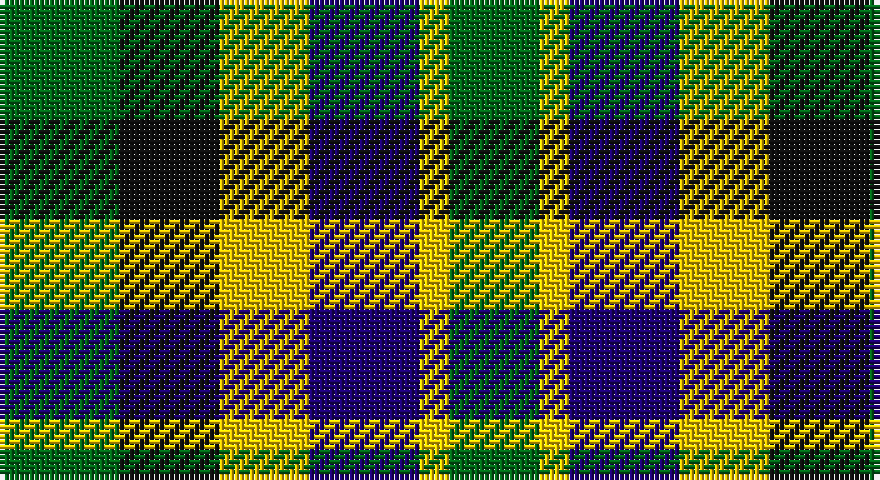

This page is one **sett** — a single exact thread-count. It belongs to the [tartan](/setts/g12k10ly9db11lyi3g9/)
(the same proportion at any scale), whose colour order is pattern [GKYBYG](/stripes/gkybyg/).

Part of the [Centeno-Oxford](/tartans/centeno-oxford/) tartan — the named design grouping this sett with its other cloths.

Sourced from tartans-authority.  It is a [6 stripe tartan](/stripes/stripes6/).

Original link http://www.tartansauthority.com/tartan-ferret/display/10892/

## Register references

External register numbers recorded for this tartan.

- Scottish Register of Tartans: [10892](https://www.tartanregister.gov.uk/tartanDetails?ref=10892)
- Scottish Tartans Authority (ITI): 10892

## Thread count
G/24 K20 Ya18 DB22 Y6 G/18

One full sett is **174 threads**.

## Palette

Palette: <strong>Tartan Register</strong>
<table><thead><tr><th>Colour</th><th>Threads</th><th>Shade</th><th>Base</th><th>OKLCh</th></tr></thead><tbody><tr><td>G/</td><td style="text-align:right;font-variant-numeric:tabular-nums">24</td><td><code style="background-color:#006818;">#006818</code> <small style="color:#888">#006818</small></td><td>G <code style="background-color:#006100;">#006100</code></td><td><small style="color:#888">oklch(45.0% 0.142 145.0)</small></td></tr><tr><td>K</td><td style="text-align:right;font-variant-numeric:tabular-nums">20</td><td><code style="background-color:#101010;">#101010</code> <small style="color:#888">#101010</small></td><td>K <code style="background-color:#000000;">#000000</code></td><td><small style="color:#888">oklch(17.3% 0.000 89.9)</small></td></tr><tr><td>Ya</td><td style="text-align:right;font-variant-numeric:tabular-nums">18</td><td><code style="background-color:#E8C000;">#E8C000</code> <small style="color:#888">#E8C000</small></td><td>Y <code style="background-color:#F2BF00;">#F2BF00</code></td><td><small style="color:#888">oklch(81.9% 0.168 93.7)</small></td></tr><tr><td>DB</td><td style="text-align:right;font-variant-numeric:tabular-nums">22</td><td><code style="background-color:#1C0070;">#1C0070</code> <small style="color:#888">#1C0070</small></td><td>B <code style="background-color:#2A418A;">#2A418A</code></td><td><small style="color:#888">oklch(26.3% 0.162 277.1)</small></td></tr><tr><td>Y</td><td style="text-align:right;font-variant-numeric:tabular-nums">6</td><td><code style="background-color:#FCCC00;">#FCCC00</code> <small style="color:#888">#FCCC00</small></td><td>Y <code style="background-color:#F2BF00;">#F2BF00</code></td><td><small style="color:#888">oklch(86.2% 0.176 91.5)</small></td></tr><tr><td>G/</td><td style="text-align:right;font-variant-numeric:tabular-nums">18</td><td><code style="background-color:#006818;">#006818</code> <small style="color:#888">#006818</small></td><td>G <code style="background-color:#006100;">#006100</code></td><td><small style="color:#888">oklch(45.0% 0.142 145.0)</small></td></tr></tbody></table>

# Sample pattern

## Compared to the master

This cloth is one sett of its design; the master sett (the exemplar the design is anchored on) is below for comparison.

<figure style="margin:0"><figcaption style="color:#888;font-size:smaller">this sett</figcaption></figure>
<figure style="margin:0"><figcaption style="color:#888;font-size:smaller"><a href="/setts/k10ly9db11g12w3g9/">master sett →</a></figcaption></figure>

## Nearest tartans

The nearest existing variants by ΔTartan distance, with this tartan at the top so the swatches line up against it.

ΔTartan

Tartan

Sett

—

<a href="/ttd/edit/#slug=g12k10ly9db11lyi3g9~x2">Centeno-Oxford</a> <a class="nn-out" href="/variants/s6/g12k10ly9db11lyi3g9~x2/" title="open its dictionary page">↗</a>

0.82

<a href="/ttd/edit/#slug=k10ly9db11g12w3g9~x2&amp;base=g12k10ly9db11lyi3g9~x2">Centeno-Oxford (Personal)</a> <a class="nn-out" href="/variants/s6/k10ly9db11g12w3g9~x2/" title="open its dictionary page">↗</a>

1.44

<a href="/ttd/edit/#slug=k19t10p19g40ly10&amp;base=g12k10ly9db11lyi3g9~x2">Gallowater, Old</a> <a class="nn-out" href="/variants/s5/k19t10p19g40ly10/" title="open its dictionary page">↗</a>

1.46

<a href="/ttd/edit/#slug=r2db4k4g4lb1g4k4g4lb1~x4&amp;base=g12k10ly9db11lyi3g9~x2">Arrol</a> <a class="nn-out" href="/variants/s9/r2db4k4g4lb1g4k4g4lb1~x4/" title="open its dictionary page">↗</a>

1.54

<a href="/ttd/edit/#slug=b8k11w3k11g12g10m2~x2&amp;base=g12k10ly9db11lyi3g9~x2">Loch Katrine</a> <a class="nn-out" href="/variants/s7/b8k11w3k11g12g10m2~x2/" title="open its dictionary page">↗</a>

1.58

<a href="/ttd/edit/#slug=k19t10dp19g40ly10&amp;base=g12k10ly9db11lyi3g9~x2">Gallowater Old District Tartan</a> <a class="nn-out" href="/variants/s5/k19t10dp19g40ly10/" title="open its dictionary page">↗</a>

1.58

<a href="/ttd/edit/#slug=k12w12k12w12g13w8dr6g4dr5&amp;base=g12k10ly9db11lyi3g9~x2">Burns Heritage Check</a> <a class="nn-out" href="/variants/s9/k12w12k12w12g13w8dr6g4dr5/" title="open its dictionary page">↗</a>

1.58

<a href="/ttd/edit/#slug=k4lo9k13g6lo3g9w4~x2&amp;base=g12k10ly9db11lyi3g9~x2">Ramsay (Orange)</a> <a class="nn-out" href="/variants/s7/k4lo9k13g6lo3g9w4~x2/" title="open its dictionary page">↗</a>

1.60

<a href="/variants/s7/db8g11k3g11m12ki10ly2~x2/">Scottish Parliament</a>

1.67

<a href="/ttd/edit/#slug=g5dg5gi5dbi5db5dg10w2~x8&amp;base=g12k10ly9db11lyi3g9~x2">Pollard (2014)</a> <a class="nn-out" href="/variants/s7/g5dg5gi5dbi5db5dg10w2~x8/" title="open its dictionary page">↗</a>

1.68

<a href="/ttd/edit/#slug=k3g10k10r3db8w3~x2&amp;base=g12k10ly9db11lyi3g9~x2">Russell (Clan)</a> <a class="nn-out" href="/variants/s6/k3g10k10r3db8w3~x2/" title="open its dictionary page">↗</a>

## Neighbour map

Every grey dot is one of 14360 variants placed by the first two principal components of the ΔTartan feature space (44% of its variance). Red is this tartan; blue dots are its nearest — click one to open its page.

<svg viewBox="0 0 640 380" role="img" style="max-width:100%;height:auto;border:1px solid #e0e0e0;border-radius:4px;display:block" xmlns="http://www.w3.org/2000/svg"><image href="/nn/cloud.v1.png" width="640" height="380"/><a href="/variants/s6/k10ly9db11g12w3g9~x2/"><circle cx="28.7" cy="270.0" r="4" fill="#3465a4"><title>Centeno-Oxford (Personal)</title></circle></a><a href="/variants/s5/k19t10p19g40ly10/"><circle cx="86.6" cy="247.1" r="4" fill="#3465a4"><title>Gallowater, Old</title></circle></a><a href="/variants/s9/r2db4k4g4lb1g4k4g4lb1~x4/"><circle cx="76.7" cy="251.9" r="4" fill="#3465a4"><title>Arrol</title></circle></a><a href="/variants/s7/b8k11w3k11g12g10m2~x2/"><circle cx="92.2" cy="236.7" r="4" fill="#3465a4"><title>Loch Katrine</title></circle></a><a href="/variants/s5/k19t10dp19g40ly10/"><circle cx="108.6" cy="257.2" r="4" fill="#3465a4"><title>Gallowater Old District Tartan</title></circle></a><a href="/variants/s9/k12w12k12w12g13w8dr6g4dr5/"><circle cx="41.9" cy="261.5" r="4" fill="#3465a4"><title>Burns Heritage Check</title></circle></a><a href="/variants/s7/k4lo9k13g6lo3g9w4~x2/"><circle cx="94.8" cy="256.2" r="4" fill="#3465a4"><title>Ramsay (Orange)</title></circle></a><a href="/variants/s7/db8g11k3g11m12ki10ly2~x2/"><circle cx="74.5" cy="228.7" r="4" fill="#3465a4"><title>Scottish Parliament</title></circle></a><a href="/variants/s7/g5dg5gi5dbi5db5dg10w2~x8/"><circle cx="67.9" cy="251.4" r="4" fill="#3465a4"><title>Pollard (2014)</title></circle></a><a href="/variants/s6/k3g10k10r3db8w3~x2/"><circle cx="67.3" cy="259.1" r="4" fill="#3465a4"><title>Russell (Clan)</title></circle></a><circle cx="46.5" cy="276.4" r="5" fill="#c00000"/></svg>

ID: /variants/s6/g12k10ly9db11lyi3g9~x2/
