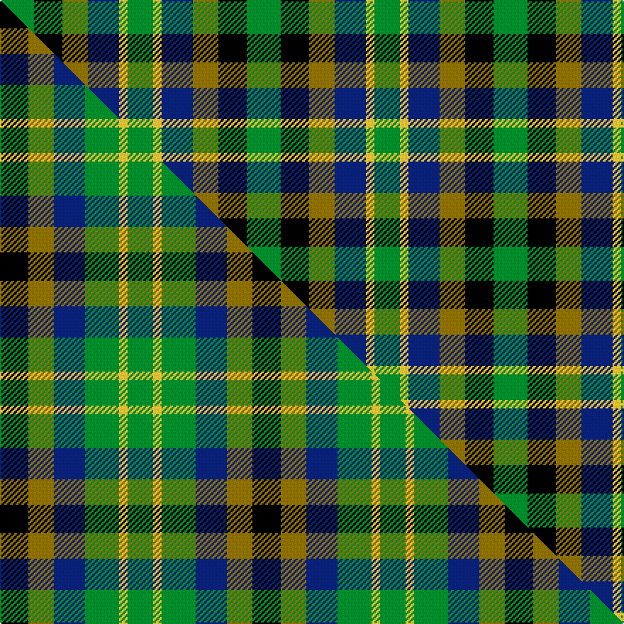

This page is one **sett** — a single exact thread-count. It belongs to the [tartan](/setts/g12k10y9db11ly3g9/)
(the same proportion at any scale), whose colour order is pattern [GKGBYG](/stripes/gkgbyg/).

Part of the [Centeno-Oxford](/tartans/centeno-oxford/) tartan — the named design grouping this sett with its other cloths.

Sourced from tartans-authority.  It is a [6 stripe tartan](/stripes/stripes6/).

Original link http://www.tartansauthority.com/tartan-ferret/display/10892/

## Register references

External register numbers recorded for this tartan.

- Scottish Register of Tartans: [10892](https://www.tartanregister.gov.uk/tartanDetails?ref=10892)
- Scottish Tartans Authority (ITI): 10892

## Thread count
G/24 K20 Y18 DB22 LY6 G/18

One full sett is **174 threads**.

## Palette
<table><thead><tr><th>Colour</th><th>Shade</th><th>OKLCh</th></tr></thead><tbody><tr><td>DB</td><td><code style="background-color:#082077;">#082077</code> <small style="color:#888">#082077</small></td><td><small style="color:#888">oklch(30.0% 0.149 265.1)</small></td></tr><tr><td>G</td><td><code style="background-color:#008B2A;">#008B2A</code> <small style="color:#888">#008B2A</small></td><td><small style="color:#888">oklch(55.4% 0.170 145.9)</small></td></tr><tr><td>K</td><td><code style="background-color:#000000;">#000000</code> <small style="color:#888">#000000</small></td><td><small style="color:#888">oklch(0.0% 0.000 0.0)</small></td></tr><tr><td>LY</td><td><code style="background-color:#DCBC32;">#DCBC32</code> <small style="color:#888">#DCBC32</small></td><td><small style="color:#888">oklch(80.0% 0.150 95.2)</small></td></tr><tr><td>Y</td><td><code style="background-color:#8B6E00;">#8B6E00</code> <small style="color:#888">#8B6E00</small></td><td><small style="color:#888">oklch(55.1% 0.113 90.4)</small></td></tr></tbody></table>

# Sample pattern

## Compared to the master

This cloth is one sett of its design; the master sett (the exemplar the design is anchored on) is below for comparison.

Its **ΔTartan distance** from the master is **0.02** — the same measure the nearest-tartans table ranks by (0 is identical; a re-scale of the same cloth is near 0, a recolour or a different proportion further).

<figure class="master-compare" style="margin:0">

this sett
master sett ★

<figcaption style="color:#888;font-size:smaller">One weave of this sett against the <a href="/setts/k10y9db11g12ly3g9/">master sett ★</a>, split on the diagonal: a shared proportion runs seamlessly across it with only the shades shifting; a different proportion breaks on it.</figcaption>
</figure>

## Nearest tartan variants

The nearest existing variants by ΔTartan distance, with this cloth at the top so the swatches line up against it.

ΔTartan

Threads

Variant

Sett

—

174

<a href="/variants/s6/g12k10y9db11ly3g9~x2/">Centeno-Oxford</a>

<a href="/ttd/edit/#slug=k10y9db11g12ly3g9~x2&amp;base=g12k10y9db11ly3g9~x2" title="compare in the TTD">0.75</a>

178

<a href="/variants/s6/k10y9db11g12ly3g9~x2/">Centeno-Oxford (Personal)</a>

<a href="/ttd/edit/#slug=k4g4k1g4k4db4y1~x2&amp;base=g12k10y9db11ly3g9~x2" title="compare in the TTD">2.34</a>

78

<a href="/variants/s7/k4g4k1g4k4db4y1~x2/">Unidentified No 39</a>

<a href="/ttd/edit/#slug=k4g4y1g4k4db4k1~x2&amp;base=g12k10y9db11ly3g9~x2" title="compare in the TTD">2.49</a>

78

<a href="/variants/s7/k4g4y1g4k4db4k1~x2/">MacKay Coat</a>

<a href="/ttd/edit/#slug=k4g4w1g4k4db4k1~x2&amp;base=g12k10y9db11ly3g9~x2" title="compare in the TTD">2.49</a>

78

<a href="/variants/s7/k4g4w1g4k4db4k1~x2/">Graham of Montrose</a>

<a href="/ttd/edit/#slug=k4g4w1g4k4db4k1~x4&amp;base=g12k10y9db11ly3g9~x2" title="compare in the TTD">2.49</a>

156

<a href="/variants/s7/k4g4w1g4k4db4k1~x4/">Graham of Montrose</a>

<a href="/ttd/edit/#slug=k9g9ly2g9k9db9k3~x2&amp;base=g12k10y9db11ly3g9~x2" title="compare in the TTD">2.60</a>

176

<a href="/variants/s7/k9g9ly2g9k9db9k3~x2/">Campbell of Breadalbane (Clan)</a>

<a href="/ttd/edit/#slug=k9g9w2g9k9db9k3~x2&amp;base=g12k10y9db11ly3g9~x2" title="compare in the TTD">2.60</a>

176

<a href="/variants/s7/k9g9w2g9k9db9k3~x2/">Graham of Montrose - 1850 (Clan)</a>

<a href="/ttd/edit/#slug=k9g9y2g9k9db9k3~x2&amp;base=g12k10y9db11ly3g9~x2" title="compare in the TTD">2.60</a>

176

<a href="/variants/s7/k9g9y2g9k9db9k3~x2/">Campbell of Breadalbane #3</a>

<a href="/ttd/edit/#slug=k9g9y2g9k9db9k3&amp;base=g12k10y9db11ly3g9~x2" title="compare in the TTD">2.60</a>

88

<a href="/variants/s7/k9g9y2g9k9db9k3/">Campbell Breadalbane</a>

<a href="/ttd/edit/#slug=r4g15k15db15w4~x2&amp;base=g12k10y9db11ly3g9~x2" title="compare in the TTD">2.72</a>

196

<a href="/variants/s5/r4g15k15db15w4~x2/">Dalmeny</a>

## Neighbour map

Every grey dot is one of 13620 variants placed by the first two principal components of the ΔTartan feature space (42% of its variance). Red is this tartan; blue dots are its nearest — click one to open its page.

<svg viewBox="0 0 640 380" role="img" style="max-width:100%;height:auto;border:1px solid #e0e0e0;border-radius:4px;display:block" xmlns="http://www.w3.org/2000/svg"><image href="/nn/cloud.v1.png" width="640" height="380"/><a href="/variants/s6/k10y9db11g12ly3g9~x2/"><circle cx="61.7" cy="283.0" r="4" fill="#3465a4"><title>Centeno-Oxford (Personal)</title></circle></a><a href="/variants/s7/k4g4k1g4k4db4y1~x2/"><circle cx="112.2" cy="267.7" r="4" fill="#3465a4"><title>Unidentified No 39</title></circle></a><a href="/variants/s7/k4g4y1g4k4db4k1~x2/"><circle cx="106.6" cy="264.0" r="4" fill="#3465a4"><title>MacKay Coat</title></circle></a><a href="/variants/s7/k4g4w1g4k4db4k1~x2/"><circle cx="97.9" cy="261.5" r="4" fill="#3465a4"><title>Graham of Montrose</title></circle></a><a href="/variants/s7/k4g4w1g4k4db4k1~x4/"><circle cx="97.9" cy="261.5" r="4" fill="#3465a4"><title>Graham of Montrose</title></circle></a><a href="/variants/s7/k9g9ly2g9k9db9k3~x2/"><circle cx="108.6" cy="260.6" r="4" fill="#3465a4"><title>Campbell of Breadalbane (Clan)</title></circle></a><a href="/variants/s7/k9g9w2g9k9db9k3~x2/"><circle cx="105.3" cy="259.7" r="4" fill="#3465a4"><title>Graham of Montrose - 1850 (Clan)</title></circle></a><a href="/variants/s7/k9g9y2g9k9db9k3~x2/"><circle cx="113.1" cy="261.9" r="4" fill="#3465a4"><title>Campbell of Breadalbane #3</title></circle></a><a href="/variants/s7/k9g9y2g9k9db9k3/"><circle cx="113.1" cy="261.9" r="4" fill="#3465a4"><title>Campbell Breadalbane</title></circle></a><a href="/variants/s5/r4g15k15db15w4~x2/"><circle cx="37.1" cy="258.3" r="4" fill="#3465a4"><title>Dalmeny</title></circle></a><circle cx="61.3" cy="282.7" r="5" fill="#c00000"/><text x="320" y="376" text-anchor="middle" font-size="11" fill="#999">ground</text><text x="11" y="190" text-anchor="middle" font-size="11" fill="#999" transform="rotate(-90 11 190)">complexity</text></svg>

ID: /variants/s6/g12k10y9db11ly3g9~x2/
