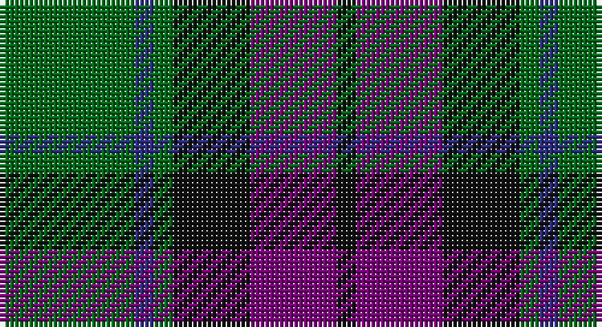

This page is one **sett** — a single exact thread-count. It belongs to the [tartan](/setts/g14db2g2k8dp9k2/)
(the same proportion at any scale), whose colour order is pattern [GBGKBK](/stripes/gbgkbk/).

Part of the [MacArthur of Milton Hunting](/tartans/macarthur-of-milton-hunting/) tartan — the named design grouping this sett with its other cloths.

Sourced from house-of-tartan.  It is a [6 stripe tartan](/stripes/stripes6/).

Original link http://www.house-of-tartan.scotland.net/house/TartanViewjs.asp?colr=Def&tnam=700

## Provenance

Earliest known date: 1823 This is the older of the two MacArthur setts, which links the clan with the Campbells.

## Also known as

This cloth is also recorded under:

- MacArthur of Milton
- MacArthur of Milton, hunting

## Thread count
G/28 DB4 G4 K16 P18 K/4

One full sett is **116 threads**.

## Palette

Palette: <strong>Tartan Register</strong>
<table><thead><tr><th>Colour</th><th>Threads</th><th>Shade</th><th>Base</th><th>OKLCh</th></tr></thead><tbody><tr><td>G/</td><td style="text-align:right;font-variant-numeric:tabular-nums">28</td><td><code style="background-color:#006818;">#006818</code> <small style="color:#888">#006818</small></td><td>G <code style="background-color:#006100;">#006100</code></td><td><small style="color:#888">oklch(45.0% 0.142 145.0)</small></td></tr><tr><td>DB</td><td style="text-align:right;font-variant-numeric:tabular-nums">4</td><td><code style="background-color:#2C2C80;">#2C2C80</code> <small style="color:#888">#2C2C80</small></td><td>B <code style="background-color:#2A418A;">#2A418A</code></td><td><small style="color:#888">oklch(35.0% 0.138 276.6)</small></td></tr><tr><td>G</td><td style="text-align:right;font-variant-numeric:tabular-nums">4</td><td><code style="background-color:#006818;">#006818</code> <small style="color:#888">#006818</small></td><td>G <code style="background-color:#006100;">#006100</code></td><td><small style="color:#888">oklch(45.0% 0.142 145.0)</small></td></tr><tr><td>K</td><td style="text-align:right;font-variant-numeric:tabular-nums">16</td><td><code style="background-color:#101010;">#101010</code> <small style="color:#888">#101010</small></td><td>K <code style="background-color:#000000;">#000000</code></td><td><small style="color:#888">oklch(17.3% 0.000 89.9)</small></td></tr><tr><td>P</td><td style="text-align:right;font-variant-numeric:tabular-nums">18</td><td><code style="background-color:#780078;">#780078</code> <small style="color:#888">#780078</small></td><td>B <code style="background-color:#2A418A;">#2A418A</code></td><td><small style="color:#888">oklch(40.2% 0.185 328.4)</small></td></tr><tr><td>K/</td><td style="text-align:right;font-variant-numeric:tabular-nums">4</td><td><code style="background-color:#101010;">#101010</code> <small style="color:#888">#101010</small></td><td>K <code style="background-color:#000000;">#000000</code></td><td><small style="color:#888">oklch(17.3% 0.000 89.9)</small></td></tr></tbody></table>

# Sample pattern

## Compared to the master

This cloth is one sett of its design; the master sett (the exemplar the design is anchored on) is below for comparison.

<figure style="margin:0"><figcaption style="color:#888;font-size:smaller">this sett</figcaption></figure>
<figure style="margin:0"><figcaption style="color:#888;font-size:smaller"><a href="/setts/dg7db1dg1k4dp4k1/">master sett →</a></figcaption></figure>

## Nearest tartans

The nearest existing variants by ΔTartan distance, with this tartan at the top so the swatches line up against it.

ΔTartan

Tartan

Sett

—

<a href="/ttd/edit/#slug=g14db2g2k8dp9k2~x2">MacArthur of Milton Hunting Clan Tartan</a> <a class="nn-out" href="/variants/s6/g14db2g2k8dp9k2~x2/" title="open its dictionary page">↗</a>

0.33

<a href="/ttd/edit/#slug=g7db1g1k4dp4k1~x4&amp;base=g14db2g2k8dp9k2~x2">MacArthur of Milton (Clan)</a> <a class="nn-out" href="/variants/s6/g7db1g1k4dp4k1~x4/" title="open its dictionary page">↗</a>

0.71

<a href="/ttd/edit/#slug=g18t2g4k14dp12k3~x2&amp;base=g14db2g2k8dp9k2~x2">Coburg</a> <a class="nn-out" href="/variants/s6/g18t2g4k14dp12k3~x2/" title="open its dictionary page">↗</a>

0.72

<a href="/ttd/edit/#slug=g1db6k6g6r1g1~x6&amp;base=g14db2g2k8dp9k2~x2">Callum Beg (Fashion)</a> <a class="nn-out" href="/variants/s6/g1db6k6g6r1g1~x6/" title="open its dictionary page">↗</a>

0.73

<a href="/ttd/edit/#slug=k3db14r2k14g14k3~x2&amp;base=g14db2g2k8dp9k2~x2">Gallamore</a> <a class="nn-out" href="/variants/s6/k3db14r2k14g14k3~x2/" title="open its dictionary page">↗</a>

0.82

<a href="/ttd/edit/#slug=g52lb7g9k35db35k7&amp;base=g14db2g2k8dp9k2~x2">Redland</a> <a class="nn-out" href="/variants/s6/g52lb7g9k35db35k7/" title="open its dictionary page">↗</a>

0.86

<a href="/ttd/edit/#slug=dg1db5dg1k5dg6ly1~x2&amp;base=g14db2g2k8dp9k2~x2">MacKay (Bonner)</a> <a class="nn-out" href="/variants/s6/dg1db5dg1k5dg6ly1~x2/" title="open its dictionary page">↗</a>

0.86

<a href="/ttd/edit/#slug=r3g6db2dbi2db11g9db2r3~x2&amp;base=g14db2g2k8dp9k2~x2">Daks (Navy)</a> <a class="nn-out" href="/variants/s8/r3g6db2dbi2db11g9db2r3~x2/" title="open its dictionary page">↗</a>

0.88

<a href="/ttd/edit/#slug=t4dy28g6t12k12t3~x2&amp;base=g14db2g2k8dp9k2~x2">MacTavish Hunting</a> <a class="nn-out" href="/variants/s6/t4dy28g6t12k12t3~x2/" title="open its dictionary page">↗</a>

0.88

<a href="/ttd/edit/#slug=k2g10t2k9dp8g2~x2&amp;base=g14db2g2k8dp9k2~x2">Lennie Family Tartan</a> <a class="nn-out" href="/variants/s6/k2g10t2k9dp8g2~x2/" title="open its dictionary page">↗</a>

0.88

<a href="/ttd/edit/#slug=r4g12k12g2db12g3~x2&amp;base=g14db2g2k8dp9k2~x2">Gunn - 1810 (Clan)</a> <a class="nn-out" href="/variants/s6/r4g12k12g2db12g3~x2/" title="open its dictionary page">↗</a>

## Neighbour map

Every grey dot is one of 14360 variants placed by the first two principal components of the ΔTartan feature space (44% of its variance). Red is this tartan; blue dots are its nearest — click one to open its page.

<svg viewBox="0 0 640 380" role="img" style="max-width:100%;height:auto;border:1px solid #e0e0e0;border-radius:4px;display:block" xmlns="http://www.w3.org/2000/svg"><image href="/nn/cloud.v1.png" width="640" height="380"/><a href="/variants/s6/g7db1g1k4dp4k1~x4/"><circle cx="233.2" cy="249.7" r="4" fill="#3465a4"><title>MacArthur of Milton (Clan)</title></circle></a><a href="/variants/s6/g18t2g4k14dp12k3~x2/"><circle cx="229.4" cy="249.4" r="4" fill="#3465a4"><title>Coburg</title></circle></a><a href="/variants/s6/g1db6k6g6r1g1~x6/"><circle cx="197.7" cy="261.3" r="4" fill="#3465a4"><title>Callum Beg (Fashion)</title></circle></a><a href="/variants/s6/k3db14r2k14g14k3~x2/"><circle cx="214.3" cy="261.9" r="4" fill="#3465a4"><title>Gallamore</title></circle></a><a href="/variants/s6/g52lb7g9k35db35k7/"><circle cx="207.5" cy="247.7" r="4" fill="#3465a4"><title>Redland</title></circle></a><a href="/variants/s6/dg1db5dg1k5dg6ly1~x2/"><circle cx="213.0" cy="266.7" r="4" fill="#3465a4"><title>MacKay (Bonner)</title></circle></a><a href="/variants/s8/r3g6db2dbi2db11g9db2r3~x2/"><circle cx="200.6" cy="248.3" r="4" fill="#3465a4"><title>Daks (Navy)</title></circle></a><a href="/variants/s6/t4dy28g6t12k12t3~x2/"><circle cx="237.6" cy="231.6" r="4" fill="#3465a4"><title>MacTavish Hunting</title></circle></a><a href="/variants/s6/k2g10t2k9dp8g2~x2/"><circle cx="165.6" cy="263.1" r="4" fill="#3465a4"><title>Lennie Family Tartan</title></circle></a><a href="/variants/s6/r4g12k12g2db12g3~x2/"><circle cx="167.6" cy="264.9" r="4" fill="#3465a4"><title>Gunn - 1810 (Clan)</title></circle></a><circle cx="221.2" cy="246.3" r="5" fill="#c00000"/></svg>

ID: /variants/s6/g14db2g2k8dp9k2~x2/
