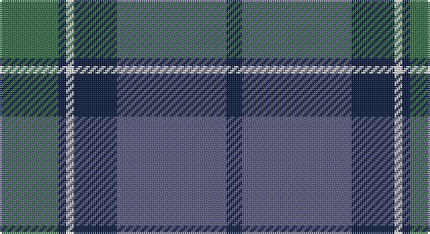

This page is one **sett** — a single exact thread-count. It belongs to the [tartan](/setts/g15dt2w2dt11n28dt4/)
(the same proportion at any scale), whose colour order is pattern [BBBWBG](/stripes/bbbwbg/).

Sourced from weddslist.  It is a [6 stripe tartan](/stripes/stripes6/).

Original link http://www.weddslist.com/cgi-bin/tartans/pg.pl?source=sts

## Thread count
G/30 DB4 LN4 DB22 N56 DB/8

One full sett is **210 threads**.

## Palette

Palette: <strong>Tartan Dictionary</strong> <small style="color:#888">(1 of 4 colours)</small>
<table><thead><tr><th>Colour</th><th>Threads</th><th>Shade</th><th>Base</th><th>OKLCh</th></tr></thead><tbody><tr><td>G/</td><td style="text-align:right;font-variant-numeric:tabular-nums">30</td><td><code style="background-color:#407050;">#407050</code> <small style="color:#888">#407050</small></td><td>G <code style="background-color:#006100;">#006100</code></td><td><small style="color:#888">oklch(50.1% 0.074 153.7)</small></td></tr><tr><td>DB</td><td style="text-align:right;font-variant-numeric:tabular-nums">4</td><td><code style="background-color:#102040;">#102040</code> <small style="color:#888">#102040</small></td><td>B <code style="background-color:#2A418A;">#2A418A</code></td><td><small style="color:#888">oklch(24.9% 0.065 262.6)</small></td></tr><tr><td>LN</td><td style="text-align:right;font-variant-numeric:tabular-nums">4</td><td><code style="background-color:#E0E0E0;">#E0E0E0</code> <small style="color:#888">#E0E0E0</small></td><td>W <code style="background-color:#F7F7F7;">#F7F7F7</code></td><td><small style="color:#888">oklch(90.7% 0.000 89.9)</small></td></tr><tr><td>DB</td><td style="text-align:right;font-variant-numeric:tabular-nums">22</td><td><code style="background-color:#102040;">#102040</code> <small style="color:#888">#102040</small></td><td>B <code style="background-color:#2A418A;">#2A418A</code></td><td><small style="color:#888">oklch(24.9% 0.065 262.6)</small></td></tr><tr><td>N</td><td style="text-align:right;font-variant-numeric:tabular-nums">56</td><td><code style="background-color:#606080;">#606080</code> <small style="color:#888">#606080</small></td><td>B <code style="background-color:#2A418A;">#2A418A</code></td><td><small style="color:#888">oklch(50.2% 0.051 284.4)</small></td></tr><tr><td>DB/</td><td style="text-align:right;font-variant-numeric:tabular-nums">8</td><td><code style="background-color:#102040;">#102040</code> <small style="color:#888">#102040</small></td><td>B <code style="background-color:#2A418A;">#2A418A</code></td><td><small style="color:#888">oklch(24.9% 0.065 262.6)</small></td></tr></tbody></table>

# Sample pattern

## Nearest tartans

The nearest existing variants by ΔTartan distance, with this tartan at the top so the swatches line up against it.

ΔTartan

Tartan

Sett

—

<a href="/ttd/edit/#slug=g15dt2w2dt11n28dt4~x2">Rhode Island, The State of</a> <a class="nn-out" href="/variants/s6/g15dt2w2dt11n28dt4~x2/" title="open its dictionary page">↗</a>

1.14

<a href="/ttd/edit/#slug=dt3t14dt3o16dt34r3~x2&amp;base=g15dt2w2dt11n28dt4~x2">Thorburn (Lochcarron)</a> <a class="nn-out" href="/variants/s6/dt3t14dt3o16dt34r3~x2/" title="open its dictionary page">↗</a>

1.20

<a href="/ttd/edit/#slug=n32k3n3k3b5k8o21k4~x2&amp;base=g15dt2w2dt11n28dt4~x2">Speyside Blue (Fashion)</a> <a class="nn-out" href="/variants/s8/n32k3n3k3b5k8o21k4~x2/" title="open its dictionary page">↗</a>

1.28

<a href="/ttd/edit/#slug=t4dy28dg6t12k12t3~x2&amp;base=g15dt2w2dt11n28dt4~x2">Thompson/Thomson/MacTavish Hunting</a> <a class="nn-out" href="/variants/s6/t4dy28dg6t12k12t3~x2/" title="open its dictionary page">↗</a>

1.30

<a href="/ttd/edit/#slug=g8w3n6db11n30db5~x2&amp;base=g15dt2w2dt11n28dt4~x2">Devlin, Craig (Personal)</a> <a class="nn-out" href="/variants/s6/g8w3n6db11n30db5~x2/" title="open its dictionary page">↗</a>

1.32

<a href="/ttd/edit/#slug=db3g13lr1o3lr1db10lo1~x2&amp;base=g15dt2w2dt11n28dt4~x2">Graeme Heckenberg Hunting</a> <a class="nn-out" href="/variants/s7/db3g13lr1o3lr1db10lo1~x2/" title="open its dictionary page">↗</a>

1.32

<a href="/ttd/edit/#slug=r3g1k1g12b12k1b1k1~x4&amp;base=g15dt2w2dt11n28dt4~x2">Peter of Lee (Personal)</a> <a class="nn-out" href="/variants/s8/r3g1k1g12b12k1b1k1~x4/" title="open its dictionary page">↗</a>

1.34

<a href="/ttd/edit/#slug=db32do3db3do3db3do10g24r3~x2&amp;base=g15dt2w2dt11n28dt4~x2">Gammell Family Tartan</a> <a class="nn-out" href="/variants/s8/db32do3db3do3db3do10g24r3~x2/" title="open its dictionary page">↗</a>

1.35

<a href="/ttd/edit/#slug=n32k3n3k3o5k8oi21k4~x2&amp;base=g15dt2w2dt11n28dt4~x2">Speyside Grey (Fashion)</a> <a class="nn-out" href="/variants/s8/n32k3n3k3o5k8oi21k4~x2/" title="open its dictionary page">↗</a>

1.37

<a href="/ttd/edit/#slug=dg8r3dg3r5dg26db7t3db28r3db6~x2&amp;base=g15dt2w2dt11n28dt4~x2">Stuart/Stewart of Appin</a> <a class="nn-out" href="/variants/s10/dg8r3dg3r5dg26db7t3db28r3db6~x2/" title="open its dictionary page">↗</a>

1.37

<a href="/ttd/edit/#slug=lp4dy2dp4dy35n27r3~x2&amp;base=g15dt2w2dt11n28dt4~x2">Deeside, Royal</a> <a class="nn-out" href="/variants/s6/lp4dy2dp4dy35n27r3~x2/" title="open its dictionary page">↗</a>

## Neighbour map

Every grey dot is one of 14360 variants placed by the first two principal components of the ΔTartan feature space (44% of its variance). Red is this tartan; blue dots are its nearest — click one to open its page.

<svg viewBox="0 0 640 380" role="img" style="max-width:100%;height:auto;border:1px solid #e0e0e0;border-radius:4px;display:block" xmlns="http://www.w3.org/2000/svg"><image href="/nn/cloud.v1.png" width="640" height="380"/><a href="/variants/s6/dt3t14dt3o16dt34r3~x2/"><circle cx="332.7" cy="226.1" r="4" fill="#3465a4"><title>Thorburn (Lochcarron)</title></circle></a><a href="/variants/s8/n32k3n3k3b5k8o21k4~x2/"><circle cx="266.9" cy="198.4" r="4" fill="#3465a4"><title>Speyside Blue (Fashion)</title></circle></a><a href="/variants/s6/t4dy28dg6t12k12t3~x2/"><circle cx="249.8" cy="242.4" r="4" fill="#3465a4"><title>Thompson/Thomson/MacTavish Hunting</title></circle></a><a href="/variants/s6/g8w3n6db11n30db5~x2/"><circle cx="357.4" cy="242.8" r="4" fill="#3465a4"><title>Devlin, Craig (Personal)</title></circle></a><a href="/variants/s7/db3g13lr1o3lr1db10lo1~x2/"><circle cx="261.5" cy="191.5" r="4" fill="#3465a4"><title>Graeme Heckenberg Hunting</title></circle></a><a href="/variants/s8/r3g1k1g12b12k1b1k1~x4/"><circle cx="282.2" cy="193.1" r="4" fill="#3465a4"><title>Peter of Lee (Personal)</title></circle></a><a href="/variants/s8/db32do3db3do3db3do10g24r3~x2/"><circle cx="315.5" cy="217.5" r="4" fill="#3465a4"><title>Gammell Family Tartan</title></circle></a><a href="/variants/s8/n32k3n3k3o5k8oi21k4~x2/"><circle cx="270.0" cy="197.8" r="4" fill="#3465a4"><title>Speyside Grey (Fashion)</title></circle></a><a href="/variants/s10/dg8r3dg3r5dg26db7t3db28r3db6~x2/"><circle cx="293.9" cy="211.6" r="4" fill="#3465a4"><title>Stuart/Stewart of Appin</title></circle></a><a href="/variants/s6/lp4dy2dp4dy35n27r3~x2/"><circle cx="337.6" cy="188.7" r="4" fill="#3465a4"><title>Deeside, Royal</title></circle></a><circle cx="299.3" cy="223.5" r="5" fill="#c00000"/></svg>

ID: /variants/s6/g15dt2w2dt11n28dt4~x2/
