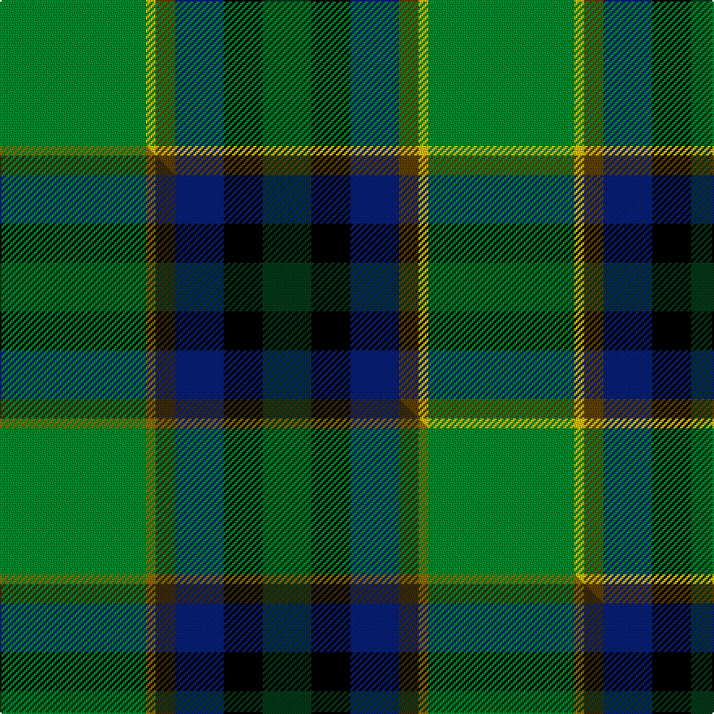

This page is one **sett** — a single exact thread-count. It belongs to the [tartan](/setts/g15ly1dy2db5k4dg5/)
(the same proportion at any scale), whose colour order is pattern [GKBGYG](/stripes/gkbgyg/).

Part of the [Dobson](/tartans/dobson/) tartan — the named design grouping this sett with its other cloths.

Sourced from tartans-authority.  It is a [6 stripe tartan](/stripes/stripes6/).

Original link http://www.tartansauthority.com/tartan-ferret/display/10943/

## Register references

External register numbers recorded for this tartan.

- Scottish Register of Tartans: [10943](https://www.tartanregister.gov.uk/tartanDetails?ref=10943)
- Scottish Tartans Authority (ITI): 10943

## Thread count
G/90 LY6 DY12 DB30 K24 DG/30

One full sett is **264 threads**.

## Palette
<table><thead><tr><th>Colour</th><th>Shade</th><th>OKLCh</th></tr></thead><tbody><tr><td>DB</td><td><code style="background-color:#082077;">#082077</code> <small style="color:#888">#082077</small></td><td><small style="color:#888">oklch(30.0% 0.149 265.1)</small></td></tr><tr><td>DG</td><td><code style="background-color:#053819;">#053819</code> <small style="color:#888">#053819</small></td><td><small style="color:#888">oklch(30.0% 0.075 151.3)</small></td></tr><tr><td>G</td><td><code style="background-color:#008B2A;">#008B2A</code> <small style="color:#888">#008B2A</small></td><td><small style="color:#888">oklch(55.4% 0.170 145.9)</small></td></tr><tr><td>K</td><td><code style="background-color:#000000;">#000000</code> <small style="color:#888">#000000</small></td><td><small style="color:#888">oklch(0.0% 0.000 0.0)</small></td></tr><tr><td>DY</td><td><code style="background-color:#604000;">#604000</code> <small style="color:#888">#604000</small></td><td><small style="color:#888">oklch(39.8% 0.083 76.8)</small></td></tr><tr><td>LY</td><td><code style="background-color:#E8C000;">#E8C000</code> <small style="color:#888">#E8C000</small></td><td><small style="color:#888">oklch(81.9% 0.168 93.7)</small></td></tr></tbody></table>

# Sample pattern

## Compared to the master

This cloth is one sett of its design; the master sett (the exemplar the design is anchored on) is below for comparison.

Its **ΔTartan distance** from the master is **0.60** — the same measure the nearest-tartans table ranks by (0 is identical; a re-scale of the same cloth is near 0, a recolour or a different proportion further).

<figure class="master-compare" style="margin:0">

this sett
master sett ★

<figcaption style="color:#888;font-size:smaller">One weave of this sett against the <a href="/setts/g15y1dy2db5k4dg5/">master sett ★</a>, split on the diagonal: a shared proportion runs seamlessly across it with only the shades shifting; a different proportion breaks on it.</figcaption>
</figure>

## Nearest tartan variants

The nearest existing variants by ΔTartan distance, with this cloth at the top so the swatches line up against it.

ΔTartan

Threads

Variant

Sett

—

264

<a href="/variants/s6/g15ly1dy2db5k4dg5~x6~ly3307090-dy1603076/">Dobson (Palm Bay) (Personal)</a>

<a href="/ttd/edit/#slug=g15y1dy2db5k4dg5~x6&amp;base=g15ly1dy2db5k4dg5~x6~ly3307090-dy1603076" title="compare in the TTD">0.60</a>

264

<a href="/variants/s6/g15y1dy2db5k4dg5~x6/">Dobson (Palm Bay) (Personal)</a>

<a href="/ttd/edit/#slug=r4lb1g6dg25k8db15lb2~x2~g1903114-dg1806142&amp;base=g15ly1dy2db5k4dg5~x6~ly3307090-dy1603076" title="compare in the TTD">1.79</a>

232

<a href="/variants/s7/r4lb1g6dg25k8db15lb2~x2~g1903114-dg1806142/">Jones (Name)</a>

<a href="/ttd/edit/#slug=r4lb1g6dg25k8db15lb2~x2~g1903114-dg1806142-db1406275&amp;base=g15ly1dy2db5k4dg5~x6~ly3307090-dy1603076" title="compare in the TTD">1.79</a>

232

<a href="/variants/s7/r4lb1g6dg25k8db15lb2~x2~g1903114-dg1806142-db1406275/">Jones</a>

<a href="/ttd/edit/#slug=r4lr1g6gi25k8db15lr2~x2~gi2004173&amp;base=g15ly1dy2db5k4dg5~x6~ly3307090-dy1603076" title="compare in the TTD">1.79</a>

232

<a href="/variants/s7/r4lr1g6gi25k8db15lr2~x2~gi2004173/">Jones Personal Tartan</a>

<a href="/ttd/edit/#slug=r3db22k11g32y3~x2&amp;base=g15ly1dy2db5k4dg5~x6~ly3307090-dy1603076" title="compare in the TTD">2.00</a>

272

<a href="/variants/s5/r3db22k11g32y3~x2/">Cultoquhey Hotel</a>

<a href="/ttd/edit/#slug=r3db22k11g32ly3~x2&amp;base=g15ly1dy2db5k4dg5~x6~ly3307090-dy1603076" title="compare in the TTD">2.00</a>

272

<a href="/variants/s5/r3db22k11g32ly3~x2/">Cultoquhey (Corporate)</a>

<a href="/ttd/edit/#slug=db3g19dg29k11r4y2~x2&amp;base=g15ly1dy2db5k4dg5~x6~ly3307090-dy1603076" title="compare in the TTD">2.08</a>

262

<a href="/variants/s6/db3g19dg29k11r4y2~x2/">Zimmermann, Martin (Personal)</a>

<a href="/ttd/edit/#slug=g30dp5db32k32g36lg2y5~g2208144-lg3105139&amp;base=g15ly1dy2db5k4dg5~x6~ly3307090-dy1603076" title="compare in the TTD">2.27</a>

249

<a href="/variants/s7/g30dp5db32k32g36lg2y5~g2208144-lg3105139/">Camelot (Corporate)</a>

<a href="/ttd/edit/#slug=r3k2g20k10t20y2~x2&amp;base=g15ly1dy2db5k4dg5~x6~ly3307090-dy1603076" title="compare in the TTD">2.30</a>

218

<a href="/variants/s6/r3k2g20k10t20y2~x2/">MacLeod of Assynt</a>

<a href="/ttd/edit/#slug=r6b2g20k3db8dg2b4~x2&amp;base=g15ly1dy2db5k4dg5~x6~ly3307090-dy1603076" title="compare in the TTD">2.35</a>

160

<a href="/variants/s7/r6b2g20k3db8dg2b4~x2/">Royal British Legion, The</a>

## Neighbour map

Every grey dot is one of 13620 variants placed by the first two principal components of the ΔTartan feature space (42% of its variance). Red is this tartan; blue dots are its nearest — click one to open its page.

<svg viewBox="0 0 640 380" role="img" style="max-width:100%;height:auto;border:1px solid #e0e0e0;border-radius:4px;display:block" xmlns="http://www.w3.org/2000/svg"><image href="/nn/cloud.v1.png" width="640" height="380"/><a href="/variants/s6/g15y1dy2db5k4dg5~x6/"><circle cx="192.5" cy="165.2" r="4" fill="#3465a4"><title>Dobson (Palm Bay) (Personal)</title></circle></a><a href="/variants/s7/r4lb1g6dg25k8db15lb2~x2~g1903114-dg1806142/"><circle cx="180.5" cy="133.1" r="4" fill="#3465a4"><title>Jones (Name)</title></circle></a><a href="/variants/s7/r4lb1g6dg25k8db15lb2~x2~g1903114-dg1806142-db1406275/"><circle cx="184.3" cy="133.7" r="4" fill="#3465a4"><title>Jones</title></circle></a><a href="/variants/s7/r4lr1g6gi25k8db15lr2~x2~gi2004173/"><circle cx="176.7" cy="131.8" r="4" fill="#3465a4"><title>Jones Personal Tartan</title></circle></a><a href="/variants/s5/r3db22k11g32y3~x2/"><circle cx="188.9" cy="195.5" r="4" fill="#3465a4"><title>Cultoquhey Hotel</title></circle></a><a href="/variants/s5/r3db22k11g32ly3~x2/"><circle cx="183.9" cy="194.5" r="4" fill="#3465a4"><title>Cultoquhey (Corporate)</title></circle></a><a href="/variants/s6/db3g19dg29k11r4y2~x2/"><circle cx="180.5" cy="162.1" r="4" fill="#3465a4"><title>Zimmermann, Martin (Personal)</title></circle></a><a href="/variants/s7/g30dp5db32k32g36lg2y5~g2208144-lg3105139/"><circle cx="168.1" cy="157.6" r="4" fill="#3465a4"><title>Camelot (Corporate)</title></circle></a><a href="/variants/s6/r3k2g20k10t20y2~x2/"><circle cx="139.2" cy="189.3" r="4" fill="#3465a4"><title>MacLeod of Assynt</title></circle></a><a href="/variants/s7/r6b2g20k3db8dg2b4~x2/"><circle cx="163.1" cy="164.9" r="4" fill="#3465a4"><title>Royal British Legion, The</title></circle></a><circle cx="185.2" cy="162.8" r="5" fill="#c00000"/><text x="320" y="376" text-anchor="middle" font-size="11" fill="#999">ground</text><text x="11" y="190" text-anchor="middle" font-size="11" fill="#999" transform="rotate(-90 11 190)">complexity</text></svg>

ID: /variants/s6/g15ly1dy2db5k4dg5~x6~ly3307090-dy1603076/
