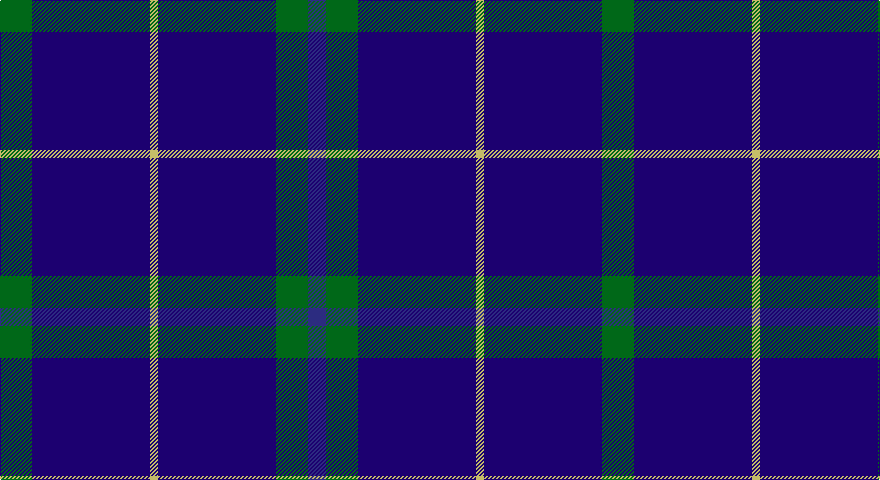

This page is one **sett** — a single exact thread-count. It belongs to the [tartan](/setts/g16db59ly4db59g16dbi9/)
(the same proportion at any scale), whose colour order is pattern [BGBYBG](/stripes/bgbybg/).

Part of the [Oxford University](/tartans/oxford-university/) tartan — the named design grouping this sett with its other cloths.

Sourced from register-of-tartans.  It is a [6 stripe tartan](/stripes/stripes6/).

Original link https://www.tartanregister.gov.uk/tartanDetails.aspx?ref=3280

## Register references

External register numbers recorded for this tartan.

- Scottish Register of Tartans: [3280](https://www.tartanregister.gov.uk/tartanDetails.aspx?ref=3280)
- Scottish Tartans Authority (ITI): 2652
- Scottish Tartans World Register: 2652

## Thread count
G/32 DBa118 LG8 DBa118 G32 DB/18

One full sett is **602 threads**.

## Palette

Palette: <strong>Tartan Register</strong>
<table><thead><tr><th>Colour</th><th>Threads</th><th>Shade</th><th>Base</th><th>OKLCh</th></tr></thead><tbody><tr><td>G/</td><td style="text-align:right;font-variant-numeric:tabular-nums">32</td><td><code style="background-color:#006818;">#006818</code> <small style="color:#888">#006818</small></td><td>G <code style="background-color:#006100;">#006100</code></td><td><small style="color:#888">oklch(45.0% 0.142 145.0)</small></td></tr><tr><td>DBa</td><td style="text-align:right;font-variant-numeric:tabular-nums">118</td><td><code style="background-color:#1C0070;">#1C0070</code> <small style="color:#888">#1C0070</small></td><td>B <code style="background-color:#2A418A;">#2A418A</code></td><td><small style="color:#888">oklch(26.3% 0.162 277.1)</small></td></tr><tr><td>LG</td><td style="text-align:right;font-variant-numeric:tabular-nums">8</td><td><code style="background-color:#C4BC68;">#C4BC68</code> <small style="color:#888">#C4BC68</small></td><td>Y <code style="background-color:#F2BF00;">#F2BF00</code></td><td><small style="color:#888">oklch(78.4% 0.107 103.7)</small></td></tr><tr><td>DBa</td><td style="text-align:right;font-variant-numeric:tabular-nums">118</td><td><code style="background-color:#1C0070;">#1C0070</code> <small style="color:#888">#1C0070</small></td><td>B <code style="background-color:#2A418A;">#2A418A</code></td><td><small style="color:#888">oklch(26.3% 0.162 277.1)</small></td></tr><tr><td>G</td><td style="text-align:right;font-variant-numeric:tabular-nums">32</td><td><code style="background-color:#006818;">#006818</code> <small style="color:#888">#006818</small></td><td>G <code style="background-color:#006100;">#006100</code></td><td><small style="color:#888">oklch(45.0% 0.142 145.0)</small></td></tr><tr><td>DB/</td><td style="text-align:right;font-variant-numeric:tabular-nums">18</td><td><code style="background-color:#2C2C80;">#2C2C80</code> <small style="color:#888">#2C2C80</small></td><td>B <code style="background-color:#2A418A;">#2A418A</code></td><td><small style="color:#888">oklch(35.0% 0.138 276.6)</small></td></tr></tbody></table>

# Sample pattern

## Nearest tartans

The nearest existing variants by ΔTartan distance, with this tartan at the top so the swatches line up against it.

ΔTartan

Tartan

Sett

—

<a href="/ttd/edit/#slug=g16db59ly4db59g16dbi9~x2">Oxford University</a> <a class="nn-out" href="/variants/s6/g16db59ly4db59g16dbi9~x2/" title="open its dictionary page">↗</a>

1.28

<a href="/ttd/edit/#slug=dbi9g16db59ly4~x2&amp;base=g16db59ly4db59g16dbi9~x2">Oxford University (Corporate)</a> <a class="nn-out" href="/variants/s4/dbi9g16db59ly4~x2/" title="open its dictionary page">↗</a>

1.30

<a href="/ttd/edit/#slug=db4w3b6db40b8db12g3~x2&amp;base=g16db59ly4db59g16dbi9~x2">JetBlue (Corporate)</a> <a class="nn-out" href="/variants/s7/db4w3b6db40b8db12g3~x2/" title="open its dictionary page">↗</a>

1.32

<a href="/ttd/edit/#slug=db9k9db9k9db42lb5~x2&amp;base=g16db59ly4db59g16dbi9~x2">Dollar Academy</a> <a class="nn-out" href="/variants/s6/db9k9db9k9db42lb5~x2/" title="open its dictionary page">↗</a>

1.38

<a href="/ttd/edit/#slug=db9k9db9k9db42w5~x2&amp;base=g16db59ly4db59g16dbi9~x2">Dollar Academy (1930s) (Corporate)</a> <a class="nn-out" href="/variants/s6/db9k9db9k9db42w5~x2/" title="open its dictionary page">↗</a>

1.48

<a href="/ttd/edit/#slug=db9k4lb1k4db9r1~x4&amp;base=g16db59ly4db59g16dbi9~x2">Scottish Nuclear</a> <a class="nn-out" href="/variants/s6/db9k4lb1k4db9r1~x4/" title="open its dictionary page">↗</a>

1.49

<a href="/ttd/edit/#slug=db40g7ly3g7db15r5~x2&amp;base=g16db59ly4db59g16dbi9~x2">Wheadon (Name)</a> <a class="nn-out" href="/variants/s6/db40g7ly3g7db15r5~x2/" title="open its dictionary page">↗</a>

1.56

<a href="/ttd/edit/#slug=db60r5db60b40db36r10db36b40w5&amp;base=g16db59ly4db59g16dbi9~x2">Brash</a> <a class="nn-out" href="/variants/s9/db60r5db60b40db36r10db36b40w5/" title="open its dictionary page">↗</a>

1.63

<a href="/ttd/edit/#slug=r5db20r3db20k6db3lb2db1~x2&amp;base=g16db59ly4db59g16dbi9~x2">Masai Shuka 29 (Artefact)</a> <a class="nn-out" href="/variants/s8/r5db20r3db20k6db3lb2db1~x2/" title="open its dictionary page">↗</a>

1.67

<a href="/ttd/edit/#slug=db72t6db12t17w6~x2&amp;base=g16db59ly4db59g16dbi9~x2">Gulfmark (Corporate)</a> <a class="nn-out" href="/variants/s5/db72t6db12t17w6~x2/" title="open its dictionary page">↗</a>

1.68

<a href="/ttd/edit/#slug=db14k3r3w1~x2&amp;base=g16db59ly4db59g16dbi9~x2">Bacon, Blue</a> <a class="nn-out" href="/variants/s4/db14k3r3w1~x2/" title="open its dictionary page">↗</a>

## Neighbour map

Every grey dot is one of 14360 variants placed by the first two principal components of the ΔTartan feature space (44% of its variance). Red is this tartan; blue dots are its nearest — click one to open its page.

<svg viewBox="0 0 640 380" role="img" style="max-width:100%;height:auto;border:1px solid #e0e0e0;border-radius:4px;display:block" xmlns="http://www.w3.org/2000/svg"><image href="/nn/cloud.v1.png" width="640" height="380"/><a href="/variants/s4/dbi9g16db59ly4~x2/"><circle cx="422.5" cy="231.1" r="4" fill="#3465a4"><title>Oxford University (Corporate)</title></circle></a><a href="/variants/s7/db4w3b6db40b8db12g3~x2/"><circle cx="470.9" cy="201.2" r="4" fill="#3465a4"><title>JetBlue (Corporate)</title></circle></a><a href="/variants/s6/db9k9db9k9db42lb5~x2/"><circle cx="463.7" cy="258.6" r="4" fill="#3465a4"><title>Dollar Academy</title></circle></a><a href="/variants/s6/db9k9db9k9db42w5~x2/"><circle cx="447.9" cy="250.6" r="4" fill="#3465a4"><title>Dollar Academy (1930s) (Corporate)</title></circle></a><a href="/variants/s6/db9k4lb1k4db9r1~x4/"><circle cx="382.0" cy="258.2" r="4" fill="#3465a4"><title>Scottish Nuclear</title></circle></a><a href="/variants/s6/db40g7ly3g7db15r5~x2/"><circle cx="427.3" cy="202.5" r="4" fill="#3465a4"><title>Wheadon (Name)</title></circle></a><a href="/variants/s9/db60r5db60b40db36r10db36b40w5/"><circle cx="379.1" cy="237.6" r="4" fill="#3465a4"><title>Brash</title></circle></a><a href="/variants/s8/r5db20r3db20k6db3lb2db1~x2/"><circle cx="452.4" cy="176.5" r="4" fill="#3465a4"><title>Masai Shuka 29 (Artefact)</title></circle></a><a href="/variants/s5/db72t6db12t17w6~x2/"><circle cx="496.0" cy="233.7" r="4" fill="#3465a4"><title>Gulfmark (Corporate)</title></circle></a><a href="/variants/s4/db14k3r3w1~x2/"><circle cx="412.0" cy="225.2" r="4" fill="#3465a4"><title>Bacon, Blue</title></circle></a><circle cx="454.3" cy="231.7" r="5" fill="#c00000"/></svg>

ID: /variants/s6/g16db59ly4db59g16dbi9~x2/
