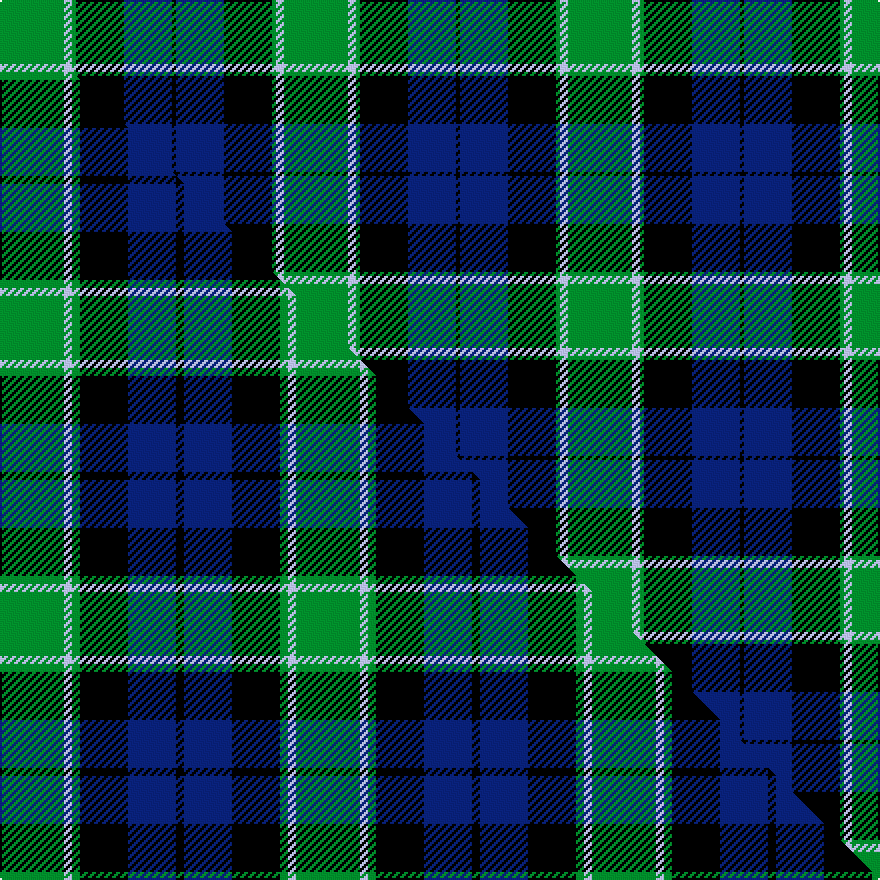

This is one **variant** — a specific cloth: this exact thread count and colourway, with its own
provenance below. It is one weaving of the [sett](/setts/g16lb2g1k12db12k1/) (the scale-free proportion — the
same cloth at any scale or shade), whose colour order is pattern [GWGKBK](/stripes/gwgkbk/).

Part of the [Graham of Menteith](/tartans/g/gr/graham-of-menteith/) tartan — the named design grouping this sett with its other cloths.

Sourced from weddslist.  It is a [6 stripe tartan](/stripes/stripes6/).

Original link [http://www.weddslist.com/cgi-bin/tartans/pg.pl?source=tinsel](http://www.weddslist.com/cgi-bin/tartans/pg.pl?source=tinsel)

2 attestations — the source records this cloth was collapsed from (oldest owns this page)

<ul>
<li>undated — Graham of Menteith (weddslist, <a href="http://www.weddslist.com/cgi-bin/tartans/pg.pl?source=tinsel">record</a>) </li>
<li>undated — Graham of Menteith (weddslist, <a href="http://www.weddslist.com/cgi-bin/tartans/pg.pl?source=x">record</a>) </li>
</ul>

Dataset <small>— provenance for this record, inherited from the source manifest</small>

<dl class="dataset-prov">
<dt>source</dt><dd><a href="/sources/weddslist/">Weddslist</a></dd>
<dt>data captured from</dt><dd><a href="https://github.com/thetartan/tartan-database/blob/master/data/weddslist/data.csv">https://github.com/thetartan/tartan-database/blob/master/data/weddslist/data.csv</a></dd>
<dt>data date</dt><dd>2016-11-17 <small>(dataset default)</small></dd>
<dt>licence</dt><dd><a href="https://creativecommons.org/licenses/by-nc-nd/4.0/">CC BY-NC-ND 4.0</a></dd>
</dl>

Capture chain <small>— the hands this data passed through, oldest first; each capture carries its own licence</small>

<ol class="capture-chain">
<li><a href="https://www.weddslist.com/tartans/">Weddslist</a> <small>the living privately compiled reference</small></li>
<li><a href="https://github.com/thetartan/tartan-database">thetartan/tartan-database</a> <small>2016-2017</small> · <a href="https://creativecommons.org/licenses/by-nc-nd/4.0/">CC BY-NC-ND 4.0</a> <small>Levko Kravets's frozen compilation — the capture we vendored, and where its CC licence text came from</small></li>
<li>this dictionary <small>captured 2026-06-10 · commit 5bf86c7566</small> <small>each re-capture is a git commit to data/sources</small></li>
</ol>

## Thread count
G/32 LB4 G2 K24 DB24 K/2

One full sett is **142 threads**.

## Palette
<table><thead><tr><th>Colour</th><th>Shade</th><th>OKLCh</th></tr></thead><tbody><tr><td>LB</td><td><code style="background-color:#B5BBDE;">#B5BBDE</code> <small style="color:#888">#B5BBDE</small></td><td><small style="color:#888">oklch(79.9% 0.050 277.6)</small></td></tr><tr><td>DB</td><td><code style="background-color:#082077;">#082077</code> <small style="color:#888">#082077</small></td><td><small style="color:#888">oklch(30.0% 0.149 265.1)</small></td></tr><tr><td>G</td><td><code style="background-color:#008B2A;">#008B2A</code> <small style="color:#888">#008B2A</small></td><td><small style="color:#888">oklch(55.4% 0.170 145.9)</small></td></tr><tr><td>K</td><td><code style="background-color:#000000;">#000000</code> <small style="color:#888">#000000</small></td><td><small style="color:#888">oklch(0.0% 0.000 0.0)</small></td></tr></tbody></table>

# Sample pattern

## Compared to the master

This cloth is one sett of its design; the master sett (the exemplar the design is anchored on) is below for comparison.

Its **ΔTartan distance** from the master is **0.49** — the same measure the nearest-tartans table ranks by (0 is identical; a re-scale of the same cloth is near 0, a recolour or a different proportion further).

<figure class="master-compare" style="margin:0">

this sett
master sett ★

<figcaption style="color:#888;font-size:smaller">One weave of this sett against the <a href="/setts/g8lb1g1k6db6k1/">master sett ★</a>, split on the diagonal: a shared proportion runs seamlessly across it with only the shades shifting; a different proportion breaks on it.</figcaption>
</figure>

## Nearest tartan variants

The nearest existing variants by ΔTartan distance, with this cloth at the top so the swatches line up against it.

ΔTartan

Threads

Variant

Sett

—

142

<a href="/variants/s6/g16lb2g1k12db12k1~x2/">Graham of Menteith</a>

<a href="/ttd/edit/#slug=g18lb2g4k14db12k3~x2&amp;base=g16lb2g1k12db12k1~x2" title="compare in the TTD">0.47</a>

170

<a href="/variants/s6/g18lb2g4k14db12k3~x2/">Graham of Menteith Clan Tartan</a>

<a href="/ttd/edit/#slug=g8lb1g1k6db6k1~x4&amp;base=g16lb2g1k12db12k1~x2" title="compare in the TTD">0.49</a>

148

<a href="/variants/s6/g8lb1g1k6db6k1~x4/">Graham of Menteith</a>

<a href="/ttd/edit/#slug=g52lb7g9k35db35k7&amp;base=g16lb2g1k12db12k1~x2" title="compare in the TTD">0.56</a>

231

<a href="/variants/s6/g52lb7g9k35db35k7/">Redland</a>

<a href="/ttd/edit/#slug=g8w2g1k12db12k1~x2&amp;base=g16lb2g1k12db12k1~x2" title="compare in the TTD">0.70</a>

126

<a href="/variants/s6/g8w2g1k12db12k1~x2/">Graham of Menteith</a>

<a href="/ttd/edit/#slug=g21w2g4k17db14k3&amp;base=g16lb2g1k12db12k1~x2" title="compare in the TTD">0.72</a>

98

<a href="/variants/s6/g21w2g4k17db14k3/">Graham W</a>

<a href="/ttd/edit/#slug=g21y2g4k16dp14k3~x2&amp;base=g16lb2g1k12db12k1~x2" title="compare in the TTD">1.70</a>

192

<a href="/variants/s6/g21y2g4k16dp14k3~x2/">Wilson's, No 160</a>

<a href="/ttd/edit/#slug=g21w2g4k17dp14k3~x2&amp;base=g16lb2g1k12db12k1~x2" title="compare in the TTD">1.71</a>

196

<a href="/variants/s6/g21w2g4k17dp14k3~x2/">Wilson's No 158</a>

<a href="/ttd/edit/#slug=db10k6lb1g6k1~x2&amp;base=g16lb2g1k12db12k1~x2" title="compare in the TTD">1.78</a>

74

<a href="/variants/s5/db10k6lb1g6k1~x2/">Unidentified No 115</a>

<a href="/ttd/edit/#slug=db30k10g10lb2g15lb2~x2&amp;base=g16lb2g1k12db12k1~x2" title="compare in the TTD">1.83</a>

212

<a href="/variants/s6/db30k10g10lb2g15lb2~x2/">MacRobart (Personal)</a>

<a href="/ttd/edit/#slug=k4db16k12g24r1g2k2~x2&amp;base=g16lb2g1k12db12k1~x2" title="compare in the TTD">1.85</a>

232

<a href="/variants/s7/k4db16k12g24r1g2k2~x2/">Dundas Clan Tartan</a>

## Neighbour map

Every grey dot is one of 13656 variants placed by the first two principal components of the ΔTartan feature space (42% of its variance). Red is this tartan; blue dots are its nearest — click one to open its page. The map is a flat projection of a many-dimensional space — [how to read it](/posts/neighbourhood-maps/).

<svg viewBox="0 0 640 380" role="img" style="max-width:100%;height:auto;border:1px solid #e0e0e0;border-radius:4px;display:block" xmlns="http://www.w3.org/2000/svg"><image href="/nn/cloud.v1.png" width="640" height="380"/><a href="/variants/s6/g18lb2g4k14db12k3~x2/"><circle cx="164.9" cy="214.6" r="4" fill="#3465a4"><title>Graham of Menteith Clan Tartan</title></circle></a><a href="/variants/s6/g8lb1g1k6db6k1~x4/"><circle cx="156.4" cy="213.2" r="4" fill="#3465a4"><title>Graham of Menteith</title></circle></a><a href="/variants/s6/g52lb7g9k35db35k7/"><circle cx="161.1" cy="218.9" r="4" fill="#3465a4"><title>Redland</title></circle></a><a href="/variants/s6/g8w2g1k12db12k1~x2/"><circle cx="157.8" cy="191.0" r="4" fill="#3465a4"><title>Graham of Menteith</title></circle></a><a href="/variants/s6/g21w2g4k17db14k3/"><circle cx="168.8" cy="204.0" r="4" fill="#3465a4"><title>Graham W</title></circle></a><a href="/variants/s6/g21y2g4k16dp14k3~x2/"><circle cx="178.6" cy="202.5" r="4" fill="#3465a4"><title>Wilson's, No 160</title></circle></a><a href="/variants/s6/g21w2g4k17dp14k3~x2/"><circle cx="171.0" cy="201.2" r="4" fill="#3465a4"><title>Wilson's No 158</title></circle></a><a href="/variants/s5/db10k6lb1g6k1~x2/"><circle cx="133.1" cy="202.7" r="4" fill="#3465a4"><title>Unidentified No 115</title></circle></a><a href="/variants/s6/db30k10g10lb2g15lb2~x2/"><circle cx="215.1" cy="187.6" r="4" fill="#3465a4"><title>MacRobart (Personal)</title></circle></a><a href="/variants/s7/k4db16k12g24r1g2k2~x2/"><circle cx="211.8" cy="146.6" r="4" fill="#3465a4"><title>Dundas Clan Tartan</title></circle></a><circle cx="181.5" cy="180.9" r="5" fill="#c00000"/><text x="320" y="376" text-anchor="middle" font-size="11" fill="#999">ground</text><text x="11" y="190" text-anchor="middle" font-size="11" fill="#999" transform="rotate(-90 11 190)">complexity</text></svg>

ID: /variants/s6/g16lb2g1k12db12k1~x2/
