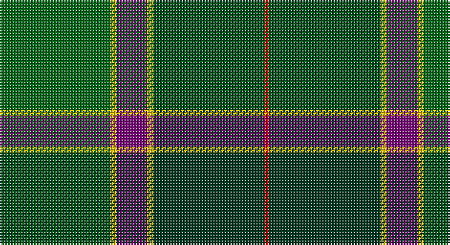

This page is one **sett** — a single exact thread-count. It belongs to the [tartan](/setts/g18ly1dp5ly1dg18r1/)
(the same proportion at any scale), whose colour order is pattern [GYBYGR](/stripes/gybygr/).

Sourced from register-of-tartans.  It is a [6 stripe tartan](/stripes/stripes6/).

Original link https://www.tartanregister.gov.uk/tartanDetails.aspx?ref=11473

## Register references

External register numbers recorded for this tartan.

- Scottish Register of Tartans: [11473](https://www.tartanregister.gov.uk/tartanDetails.aspx?ref=11473)

## Thread count
G/72 Y4 P20 Y4 DG72 R/4

One full sett is **276 threads**.

## Palette

Palette: <strong>Tartan Register</strong>
<table><thead><tr><th>Colour</th><th>Threads</th><th>Shade</th><th>Base</th><th>OKLCh</th></tr></thead><tbody><tr><td>G/</td><td style="text-align:right;font-variant-numeric:tabular-nums">72</td><td><code style="background-color:#006818;">#006818</code> <small style="color:#888">#006818</small></td><td>G <code style="background-color:#006100;">#006100</code></td><td><small style="color:#888">oklch(45.0% 0.142 145.0)</small></td></tr><tr><td>Y</td><td style="text-align:right;font-variant-numeric:tabular-nums">4</td><td><code style="background-color:#E8C000;">#E8C000</code> <small style="color:#888">#E8C000</small></td><td>Y <code style="background-color:#F2BF00;">#F2BF00</code></td><td><small style="color:#888">oklch(81.9% 0.168 93.7)</small></td></tr><tr><td>P</td><td style="text-align:right;font-variant-numeric:tabular-nums">20</td><td><code style="background-color:#780078;">#780078</code> <small style="color:#888">#780078</small></td><td>B <code style="background-color:#2A418A;">#2A418A</code></td><td><small style="color:#888">oklch(40.2% 0.185 328.4)</small></td></tr><tr><td>Y</td><td style="text-align:right;font-variant-numeric:tabular-nums">4</td><td><code style="background-color:#E8C000;">#E8C000</code> <small style="color:#888">#E8C000</small></td><td>Y <code style="background-color:#F2BF00;">#F2BF00</code></td><td><small style="color:#888">oklch(81.9% 0.168 93.7)</small></td></tr><tr><td>DG</td><td style="text-align:right;font-variant-numeric:tabular-nums">72</td><td><code style="background-color:#003820;">#003820</code> <small style="color:#888">#003820</small></td><td>G <code style="background-color:#006100;">#006100</code></td><td><small style="color:#888">oklch(30.0% 0.070 158.3)</small></td></tr><tr><td>R/</td><td style="text-align:right;font-variant-numeric:tabular-nums">4</td><td><code style="background-color:#C80000;">#C80000</code> <small style="color:#888">#C80000</small></td><td>R <code style="background-color:#CC0000;">#CC0000</code></td><td><small style="color:#888">oklch(52.3% 0.215 29.2)</small></td></tr></tbody></table>

# Sample pattern

## Nearest tartans

The nearest existing variants by ΔTartan distance, with this tartan at the top so the swatches line up against it.

ΔTartan

Tartan

Sett

—

<a href="/ttd/edit/#slug=g18ly1dp5ly1dg18r1~x4">Symonds (2016)</a> <a class="nn-out" href="/variants/s6/g18ly1dp5ly1dg18r1~x4/" title="open its dictionary page">↗</a>

1.18

<a href="/ttd/edit/#slug=r4db15w2n15g30r2g4~x2&amp;base=g18ly1dp5ly1dg18r1~x4">Sinclair Green (Personal)</a> <a class="nn-out" href="/variants/s7/r4db15w2n15g30r2g4~x2/" title="open its dictionary page">↗</a>

1.20

<a href="/ttd/edit/#slug=g3r3g31dg18g4k22ly3&amp;base=g18ly1dp5ly1dg18r1~x4">MacSween Hunting (Lochs, Isle of Lew</a> <a class="nn-out" href="/variants/s7/g3r3g31dg18g4k22ly3/" title="open its dictionary page">↗</a>

1.20

<a href="/ttd/edit/#slug=g16k1t2k1g3k5n12k1ly1k3~x4&amp;base=g18ly1dp5ly1dg18r1~x4">Hope-Vere (Lochcarron)</a> <a class="nn-out" href="/variants/s10/g16k1t2k1g3k5n12k1ly1k3~x4/" title="open its dictionary page">↗</a>

1.23

<a href="/ttd/edit/#slug=r3db6ly2db15g12dg39w3~x2&amp;base=g18ly1dp5ly1dg18r1~x4">Wagland (Name)</a> <a class="nn-out" href="/variants/s7/r3db6ly2db15g12dg39w3~x2/" title="open its dictionary page">↗</a>

1.34

<a href="/ttd/edit/#slug=dg14k1dg2k1dg2k10g14lp2&amp;base=g18ly1dp5ly1dg18r1~x4">Manor (Corporate)</a> <a class="nn-out" href="/variants/s8/dg14k1dg2k1dg2k10g14lp2/" title="open its dictionary page">↗</a>

1.35

<a href="/ttd/edit/#slug=db3g13lr1o3lr1db10lo1~x2&amp;base=g18ly1dp5ly1dg18r1~x4">Graeme Heckenberg Hunting</a> <a class="nn-out" href="/variants/s7/db3g13lr1o3lr1db10lo1~x2/" title="open its dictionary page">↗</a>

1.37

<a href="/ttd/edit/#slug=g15ly1dy2db5k4dg5~x6&amp;base=g18ly1dp5ly1dg18r1~x4">Dobson (Palm Bay) (Personal)</a> <a class="nn-out" href="/variants/s6/g15ly1dy2db5k4dg5~x6/" title="open its dictionary page">↗</a>

1.37

<a href="/ttd/edit/#slug=g6ly3g26dg10dt30lb3~x2&amp;base=g18ly1dp5ly1dg18r1~x4">Wcwm 1716</a> <a class="nn-out" href="/variants/s6/g6ly3g26dg10dt30lb3~x2/" title="open its dictionary page">↗</a>

1.38

<a href="/ttd/edit/#slug=db3dgi19dg29k11r4ly2~x2&amp;base=g18ly1dp5ly1dg18r1~x4">Zimmermann, Martin (Personal)</a> <a class="nn-out" href="/variants/s6/db3dgi19dg29k11r4ly2~x2/" title="open its dictionary page">↗</a>

1.40

<a href="/ttd/edit/#slug=b30ly3dy11ly3g33r6~x2&amp;base=g18ly1dp5ly1dg18r1~x4">Balfour Hunting</a> <a class="nn-out" href="/variants/s6/b30ly3dy11ly3g33r6~x2/" title="open its dictionary page">↗</a>

## Neighbour map

Every grey dot is one of 14360 variants placed by the first two principal components of the ΔTartan feature space (44% of its variance). Red is this tartan; blue dots are its nearest — click one to open its page.

<svg viewBox="0 0 640 380" role="img" style="max-width:100%;height:auto;border:1px solid #e0e0e0;border-radius:4px;display:block" xmlns="http://www.w3.org/2000/svg"><image href="/nn/cloud.v1.png" width="640" height="380"/><a href="/variants/s7/r4db15w2n15g30r2g4~x2/"><circle cx="254.8" cy="183.5" r="4" fill="#3465a4"><title>Sinclair Green (Personal)</title></circle></a><a href="/variants/s7/g3r3g31dg18g4k22ly3/"><circle cx="240.0" cy="208.5" r="4" fill="#3465a4"><title>MacSween Hunting (Lochs, Isle of Lew</title></circle></a><a href="/variants/s10/g16k1t2k1g3k5n12k1ly1k3~x4/"><circle cx="253.3" cy="163.8" r="4" fill="#3465a4"><title>Hope-Vere (Lochcarron)</title></circle></a><a href="/variants/s7/r3db6ly2db15g12dg39w3~x2/"><circle cx="271.6" cy="154.6" r="4" fill="#3465a4"><title>Wagland (Name)</title></circle></a><a href="/variants/s8/dg14k1dg2k1dg2k10g14lp2/"><circle cx="257.7" cy="209.9" r="4" fill="#3465a4"><title>Manor (Corporate)</title></circle></a><a href="/variants/s7/db3g13lr1o3lr1db10lo1~x2/"><circle cx="261.5" cy="191.5" r="4" fill="#3465a4"><title>Graeme Heckenberg Hunting</title></circle></a><a href="/variants/s6/g15ly1dy2db5k4dg5~x6/"><circle cx="242.7" cy="196.1" r="4" fill="#3465a4"><title>Dobson (Palm Bay) (Personal)</title></circle></a><a href="/variants/s6/g6ly3g26dg10dt30lb3~x2/"><circle cx="216.2" cy="212.7" r="4" fill="#3465a4"><title>Wcwm 1716</title></circle></a><a href="/variants/s6/db3dgi19dg29k11r4ly2~x2/"><circle cx="220.9" cy="189.4" r="4" fill="#3465a4"><title>Zimmermann, Martin (Personal)</title></circle></a><a href="/variants/s6/b30ly3dy11ly3g33r6~x2/"><circle cx="216.7" cy="209.7" r="4" fill="#3465a4"><title>Balfour Hunting</title></circle></a><circle cx="278.9" cy="186.4" r="5" fill="#c00000"/></svg>

ID: /variants/s6/g18ly1dp5ly1dg18r1~x4/
