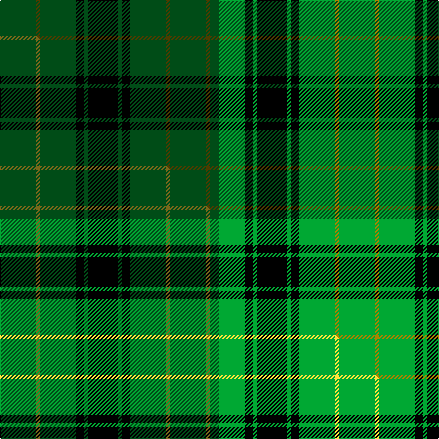

This page is one **sett** — a single exact thread-count. It belongs to the [tartan](/setts/g18y2g18k4g2k15/)
(the same proportion at any scale), whose colour order is pattern [GGGKGK](/stripes/gggkgk/).

Part of the [MacArthur](/tartans/macarthur/) tartan — the named design grouping this sett with its other cloths.

Sourced from weddslist.  It is a [6 stripe tartan](/stripes/stripes6/).

Original link http://www.weddslist.com/cgi-bin/tartans/pg.pl?source=sts

## Thread count
G/36 Y4 G36 K8 G4 K/30

One full sett is **170 threads**.

## Palette
<table><thead><tr><th>Colour</th><th>Shade</th><th>OKLCh</th></tr></thead><tbody><tr><td>G</td><td><code style="background-color:#008B2A;">#008B2A</code> <small style="color:#888">#008B2A</small></td><td><small style="color:#888">oklch(55.4% 0.170 145.9)</small></td></tr><tr><td>K</td><td><code style="background-color:#000000;">#000000</code> <small style="color:#888">#000000</small></td><td><small style="color:#888">oklch(0.0% 0.000 0.0)</small></td></tr><tr><td>Y</td><td><code style="background-color:#8B6E00;">#8B6E00</code> <small style="color:#888">#8B6E00</small></td><td><small style="color:#888">oklch(55.1% 0.113 90.4)</small></td></tr></tbody></table>

# Sample pattern

## Compared to the master

This cloth is one sett of its design; the master sett (the exemplar the design is anchored on) is below for comparison.

Its **ΔTartan distance** from the master is **0.11** — the same measure the nearest-tartans table ranks by (0 is identical; a re-scale of the same cloth is near 0, a recolour or a different proportion further).

<figure class="master-compare" style="margin:0">

this sett
master sett ★

<figcaption style="color:#888;font-size:smaller">One weave of this sett against the <a href="/setts/g18ly2g18k4g2k15/">master sett ★</a>, split on the diagonal: a shared proportion runs seamlessly across it with only the shades shifting; a different proportion breaks on it.</figcaption>
</figure>

## Nearest variants

The nearest existing variants by ΔTartan distance, with this cloth at the top so the swatches line up against it.

ΔTartan

Threads

Variant

Sett

—

170

<a href="/variants/s6/g18y2g18k4g2k15~x2/">MacArthur</a>

<a href="/ttd/edit/#slug=g18ly2g18k4g2k15~x2&amp;base=g18y2g18k4g2k15~x2" title="compare in the TTD">0.00</a>

170

<a href="/variants/s6/g18ly2g18k4g2k15~x2/">MacArthur (Highland Society)</a>

<a href="/ttd/edit/#slug=r1g15k8g1k8g1~x2&amp;base=g18y2g18k4g2k15~x2" title="compare in the TTD">1.16</a>

132

<a href="/variants/s6/r1g15k8g1k8g1~x2/">Gunn VS</a>

<a href="/ttd/edit/#slug=r1g15k8g1k8g1~x4&amp;base=g18y2g18k4g2k15~x2" title="compare in the TTD">1.16</a>

264

<a href="/variants/s6/r1g15k8g1k8g1~x4/">Gunn VS</a>

<a href="/ttd/edit/#slug=g8w4g50k12g4k15ly5~x2&amp;base=g18y2g18k4g2k15~x2" title="compare in the TTD">1.19</a>

366

<a href="/variants/s7/g8w4g50k12g4k15ly5~x2/">Instakilt, Green (Fashion)</a>

<a href="/ttd/edit/#slug=r2g12k12g1k12g2~x2&amp;base=g18y2g18k4g2k15~x2" title="compare in the TTD">1.22</a>

156

<a href="/variants/s6/r2g12k12g1k12g2~x2/">Gunn (Logan)</a>

<a href="/ttd/edit/#slug=g3k8g8lb3k18g2~x4&amp;base=g18y2g18k4g2k15~x2" title="compare in the TTD">1.58</a>

316

<a href="/variants/s6/g3k8g8lb3k18g2~x4/">Kincardine City</a>

<a href="/ttd/edit/#slug=k9g3k3g12y2~x4&amp;base=g18y2g18k4g2k15~x2" title="compare in the TTD">1.77</a>

188

<a href="/variants/s5/k9g3k3g12y2~x4/">MacArthur</a>

<a href="/ttd/edit/#slug=g12k4g1~x2&amp;base=g18y2g18k4g2k15~x2" title="compare in the TTD">1.81</a>

42

<a href="/variants/s3/g12k4g1~x2/">Graham</a>

<a href="/ttd/edit/#slug=k32g6k12g30y3&amp;base=g18y2g18k4g2k15~x2" title="compare in the TTD">1.82</a>

131

<a href="/variants/s5/k32g6k12g30y3/">MacArthur</a>

<a href="/ttd/edit/#slug=k32g6k12g30y3~x2&amp;base=g18y2g18k4g2k15~x2" title="compare in the TTD">1.82</a>

262

<a href="/variants/s5/k32g6k12g30y3~x2/">MacArthur</a>

## Neighbour map

Every grey dot is one of 13620 variants placed by the first two principal components of the ΔTartan feature space (42% of its variance). Red is this tartan; blue dots are its nearest — click one to open its page.

<svg viewBox="0 0 640 380" role="img" style="max-width:100%;height:auto;border:1px solid #e0e0e0;border-radius:4px;display:block" xmlns="http://www.w3.org/2000/svg"><image href="/nn/cloud.v1.png" width="640" height="380"/><a href="/variants/s6/g18ly2g18k4g2k15~x2/"><circle cx="311.0" cy="218.5" r="4" fill="#3465a4"><title>MacArthur (Highland Society)</title></circle></a><a href="/variants/s6/r1g15k8g1k8g1~x2/"><circle cx="280.1" cy="183.5" r="4" fill="#3465a4"><title>Gunn VS</title></circle></a><a href="/variants/s6/r1g15k8g1k8g1~x4/"><circle cx="280.1" cy="183.5" r="4" fill="#3465a4"><title>Gunn VS</title></circle></a><a href="/variants/s7/g8w4g50k12g4k15ly5~x2/"><circle cx="302.5" cy="158.9" r="4" fill="#3465a4"><title>Instakilt, Green (Fashion)</title></circle></a><a href="/variants/s6/r2g12k12g1k12g2~x2/"><circle cx="292.4" cy="201.0" r="4" fill="#3465a4"><title>Gunn (Logan)</title></circle></a><a href="/variants/s6/g3k8g8lb3k18g2~x4/"><circle cx="293.8" cy="208.0" r="4" fill="#3465a4"><title>Kincardine City</title></circle></a><a href="/variants/s5/k9g3k3g12y2~x4/"><circle cx="235.9" cy="246.5" r="4" fill="#3465a4"><title>MacArthur</title></circle></a><a href="/variants/s3/g12k4g1~x2/"><circle cx="344.5" cy="233.2" r="4" fill="#3465a4"><title>Graham</title></circle></a><a href="/variants/s5/k32g6k12g30y3/"><circle cx="270.4" cy="218.6" r="4" fill="#3465a4"><title>MacArthur</title></circle></a><a href="/variants/s5/k32g6k12g30y3~x2/"><circle cx="270.4" cy="218.6" r="4" fill="#3465a4"><title>MacArthur</title></circle></a><circle cx="313.9" cy="219.3" r="5" fill="#c00000"/><text x="320" y="376" text-anchor="middle" font-size="11" fill="#999">ground</text><text x="11" y="190" text-anchor="middle" font-size="11" fill="#999" transform="rotate(-90 11 190)">complexity</text></svg>

ID: /variants/s6/g18y2g18k4g2k15~x2/
