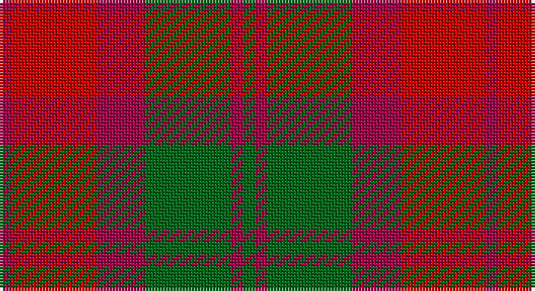

This page is one **sett** — a single exact thread-count. It belongs to the [tartan](/setts/g1m1g7m4r7m1/)
(the same proportion at any scale), whose colour order is pattern [GRGRRR](/stripes/grgrrr/).

Sourced from register-of-tartans.  It is a [6 stripe tartan](/stripes/stripes6/).

Original link https://www.tartanregister.gov.uk/tartanDetails.aspx?ref=2665

## Register references

External register numbers recorded for this tartan.

- Scottish Register of Tartans: [2665](https://www.tartanregister.gov.uk/tartanDetails.aspx?ref=2665)
- Scottish Tartans Authority (ITI): 967
- Scottish Tartans World Register: 967

## Thread count
R/4 Ra28 R16 Gb28 R4 Gb/4

One full sett is **160 threads**.

## Palette

Palette: <strong>Tartan Register</strong>
<table><thead><tr><th>Colour</th><th>Threads</th><th>Shade</th><th>Base</th><th>OKLCh</th></tr></thead><tbody><tr><td>R/</td><td style="text-align:right;font-variant-numeric:tabular-nums">4</td><td><code style="background-color:#A00048;">#A00048</code> <small style="color:#888">#A00048</small></td><td>R <code style="background-color:#CC0000;">#CC0000</code></td><td><small style="color:#888">oklch(45.4% 0.182 5.3)</small></td></tr><tr><td>Ra</td><td style="text-align:right;font-variant-numeric:tabular-nums">28</td><td><code style="background-color:#C80000;">#C80000</code> <small style="color:#888">#C80000</small></td><td>R <code style="background-color:#CC0000;">#CC0000</code></td><td><small style="color:#888">oklch(52.3% 0.215 29.2)</small></td></tr><tr><td>R</td><td style="text-align:right;font-variant-numeric:tabular-nums">16</td><td><code style="background-color:#A00048;">#A00048</code> <small style="color:#888">#A00048</small></td><td>R <code style="background-color:#CC0000;">#CC0000</code></td><td><small style="color:#888">oklch(45.4% 0.182 5.3)</small></td></tr><tr><td>Gb</td><td style="text-align:right;font-variant-numeric:tabular-nums">28</td><td><code style="background-color:#006818;">#006818</code> <small style="color:#888">#006818</small></td><td>G <code style="background-color:#006100;">#006100</code></td><td><small style="color:#888">oklch(45.0% 0.142 145.0)</small></td></tr><tr><td>R</td><td style="text-align:right;font-variant-numeric:tabular-nums">4</td><td><code style="background-color:#A00048;">#A00048</code> <small style="color:#888">#A00048</small></td><td>R <code style="background-color:#CC0000;">#CC0000</code></td><td><small style="color:#888">oklch(45.4% 0.182 5.3)</small></td></tr><tr><td>Gb/</td><td style="text-align:right;font-variant-numeric:tabular-nums">4</td><td><code style="background-color:#006818;">#006818</code> <small style="color:#888">#006818</small></td><td>G <code style="background-color:#006100;">#006100</code></td><td><small style="color:#888">oklch(45.0% 0.142 145.0)</small></td></tr></tbody></table>

# Sample pattern

## Nearest tartans

The nearest existing variants by ΔTartan distance, with this tartan at the top so the swatches line up against it.

ΔTartan

Tartan

Sett

—

<a href="/ttd/edit/#slug=g1m1g7m4r7m1~x4">MacNab #2</a> <a class="nn-out" href="/variants/s6/g1m1g7m4r7m1~x4/" title="open its dictionary page">↗</a>

0.56

<a href="/ttd/edit/#slug=ri1r7ri4g7ri1g1~x4&amp;base=g1m1g7m4r7m1~x4">MacNab, Variant</a> <a class="nn-out" href="/variants/s6/ri1r7ri4g7ri1g1~x4/" title="open its dictionary page">↗</a>

0.97

<a href="/ttd/edit/#slug=dg1ri1dg7ri4r7ri1~x6&amp;base=g1m1g7m4r7m1~x4">Dewar (Name)</a> <a class="nn-out" href="/variants/s6/dg1ri1dg7ri4r7ri1~x6/" title="open its dictionary page">↗</a>

1.13

<a href="/ttd/edit/#slug=dr2y10o15dr10y2~x4&amp;base=g1m1g7m4r7m1~x4">Harmony 8</a> <a class="nn-out" href="/variants/s5/dr2y10o15dr10y2~x4/" title="open its dictionary page">↗</a>

1.20

<a href="/ttd/edit/#slug=dp4r3dp26r26g26r4~x2&amp;base=g1m1g7m4r7m1~x4">Unidentified Artifact Tartan</a> <a class="nn-out" href="/variants/s6/dp4r3dp26r26g26r4~x2/" title="open its dictionary page">↗</a>

1.25

<a href="/ttd/edit/#slug=r4g26r26p26r3p4~x2&amp;base=g1m1g7m4r7m1~x4">Unidentified 16</a> <a class="nn-out" href="/variants/s6/r4g26r26p26r3p4~x2/" title="open its dictionary page">↗</a>

1.27

<a href="/ttd/edit/#slug=ri8r1g4r1db4~x2&amp;base=g1m1g7m4r7m1~x4">Moray of Abercairney</a> <a class="nn-out" href="/variants/s5/ri8r1g4r1db4~x2/" title="open its dictionary page">↗</a>

1.32

<a href="/ttd/edit/#slug=ri8r1g4r1g1t2~x2&amp;base=g1m1g7m4r7m1~x4">Moray of Abercairney</a> <a class="nn-out" href="/variants/s6/ri8r1g4r1g1t2~x2/" title="open its dictionary page">↗</a>

1.38

<a href="/ttd/edit/#slug=r8ri1dg4ri1dg1t2~x2&amp;base=g1m1g7m4r7m1~x4">Moray of Abercairney</a> <a class="nn-out" href="/variants/s6/r8ri1dg4ri1dg1t2~x2/" title="open its dictionary page">↗</a>

1.43

<a href="/ttd/edit/#slug=dg2r1dg8r5y5r1y2~x4&amp;base=g1m1g7m4r7m1~x4">Glen Esk (1993)</a> <a class="nn-out" href="/variants/s7/dg2r1dg8r5y5r1y2~x4/" title="open its dictionary page">↗</a>

1.44

<a href="/ttd/edit/#slug=p3r14g2p10r2g14p3~x2&amp;base=g1m1g7m4r7m1~x4">Scottish Netball Association</a> <a class="nn-out" href="/variants/s7/p3r14g2p10r2g14p3~x2/" title="open its dictionary page">↗</a>

## Neighbour map

Every grey dot is one of 14360 variants placed by the first two principal components of the ΔTartan feature space (44% of its variance). Red is this tartan; blue dots are its nearest — click one to open its page.

<svg viewBox="0 0 640 380" role="img" style="max-width:100%;height:auto;border:1px solid #e0e0e0;border-radius:4px;display:block" xmlns="http://www.w3.org/2000/svg"><image href="/nn/cloud.v1.png" width="640" height="380"/><a href="/variants/s6/ri1r7ri4g7ri1g1~x4/"><circle cx="251.3" cy="249.2" r="4" fill="#3465a4"><title>MacNab, Variant</title></circle></a><a href="/variants/s6/dg1ri1dg7ri4r7ri1~x6/"><circle cx="285.1" cy="264.5" r="4" fill="#3465a4"><title>Dewar (Name)</title></circle></a><a href="/variants/s5/dr2y10o15dr10y2~x4/"><circle cx="256.7" cy="277.8" r="4" fill="#3465a4"><title>Harmony 8</title></circle></a><a href="/variants/s6/dp4r3dp26r26g26r4~x2/"><circle cx="249.0" cy="237.0" r="4" fill="#3465a4"><title>Unidentified Artifact Tartan</title></circle></a><a href="/variants/s6/r4g26r26p26r3p4~x2/"><circle cx="239.6" cy="232.4" r="4" fill="#3465a4"><title>Unidentified 16</title></circle></a><a href="/variants/s5/ri8r1g4r1db4~x2/"><circle cx="241.6" cy="236.1" r="4" fill="#3465a4"><title>Moray of Abercairney</title></circle></a><a href="/variants/s6/ri8r1g4r1g1t2~x2/"><circle cx="277.4" cy="215.2" r="4" fill="#3465a4"><title>Moray of Abercairney</title></circle></a><a href="/variants/s6/r8ri1dg4ri1dg1t2~x2/"><circle cx="270.7" cy="209.0" r="4" fill="#3465a4"><title>Moray of Abercairney</title></circle></a><a href="/variants/s7/dg2r1dg8r5y5r1y2~x4/"><circle cx="270.7" cy="258.6" r="4" fill="#3465a4"><title>Glen Esk (1993)</title></circle></a><a href="/variants/s7/p3r14g2p10r2g14p3~x2/"><circle cx="219.7" cy="241.4" r="4" fill="#3465a4"><title>Scottish Netball Association</title></circle></a><circle cx="261.0" cy="252.4" r="5" fill="#c00000"/></svg>

ID: /variants/s6/g1m1g7m4r7m1~x4/
