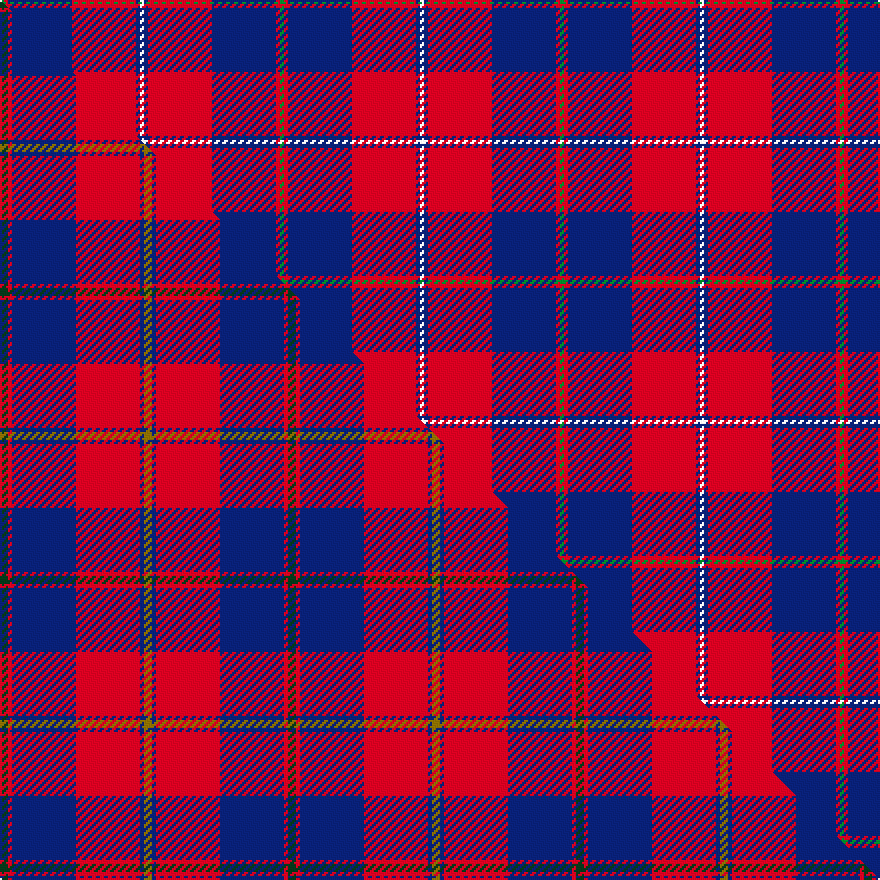

This page is one **sett** — a single exact thread-count. It belongs to the [tartan](/setts/g1r1db16r16db1w1/)
(the same proportion at any scale), whose colour order is pattern [GRBRBW](/stripes/grbrbw/).

Part of the [Galloway Dress](/tartans/galloway-dress/) tartan — the named design grouping this sett with its other cloths.

Sourced from weddslist.  It is a [6 stripe tartan](/stripes/stripes6/).

Original link http://www.weddslist.com/cgi-bin/tartans/pg.pl?source=sts

Dataset <small>— provenance for this record, inherited from the source manifest</small>

<dl class="dataset-prov">
<dt>source</dt><dd><a href="/sources/weddslist/">Weddslist</a></dd>
<dt>data captured from</dt><dd><a href="https://github.com/thetartan/tartan-database/blob/master/data/weddslist/data.csv">https://github.com/thetartan/tartan-database/blob/master/data/weddslist/data.csv</a></dd>
<dt>data date</dt><dd>2016-11-17 <small>(dataset default)</small></dd>
<dt>licence</dt><dd><a href="https://creativecommons.org/licenses/by-nc-nd/4.0/">CC BY-NC-ND 4.0</a></dd>
</dl>

Capture chain <small>— the hands this data passed through, oldest first; each capture carries its own licence</small>

<ol class="capture-chain">
<li><a href="https://www.weddslist.com/tartans/">Weddslist</a> <small>the living privately compiled reference</small></li>
<li><a href="https://github.com/thetartan/tartan-database">thetartan/tartan-database</a> <small>2016-2017</small> · <a href="https://creativecommons.org/licenses/by-nc-nd/4.0/">CC BY-NC-ND 4.0</a> <small>Levko Kravets's frozen compilation — the capture we vendored, and where its CC licence text came from</small></li>
<li>this dictionary <small>captured 2026-06-10 · commit 5bf86c7566</small> <small>each re-capture is a git commit to data/sources</small></li>
</ol>

## Thread count
G/2 R2 DB32 R32 DB2 W/2

One full sett is **140 threads**.

## Palette
<table><thead><tr><th>Colour</th><th>Shade</th><th>OKLCh</th></tr></thead><tbody><tr><td>DB</td><td><code style="background-color:#082077;">#082077</code> <small style="color:#888">#082077</small></td><td><small style="color:#888">oklch(30.0% 0.149 265.1)</small></td></tr><tr><td>G</td><td><code style="background-color:#008B2A;">#008B2A</code> <small style="color:#888">#008B2A</small></td><td><small style="color:#888">oklch(55.4% 0.170 145.9)</small></td></tr><tr><td>W</td><td><code style="background-color:#F7F7F7;">#F7F7F7</code> <small style="color:#888">#F7F7F7</small></td><td><small style="color:#888">oklch(97.6% 0.000 89.9)</small></td></tr><tr><td>R</td><td><code style="background-color:#D60020;">#D60020</code> <small style="color:#888">#D60020</small></td><td><small style="color:#888">oklch(55.2% 0.224 25.5)</small></td></tr></tbody></table>

# Sample pattern

## Compared to the master

This cloth is one sett of its design; the master sett (the exemplar the design is anchored on) is below for comparison.

Its **ΔTartan distance** from the master is **0.36** — the same measure the nearest-tartans table ranks by (0 is identical; a re-scale of the same cloth is near 0, a recolour or a different proportion further).

<figure class="master-compare" style="margin:0">

this sett
master sett ★

<figcaption style="color:#888;font-size:smaller">One weave of this sett against the <a href="/setts/dg2r1db16r16db1y2/">master sett ★</a>, split on the diagonal: a shared proportion runs seamlessly across it with only the shades shifting; a different proportion breaks on it.</figcaption>
</figure>

## Nearest tartan variants

The nearest existing variants by ΔTartan distance, with this cloth at the top so the swatches line up against it.

ΔTartan

Threads

Variant

Sett

—

140

<a href="/variants/s6/g1r1db16r16db1w1~x2/">Galloway, dress</a>

<a href="/ttd/edit/#slug=y2db1r16db16r1g2~x2&amp;base=g1r1db16r16db1w1~x2" title="compare in the TTD">0.34</a>

144

<a href="/variants/s6/y2db1r16db16r1g2~x2/">Galloway dress</a>

<a href="/ttd/edit/#slug=g3r2db22r22db2w3~x2&amp;base=g1r1db16r16db1w1~x2" title="compare in the TTD">0.35</a>

204

<a href="/variants/s6/g3r2db22r22db2w3~x2/">Galloway Red</a>

<a href="/ttd/edit/#slug=dg2r1db16r16db1y2~x2&amp;base=g1r1db16r16db1w1~x2" title="compare in the TTD">0.36</a>

144

<a href="/variants/s6/dg2r1db16r16db1y2~x2/">Galloway Dress (Yellow Line)</a>

<a href="/ttd/edit/#slug=db15w2r20db2r4~x2&amp;base=g1r1db16r16db1w1~x2" title="compare in the TTD">1.07</a>

134

<a href="/variants/s5/db15w2r20db2r4~x2/">Masai Shuka 25 (Artefact)</a>

<a href="/ttd/edit/#slug=db1r14g7db7r1~x4&amp;base=g1r1db16r16db1w1~x2" title="compare in the TTD">1.21</a>

232

<a href="/variants/s5/db1r14g7db7r1~x4/">Fraser of Boblainy, Hugh (Personal)</a>

<a href="/ttd/edit/#slug=ri2db13r3db3r16lb2~x4~ri2008029-r1506028&amp;base=g1r1db16r16db1w1~x2" title="compare in the TTD">1.28</a>

296

<a href="/variants/s6/ri2db13r3db3r16lb2~x4~ri2008029-r1506028/">MacArthur-Fox, dress</a>

<a href="/ttd/edit/#slug=db18r9db2r3k1n1~x4&amp;base=g1r1db16r16db1w1~x2" title="compare in the TTD">1.44</a>

196

<a href="/variants/s6/db18r9db2r3k1n1~x4/">MacGregor, Modern</a>

<a href="/ttd/edit/#slug=w3g15db18r30db1r2~x2&amp;base=g1r1db16r16db1w1~x2" title="compare in the TTD">1.45</a>

266

<a href="/variants/s6/w3g15db18r30db1r2~x2/">Ruthven</a>

<a href="/ttd/edit/#slug=db3r24db3r3db25w3~x2&amp;base=g1r1db16r16db1w1~x2" title="compare in the TTD">1.67</a>

232

<a href="/variants/s6/db3r24db3r3db25w3~x2/">Matthews (Personal)</a>

<a href="/ttd/edit/#slug=r12db2r12db17w2r2~x4&amp;base=g1r1db16r16db1w1~x2" title="compare in the TTD">1.75</a>

320

<a href="/variants/s6/r12db2r12db17w2r2~x4/">British European (Corporate)</a>

## Neighbour map

Every grey dot is one of 13620 variants placed by the first two principal components of the ΔTartan feature space (42% of its variance). Red is this tartan; blue dots are its nearest — click one to open its page.

<svg viewBox="0 0 640 380" role="img" style="max-width:100%;height:auto;border:1px solid #e0e0e0;border-radius:4px;display:block" xmlns="http://www.w3.org/2000/svg"><image href="/nn/cloud.v1.png" width="640" height="380"/><a href="/variants/s6/y2db1r16db16r1g2~x2/"><circle cx="307.8" cy="172.5" r="4" fill="#3465a4"><title>Galloway dress</title></circle></a><a href="/variants/s6/g3r2db22r22db2w3~x2/"><circle cx="274.3" cy="186.0" r="4" fill="#3465a4"><title>Galloway Red</title></circle></a><a href="/variants/s6/dg2r1db16r16db1y2~x2/"><circle cx="311.6" cy="173.2" r="4" fill="#3465a4"><title>Galloway Dress (Yellow Line)</title></circle></a><a href="/variants/s5/db15w2r20db2r4~x2/"><circle cx="348.9" cy="218.2" r="4" fill="#3465a4"><title>Masai Shuka 25 (Artefact)</title></circle></a><a href="/variants/s5/db1r14g7db7r1~x4/"><circle cx="309.8" cy="219.0" r="4" fill="#3465a4"><title>Fraser of Boblainy, Hugh (Personal)</title></circle></a><a href="/variants/s6/ri2db13r3db3r16lb2~x4~ri2008029-r1506028/"><circle cx="324.9" cy="225.2" r="4" fill="#3465a4"><title>MacArthur-Fox, dress</title></circle></a><a href="/variants/s6/db18r9db2r3k1n1~x4/"><circle cx="352.6" cy="149.9" r="4" fill="#3465a4"><title>MacGregor, Modern</title></circle></a><a href="/variants/s6/w3g15db18r30db1r2~x2/"><circle cx="287.6" cy="160.5" r="4" fill="#3465a4"><title>Ruthven</title></circle></a><a href="/variants/s6/db3r24db3r3db25w3~x2/"><circle cx="322.7" cy="210.5" r="4" fill="#3465a4"><title>Matthews (Personal)</title></circle></a><a href="/variants/s6/r12db2r12db17w2r2~x4/"><circle cx="326.8" cy="222.0" r="4" fill="#3465a4"><title>British European (Corporate)</title></circle></a><circle cx="326.4" cy="162.6" r="5" fill="#c00000"/><text x="320" y="376" text-anchor="middle" font-size="11" fill="#999">ground</text><text x="11" y="190" text-anchor="middle" font-size="11" fill="#999" transform="rotate(-90 11 190)">complexity</text></svg>

ID: /variants/s6/g1r1db16r16db1w1~x2/
