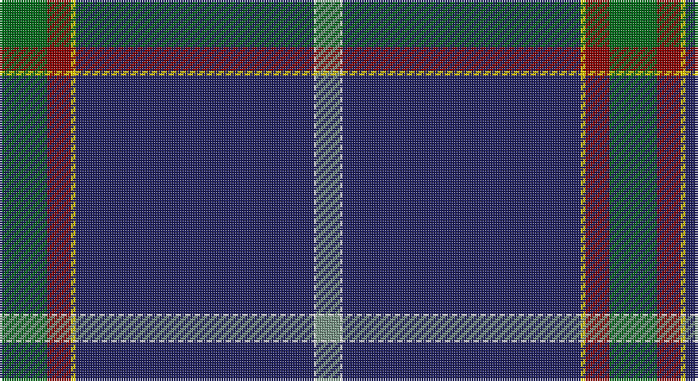

This page is one **sett** — a single exact thread-count. It belongs to the [tartan](/setts/g20r10ly2db100w1y10/)
(the same proportion at any scale), whose colour order is pattern [GRYBWG](/stripes/grybwg/).

Sourced from tartans-authority.  It is a [6 stripe tartan](/stripes/stripes6/).

Original link http://www.tartansauthority.com/tartan-ferret/display/10756/

## Register references

External register numbers recorded for this tartan.

- Scottish Tartans Authority (ITI): 10756

## Thread count
G/20 DR10 Y2 DB100 W1 LG/10

One full sett is **256 threads**.

## Palette

Palette: <strong>Tartan Register</strong>
<table><thead><tr><th>Colour</th><th>Threads</th><th>Shade</th><th>Base</th><th>OKLCh</th></tr></thead><tbody><tr><td>G/</td><td style="text-align:right;font-variant-numeric:tabular-nums">20</td><td><code style="background-color:#006818;">#006818</code> <small style="color:#888">#006818</small></td><td>G <code style="background-color:#006100;">#006100</code></td><td><small style="color:#888">oklch(45.0% 0.142 145.0)</small></td></tr><tr><td>DR</td><td style="text-align:right;font-variant-numeric:tabular-nums">10</td><td><code style="background-color:#880000;">#880000</code> <small style="color:#888">#880000</small></td><td>R <code style="background-color:#CC0000;">#CC0000</code></td><td><small style="color:#888">oklch(39.4% 0.162 29.2)</small></td></tr><tr><td>Y</td><td style="text-align:right;font-variant-numeric:tabular-nums">2</td><td><code style="background-color:#FCCC00;">#FCCC00</code> <small style="color:#888">#FCCC00</small></td><td>Y <code style="background-color:#F2BF00;">#F2BF00</code></td><td><small style="color:#888">oklch(86.2% 0.176 91.5)</small></td></tr><tr><td>DB</td><td style="text-align:right;font-variant-numeric:tabular-nums">100</td><td><code style="background-color:#202060;">#202060</code> <small style="color:#888">#202060</small></td><td>B <code style="background-color:#2A418A;">#2A418A</code></td><td><small style="color:#888">oklch(28.9% 0.111 276.9)</small></td></tr><tr><td>W</td><td style="text-align:right;font-variant-numeric:tabular-nums">1</td><td><code style="background-color:#FCFCFC;">#FCFCFC</code> <small style="color:#888">#FCFCFC</small></td><td>W <code style="background-color:#F7F7F7;">#F7F7F7</code></td><td><small style="color:#888">oklch(99.1% 0.000 89.9)</small></td></tr><tr><td>LG/</td><td style="text-align:right;font-variant-numeric:tabular-nums">10</td><td><code style="background-color:#789484;">#789484</code> <small style="color:#888">#789484</small></td><td>G <code style="background-color:#006100;">#006100</code></td><td><small style="color:#888">oklch(64.0% 0.040 160.0)</small></td></tr></tbody></table>

# Sample pattern

## Nearest tartans

The nearest existing variants by ΔTartan distance, with this tartan at the top so the swatches line up against it.

ΔTartan

Tartan

Sett

—

<a href="/ttd/edit/#slug=g20r10ly2db100w1y10">Ravetta (Name)</a> <a class="nn-out" href="/variants/s6/g20r10ly2db100w1y10/" title="open its dictionary page">↗</a>

0.63

<a href="/ttd/edit/#slug=w2db45g9r1n9ri1~x2&amp;base=g20r10ly2db100w1y10">Wilton (Name)</a> <a class="nn-out" href="/variants/s6/w2db45g9r1n9ri1~x2/" title="open its dictionary page">↗</a>

1.15

<a href="/ttd/edit/#slug=g5w1r5k5db43r1~x2&amp;base=g20r10ly2db100w1y10">Michael (John) (Personal)</a> <a class="nn-out" href="/variants/s6/g5w1r5k5db43r1~x2/" title="open its dictionary page">↗</a>

1.22

<a href="/ttd/edit/#slug=db60w1db6g10r1g7k2lo2w2~x2&amp;base=g20r10ly2db100w1y10">Mohammed, Abu Hassan (Personal)</a> <a class="nn-out" href="/variants/s9/db60w1db6g10r1g7k2lo2w2~x2/" title="open its dictionary page">↗</a>

1.23

<a href="/ttd/edit/#slug=db67w1lo6r5dg25db3k5~x2&amp;base=g20r10ly2db100w1y10">Guide Dogs (Corporate)</a> <a class="nn-out" href="/variants/s7/db67w1lo6r5dg25db3k5~x2/" title="open its dictionary page">↗</a>

1.29

<a href="/ttd/edit/#slug=n15k55w1dp5r2ly1~x2&amp;base=g20r10ly2db100w1y10">Venters (Edinburgh)</a> <a class="nn-out" href="/variants/s6/n15k55w1dp5r2ly1~x2/" title="open its dictionary page">↗</a>

1.33

<a href="/ttd/edit/#slug=g3db16k3dp2k45r1k2lo3~x2&amp;base=g20r10ly2db100w1y10">Cumnock (District)</a> <a class="nn-out" href="/variants/s8/g3db16k3dp2k45r1k2lo3~x2/" title="open its dictionary page">↗</a>

1.37

<a href="/ttd/edit/#slug=w3dt9ly1lb3dp9lb1dt40dp2~x2&amp;base=g20r10ly2db100w1y10">Parkin</a> <a class="nn-out" href="/variants/s8/w3dt9ly1lb3dp9lb1dt40dp2~x2/" title="open its dictionary page">↗</a>

1.37

<a href="/ttd/edit/#slug=dt60lr11oi5n5k1o4~x2&amp;base=g20r10ly2db100w1y10">Christie (London) Hunting</a> <a class="nn-out" href="/variants/s6/dt60lr11oi5n5k1o4~x2/" title="open its dictionary page">↗</a>

1.45

<a href="/ttd/edit/#slug=db46lyi1ly3dg13lyi1r7g3lyi1~x2&amp;base=g20r10ly2db100w1y10">Victorian Highland Pipe Band Assoc</a> <a class="nn-out" href="/variants/s8/db46lyi1ly3dg13lyi1r7g3lyi1~x2/" title="open its dictionary page">↗</a>

1.47

<a href="/ttd/edit/#slug=g3db16k3p2k45r1k2lo3~x2&amp;base=g20r10ly2db100w1y10">Cumnock</a> <a class="nn-out" href="/variants/s8/g3db16k3p2k45r1k2lo3~x2/" title="open its dictionary page">↗</a>

## Neighbour map

Every grey dot is one of 14360 variants placed by the first two principal components of the ΔTartan feature space (44% of its variance). Red is this tartan; blue dots are its nearest — click one to open its page.

<svg viewBox="0 0 640 380" role="img" style="max-width:100%;height:auto;border:1px solid #e0e0e0;border-radius:4px;display:block" xmlns="http://www.w3.org/2000/svg"><image href="/nn/cloud.v1.png" width="640" height="380"/><a href="/variants/s6/w2db45g9r1n9ri1~x2/"><circle cx="453.9" cy="121.7" r="4" fill="#3465a4"><title>Wilton (Name)</title></circle></a><a href="/variants/s6/g5w1r5k5db43r1~x2/"><circle cx="503.9" cy="129.8" r="4" fill="#3465a4"><title>Michael (John) (Personal)</title></circle></a><a href="/variants/s9/db60w1db6g10r1g7k2lo2w2~x2/"><circle cx="487.5" cy="77.3" r="4" fill="#3465a4"><title>Mohammed, Abu Hassan (Personal)</title></circle></a><a href="/variants/s7/db67w1lo6r5dg25db3k5~x2/"><circle cx="430.4" cy="113.5" r="4" fill="#3465a4"><title>Guide Dogs (Corporate)</title></circle></a><a href="/variants/s6/n15k55w1dp5r2ly1~x2/"><circle cx="502.9" cy="129.5" r="4" fill="#3465a4"><title>Venters (Edinburgh)</title></circle></a><a href="/variants/s8/g3db16k3dp2k45r1k2lo3~x2/"><circle cx="438.3" cy="96.2" r="4" fill="#3465a4"><title>Cumnock (District)</title></circle></a><a href="/variants/s8/w3dt9ly1lb3dp9lb1dt40dp2~x2/"><circle cx="473.4" cy="109.7" r="4" fill="#3465a4"><title>Parkin</title></circle></a><a href="/variants/s6/dt60lr11oi5n5k1o4~x2/"><circle cx="470.0" cy="109.1" r="4" fill="#3465a4"><title>Christie (London) Hunting</title></circle></a><a href="/variants/s8/db46lyi1ly3dg13lyi1r7g3lyi1~x2/"><circle cx="390.7" cy="88.4" r="4" fill="#3465a4"><title>Victorian Highland Pipe Band Assoc</title></circle></a><a href="/variants/s8/g3db16k3p2k45r1k2lo3~x2/"><circle cx="415.0" cy="86.6" r="4" fill="#3465a4"><title>Cumnock</title></circle></a><circle cx="469.7" cy="109.2" r="5" fill="#c00000"/></svg>

ID: /variants/s6/g20r10ly2db100w1y10/
