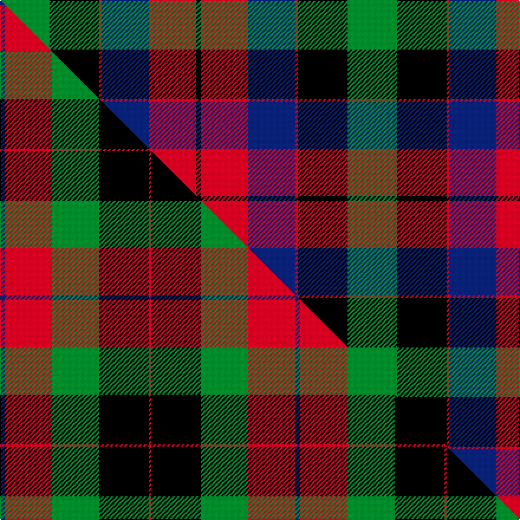

This is one **variant** — a specific cloth: this exact thread count and colourway, with its own
provenance below. It is one weaving of the [sett](/setts/g21k21r1db20r20k2/) (the scale-free proportion — the
same cloth at any scale or shade), whose colour order is pattern [GKRBRK](/stripes/gkrbrk/).

Part of the [Skene of Cromar](/tartans/skene-of-cromar/) tartan — the named design grouping this sett with its other cloths.

Sourced from register-of-tartans.  It is a [6 stripe tartan](/stripes/stripes6/).

Original link [https://www.tartanregister.gov.uk/tartanDetails.aspx?ref=3807](https://www.tartanregister.gov.uk/tartanDetails.aspx?ref=3807)

Dataset <small>— provenance for this record, inherited from the source manifest</small>

<dl class="dataset-prov">
<dt>source</dt><dd><a href="/sources/register-of-tartans/">Scottish Register of Tartans</a></dd>
<dt>data captured from</dt><dd><a href="https://github.com/thetartan/tartan-database/blob/master/data/register-of-tartans/data.csv">https://github.com/thetartan/tartan-database/blob/master/data/register-of-tartans/data.csv</a></dd>
<dt>data date</dt><dd>2017-01-06 <small>(dataset default)</small></dd>
<dt>licence</dt><dd><a href="https://www.tartanregister.gov.uk/copyright">Crown copyright</a></dd>
</dl>

Capture chain <small>— the hands this data passed through, oldest first; each capture carries its own licence</small>

<ol class="capture-chain">
<li><a href="https://www.tartanregister.gov.uk/">Scottish Register of Tartans</a> · <a href="https://www.tartanregister.gov.uk/copyright">Crown copyright</a> <small>the living register — still published by National Records of Scotland</small></li>
<li><a href="https://github.com/thetartan/tartan-database">thetartan/tartan-database</a> <small>2016-2017</small> · <a href="https://creativecommons.org/licenses/by-nc-nd/4.0/">CC BY-NC-ND 4.0</a> <small>Levko Kravets's frozen compilation — the capture we vendored, and where its CC licence text came from</small></li>
<li>this dictionary <small>captured 2026-06-10 · commit 5bf86c7566</small> <small>each re-capture is a git commit to data/sources</small></li>
</ol>

## Register references

External register numbers recorded for this tartan.

- Scottish Register of Tartans: [3807](https://www.tartanregister.gov.uk/tartanDetails.aspx?ref=3807)
- Scottish Tartans Authority (ITI): 7126

## Thread count
G/42 K42 R2 DB40 R40 K/4

One full sett is **294 threads**.

## Palette
<table><thead><tr><th>Colour</th><th>Shade</th><th>OKLCh</th></tr></thead><tbody><tr><td>DB</td><td><code style="background-color:#082077;">#082077</code> <small style="color:#888">#082077</small></td><td><small style="color:#888">oklch(30.0% 0.149 265.1)</small></td></tr><tr><td>G</td><td><code style="background-color:#008B2A;">#008B2A</code> <small style="color:#888">#008B2A</small></td><td><small style="color:#888">oklch(55.4% 0.170 145.9)</small></td></tr><tr><td>K</td><td><code style="background-color:#000000;">#000000</code> <small style="color:#888">#000000</small></td><td><small style="color:#888">oklch(0.0% 0.000 0.0)</small></td></tr><tr><td>R</td><td><code style="background-color:#D60020;">#D60020</code> <small style="color:#888">#D60020</small></td><td><small style="color:#888">oklch(55.2% 0.224 25.5)</small></td></tr></tbody></table>

# Sample pattern

## Compared to the master

This cloth is one sett of its design; the master sett (the exemplar the design is anchored on) is below for comparison.

Its **ΔTartan distance** from the master is **1.32** — the same measure the nearest-tartans table ranks by (0 is identical; a re-scale of the same cloth is near 0, a recolour or a different proportion further).

<figure class="master-compare" style="margin:0">

this sett
master sett ★

<figcaption style="color:#888;font-size:smaller">One weave of this sett against the <a href="/setts/db2r20g20k21r1/">master sett ★</a>, split on the diagonal: a shared proportion runs seamlessly across it with only the shades shifting; a different proportion breaks on it.</figcaption>
</figure>

## Nearest tartan variants

The nearest existing variants by ΔTartan distance, with this cloth at the top so the swatches line up against it.

ΔTartan

Threads

Variant

Sett

—

294

<a href="/variants/s6/g21k21r1db20r20k2~x2/">Skene of Cromar (Cant version)</a>

<a href="/ttd/edit/#slug=db2r20g20k21r1~x2&amp;base=g21k21r1db20r20k2~x2" title="compare in the TTD">1.32</a>

250

<a href="/variants/s5/db2r20g20k21r1~x2/">Skene of Cromar (1885)</a>

<a href="/ttd/edit/#slug=k2g12k12r1db12w2~x2&amp;base=g21k21r1db20r20k2~x2" title="compare in the TTD">1.46</a>

156

<a href="/variants/s6/k2g12k12r1db12w2~x2/">Russell Clan Tartan</a>

<a href="/ttd/edit/#slug=k2g12k12r1db12w2&amp;base=g21k21r1db20r20k2~x2" title="compare in the TTD">1.46</a>

78

<a href="/variants/s6/k2g12k12r1db12w2/">Mitchell</a>

<a href="/ttd/edit/#slug=k2g12k12r1db12g2~x2&amp;base=g21k21r1db20r20k2~x2" title="compare in the TTD">1.48</a>

156

<a href="/variants/s6/k2g12k12r1db12g2~x2/">Ferguson of Balquhidder</a>

<a href="/ttd/edit/#slug=k7g22k22db6r2db15r2~x2&amp;base=g21k21r1db20r20k2~x2" title="compare in the TTD">1.63</a>

286

<a href="/variants/s7/k7g22k22db6r2db15r2~x2/">National Galleries of Scotland</a>

<a href="/ttd/edit/#slug=r2db16r1k10g12o2~x2&amp;base=g21k21r1db20r20k2~x2" title="compare in the TTD">1.69</a>

164

<a href="/variants/s6/r2db16r1k10g12o2~x2/">MacWilliam</a>

<a href="/ttd/edit/#slug=dy2g12k10r1db16r2~x2&amp;base=g21k21r1db20r20k2~x2" title="compare in the TTD">1.69</a>

164

<a href="/variants/s6/dy2g12k10r1db16r2~x2/">MacWilliam Clan Tartan</a>

<a href="/ttd/edit/#slug=r1g14k14r2db14lb1~x2&amp;base=g21k21r1db20r20k2~x2" title="compare in the TTD">1.83</a>

180

<a href="/variants/s6/r1g14k14r2db14lb1~x2/">Wilson's No.221</a>

<a href="/ttd/edit/#slug=k2g11y1k8db9r2~x4&amp;base=g21k21r1db20r20k2~x2" title="compare in the TTD">1.94</a>

248

<a href="/variants/s6/k2g11y1k8db9r2~x4/">Forsyth Clan Tartan</a>

<a href="/ttd/edit/#slug=dt18k5r26k5g25k5dt18y2~x2~dt1204274&amp;base=g21k21r1db20r20k2~x2" title="compare in the TTD">2.43</a>

376

<a href="/variants/s8/db18k5r26k5g25k5db18y2~x2~db1204274/">St. Clement of Rome School</a>

## Neighbour map

Every grey dot is one of 13621 variants placed by the first two principal components of the ΔTartan feature space (42% of its variance). Red is this tartan; blue dots are its nearest — click one to open its page.

<svg viewBox="0 0 640 380" role="img" style="max-width:100%;height:auto;border:1px solid #e0e0e0;border-radius:4px;display:block" xmlns="http://www.w3.org/2000/svg"><image href="/nn/cloud.v1.png" width="640" height="380"/><a href="/variants/s5/db2r20g20k21r1~x2/"><circle cx="164.3" cy="178.3" r="4" fill="#3465a4"><title>Skene of Cromar (1885)</title></circle></a><a href="/variants/s6/k2g12k12r1db12w2~x2/"><circle cx="121.5" cy="180.7" r="4" fill="#3465a4"><title>Russell Clan Tartan</title></circle></a><a href="/variants/s6/k2g12k12r1db12w2/"><circle cx="121.5" cy="180.7" r="4" fill="#3465a4"><title>Mitchell</title></circle></a><a href="/variants/s6/k2g12k12r1db12g2~x2/"><circle cx="157.0" cy="197.6" r="4" fill="#3465a4"><title>Ferguson of Balquhidder</title></circle></a><a href="/variants/s7/k7g22k22db6r2db15r2~x2/"><circle cx="157.7" cy="192.9" r="4" fill="#3465a4"><title>National Galleries of Scotland</title></circle></a><a href="/variants/s6/r2db16r1k10g12o2~x2/"><circle cx="153.5" cy="168.2" r="4" fill="#3465a4"><title>MacWilliam</title></circle></a><a href="/variants/s6/dy2g12k10r1db16r2~x2/"><circle cx="156.4" cy="169.4" r="4" fill="#3465a4"><title>MacWilliam Clan Tartan</title></circle></a><a href="/variants/s6/r1g14k14r2db14lb1~x2/"><circle cx="125.4" cy="171.5" r="4" fill="#3465a4"><title>Wilson's No.221</title></circle></a><a href="/variants/s6/k2g11y1k8db9r2~x4/"><circle cx="118.9" cy="190.3" r="4" fill="#3465a4"><title>Forsyth Clan Tartan</title></circle></a><a href="/variants/s8/db18k5r26k5g25k5db18y2~x2~db1204274/"><circle cx="124.7" cy="170.6" r="4" fill="#3465a4"><title>St. Clement of Rome School</title></circle></a><circle cx="119.2" cy="184.7" r="5" fill="#c00000"/><text x="320" y="376" text-anchor="middle" font-size="11" fill="#999">ground</text><text x="11" y="190" text-anchor="middle" font-size="11" fill="#999" transform="rotate(-90 11 190)">complexity</text></svg>

ID: /variants/s6/g21k21r1db20r20k2~x2/
