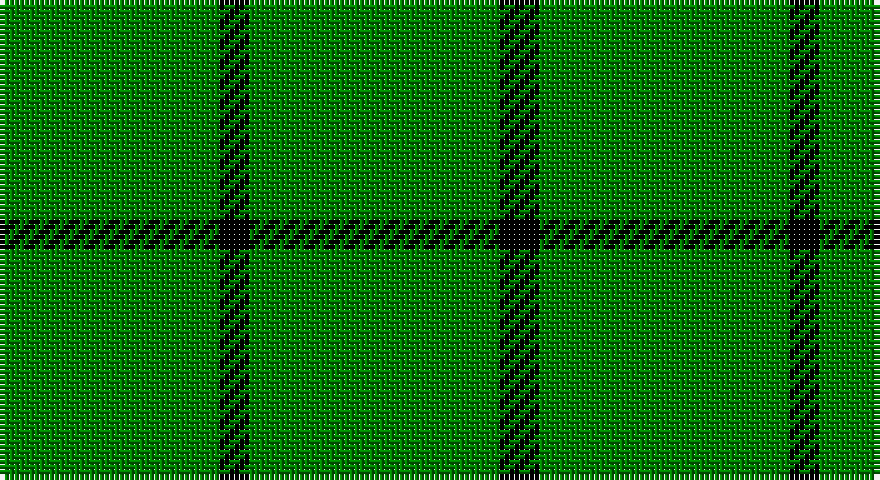

This page is one **sett** — a single exact thread-count. It belongs to the [tartan](/setts/g22k3g3g16g6k4/)
(the same proportion at any scale), whose colour order is pattern [GKGGGK](/stripes/gkgggk/).

Part of the [Campbell Simpson](/tartans/campbell-simpson/) tartan — the named design grouping this sett with its other cloths.

Sourced from weddslist.  It is a [6 stripe tartan](/stripes/stripes6/).

Original link http://www.weddslist.com/cgi-bin/tartans/pg.pl?source=sts

## Also known as

This cloth is also recorded under:

- Campbell, Simpson

## Thread count
G/44 K6 G6 G32 G12 K/8

One full sett is **164 threads**.

## Palette

Palette: <strong>Ingles Buchan</strong> <small style="color:#888">(1 of 2 colours)</small>
<table><thead><tr><th>Colour</th><th>Threads</th><th>Shade</th><th>Base</th><th>OKLCh</th></tr></thead><tbody><tr><td>G/</td><td style="text-align:right;font-variant-numeric:tabular-nums">44</td><td><code style="background-color:#008000;">#008000</code> <small style="color:#888">#008000</small></td><td>G <code style="background-color:#006100;">#006100</code></td><td><small style="color:#888">oklch(52.0% 0.177 142.5)</small></td></tr><tr><td>K</td><td style="text-align:right;font-variant-numeric:tabular-nums">6</td><td><code style="background-color:#000000;">#000000</code> <small style="color:#888">#000000</small></td><td>K <code style="background-color:#000000;">#000000</code></td><td><small style="color:#888">oklch(0.0% 0.000 0.0)</small></td></tr><tr><td>G</td><td style="text-align:right;font-variant-numeric:tabular-nums">6</td><td><code style="background-color:#008000;">#008000</code> <small style="color:#888">#008000</small></td><td>G <code style="background-color:#006100;">#006100</code></td><td><small style="color:#888">oklch(52.0% 0.177 142.5)</small></td></tr><tr><td>G</td><td style="text-align:right;font-variant-numeric:tabular-nums">32</td><td><code style="background-color:#008000;">#008000</code> <small style="color:#888">#008000</small></td><td>G <code style="background-color:#006100;">#006100</code></td><td><small style="color:#888">oklch(52.0% 0.177 142.5)</small></td></tr><tr><td>G</td><td style="text-align:right;font-variant-numeric:tabular-nums">12</td><td><code style="background-color:#008000;">#008000</code> <small style="color:#888">#008000</small></td><td>G <code style="background-color:#006100;">#006100</code></td><td><small style="color:#888">oklch(52.0% 0.177 142.5)</small></td></tr><tr><td>K/</td><td style="text-align:right;font-variant-numeric:tabular-nums">8</td><td><code style="background-color:#000000;">#000000</code> <small style="color:#888">#000000</small></td><td>K <code style="background-color:#000000;">#000000</code></td><td><small style="color:#888">oklch(0.0% 0.000 0.0)</small></td></tr></tbody></table>

# Sample pattern

## Compared to the master

This cloth is one sett of its design; the master sett (the exemplar the design is anchored on) is below for comparison.

<figure style="margin:0"><figcaption style="color:#888;font-size:smaller">this sett</figcaption></figure>
<figure style="margin:0"><figcaption style="color:#888;font-size:smaller"><a href="/setts/dg22k3dg25k4/">master sett →</a></figcaption></figure>

## Nearest tartans

The nearest existing variants by ΔTartan distance, with this tartan at the top so the swatches line up against it.

ΔTartan

Tartan

Sett

—

<a href="/ttd/edit/#slug=g22k3g3g16g6k4~x2">Campbell, Simpson</a> <a class="nn-out" href="/variants/s6/g22k3g3g16g6k4~x2/" title="open its dictionary page">↗</a>

1.86

<a href="/ttd/edit/#slug=g1w1g8w1g8w1g2w1g4w1~x4&amp;base=g22k3g3g16g6k4~x2">Cowper (Personal)</a> <a class="nn-out" href="/variants/s10/g1w1g8w1g8w1g2w1g4w1~x4/" title="open its dictionary page">↗</a>

2.52

<a href="/ttd/edit/#slug=g7db1g2k3g2~x4&amp;base=g22k3g3g16g6k4~x2">Peterhead</a> <a class="nn-out" href="/variants/s5/g7db1g2k3g2~x4/" title="open its dictionary page">↗</a>

2.57

<a href="/ttd/edit/#slug=g50k6db11g25ly4~x2&amp;base=g22k3g3g16g6k4~x2">Glen of Daviot (Dalgleish)</a> <a class="nn-out" href="/variants/s5/g50k6db11g25ly4~x2/" title="open its dictionary page">↗</a>

2.57

<a href="/ttd/edit/#slug=g23r3g7r3g23dp7~x2&amp;base=g22k3g3g16g6k4~x2">Highland Spring (1997)</a> <a class="nn-out" href="/variants/s6/g23r3g7r3g23dp7~x2/" title="open its dictionary page">↗</a>

2.81

<a href="/ttd/edit/#slug=g49w4lo11~x2&amp;base=g22k3g3g16g6k4~x2">Hibernian S3</a> <a class="nn-out" href="/variants/s3/g49w4lo11~x2/" title="open its dictionary page">↗</a>

2.84

<a href="/ttd/edit/#slug=k2g2g19g2g2g19r2~x2&amp;base=g22k3g3g16g6k4~x2">Kenmore Hunting (Fashion)</a> <a class="nn-out" href="/variants/s7/k2g2g19g2g2g19r2~x2/" title="open its dictionary page">↗</a>

2.89

<a href="/ttd/edit/#slug=r19g6r7g101k7g7&amp;base=g22k3g3g16g6k4~x2">Loch Laggan</a> <a class="nn-out" href="/variants/s6/r19g6r7g101k7g7/" title="open its dictionary page">↗</a>

2.91

<a href="/ttd/edit/#slug=r2g1r1g11w1~x8&amp;base=g22k3g3g16g6k4~x2">Welsh, National</a> <a class="nn-out" href="/variants/s5/r2g1r1g11w1~x8/" title="open its dictionary page">↗</a>

2.96

<a href="/variants/s10/r4g2r1g19k1g2~x4/">Loch Laggan</a>

2.99

<a href="/ttd/edit/#slug=g7r3g23m7~x2&amp;base=g22k3g3g16g6k4~x2">Highland Spring (Green)</a> <a class="nn-out" href="/variants/s4/g7r3g23m7~x2/" title="open its dictionary page">↗</a>

## Neighbour map

Every grey dot is one of 14360 variants placed by the first two principal components of the ΔTartan feature space (44% of its variance). Red is this tartan; blue dots are its nearest — click one to open its page.

<svg viewBox="0 0 640 380" role="img" style="max-width:100%;height:auto;border:1px solid #e0e0e0;border-radius:4px;display:block" xmlns="http://www.w3.org/2000/svg"><image href="/nn/cloud.v1.png" width="640" height="380"/><a href="/variants/s10/g1w1g8w1g8w1g2w1g4w1~x4/"><circle cx="490.0" cy="223.9" r="4" fill="#3465a4"><title>Cowper (Personal)</title></circle></a><a href="/variants/s5/g7db1g2k3g2~x4/"><circle cx="386.6" cy="270.5" r="4" fill="#3465a4"><title>Peterhead</title></circle></a><a href="/variants/s5/g50k6db11g25ly4~x2/"><circle cx="461.8" cy="229.7" r="4" fill="#3465a4"><title>Glen of Daviot (Dalgleish)</title></circle></a><a href="/variants/s6/g23r3g7r3g23dp7~x2/"><circle cx="515.0" cy="278.5" r="4" fill="#3465a4"><title>Highland Spring (1997)</title></circle></a><a href="/variants/s3/g49w4lo11~x2/"><circle cx="491.3" cy="257.5" r="4" fill="#3465a4"><title>Hibernian S3</title></circle></a><a href="/variants/s7/k2g2g19g2g2g19r2~x2/"><circle cx="626.0" cy="256.8" r="4" fill="#3465a4"><title>Kenmore Hunting (Fashion)</title></circle></a><a href="/variants/s6/r19g6r7g101k7g7/"><circle cx="527.5" cy="189.4" r="4" fill="#3465a4"><title>Loch Laggan</title></circle></a><a href="/variants/s5/r2g1r1g11w1~x8/"><circle cx="490.3" cy="219.9" r="4" fill="#3465a4"><title>Welsh, National</title></circle></a><a href="/variants/s10/r4g2r1g19k1g2~x4/"><circle cx="587.8" cy="176.1" r="4" fill="#3465a4"><title>Loch Laggan</title></circle></a><a href="/variants/s4/g7r3g23m7~x2/"><circle cx="473.4" cy="289.1" r="4" fill="#3465a4"><title>Highland Spring (Green)</title></circle></a><circle cx="540.4" cy="278.0" r="5" fill="#c00000"/></svg>

ID: /variants/s6/g22k3g3g16g6k4~x2/
