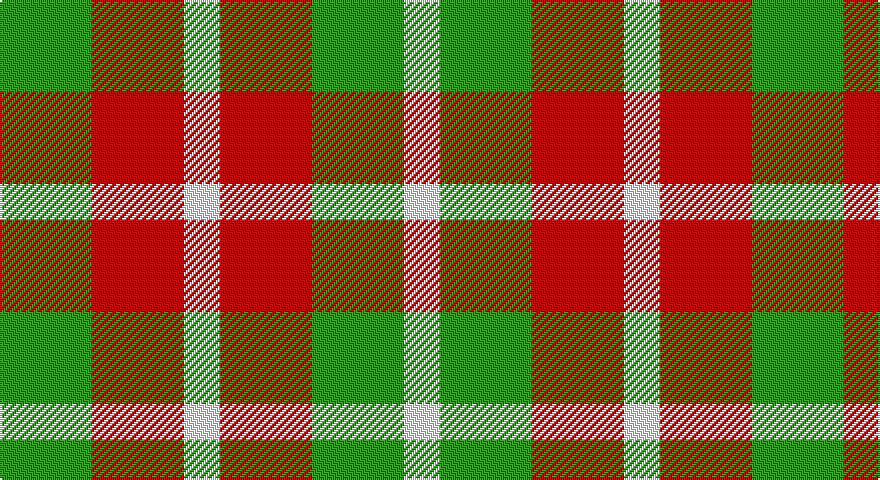

This page is one **sett** — a single exact thread-count. It belongs to the [tartan](/setts/g23r23w9r23g23w9/)
(the same proportion at any scale), whose colour order is pattern [GRWRGW](/stripes/grwrgw/).

Sourced from register-of-tartans.  It is a [6 stripe tartan](/stripes/stripes6/).

Original link https://www.tartanregister.gov.uk/tartanDetails.aspx?ref=3246

## Register references

External register numbers recorded for this tartan.

- Scottish Register of Tartans: [3246](https://www.tartanregister.gov.uk/tartanDetails.aspx?ref=3246)
- Scottish Tartans Authority (ITI): 6852

## Thread count
G/46 R46 W18 R46 G46 W/18

One full sett is **376 threads**.

## Palette

Palette: <strong>Tartan Register</strong>
<table><thead><tr><th>Colour</th><th>Threads</th><th>Shade</th><th>Base</th><th>OKLCh</th></tr></thead><tbody><tr><td>G/</td><td style="text-align:right;font-variant-numeric:tabular-nums">46</td><td><code style="background-color:#289C18;">#289C18</code> <small style="color:#888">#289C18</small></td><td>G <code style="background-color:#006100;">#006100</code></td><td><small style="color:#888">oklch(60.6% 0.191 141.6)</small></td></tr><tr><td>R</td><td style="text-align:right;font-variant-numeric:tabular-nums">46</td><td><code style="background-color:#C80000;">#C80000</code> <small style="color:#888">#C80000</small></td><td>R <code style="background-color:#CC0000;">#CC0000</code></td><td><small style="color:#888">oklch(52.3% 0.215 29.2)</small></td></tr><tr><td>W</td><td style="text-align:right;font-variant-numeric:tabular-nums">18</td><td><code style="background-color:#F8F8F8;">#F8F8F8</code> <small style="color:#888">#F8F8F8</small></td><td>W <code style="background-color:#F7F7F7;">#F7F7F7</code></td><td><small style="color:#888">oklch(97.9% 0.000 89.9)</small></td></tr><tr><td>R</td><td style="text-align:right;font-variant-numeric:tabular-nums">46</td><td><code style="background-color:#C80000;">#C80000</code> <small style="color:#888">#C80000</small></td><td>R <code style="background-color:#CC0000;">#CC0000</code></td><td><small style="color:#888">oklch(52.3% 0.215 29.2)</small></td></tr><tr><td>G</td><td style="text-align:right;font-variant-numeric:tabular-nums">46</td><td><code style="background-color:#289C18;">#289C18</code> <small style="color:#888">#289C18</small></td><td>G <code style="background-color:#006100;">#006100</code></td><td><small style="color:#888">oklch(60.6% 0.191 141.6)</small></td></tr><tr><td>W/</td><td style="text-align:right;font-variant-numeric:tabular-nums">18</td><td><code style="background-color:#F8F8F8;">#F8F8F8</code> <small style="color:#888">#F8F8F8</small></td><td>W <code style="background-color:#F7F7F7;">#F7F7F7</code></td><td><small style="color:#888">oklch(97.9% 0.000 89.9)</small></td></tr></tbody></table>

# Sample pattern

## Nearest tartans

The nearest existing variants by ΔTartan distance, with this tartan at the top so the swatches line up against it.

ΔTartan

Tartan

Sett

—

<a href="/ttd/edit/#slug=g23r23w9r23g23w9~x2">Omani Regiment 2nd Pipe Sqn.</a> <a class="nn-out" href="/variants/s6/g23r23w9r23g23w9~x2/" title="open its dictionary page">↗</a>

1.28

<a href="/ttd/edit/#slug=w9r23g23w9~x2&amp;base=g23r23w9r23g23w9~x2">Quaboos Pipers Plaid</a> <a class="nn-out" href="/variants/s4/w9r23g23w9~x2/" title="open its dictionary page">↗</a>

1.71

<a href="/ttd/edit/#slug=k5g8lo5g3lo5~x4&amp;base=g23r23w9r23g23w9~x2">Angle Dress (Fashion)</a> <a class="nn-out" href="/variants/s5/k5g8lo5g3lo5~x4/" title="open its dictionary page">↗</a>

1.81

<a href="/ttd/edit/#slug=lo17ly17lo17g26db5~x2&amp;base=g23r23w9r23g23w9~x2">Wild Mustard Dreams</a> <a class="nn-out" href="/variants/s5/lo17ly17lo17g26db5~x2/" title="open its dictionary page">↗</a>

1.94

<a href="/ttd/edit/#slug=r14k3r14g13db8g13~x2&amp;base=g23r23w9r23g23w9~x2">Tulsa</a> <a class="nn-out" href="/variants/s6/r14k3r14g13db8g13~x2/" title="open its dictionary page">↗</a>

1.95

<a href="/variants/s8/r2g1w1k1~x20/">Harazeen</a>

2.04

<a href="/ttd/edit/#slug=r21k21w10k10w21~x2&amp;base=g23r23w9r23g23w9~x2">Havel</a> <a class="nn-out" href="/variants/s5/r21k21w10k10w21~x2/" title="open its dictionary page">↗</a>

2.08

<a href="/ttd/edit/#slug=dg8k8dg8ly6k3ly6~x2&amp;base=g23r23w9r23g23w9~x2">Hage-West (Personal)</a> <a class="nn-out" href="/variants/s6/dg8k8dg8ly6k3ly6~x2/" title="open its dictionary page">↗</a>

2.09

<a href="/ttd/edit/#slug=ly15r7k12ly12k12dy12r7~x2&amp;base=g23r23w9r23g23w9~x2">Duffus Lord... Portrait Tartan</a> <a class="nn-out" href="/variants/s7/ly15r7k12ly12k12dy12r7~x2/" title="open its dictionary page">↗</a>

2.12

<a href="/ttd/edit/#slug=w3r2w1dt2r2~x4&amp;base=g23r23w9r23g23w9~x2">Oakland Centre</a> <a class="nn-out" href="/variants/s5/w3r2w1dt2r2~x4/" title="open its dictionary page">↗</a>

2.17

<a href="/ttd/edit/#slug=g2r4g2t1~x4&amp;base=g23r23w9r23g23w9~x2">Wilson's No.188</a> <a class="nn-out" href="/variants/s4/g2r4g2t1~x4/" title="open its dictionary page">↗</a>

## Neighbour map

Every grey dot is one of 14360 variants placed by the first two principal components of the ΔTartan feature space (44% of its variance). Red is this tartan; blue dots are its nearest — click one to open its page.

<svg viewBox="0 0 640 380" role="img" style="max-width:100%;height:auto;border:1px solid #e0e0e0;border-radius:4px;display:block" xmlns="http://www.w3.org/2000/svg"><image href="/nn/cloud.v1.png" width="640" height="380"/><a href="/variants/s4/w9r23g23w9~x2/"><circle cx="120.5" cy="308.5" r="4" fill="#3465a4"><title>Quaboos Pipers Plaid</title></circle></a><a href="/variants/s5/k5g8lo5g3lo5~x4/"><circle cx="149.2" cy="342.9" r="4" fill="#3465a4"><title>Angle Dress (Fashion)</title></circle></a><a href="/variants/s5/lo17ly17lo17g26db5~x2/"><circle cx="145.2" cy="274.2" r="4" fill="#3465a4"><title>Wild Mustard Dreams</title></circle></a><a href="/variants/s6/r14k3r14g13db8g13~x2/"><circle cx="164.7" cy="283.0" r="4" fill="#3465a4"><title>Tulsa</title></circle></a><a href="/variants/s8/r2g1w1k1~x20/"><circle cx="44.7" cy="271.0" r="4" fill="#3465a4"><title>Harazeen</title></circle></a><a href="/variants/s5/r21k21w10k10w21~x2/"><circle cx="74.9" cy="307.9" r="4" fill="#3465a4"><title>Havel</title></circle></a><a href="/variants/s6/dg8k8dg8ly6k3ly6~x2/"><circle cx="90.4" cy="321.6" r="4" fill="#3465a4"><title>Hage-West (Personal)</title></circle></a><a href="/variants/s7/ly15r7k12ly12k12dy12r7~x2/"><circle cx="23.6" cy="302.5" r="4" fill="#3465a4"><title>Duffus Lord... Portrait Tartan</title></circle></a><a href="/variants/s5/w3r2w1dt2r2~x4/"><circle cx="108.9" cy="294.3" r="4" fill="#3465a4"><title>Oakland Centre</title></circle></a><a href="/variants/s4/g2r4g2t1~x4/"><circle cx="239.7" cy="315.1" r="4" fill="#3465a4"><title>Wilson's No.188</title></circle></a><circle cx="136.7" cy="304.3" r="5" fill="#c00000"/></svg>

ID: /variants/s6/g23r23w9r23g23w9~x2/
