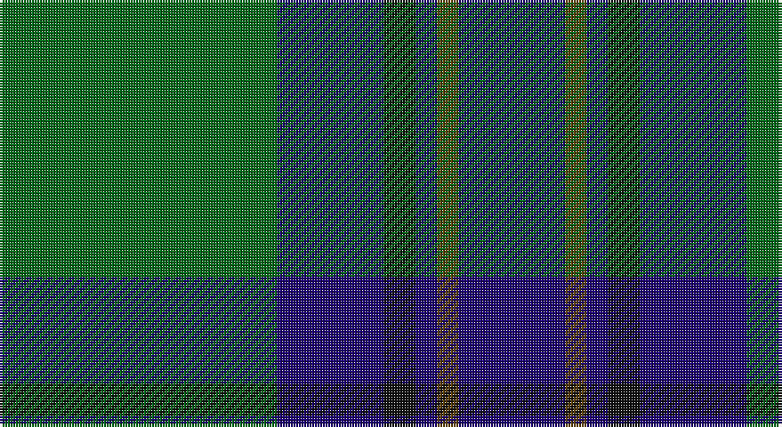

This page is one **sett** — a single exact thread-count. It belongs to the [tartan](/setts/g26db10k3db2dy2db10/)
(the same proportion at any scale), whose colour order is pattern [BGBKBG](/stripes/bgbkbg/).

Part of the [St. Andrews Old Course Hotel](/tartans/st-andrews-old-course-hotel/) tartan — the named design grouping this sett with its other cloths.

Sourced from tartans-authority.  It is a [6 stripe tartan](/stripes/stripes6/).

Original link http://www.tartansauthority.com/tartan-ferret/display/2332/

## Also known as

This cloth is also recorded under:

- St Andrews Old Course Hotel

## Register references

External register numbers recorded for this tartan.

- Scottish Tartans Authority (ITI): 2332

## Thread count
G/104 DB40 K12 DB8 T8 DB/40

One full sett is **280 threads**.

## Palette

Palette: <strong>Tartan Register</strong>
<table><thead><tr><th>Colour</th><th>Threads</th><th>Shade</th><th>Base</th><th>OKLCh</th></tr></thead><tbody><tr><td>G/</td><td style="text-align:right;font-variant-numeric:tabular-nums">104</td><td><code style="background-color:#006818;">#006818</code> <small style="color:#888">#006818</small></td><td>G <code style="background-color:#006100;">#006100</code></td><td><small style="color:#888">oklch(45.0% 0.142 145.0)</small></td></tr><tr><td>DB</td><td style="text-align:right;font-variant-numeric:tabular-nums">40</td><td><code style="background-color:#1C0070;">#1C0070</code> <small style="color:#888">#1C0070</small></td><td>B <code style="background-color:#2A418A;">#2A418A</code></td><td><small style="color:#888">oklch(26.3% 0.162 277.1)</small></td></tr><tr><td>K</td><td style="text-align:right;font-variant-numeric:tabular-nums">12</td><td><code style="background-color:#101010;">#101010</code> <small style="color:#888">#101010</small></td><td>K <code style="background-color:#000000;">#000000</code></td><td><small style="color:#888">oklch(17.3% 0.000 89.9)</small></td></tr><tr><td>DB</td><td style="text-align:right;font-variant-numeric:tabular-nums">8</td><td><code style="background-color:#1C0070;">#1C0070</code> <small style="color:#888">#1C0070</small></td><td>B <code style="background-color:#2A418A;">#2A418A</code></td><td><small style="color:#888">oklch(26.3% 0.162 277.1)</small></td></tr><tr><td>T</td><td style="text-align:right;font-variant-numeric:tabular-nums">8</td><td><code style="background-color:#604000;">#604000</code> <small style="color:#888">#604000</small></td><td>G <code style="background-color:#006100;">#006100</code></td><td><small style="color:#888">oklch(39.8% 0.083 76.8)</small></td></tr><tr><td>DB/</td><td style="text-align:right;font-variant-numeric:tabular-nums">40</td><td><code style="background-color:#1C0070;">#1C0070</code> <small style="color:#888">#1C0070</small></td><td>B <code style="background-color:#2A418A;">#2A418A</code></td><td><small style="color:#888">oklch(26.3% 0.162 277.1)</small></td></tr></tbody></table>

# Sample pattern

## Nearest tartans

The nearest existing variants by ΔTartan distance, with this tartan at the top so the swatches line up against it.

ΔTartan

Tartan

Sett

—

<a href="/ttd/edit/#slug=g26db10k3db2dy2db10~x4">St. Andrews Old Course Hotel (Corp)</a> <a class="nn-out" href="/variants/s6/g26db10k3db2dy2db10~x4/" title="open its dictionary page">↗</a>

0.65

<a href="/ttd/edit/#slug=dg4db12r3db12dg32lr4~x2&amp;base=g26db10k3db2dy2db10~x4">MacIntyre LC</a> <a class="nn-out" href="/variants/s6/dg4db12r3db12dg32lr4~x2/" title="open its dictionary page">↗</a>

0.65

<a href="/ttd/edit/#slug=dg4db12r3db12dg32lr4&amp;base=g26db10k3db2dy2db10~x4">MacIntyre LC</a> <a class="nn-out" href="/variants/s6/dg4db12r3db12dg32lr4/" title="open its dictionary page">↗</a>

0.79

<a href="/ttd/edit/#slug=db24g3db3g3lo2g18r2~x2&amp;base=g26db10k3db2dy2db10~x4">Greenways Marketing Intl (Corporate)</a> <a class="nn-out" href="/variants/s7/db24g3db3g3lo2g18r2~x2/" title="open its dictionary page">↗</a>

0.80

<a href="/ttd/edit/#slug=dg4db12r3db12dg32w4~x2&amp;base=g26db10k3db2dy2db10~x4">MacIntyre</a> <a class="nn-out" href="/variants/s6/dg4db12r3db12dg32w4~x2/" title="open its dictionary page">↗</a>

0.85

<a href="/ttd/edit/#slug=g12lo1db8k1db1~x4&amp;base=g26db10k3db2dy2db10~x4">Rowan (Personal)</a> <a class="nn-out" href="/variants/s5/g12lo1db8k1db1~x4/" title="open its dictionary page">↗</a>

0.89

<a href="/ttd/edit/#slug=dg4db12r3db12dg32lb4&amp;base=g26db10k3db2dy2db10~x4">MacIntyre L</a> <a class="nn-out" href="/variants/s6/dg4db12r3db12dg32lb4/" title="open its dictionary page">↗</a>

0.93

<a href="/variants/s8/g47r3g6db35lo3~x2/">Gracie</a>

0.94

<a href="/ttd/edit/#slug=db5w3db36g38ly5g5~x2&amp;base=g26db10k3db2dy2db10~x4">St. Andrew Society, Sao Paulo (Corp)</a> <a class="nn-out" href="/variants/s6/db5w3db36g38ly5g5~x2/" title="open its dictionary page">↗</a>

0.97

<a href="/ttd/edit/#slug=r2db32g14db5g16w2~x2&amp;base=g26db10k3db2dy2db10~x4">Connacht Irish District Tartan</a> <a class="nn-out" href="/variants/s6/r2db32g14db5g16w2~x2/" title="open its dictionary page">↗</a>

1.00

<a href="/ttd/edit/#slug=db30k10g10lb2g15lb2~x2&amp;base=g26db10k3db2dy2db10~x4">MacRobart (Personal)</a> <a class="nn-out" href="/variants/s6/db30k10g10lb2g15lb2~x2/" title="open its dictionary page">↗</a>

## Neighbour map

Every grey dot is one of 14360 variants placed by the first two principal components of the ΔTartan feature space (44% of its variance). Red is this tartan; blue dots are its nearest — click one to open its page.

<svg viewBox="0 0 640 380" role="img" style="max-width:100%;height:auto;border:1px solid #e0e0e0;border-radius:4px;display:block" xmlns="http://www.w3.org/2000/svg"><image href="/nn/cloud.v1.png" width="640" height="380"/><a href="/variants/s6/dg4db12r3db12dg32lr4~x2/"><circle cx="322.0" cy="229.6" r="4" fill="#3465a4"><title>MacIntyre LC</title></circle></a><a href="/variants/s6/dg4db12r3db12dg32lr4/"><circle cx="322.0" cy="229.6" r="4" fill="#3465a4"><title>MacIntyre LC</title></circle></a><a href="/variants/s7/db24g3db3g3lo2g18r2~x2/"><circle cx="312.1" cy="197.7" r="4" fill="#3465a4"><title>Greenways Marketing Intl (Corporate)</title></circle></a><a href="/variants/s6/dg4db12r3db12dg32w4~x2/"><circle cx="323.0" cy="226.7" r="4" fill="#3465a4"><title>MacIntyre</title></circle></a><a href="/variants/s5/g12lo1db8k1db1~x4/"><circle cx="339.9" cy="226.8" r="4" fill="#3465a4"><title>Rowan (Personal)</title></circle></a><a href="/variants/s6/dg4db12r3db12dg32lb4/"><circle cx="301.0" cy="219.4" r="4" fill="#3465a4"><title>MacIntyre L</title></circle></a><a href="/variants/s8/g47r3g6db35lo3~x2/"><circle cx="326.0" cy="190.4" r="4" fill="#3465a4"><title>Gracie</title></circle></a><a href="/variants/s6/db5w3db36g38ly5g5~x2/"><circle cx="293.6" cy="202.5" r="4" fill="#3465a4"><title>St. Andrew Society, Sao Paulo (Corp)</title></circle></a><a href="/variants/s6/r2db32g14db5g16w2~x2/"><circle cx="323.1" cy="202.9" r="4" fill="#3465a4"><title>Connacht Irish District Tartan</title></circle></a><a href="/variants/s6/db30k10g10lb2g15lb2~x2/"><circle cx="264.1" cy="218.3" r="4" fill="#3465a4"><title>MacRobart (Personal)</title></circle></a><circle cx="315.5" cy="218.3" r="5" fill="#c00000"/></svg>

ID: /variants/s6/g26db10k3db2dy2db10~x4/
