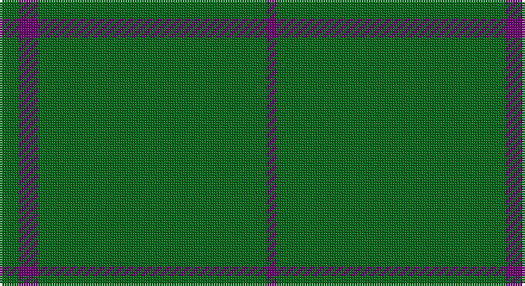

This page is one **sett** — a single exact thread-count. It belongs to the [tartan](/setts/g2dp2g20g2g2dp1/)
(the same proportion at any scale), whose colour order is pattern [BGGGBG](/stripes/bgggbg/).

Part of the [Walters](/tartans/walters/) tartan — the named design grouping this sett with its other cloths.

Sourced from tartans-authority.  It is a [6 stripe tartan](/stripes/stripes6/).

Original link http://www.tartansauthority.com/tartan-ferret/display/4160/

## Register references

External register numbers recorded for this tartan.

- Scottish Tartans Authority (ITI): 4160

## Thread count
G/8 Pa8 G80 G8 G8 P/4

One full sett is **220 threads**.

## Palette

Palette: <strong>Tartan Register</strong>
<table><thead><tr><th>Colour</th><th>Threads</th><th>Shade</th><th>Base</th><th>OKLCh</th></tr></thead><tbody><tr><td>G/</td><td style="text-align:right;font-variant-numeric:tabular-nums">8</td><td><code style="background-color:#006818;">#006818</code> <small style="color:#888">#006818</small></td><td>G <code style="background-color:#006100;">#006100</code></td><td><small style="color:#888">oklch(45.0% 0.142 145.0)</small></td></tr><tr><td>Pa</td><td style="text-align:right;font-variant-numeric:tabular-nums">8</td><td><code style="background-color:#6C0070;">#6C0070</code> <small style="color:#888">#6C0070</small></td><td>B <code style="background-color:#2A418A;">#2A418A</code></td><td><small style="color:#888">oklch(37.6% 0.174 326.5)</small></td></tr><tr><td>G</td><td style="text-align:right;font-variant-numeric:tabular-nums">80</td><td><code style="background-color:#006818;">#006818</code> <small style="color:#888">#006818</small></td><td>G <code style="background-color:#006100;">#006100</code></td><td><small style="color:#888">oklch(45.0% 0.142 145.0)</small></td></tr><tr><td>G</td><td style="text-align:right;font-variant-numeric:tabular-nums">8</td><td><code style="background-color:#006818;">#006818</code> <small style="color:#888">#006818</small></td><td>G <code style="background-color:#006100;">#006100</code></td><td><small style="color:#888">oklch(45.0% 0.142 145.0)</small></td></tr><tr><td>G</td><td style="text-align:right;font-variant-numeric:tabular-nums">8</td><td><code style="background-color:#006818;">#006818</code> <small style="color:#888">#006818</small></td><td>G <code style="background-color:#006100;">#006100</code></td><td><small style="color:#888">oklch(45.0% 0.142 145.0)</small></td></tr><tr><td>P/</td><td style="text-align:right;font-variant-numeric:tabular-nums">4</td><td><code style="background-color:#6C0070;">#6C0070</code> <small style="color:#888">#6C0070</small></td><td>B <code style="background-color:#2A418A;">#2A418A</code></td><td><small style="color:#888">oklch(37.6% 0.174 326.5)</small></td></tr></tbody></table>

# Sample pattern

## Compared to the master

This cloth is one sett of its design; the master sett (the exemplar the design is anchored on) is below for comparison.

<figure style="margin:0"><figcaption style="color:#888;font-size:smaller">this sett</figcaption></figure>
<figure style="margin:0"><figcaption style="color:#888;font-size:smaller"><a href="/setts/gi2dp2gi20gi2gi2g1/">master sett →</a></figcaption></figure>

## Nearest tartans

The nearest existing variants by ΔTartan distance, with this tartan at the top so the swatches line up against it.

ΔTartan

Tartan

Sett

—

<a href="/ttd/edit/#slug=g2dp2g20g2g2dp1~x4">Walters (Personal)</a> <a class="nn-out" href="/variants/s6/g2dp2g20g2g2dp1~x4/" title="open its dictionary page">↗</a>

1.25

<a href="/variants/s10/gi2dp2gi20gi2gi2g1~x4/">Walters (Personal)</a>

1.32

<a href="/ttd/edit/#slug=dg62r7k4r4dg62~x2&amp;base=g2dp2g20g2g2dp1~x4">MacNab, Ancient</a> <a class="nn-out" href="/variants/s5/dg62r7k4r4dg62~x2/" title="open its dictionary page">↗</a>

1.53

<a href="/ttd/edit/#slug=k2g2g19g2g2g19r2~x2&amp;base=g2dp2g20g2g2dp1~x4">Kenmore Hunting (Fashion)</a> <a class="nn-out" href="/variants/s7/k2g2g19g2g2g19r2~x2/" title="open its dictionary page">↗</a>

1.78

<a href="/ttd/edit/#slug=r2g19g2g2g19g2lo2~x2&amp;base=g2dp2g20g2g2dp1~x4">Kenmore Hunting</a> <a class="nn-out" href="/variants/s7/r2g19g2g2g19g2lo2~x2/" title="open its dictionary page">↗</a>

1.83

<a href="/ttd/edit/#slug=dg100loi4dg2lo3ly6~x2&amp;base=g2dp2g20g2g2dp1~x4">Lagrande</a> <a class="nn-out" href="/variants/s5/dg100loi4dg2lo3ly6~x2/" title="open its dictionary page">↗</a>

1.84

<a href="/ttd/edit/#slug=g3db2g40db1g2db1g9r4g3r2~x4&amp;base=g2dp2g20g2g2dp1~x4">Braveheart Htg (Fashion)</a> <a class="nn-out" href="/variants/s10/g3db2g40db1g2db1g9r4g3r2~x4/" title="open its dictionary page">↗</a>

1.95

<a href="/ttd/edit/#slug=dg30r2dg8r1dg5w2&amp;base=g2dp2g20g2g2dp1~x4">Dewi Sant</a> <a class="nn-out" href="/variants/s6/dg30r2dg8r1dg5w2/" title="open its dictionary page">↗</a>

2.14

<a href="/ttd/edit/#slug=g2o2g15o1w1g15o2g2~x2&amp;base=g2dp2g20g2g2dp1~x4">Bannockbane, hunting</a> <a class="nn-out" href="/variants/s8/g2o2g15o1w1g15o2g2~x2/" title="open its dictionary page">↗</a>

2.21

<a href="/ttd/edit/#slug=r2k3g45k3ly2&amp;base=g2dp2g20g2g2dp1~x4">Mar Tribe</a> <a class="nn-out" href="/variants/s5/r2k3g45k3ly2/" title="open its dictionary page">↗</a>

2.23

<a href="/variants/s8/r8g3r4g44w4~x2/">Welsh National</a>

## Neighbour map

Every grey dot is one of 14360 variants placed by the first two principal components of the ΔTartan feature space (44% of its variance). Red is this tartan; blue dots are its nearest — click one to open its page.

<svg viewBox="0 0 640 380" role="img" style="max-width:100%;height:auto;border:1px solid #e0e0e0;border-radius:4px;display:block" xmlns="http://www.w3.org/2000/svg"><image href="/nn/cloud.v1.png" width="640" height="380"/><a href="/variants/s10/gi2dp2gi20gi2gi2g1~x4/"><circle cx="626.0" cy="218.8" r="4" fill="#3465a4"><title>Walters (Personal)</title></circle></a><a href="/variants/s5/dg62r7k4r4dg62~x2/"><circle cx="626.0" cy="264.5" r="4" fill="#3465a4"><title>MacNab, Ancient</title></circle></a><a href="/variants/s7/k2g2g19g2g2g19r2~x2/"><circle cx="626.0" cy="256.8" r="4" fill="#3465a4"><title>Kenmore Hunting (Fashion)</title></circle></a><a href="/variants/s7/r2g19g2g2g19g2lo2~x2/"><circle cx="626.0" cy="276.2" r="4" fill="#3465a4"><title>Kenmore Hunting</title></circle></a><a href="/variants/s5/dg100loi4dg2lo3ly6~x2/"><circle cx="626.0" cy="170.3" r="4" fill="#3465a4"><title>Lagrande</title></circle></a><a href="/variants/s10/g3db2g40db1g2db1g9r4g3r2~x4/"><circle cx="626.0" cy="170.8" r="4" fill="#3465a4"><title>Braveheart Htg (Fashion)</title></circle></a><a href="/variants/s6/dg30r2dg8r1dg5w2/"><circle cx="626.0" cy="202.3" r="4" fill="#3465a4"><title>Dewi Sant</title></circle></a><a href="/variants/s8/g2o2g15o1w1g15o2g2~x2/"><circle cx="626.0" cy="248.8" r="4" fill="#3465a4"><title>Bannockbane, hunting</title></circle></a><a href="/variants/s5/r2k3g45k3ly2/"><circle cx="588.3" cy="184.8" r="4" fill="#3465a4"><title>Mar Tribe</title></circle></a><a href="/variants/s8/r8g3r4g44w4~x2/"><circle cx="575.0" cy="207.6" r="4" fill="#3465a4"><title>Welsh National</title></circle></a><circle cx="626.0" cy="226.0" r="5" fill="#c00000"/></svg>

ID: /variants/s6/g2dp2g20g2g2dp1~x4/
