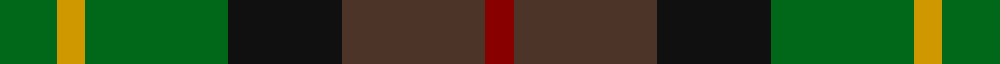
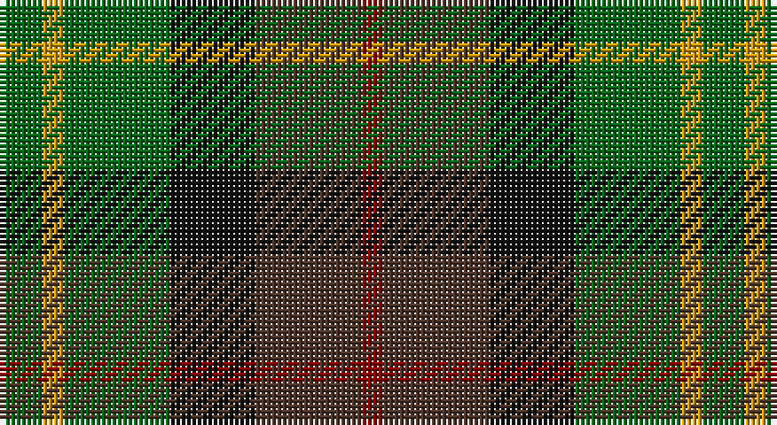

This page is one **sett** — a single exact thread-count. It belongs to the [tartan](/setts/g2lo1g5k4do5r1/)
(the same proportion at any scale), whose colour order is pattern [GYGKBR](/stripes/gygkbr/).

Sourced from register-of-tartans.  It is a [6 stripe tartan](/stripes/stripes6/).

Original link https://www.tartanregister.gov.uk/tartanDetails.aspx?ref=1231

## Register references

External register numbers recorded for this tartan.

- Scottish Register of Tartans: [1231](https://www.tartanregister.gov.uk/tartanDetails.aspx?ref=1231)
- Scottish Tartans Authority (ITI): 4891

## Thread count
G/8 DY4 G20 K16 T20 DR/4

One full sett is **132 threads**.

## Palette

Palette: <strong>Tartan Register</strong> <small style="color:#888">(4 of 5 colours)</small>
<table><thead><tr><th>Colour</th><th>Threads</th><th>Shade</th><th>Base</th><th>OKLCh</th></tr></thead><tbody><tr><td>G/</td><td style="text-align:right;font-variant-numeric:tabular-nums">8</td><td><code style="background-color:#006818;">#006818</code> <small style="color:#888">#006818</small></td><td>G <code style="background-color:#006100;">#006100</code></td><td><small style="color:#888">oklch(45.0% 0.142 145.0)</small></td></tr><tr><td>DY</td><td style="text-align:right;font-variant-numeric:tabular-nums">4</td><td><code style="background-color:#D09800;">#D09800</code> <small style="color:#888">#D09800</small></td><td>Y <code style="background-color:#F2BF00;">#F2BF00</code></td><td><small style="color:#888">oklch(71.4% 0.147 82.1)</small></td></tr><tr><td>G</td><td style="text-align:right;font-variant-numeric:tabular-nums">20</td><td><code style="background-color:#006818;">#006818</code> <small style="color:#888">#006818</small></td><td>G <code style="background-color:#006100;">#006100</code></td><td><small style="color:#888">oklch(45.0% 0.142 145.0)</small></td></tr><tr><td>K</td><td style="text-align:right;font-variant-numeric:tabular-nums">16</td><td><code style="background-color:#101010;">#101010</code> <small style="color:#888">#101010</small></td><td>K <code style="background-color:#000000;">#000000</code></td><td><small style="color:#888">oklch(17.3% 0.000 89.9)</small></td></tr><tr><td>T</td><td style="text-align:right;font-variant-numeric:tabular-nums">20</td><td><code style="background-color:#4C3428;">#4C3428</code> <small style="color:#888">#4C3428</small></td><td>B <code style="background-color:#2A418A;">#2A418A</code></td><td><small style="color:#888">oklch(34.9% 0.040 47.5)</small></td></tr><tr><td>DR/</td><td style="text-align:right;font-variant-numeric:tabular-nums">4</td><td><code style="background-color:#880000;">#880000</code> <small style="color:#888">#880000</small></td><td>R <code style="background-color:#CC0000;">#CC0000</code></td><td><small style="color:#888">oklch(39.4% 0.162 29.2)</small></td></tr></tbody></table>

# Sample pattern

## Nearest tartans

The nearest existing variants by ΔTartan distance, with this tartan at the top so the swatches line up against it.

ΔTartan

Tartan

Sett

—

<a href="/ttd/edit/#slug=g2lo1g5k4do5r1~x4">Forres</a> <a class="nn-out" href="/variants/s6/g2lo1g5k4do5r1~x4/" title="open its dictionary page">↗</a>

0.95

<a href="/ttd/edit/#slug=r1dy7g7k7b7dy7r1~x4&amp;base=g2lo1g5k4do5r1~x4">Tennant (Clan)</a> <a class="nn-out" href="/variants/s7/r1dy7g7k7b7dy7r1~x4/" title="open its dictionary page">↗</a>

1.16

<a href="/ttd/edit/#slug=r1dy7db7k7g7dy7r1~x4&amp;base=g2lo1g5k4do5r1~x4">Tennant Family Tartan</a> <a class="nn-out" href="/variants/s7/r1dy7db7k7g7dy7r1~x4/" title="open its dictionary page">↗</a>

1.20

<a href="/ttd/edit/#slug=r4g11k11g2n11y3~x4&amp;base=g2lo1g5k4do5r1~x4">Casely</a> <a class="nn-out" href="/variants/s6/r4g11k11g2n11y3~x4/" title="open its dictionary page">↗</a>

1.24

<a href="/ttd/edit/#slug=db14g18k3g18r20k14lo3~x2&amp;base=g2lo1g5k4do5r1~x4">Scottish Parliament (unofficial)</a> <a class="nn-out" href="/variants/s7/db14g18k3g18r20k14lo3~x2/" title="open its dictionary page">↗</a>

1.29

<a href="/ttd/edit/#slug=dg24k4dg24k24t7r24t7~x2&amp;base=g2lo1g5k4do5r1~x4">Unidentified Pinafore</a> <a class="nn-out" href="/variants/s7/dg24k4dg24k24t7r24t7~x2/" title="open its dictionary page">↗</a>

1.31

<a href="/ttd/edit/#slug=k4g16k14lo3n16r4~x2&amp;base=g2lo1g5k4do5r1~x4">Birse</a> <a class="nn-out" href="/variants/s6/k4g16k14lo3n16r4~x2/" title="open its dictionary page">↗</a>

1.38

<a href="/ttd/edit/#slug=g8n19dg29o16r4~x2&amp;base=g2lo1g5k4do5r1~x4">Styrian (Fashion)</a> <a class="nn-out" href="/variants/s5/g8n19dg29o16r4~x2/" title="open its dictionary page">↗</a>

1.40

<a href="/ttd/edit/#slug=db8g11k3g11r12dt10ly2~x2&amp;base=g2lo1g5k4do5r1~x4">Parliament Trade Tartan</a> <a class="nn-out" href="/variants/s7/db8g11k3g11r12dt10ly2~x2/" title="open its dictionary page">↗</a>

1.40

<a href="/ttd/edit/#slug=g14dt11y3k5y3dt11g14ly2~x2&amp;base=g2lo1g5k4do5r1~x4">Wilson's No.122</a> <a class="nn-out" href="/variants/s8/g14dt11y3k5y3dt11g14ly2~x2/" title="open its dictionary page">↗</a>

1.43

<a href="/ttd/edit/#slug=n4g18n3k17n18p4~x2&amp;base=g2lo1g5k4do5r1~x4">Scottish Airports</a> <a class="nn-out" href="/variants/s6/n4g18n3k17n18p4~x2/" title="open its dictionary page">↗</a>

## Neighbour map

Every grey dot is one of 14360 variants placed by the first two principal components of the ΔTartan feature space (44% of its variance). Red is this tartan; blue dots are its nearest — click one to open its page.

<svg viewBox="0 0 640 380" role="img" style="max-width:100%;height:auto;border:1px solid #e0e0e0;border-radius:4px;display:block" xmlns="http://www.w3.org/2000/svg"><image href="/nn/cloud.v1.png" width="640" height="380"/><a href="/variants/s7/r1dy7g7k7b7dy7r1~x4/"><circle cx="151.6" cy="254.5" r="4" fill="#3465a4"><title>Tennant (Clan)</title></circle></a><a href="/variants/s7/r1dy7db7k7g7dy7r1~x4/"><circle cx="167.7" cy="262.2" r="4" fill="#3465a4"><title>Tennant Family Tartan</title></circle></a><a href="/variants/s6/r4g11k11g2n11y3~x4/"><circle cx="133.1" cy="264.8" r="4" fill="#3465a4"><title>Casely</title></circle></a><a href="/variants/s7/db14g18k3g18r20k14lo3~x2/"><circle cx="143.2" cy="247.0" r="4" fill="#3465a4"><title>Scottish Parliament (unofficial)</title></circle></a><a href="/variants/s7/dg24k4dg24k24t7r24t7~x2/"><circle cx="192.4" cy="269.9" r="4" fill="#3465a4"><title>Unidentified Pinafore</title></circle></a><a href="/variants/s6/k4g16k14lo3n16r4~x2/"><circle cx="127.3" cy="255.8" r="4" fill="#3465a4"><title>Birse</title></circle></a><a href="/variants/s5/g8n19dg29o16r4~x2/"><circle cx="194.9" cy="274.2" r="4" fill="#3465a4"><title>Styrian (Fashion)</title></circle></a><a href="/variants/s7/db8g11k3g11r12dt10ly2~x2/"><circle cx="115.4" cy="248.3" r="4" fill="#3465a4"><title>Parliament Trade Tartan</title></circle></a><a href="/variants/s8/g14dt11y3k5y3dt11g14ly2~x2/"><circle cx="200.1" cy="242.9" r="4" fill="#3465a4"><title>Wilson's No.122</title></circle></a><a href="/variants/s6/n4g18n3k17n18p4~x2/"><circle cx="211.5" cy="276.1" r="4" fill="#3465a4"><title>Scottish Airports</title></circle></a><circle cx="166.5" cy="269.7" r="5" fill="#c00000"/></svg>

ID: /variants/s6/g2lo1g5k4do5r1~x4/
