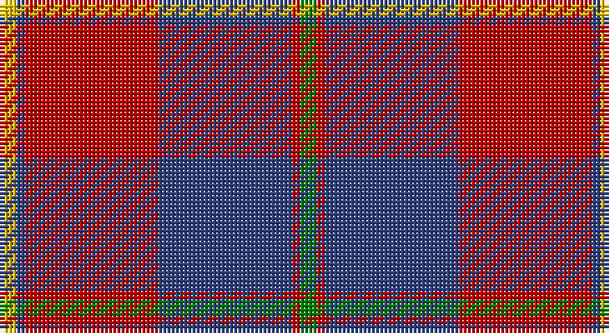

This page is one **sett** — a single exact thread-count. It belongs to the [tartan](/setts/g2r1db16r16db1ly2/)
(the same proportion at any scale), whose colour order is pattern [GRBRBY](/stripes/grbrby/).

Sourced from weddslist.  It is a [6 stripe tartan](/stripes/stripes6/).

Original link http://www.weddslist.com/cgi-bin/tartans/pg.pl?source=sts

## Provenance

Earliest known date: 1950 This sett is taken from a sample in MacGregor-Hastie Collection at the Scottish Tartans Museum. It is the more usual form of the dress version.

2 attestations — the source records this cloth was collapsed from (oldest owns this page)

<ul>
<li>undated — Galloway dress (weddslist, <a href="http://www.weddslist.com/cgi-bin/tartans/pg.pl?source=sts">record</a>)</li>
<li>undated — Galloway Dress District Tartan (house-of-tartan, <a href="http://www.house-of-tartan.scotland.net/house/TartanViewjs.asp?colr=Def&tnam=850">record</a>)</li>
</ul>

## Thread count
Y/4 B2 R32 B32 R2 G/4

One full sett is **144 threads**.

## Palette

Palette: <strong>custom</strong>
<table><thead><tr><th>Colour</th><th>Threads</th><th>Shade</th><th>Base</th><th>OKLCh</th></tr></thead><tbody><tr><td>Y/</td><td style="text-align:right;font-variant-numeric:tabular-nums">4</td><td><code style="background-color:#F0C000;">#F0C000</code> <small style="color:#888">#F0C000</small></td><td>Y <code style="background-color:#F2BF00;">#F2BF00</code></td><td><small style="color:#888">oklch(82.7% 0.169 90.5)</small></td></tr><tr><td>B</td><td style="text-align:right;font-variant-numeric:tabular-nums">2</td><td><code style="background-color:#304080;">#304080</code> <small style="color:#888">#304080</small></td><td>B <code style="background-color:#2A418A;">#2A418A</code></td><td><small style="color:#888">oklch(39.4% 0.109 270.2)</small></td></tr><tr><td>R</td><td style="text-align:right;font-variant-numeric:tabular-nums">32</td><td><code style="background-color:#C00000;">#C00000</code> <small style="color:#888">#C00000</small></td><td>R <code style="background-color:#CC0000;">#CC0000</code></td><td><small style="color:#888">oklch(50.7% 0.208 29.2)</small></td></tr><tr><td>B</td><td style="text-align:right;font-variant-numeric:tabular-nums">32</td><td><code style="background-color:#304080;">#304080</code> <small style="color:#888">#304080</small></td><td>B <code style="background-color:#2A418A;">#2A418A</code></td><td><small style="color:#888">oklch(39.4% 0.109 270.2)</small></td></tr><tr><td>R</td><td style="text-align:right;font-variant-numeric:tabular-nums">2</td><td><code style="background-color:#C00000;">#C00000</code> <small style="color:#888">#C00000</small></td><td>R <code style="background-color:#CC0000;">#CC0000</code></td><td><small style="color:#888">oklch(50.7% 0.208 29.2)</small></td></tr><tr><td>G/</td><td style="text-align:right;font-variant-numeric:tabular-nums">4</td><td><code style="background-color:#008000;">#008000</code> <small style="color:#888">#008000</small></td><td>G <code style="background-color:#006100;">#006100</code></td><td><small style="color:#888">oklch(52.0% 0.177 142.5)</small></td></tr></tbody></table>

# Sample pattern

## Nearest tartans

The nearest existing variants by ΔTartan distance, with this tartan at the top so the swatches line up against it.

ΔTartan

Tartan

Sett

—

<a href="/ttd/edit/#slug=g2r1db16r16db1ly2~x2">Galloway dress</a> <a class="nn-out" href="/variants/s6/g2r1db16r16db1ly2~x2/" title="open its dictionary page">↗</a>

0.53

<a href="/ttd/edit/#slug=dg2r1db16r16db1ly2~x2&amp;base=g2r1db16r16db1ly2~x2">Galloway Dress (Yellow Line)</a> <a class="nn-out" href="/variants/s6/dg2r1db16r16db1ly2~x2/" title="open its dictionary page">↗</a>

0.62

<a href="/ttd/edit/#slug=g1r1db16r16db1w1~x2&amp;base=g2r1db16r16db1ly2~x2">Galloway, dress</a> <a class="nn-out" href="/variants/s6/g1r1db16r16db1w1~x2/" title="open its dictionary page">↗</a>

0.72

<a href="/ttd/edit/#slug=k1r7k1r7db16g1~x2&amp;base=g2r1db16r16db1ly2~x2">Robinson, dress</a> <a class="nn-out" href="/variants/s6/k1r7k1r7db16g1~x2/" title="open its dictionary page">↗</a>

0.93

<a href="/ttd/edit/#slug=k1r7k1r7db16g1~x4&amp;base=g2r1db16r16db1ly2~x2">Robinson Dress (Pendleton) #1</a> <a class="nn-out" href="/variants/s6/k1r7k1r7db16g1~x4/" title="open its dictionary page">↗</a>

1.02

<a href="/ttd/edit/#slug=g3r2db22r22db2w3~x2&amp;base=g2r1db16r16db1ly2~x2">Galloway Red</a> <a class="nn-out" href="/variants/s6/g3r2db22r22db2w3~x2/" title="open its dictionary page">↗</a>

1.13

<a href="/ttd/edit/#slug=db1r16db6ly4db6w1~x4&amp;base=g2r1db16r16db1ly2~x2">Superfast Ferries (Corporate)</a> <a class="nn-out" href="/variants/s6/db1r16db6ly4db6w1~x4/" title="open its dictionary page">↗</a>

1.19

<a href="/ttd/edit/#slug=db2r2db28k11r27w2r2~x2&amp;base=g2r1db16r16db1ly2~x2">Americana - 1978 #2 (Fashion)</a> <a class="nn-out" href="/variants/s7/db2r2db28k11r27w2r2~x2/" title="open its dictionary page">↗</a>

1.19

<a href="/ttd/edit/#slug=r28db12r3dg20t2dg2r7~x2&amp;base=g2r1db16r16db1ly2~x2">Carrick (Strathmore) District Tartan</a> <a class="nn-out" href="/variants/s7/r28db12r3dg20t2dg2r7~x2/" title="open its dictionary page">↗</a>

1.21

<a href="/ttd/edit/#slug=r2db12r2g12r24w1~x2&amp;base=g2r1db16r16db1ly2~x2">Fraser (1745)</a> <a class="nn-out" href="/variants/s6/r2db12r2g12r24w1~x2/" title="open its dictionary page">↗</a>

1.22

<a href="/ttd/edit/#slug=r1db6r1dg6r12w1~x2&amp;base=g2r1db16r16db1ly2~x2">Fraser Red Clan Tartan</a> <a class="nn-out" href="/variants/s6/r1db6r1dg6r12w1~x2/" title="open its dictionary page">↗</a>

## Neighbour map

Every grey dot is one of 14360 variants placed by the first two principal components of the ΔTartan feature space (44% of its variance). Red is this tartan; blue dots are its nearest — click one to open its page.

<svg viewBox="0 0 640 380" role="img" style="max-width:100%;height:auto;border:1px solid #e0e0e0;border-radius:4px;display:block" xmlns="http://www.w3.org/2000/svg"><image href="/nn/cloud.v1.png" width="640" height="380"/><a href="/variants/s6/dg2r1db16r16db1ly2~x2/"><circle cx="307.5" cy="167.7" r="4" fill="#3465a4"><title>Galloway Dress (Yellow Line)</title></circle></a><a href="/variants/s6/g1r1db16r16db1w1~x2/"><circle cx="352.7" cy="171.0" r="4" fill="#3465a4"><title>Galloway, dress</title></circle></a><a href="/variants/s6/k1r7k1r7db16g1~x2/"><circle cx="324.1" cy="182.0" r="4" fill="#3465a4"><title>Robinson, dress</title></circle></a><a href="/variants/s6/k1r7k1r7db16g1~x4/"><circle cx="328.3" cy="182.9" r="4" fill="#3465a4"><title>Robinson Dress (Pendleton) #1</title></circle></a><a href="/variants/s6/g3r2db22r22db2w3~x2/"><circle cx="276.5" cy="179.6" r="4" fill="#3465a4"><title>Galloway Red</title></circle></a><a href="/variants/s6/db1r16db6ly4db6w1~x4/"><circle cx="278.6" cy="169.1" r="4" fill="#3465a4"><title>Superfast Ferries (Corporate)</title></circle></a><a href="/variants/s7/db2r2db28k11r27w2r2~x2/"><circle cx="269.8" cy="168.9" r="4" fill="#3465a4"><title>Americana - 1978 #2 (Fashion)</title></circle></a><a href="/variants/s7/r28db12r3dg20t2dg2r7~x2/"><circle cx="308.1" cy="185.9" r="4" fill="#3465a4"><title>Carrick (Strathmore) District Tartan</title></circle></a><a href="/variants/s6/r2db12r2g12r24w1~x2/"><circle cx="332.4" cy="163.8" r="4" fill="#3465a4"><title>Fraser (1745)</title></circle></a><a href="/variants/s6/r1db6r1dg6r12w1~x2/"><circle cx="292.6" cy="189.0" r="4" fill="#3465a4"><title>Fraser Red Clan Tartan</title></circle></a><circle cx="315.8" cy="172.7" r="5" fill="#c00000"/></svg>

ID: /variants/s6/g2r1db16r16db1ly2~x2/
