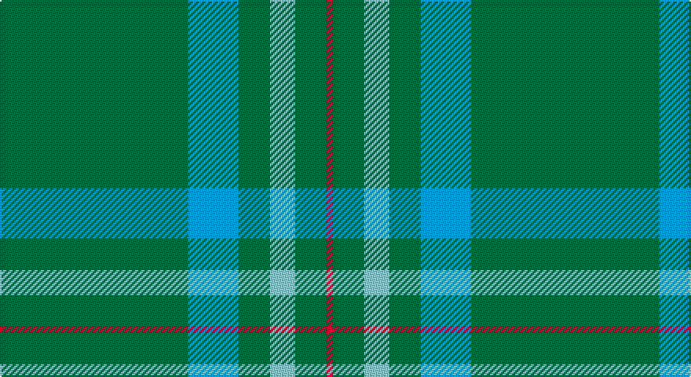

This page is one **sett** — a single exact thread-count. It belongs to the [tartan](/setts/g30b8g5lb4g5r1/)
(the same proportion at any scale), whose colour order is pattern [GBGWGR](/stripes/gbgwgr/).

Part of the [Annapolis Valley](/tartans/annapolis-valley/) tartan — the named design grouping this sett with its other cloths.

Sourced from register-of-tartans.  It is a [6 stripe tartan](/stripes/stripes6/).

Original link https://www.tartanregister.gov.uk/tartanDetails.aspx?ref=11065

## Register references

External register numbers recorded for this tartan.

- Scottish Register of Tartans: [11065](https://www.tartanregister.gov.uk/tartanDetails.aspx?ref=11065)

## Thread count
G/120 B32 G20 LB16 G20 R/4

One full sett is **300 threads**.

## Palette

Palette: <strong>Tartan Register</strong>
<table><thead><tr><th>Colour</th><th>Threads</th><th>Shade</th><th>Base</th><th>OKLCh</th></tr></thead><tbody><tr><td>G/</td><td style="text-align:right;font-variant-numeric:tabular-nums">120</td><td><code style="background-color:#00643C;">#00643C</code> <small style="color:#888">#00643C</small></td><td>G <code style="background-color:#006100;">#006100</code></td><td><small style="color:#888">oklch(44.3% 0.104 157.7)</small></td></tr><tr><td>B</td><td style="text-align:right;font-variant-numeric:tabular-nums">32</td><td><code style="background-color:#0596FA;">#0596FA</code> <small style="color:#888">#0596FA</small></td><td>B <code style="background-color:#2A418A;">#2A418A</code></td><td><small style="color:#888">oklch(66.0% 0.180 248.9)</small></td></tr><tr><td>G</td><td style="text-align:right;font-variant-numeric:tabular-nums">20</td><td><code style="background-color:#00643C;">#00643C</code> <small style="color:#888">#00643C</small></td><td>G <code style="background-color:#006100;">#006100</code></td><td><small style="color:#888">oklch(44.3% 0.104 157.7)</small></td></tr><tr><td>LB</td><td style="text-align:right;font-variant-numeric:tabular-nums">16</td><td><code style="background-color:#98C8E8;">#98C8E8</code> <small style="color:#888">#98C8E8</small></td><td>W <code style="background-color:#F7F7F7;">#F7F7F7</code></td><td><small style="color:#888">oklch(81.0% 0.068 237.9)</small></td></tr><tr><td>G</td><td style="text-align:right;font-variant-numeric:tabular-nums">20</td><td><code style="background-color:#00643C;">#00643C</code> <small style="color:#888">#00643C</small></td><td>G <code style="background-color:#006100;">#006100</code></td><td><small style="color:#888">oklch(44.3% 0.104 157.7)</small></td></tr><tr><td>R/</td><td style="text-align:right;font-variant-numeric:tabular-nums">4</td><td><code style="background-color:#C8002C;">#C8002C</code> <small style="color:#888">#C8002C</small></td><td>R <code style="background-color:#CC0000;">#CC0000</code></td><td><small style="color:#888">oklch(52.6% 0.212 22.0)</small></td></tr></tbody></table>

# Sample pattern

## Nearest tartans

The nearest existing variants by ΔTartan distance, with this tartan at the top so the swatches line up against it.

ΔTartan

Tartan

Sett

—

<a href="/ttd/edit/#slug=g30b8g5lb4g5r1~x4">Annapolis Valley</a> <a class="nn-out" href="/variants/s6/g30b8g5lb4g5r1~x4/" title="open its dictionary page">↗</a>

1.42

<a href="/ttd/edit/#slug=g30t8g5lb4g5r2~x4&amp;base=g30b8g5lb4g5r1~x4">Annapolis Valley</a> <a class="nn-out" href="/variants/s6/g30t8g5lb4g5r2~x4/" title="open its dictionary page">↗</a>

1.48

<a href="/ttd/edit/#slug=g44db11g5t3g4db8g4w1~x2&amp;base=g30b8g5lb4g5r1~x4">Hastings-Stephenson (Personal)</a> <a class="nn-out" href="/variants/s8/g44db11g5t3g4db8g4w1~x2/" title="open its dictionary page">↗</a>

1.66

<a href="/ttd/edit/#slug=g44db9r2db9g2~x2&amp;base=g30b8g5lb4g5r1~x4">Tyrconnell (Personal)</a> <a class="nn-out" href="/variants/s5/g44db9r2db9g2~x2/" title="open its dictionary page">↗</a>

1.77

<a href="/ttd/edit/#slug=r4dp12g2dp2g46w1~x2&amp;base=g30b8g5lb4g5r1~x4">Kinfauns Castle (Corporate)</a> <a class="nn-out" href="/variants/s6/r4dp12g2dp2g46w1~x2/" title="open its dictionary page">↗</a>

1.83

<a href="/ttd/edit/#slug=gi16dg1lg4dg41lg1dg6g2dg2~x2&amp;base=g30b8g5lb4g5r1~x4">Semper</a> <a class="nn-out" href="/variants/s8/gi16dg1lg4dg41lg1dg6g2dg2~x2/" title="open its dictionary page">↗</a>

1.85

<a href="/ttd/edit/#slug=g40ly2db3r4db3ly2g40w3~x2&amp;base=g30b8g5lb4g5r1~x4">Asher (Personal)</a> <a class="nn-out" href="/variants/s8/g40ly2db3r4db3ly2g40w3~x2/" title="open its dictionary page">↗</a>

1.85

<a href="/ttd/edit/#slug=g50db20k3db2o2db5~x2&amp;base=g30b8g5lb4g5r1~x4">St Andrews Hotel, Golf Resort, and SPA</a> <a class="nn-out" href="/variants/s6/g50db20k3db2o2db5~x2/" title="open its dictionary page">↗</a>

1.88

<a href="/ttd/edit/#slug=r2dg24k2dg12lo6k1r2~x2&amp;base=g30b8g5lb4g5r1~x4">Inman (2016)</a> <a class="nn-out" href="/variants/s7/r2dg24k2dg12lo6k1r2~x2/" title="open its dictionary page">↗</a>

1.91

<a href="/ttd/edit/#slug=r3g22db16g14r2g6ly1~x2&amp;base=g30b8g5lb4g5r1~x4">Scottish Scouts</a> <a class="nn-out" href="/variants/s7/r3g22db16g14r2g6ly1~x2/" title="open its dictionary page">↗</a>

1.97

<a href="/ttd/edit/#slug=db40g8k1ly2k1g8db5~x4&amp;base=g30b8g5lb4g5r1~x4">Salvation Army, Hunting</a> <a class="nn-out" href="/variants/s7/db40g8k1ly2k1g8db5~x4/" title="open its dictionary page">↗</a>

## Neighbour map

Every grey dot is one of 14360 variants placed by the first two principal components of the ΔTartan feature space (44% of its variance). Red is this tartan; blue dots are its nearest — click one to open its page.

<svg viewBox="0 0 640 380" role="img" style="max-width:100%;height:auto;border:1px solid #e0e0e0;border-radius:4px;display:block" xmlns="http://www.w3.org/2000/svg"><image href="/nn/cloud.v1.png" width="640" height="380"/><a href="/variants/s6/g30t8g5lb4g5r2~x4/"><circle cx="477.5" cy="213.2" r="4" fill="#3465a4"><title>Annapolis Valley</title></circle></a><a href="/variants/s8/g44db11g5t3g4db8g4w1~x2/"><circle cx="501.6" cy="146.5" r="4" fill="#3465a4"><title>Hastings-Stephenson (Personal)</title></circle></a><a href="/variants/s5/g44db9r2db9g2~x2/"><circle cx="512.3" cy="221.4" r="4" fill="#3465a4"><title>Tyrconnell (Personal)</title></circle></a><a href="/variants/s6/r4dp12g2dp2g46w1~x2/"><circle cx="517.4" cy="140.8" r="4" fill="#3465a4"><title>Kinfauns Castle (Corporate)</title></circle></a><a href="/variants/s8/gi16dg1lg4dg41lg1dg6g2dg2~x2/"><circle cx="503.0" cy="153.0" r="4" fill="#3465a4"><title>Semper</title></circle></a><a href="/variants/s8/g40ly2db3r4db3ly2g40w3~x2/"><circle cx="540.3" cy="156.6" r="4" fill="#3465a4"><title>Asher (Personal)</title></circle></a><a href="/variants/s6/g50db20k3db2o2db5~x2/"><circle cx="416.1" cy="173.6" r="4" fill="#3465a4"><title>St Andrews Hotel, Golf Resort, and SPA</title></circle></a><a href="/variants/s7/r2dg24k2dg12lo6k1r2~x2/"><circle cx="471.7" cy="171.9" r="4" fill="#3465a4"><title>Inman (2016)</title></circle></a><a href="/variants/s7/r3g22db16g14r2g6ly1~x2/"><circle cx="407.9" cy="202.5" r="4" fill="#3465a4"><title>Scottish Scouts</title></circle></a><a href="/variants/s7/db40g8k1ly2k1g8db5~x4/"><circle cx="486.5" cy="143.3" r="4" fill="#3465a4"><title>Salvation Army, Hunting</title></circle></a><circle cx="510.4" cy="183.7" r="5" fill="#c00000"/></svg>

ID: /variants/s6/g30b8g5lb4g5r1~x4/
