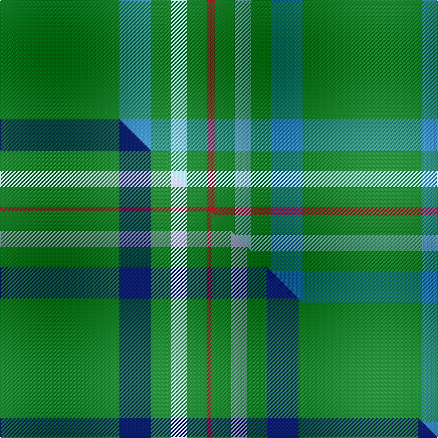

This is one **variant** — a specific cloth: this exact thread count and colourway, with its own
provenance below. It is one weaving of the [sett](/tartans/a/an/annapolis-valley/) (the scale-free proportion — the
same cloth at any scale or shade), whose colour order is pattern [GBGWGR](/stripes/gbgwgr/).

Part of the [Annapolis Valley](/tartans/a/an/annapolis-valley/) tartan — the named design grouping this sett with its other cloths.

Sourced from tartans-authority.  It is a [6 stripe tartan](/stripes/stripes6/).

Original link <code>http://www.tartansauthority.com/tartan-ferret/display/11065/</code> — retired · [Internet Archive copy](https://web.archive.org/web/*/http://www.tartansauthority.com/tartan-ferret/display/11065/*)

Dataset <small>— provenance for this record, inherited from the source manifest</small>

<dl class="dataset-prov">
<dt>source</dt><dd><a href="/sources/tartans-authority/">Scottish Tartans Authority</a></dd>
<dt>data captured from</dt><dd><a href="https://github.com/thetartan/tartan-database/blob/master/data/tartans-authority/data.csv">https://github.com/thetartan/tartan-database/blob/master/data/tartans-authority/data.csv</a></dd>
<dt>data date</dt><dd>2014 <small>(this record)</small></dd>
<dt>licence</dt><dd><a href="https://creativecommons.org/licenses/by-nc-nd/4.0/">CC BY-NC-ND 4.0</a></dd>
</dl>

Capture chain <small>— the hands this data passed through, oldest first; each capture carries its own licence</small>

<ol class="capture-chain">
<li><a href="https://www.tartansauthority.com/">Scottish Tartans Authority</a> <small>the heritage body’s archive — its tartan-ferret record browser is retired; dead record links are shown unlinked, with an Internet Archive copy (ITI numbers are not SRT references)</small></li>
<li><a href="https://github.com/thetartan/tartan-database">thetartan/tartan-database</a> <small>2016-2017</small> · <a href="https://creativecommons.org/licenses/by-nc-nd/4.0/">CC BY-NC-ND 4.0</a> <small>Levko Kravets's frozen compilation — the capture we vendored, and where its CC licence text came from</small></li>
<li>this dictionary <small>captured 2026-06-10 · commit 5bf86c7566</small> <small>each re-capture is a git commit to data/sources</small></li>
</ol>

## Register references

External register numbers recorded for this tartan.

- Scottish Register of Tartans: [11065](https://www.tartanregister.gov.uk/tartanDetails?ref=11065)
- Scottish Tartans Authority (ITI): 11065

## Thread count
G/120 T32 G20 LB16 G20 R/8

One full sett is **304 threads**.

## Palette
<table><thead><tr><th>Colour</th><th>Shade</th><th>OKLCh</th></tr></thead><tbody><tr><td>T</td><td><code style="background-color:#2888C4;">#2888C4</code> <small style="color:#888">#2888C4</small></td><td><small style="color:#888">oklch(60.1% 0.125 241.5)</small></td></tr><tr><td>G</td><td><code style="background-color:#008B2A;">#008B2A</code> <small style="color:#888">#008B2A</small></td><td><small style="color:#888">oklch(55.4% 0.170 145.9)</small></td></tr><tr><td>LB</td><td><code style="background-color:#98C8E8;">#98C8E8</code> <small style="color:#888">#98C8E8</small></td><td><small style="color:#888">oklch(81.0% 0.068 237.9)</small></td></tr><tr><td>R</td><td><code style="background-color:#D60020;">#D60020</code> <small style="color:#888">#D60020</small></td><td><small style="color:#888">oklch(55.2% 0.224 25.5)</small></td></tr></tbody></table>

# Sample pattern

## Compared to the master

This cloth is one sett of its design; the master sett (the exemplar the design is anchored on) is below for comparison.

Its **ΔTartan distance** from the master is **0.54** — the same measure the nearest-tartans table ranks by (0 is identical; a re-scale of the same cloth is near 0, a recolour or a different proportion further).

<figure class="master-compare" style="margin:0">

this sett
master sett ★

<figcaption style="color:#888;font-size:smaller">One weave of this sett against the <a href="/setts/g30db8g5lb4g5r1/">master sett ★</a>, split on the diagonal: a shared proportion runs seamlessly across it with only the shades shifting; a different proportion breaks on it.</figcaption>
</figure>

## Nearest tartan variants

The nearest existing variants by ΔTartan distance, with this cloth at the top so the swatches line up against it.

ΔTartan

Threads

Variant

Sett

—

304

<a href="/variants/s6/g30t8g5lb4g5r2~x4~t2405244-lb3203246/">Annapolis Valley</a>

<a href="/ttd/edit/#slug=g30db8g5lb4g5r1~x4&amp;base=g30t8g5lb4g5r2~x4~t2405244-lb3203246" title="compare in the TTD">0.54</a>

300

<a href="/variants/s6/g30db8g5lb4g5r1~x4/">Annapolis Valley</a>

<a href="/ttd/edit/#slug=g4r1g15t5r1w5g4r1~x4&amp;base=g30t8g5lb4g5r2~x4~t2405244-lb3203246" title="compare in the TTD">1.09</a>

268

<a href="/variants/s8/g4r1g15t5r1w5g4r1~x4/">McGirr (Letterkenny) David, (Pers.)</a>

<a href="/ttd/edit/#slug=g23r3g7r3g23dp7~x2&amp;base=g30t8g5lb4g5r2~x4~t2405244-lb3203246" title="compare in the TTD">1.15</a>

204

<a href="/variants/s6/g23r3g7r3g23dp7~x2/">Highland Spring (1997)</a>

<a href="/ttd/edit/#slug=r3g22db16g14r2g6y1~x2&amp;base=g30t8g5lb4g5r2~x4~t2405244-lb3203246" title="compare in the TTD">1.29</a>

248

<a href="/variants/s7/r3g22db16g14r2g6y1~x2/">Scottish Scouts Corporate Tartan</a>

<a href="/ttd/edit/#slug=g72k8g4dy16g7n2~x2&amp;base=g30t8g5lb4g5r2~x4~t2405244-lb3203246" title="compare in the TTD">1.41</a>

288

<a href="/variants/s6/g72k8g4dy16g7n2~x2/">MacAndrew Hunting (Name)</a>

<a href="/ttd/edit/#slug=db1g4r1g1y1g4db1~x12&amp;base=g30t8g5lb4g5r2~x4~t2405244-lb3203246" title="compare in the TTD">1.87</a>

288

<a href="/variants/s7/db1g4r1g1y1g4db1~x12/">Justus hunting</a>

<a href="/ttd/edit/#slug=r4g2r1g20k1g1~x4&amp;base=g30t8g5lb4g5r2~x4~t2405244-lb3203246" title="compare in the TTD">1.95</a>

212

<a href="/variants/s6/r4g2r1g20k1g1~x4/">Loch Laggan (District)</a>

<a href="/ttd/edit/#slug=g4lb1db2r1g1r1db2lb1g14lo1~x4&amp;base=g30t8g5lb4g5r2~x4~t2405244-lb3203246" title="compare in the TTD">2.09</a>

204

<a href="/variants/s10/g4lb1db2r1g1r1db2lb1g14lo1~x4/">Seattle (District)</a>

<a href="/ttd/edit/#slug=db1r3g11r2db5g11y1~x2&amp;base=g30t8g5lb4g5r2~x4~t2405244-lb3203246" title="compare in the TTD">2.19</a>

132

<a href="/variants/s7/db1r3g11r2db5g11y1~x2/">MacKintosh Hunting Clan Tartan</a>

<a href="/ttd/edit/#slug=r2g1r1g11w1~x8&amp;base=g30t8g5lb4g5r2~x4~t2405244-lb3203246" title="compare in the TTD">2.20</a>

232

<a href="/variants/s5/r2g1r1g11w1~x8/">Welsh, National</a>

## Neighbour map

Every grey dot is one of 13656 variants placed by the first two principal components of the ΔTartan feature space (42% of its variance). Red is this tartan; blue dots are its nearest — click one to open its page. The map is a flat projection of a many-dimensional space — [how to read it](/posts/neighbourhood-maps/).

<svg viewBox="0 0 640 380" role="img" style="max-width:100%;height:auto;border:1px solid #e0e0e0;border-radius:4px;display:block" xmlns="http://www.w3.org/2000/svg"><image href="/nn/cloud.v1.png" width="640" height="380"/><a href="/variants/s6/g30db8g5lb4g5r1~x4/"><circle cx="500.2" cy="167.7" r="4" fill="#3465a4"><title>Annapolis Valley</title></circle></a><a href="/variants/s8/g4r1g15t5r1w5g4r1~x4/"><circle cx="369.6" cy="190.4" r="4" fill="#3465a4"><title>McGirr (Letterkenny) David, (Pers.)</title></circle></a><a href="/variants/s6/g23r3g7r3g23dp7~x2/"><circle cx="506.5" cy="254.7" r="4" fill="#3465a4"><title>Highland Spring (1997)</title></circle></a><a href="/variants/s7/r3g22db16g14r2g6y1~x2/"><circle cx="396.6" cy="189.2" r="4" fill="#3465a4"><title>Scottish Scouts Corporate Tartan</title></circle></a><a href="/variants/s6/g72k8g4dy16g7n2~x2/"><circle cx="493.2" cy="129.2" r="4" fill="#3465a4"><title>MacAndrew Hunting (Name)</title></circle></a><a href="/variants/s7/db1g4r1g1y1g4db1~x12/"><circle cx="376.1" cy="268.1" r="4" fill="#3465a4"><title>Justus hunting</title></circle></a><a href="/variants/s6/r4g2r1g20k1g1~x4/"><circle cx="529.3" cy="158.0" r="4" fill="#3465a4"><title>Loch Laggan (District)</title></circle></a><a href="/variants/s10/g4lb1db2r1g1r1db2lb1g14lo1~x4/"><circle cx="389.4" cy="141.4" r="4" fill="#3465a4"><title>Seattle (District)</title></circle></a><a href="/variants/s7/db1r3g11r2db5g11y1~x2/"><circle cx="367.4" cy="212.7" r="4" fill="#3465a4"><title>MacKintosh Hunting Clan Tartan</title></circle></a><a href="/variants/s5/r2g1r1g11w1~x8/"><circle cx="492.4" cy="210.9" r="4" fill="#3465a4"><title>Welsh, National</title></circle></a><circle cx="523.6" cy="216.8" r="5" fill="#c00000"/><text x="320" y="376" text-anchor="middle" font-size="11" fill="#999">ground</text><text x="11" y="190" text-anchor="middle" font-size="11" fill="#999" transform="rotate(-90 11 190)">complexity</text></svg>

ID: /variants/s6/g30t8g5lb4g5r2~x4~t2405244-lb3203246/
