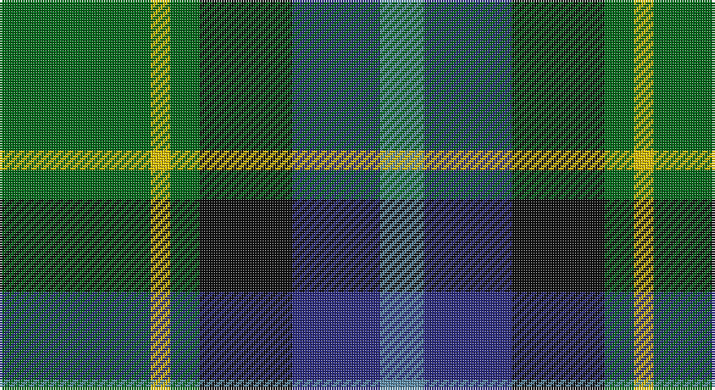

This page is one **sett** — a single exact thread-count. It belongs to the [tartan](/setts/g31ly4g6k19db18t9/)
(the same proportion at any scale), whose colour order is pattern [BBKGYG](/stripes/bbkgyg/).

Sourced from register-of-tartans.  It is a [6 stripe tartan](/stripes/stripes6/).

Original link https://www.tartanregister.gov.uk/tartanDetails.aspx?ref=2039

## Register references

External register numbers recorded for this tartan.

- Scottish Register of Tartans: [2039](https://www.tartanregister.gov.uk/tartanDetails.aspx?ref=2039)
- Scottish Tartans World Register: 2502

## Thread count
G/62 Y8 G12 K38 DB36 B/18

One full sett is **268 threads**.

## Palette

Palette: <strong>Tartan Register</strong>
<table><thead><tr><th>Colour</th><th>Threads</th><th>Shade</th><th>Base</th><th>OKLCh</th></tr></thead><tbody><tr><td>G/</td><td style="text-align:right;font-variant-numeric:tabular-nums">62</td><td><code style="background-color:#006818;">#006818</code> <small style="color:#888">#006818</small></td><td>G <code style="background-color:#006100;">#006100</code></td><td><small style="color:#888">oklch(45.0% 0.142 145.0)</small></td></tr><tr><td>Y</td><td style="text-align:right;font-variant-numeric:tabular-nums">8</td><td><code style="background-color:#E8C000;">#E8C000</code> <small style="color:#888">#E8C000</small></td><td>Y <code style="background-color:#F2BF00;">#F2BF00</code></td><td><small style="color:#888">oklch(81.9% 0.168 93.7)</small></td></tr><tr><td>G</td><td style="text-align:right;font-variant-numeric:tabular-nums">12</td><td><code style="background-color:#006818;">#006818</code> <small style="color:#888">#006818</small></td><td>G <code style="background-color:#006100;">#006100</code></td><td><small style="color:#888">oklch(45.0% 0.142 145.0)</small></td></tr><tr><td>K</td><td style="text-align:right;font-variant-numeric:tabular-nums">38</td><td><code style="background-color:#101010;">#101010</code> <small style="color:#888">#101010</small></td><td>K <code style="background-color:#000000;">#000000</code></td><td><small style="color:#888">oklch(17.3% 0.000 89.9)</small></td></tr><tr><td>DB</td><td style="text-align:right;font-variant-numeric:tabular-nums">36</td><td><code style="background-color:#2C2C80;">#2C2C80</code> <small style="color:#888">#2C2C80</small></td><td>B <code style="background-color:#2A418A;">#2A418A</code></td><td><small style="color:#888">oklch(35.0% 0.138 276.6)</small></td></tr><tr><td>B/</td><td style="text-align:right;font-variant-numeric:tabular-nums">18</td><td><code style="background-color:#5C8CA8;">#5C8CA8</code> <small style="color:#888">#5C8CA8</small></td><td>B <code style="background-color:#2A418A;">#2A418A</code></td><td><small style="color:#888">oklch(61.7% 0.067 235.0)</small></td></tr></tbody></table>

# Sample pattern

## Nearest tartans

The nearest existing variants by ΔTartan distance, with this tartan at the top so the swatches line up against it.

ΔTartan

Tartan

Sett

—

<a href="/ttd/edit/#slug=g31ly4g6k19db18t9~x2">Lanarkshire</a> <a class="nn-out" href="/variants/s6/g31ly4g6k19db18t9~x2/" title="open its dictionary page">↗</a>

0.73

<a href="/ttd/edit/#slug=k22g21k5g12t12o3w4~x2&amp;base=g31ly4g6k19db18t9~x2">Disciples of Christ Motorcycle Ministry (Switzerland)</a> <a class="nn-out" href="/variants/s7/k22g21k5g12t12o3w4~x2/" title="open its dictionary page">↗</a>

0.75

<a href="/variants/s7/k7db11ki3db11dy11g22db3~x2/">Scottish Odyssey Commemorative Tartan</a>

0.86

<a href="/ttd/edit/#slug=ly4dg30g15db5b10ly4~x2&amp;base=g31ly4g6k19db18t9~x2">MPS Emerald Society</a> <a class="nn-out" href="/variants/s6/ly4dg30g15db5b10ly4~x2/" title="open its dictionary page">↗</a>

0.93

<a href="/ttd/edit/#slug=ly4dg30g15db5t10ly4~x2&amp;base=g31ly4g6k19db18t9~x2">MPS Emerald Society NCLEES 2012</a> <a class="nn-out" href="/variants/s6/ly4dg30g15db5t10ly4~x2/" title="open its dictionary page">↗</a>

0.95

<a href="/ttd/edit/#slug=db18r3k9r3g23ly3~x2&amp;base=g31ly4g6k19db18t9~x2">Royal College of Physicians (Corp)</a> <a class="nn-out" href="/variants/s6/db18r3k9r3g23ly3~x2/" title="open its dictionary page">↗</a>

0.97

<a href="/ttd/edit/#slug=dg31ly4dg6k19db18t9~x2&amp;base=g31ly4g6k19db18t9~x2">Lanark</a> <a class="nn-out" href="/variants/s6/dg31ly4dg6k19db18t9~x2/" title="open its dictionary page">↗</a>

1.02

<a href="/ttd/edit/#slug=g16lb3g3k10db12r2db3~x2&amp;base=g31ly4g6k19db18t9~x2">MacLean, Donald (Personal)</a> <a class="nn-out" href="/variants/s7/g16lb3g3k10db12r2db3~x2/" title="open its dictionary page">↗</a>

1.02

<a href="/ttd/edit/#slug=k2ly1dg6k6db6w1~x4&amp;base=g31ly4g6k19db18t9~x2">Dyce #3</a> <a class="nn-out" href="/variants/s6/k2ly1dg6k6db6w1~x4/" title="open its dictionary page">↗</a>

1.03

<a href="/ttd/edit/#slug=r3db22k11g32ly3~x2&amp;base=g31ly4g6k19db18t9~x2">Cultoquhey Hotel</a> <a class="nn-out" href="/variants/s5/r3db22k11g32ly3~x2/" title="open its dictionary page">↗</a>

1.04

<a href="/ttd/edit/#slug=dg24k5dg6r6dg6k20b20w2~x2&amp;base=g31ly4g6k19db18t9~x2">Dunfermline Bank of Scotland (Corp)</a> <a class="nn-out" href="/variants/s8/dg24k5dg6r6dg6k20b20w2~x2/" title="open its dictionary page">↗</a>

## Neighbour map

Every grey dot is one of 14360 variants placed by the first two principal components of the ΔTartan feature space (44% of its variance). Red is this tartan; blue dots are its nearest — click one to open its page.

<svg viewBox="0 0 640 380" role="img" style="max-width:100%;height:auto;border:1px solid #e0e0e0;border-radius:4px;display:block" xmlns="http://www.w3.org/2000/svg"><image href="/nn/cloud.v1.png" width="640" height="380"/><a href="/variants/s7/k22g21k5g12t12o3w4~x2/"><circle cx="156.0" cy="222.3" r="4" fill="#3465a4"><title>Disciples of Christ Motorcycle Ministry (Switzerland)</title></circle></a><a href="/variants/s7/k7db11ki3db11dy11g22db3~x2/"><circle cx="127.8" cy="225.1" r="4" fill="#3465a4"><title>Scottish Odyssey Commemorative Tartan</title></circle></a><a href="/variants/s6/ly4dg30g15db5b10ly4~x2/"><circle cx="178.3" cy="214.8" r="4" fill="#3465a4"><title>MPS Emerald Society</title></circle></a><a href="/variants/s6/ly4dg30g15db5t10ly4~x2/"><circle cx="174.5" cy="213.8" r="4" fill="#3465a4"><title>MPS Emerald Society NCLEES 2012</title></circle></a><a href="/variants/s6/db18r3k9r3g23ly3~x2/"><circle cx="168.5" cy="211.9" r="4" fill="#3465a4"><title>Royal College of Physicians (Corp)</title></circle></a><a href="/variants/s6/dg31ly4dg6k19db18t9~x2/"><circle cx="154.0" cy="229.3" r="4" fill="#3465a4"><title>Lanark</title></circle></a><a href="/variants/s7/g16lb3g3k10db12r2db3~x2/"><circle cx="164.3" cy="216.4" r="4" fill="#3465a4"><title>MacLean, Donald (Personal)</title></circle></a><a href="/variants/s6/k2ly1dg6k6db6w1~x4/"><circle cx="135.4" cy="240.4" r="4" fill="#3465a4"><title>Dyce #3</title></circle></a><a href="/variants/s5/r3db22k11g32ly3~x2/"><circle cx="226.3" cy="218.7" r="4" fill="#3465a4"><title>Cultoquhey Hotel</title></circle></a><a href="/variants/s8/dg24k5dg6r6dg6k20b20w2~x2/"><circle cx="181.9" cy="194.6" r="4" fill="#3465a4"><title>Dunfermline Bank of Scotland (Corp)</title></circle></a><circle cx="165.1" cy="233.2" r="5" fill="#c00000"/></svg>

ID: /variants/s6/g31ly4g6k19db18t9~x2/
