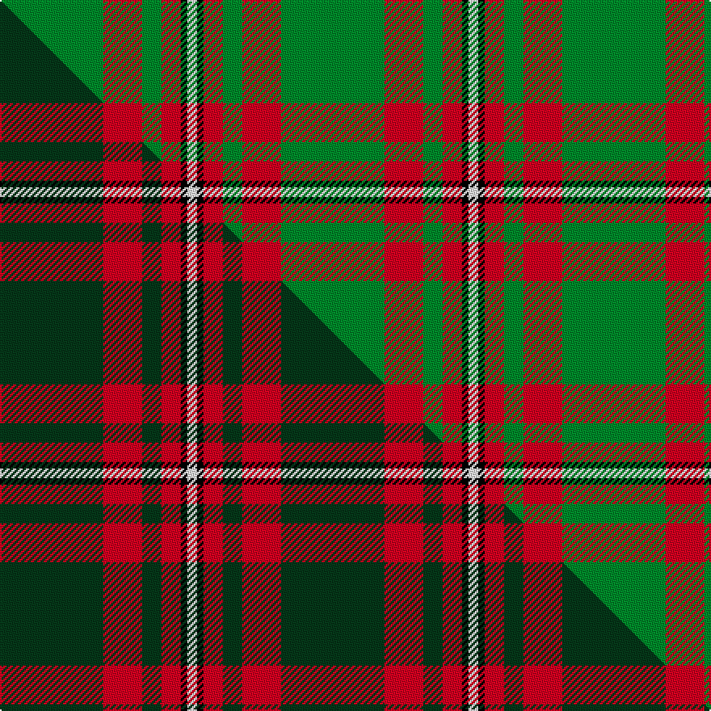

This page is one **sett** — a single exact thread-count. It belongs to the [tartan](/setts/g32r12g6r6k2w3/)
(the same proportion at any scale), whose colour order is pattern [GRGRKW](/stripes/grgrkw/).

Part of the [Princess Margaret Rose](/tartans/princess-margaret-rose/) tartan — the named design grouping this sett with its other cloths.

Sourced from tartans-authority.  It is a [6 stripe tartan](/stripes/stripes6/).

Original link http://www.tartansauthority.com/tartan-ferret/display/986/

## Register references

External register numbers recorded for this tartan.

- Scottish Tartans Authority (ITI): 986

## Thread count
G/64 R24 G12 R12 K4 W/6

One full sett is **174 threads**.

## Palette
<table><thead><tr><th>Colour</th><th>Shade</th><th>OKLCh</th></tr></thead><tbody><tr><td>G</td><td><code style="background-color:#008B2A;">#008B2A</code> <small style="color:#888">#008B2A</small></td><td><small style="color:#888">oklch(55.4% 0.170 145.9)</small></td></tr><tr><td>K</td><td><code style="background-color:#000000;">#000000</code> <small style="color:#888">#000000</small></td><td><small style="color:#888">oklch(0.0% 0.000 0.0)</small></td></tr><tr><td>R</td><td><code style="background-color:#D60020;">#D60020</code> <small style="color:#888">#D60020</small></td><td><small style="color:#888">oklch(55.2% 0.224 25.5)</small></td></tr><tr><td>W</td><td><code style="background-color:#F7F7F7;">#F7F7F7</code> <small style="color:#888">#F7F7F7</small></td><td><small style="color:#888">oklch(97.6% 0.000 89.9)</small></td></tr></tbody></table>

# Sample pattern

## Compared to the master

This cloth is one sett of its design; the master sett (the exemplar the design is anchored on) is below for comparison.

Its **ΔTartan distance** from the master is **1.70** — the same measure the nearest-tartans table ranks by (0 is identical; a re-scale of the same cloth is near 0, a recolour or a different proportion further).

<figure class="master-compare" style="margin:0">

this sett
master sett ★

<figcaption style="color:#888;font-size:smaller">One weave of this sett against the <a href="/setts/dg32r12dg6r6k2w3/">master sett ★</a>, split on the diagonal: a shared proportion runs seamlessly across it with only the shades shifting; a different proportion breaks on it.</figcaption>
</figure>

## Nearest variants

The nearest existing variants by ΔTartan distance, with this cloth at the top so the swatches line up against it.

ΔTartan

Threads

Variant

Sett

—

174

<a href="/variants/s6/g32r12g6r6k2w3~x2/">Princess Margaret Rose (Royal)</a>

<a href="/ttd/edit/#slug=dg32r12dg6r6k2w3~x2&amp;base=g32r12g6r6k2w3~x2" title="compare in the TTD">0.00</a>

174

<a href="/variants/s6/dg32r12dg6r6k2w3~x2/">Princess Margaret Rose</a>

<a href="/ttd/edit/#slug=g36r18g4r6k1w2~x2&amp;base=g32r12g6r6k2w3~x2" title="compare in the TTD">0.63</a>

192

<a href="/variants/s6/g36r18g4r6k1w2~x2/">Princess Margaret Rose Tartan</a>

<a href="/ttd/edit/#slug=g9r2g9r14k1w2~x2&amp;base=g32r12g6r6k2w3~x2" title="compare in the TTD">0.83</a>

126

<a href="/variants/s6/g9r2g9r14k1w2~x2/">MacGregor of Balquidder (Logan)</a>

<a href="/ttd/edit/#slug=g9r2g9r14k1w2~x4&amp;base=g32r12g6r6k2w3~x2" title="compare in the TTD">0.83</a>

252

<a href="/variants/s6/g9r2g9r14k1w2~x4/">MacGregor of Balquidder - 1831 (Clan</a>

<a href="/ttd/edit/#slug=k2r16g6r3g8w1~x4&amp;base=g32r12g6r6k2w3~x2" title="compare in the TTD">0.91</a>

276

<a href="/variants/s6/k2r16g6r3g8w1~x4/">MacAulay (Clan)</a>

<a href="/ttd/edit/#slug=k2r16g6r3g8w1&amp;base=g32r12g6r6k2w3~x2" title="compare in the TTD">0.91</a>

69

<a href="/variants/s6/k2r16g6r3g8w1/">MacAulay</a>

<a href="/ttd/edit/#slug=k2r16g6r3g8w1~x2&amp;base=g32r12g6r6k2w3~x2" title="compare in the TTD">0.91</a>

138

<a href="/variants/s6/k2r16g6r3g8w1~x2/">MacAulay</a>

<a href="/ttd/edit/#slug=k2r16g6r3g8lb1~x2&amp;base=g32r12g6r6k2w3~x2" title="compare in the TTD">1.22</a>

138

<a href="/variants/s6/k2r16g6r3g8lb1~x2/">MacAulay</a>

<a href="/ttd/edit/#slug=r2g2r1g12r3k1~x4&amp;base=g32r12g6r6k2w3~x2" title="compare in the TTD">1.64</a>

156

<a href="/variants/s6/r2g2r1g12r3k1~x4/">Connell (Personal?)</a>

<a href="/ttd/edit/#slug=g53w1r20k1w2r7~x2&amp;base=g32r12g6r6k2w3~x2" title="compare in the TTD">1.90</a>

216

<a href="/variants/s6/g53w1r20k1w2r7~x2/">Masai Shuka 10 (Artefact)</a>

## Neighbour map

Every grey dot is one of 13620 variants placed by the first two principal components of the ΔTartan feature space (42% of its variance). Red is this tartan; blue dots are its nearest — click one to open its page.

<svg viewBox="0 0 640 380" role="img" style="max-width:100%;height:auto;border:1px solid #e0e0e0;border-radius:4px;display:block" xmlns="http://www.w3.org/2000/svg"><image href="/nn/cloud.v1.png" width="640" height="380"/><a href="/variants/s6/dg32r12dg6r6k2w3~x2/"><circle cx="341.4" cy="158.4" r="4" fill="#3465a4"><title>Princess Margaret Rose</title></circle></a><a href="/variants/s6/g36r18g4r6k1w2~x2/"><circle cx="385.0" cy="133.3" r="4" fill="#3465a4"><title>Princess Margaret Rose Tartan</title></circle></a><a href="/variants/s6/g9r2g9r14k1w2~x2/"><circle cx="271.3" cy="189.2" r="4" fill="#3465a4"><title>MacGregor of Balquidder (Logan)</title></circle></a><a href="/variants/s6/g9r2g9r14k1w2~x4/"><circle cx="271.3" cy="189.2" r="4" fill="#3465a4"><title>MacGregor of Balquidder - 1831 (Clan</title></circle></a><a href="/variants/s6/k2r16g6r3g8w1~x4/"><circle cx="292.5" cy="172.7" r="4" fill="#3465a4"><title>MacAulay (Clan)</title></circle></a><a href="/variants/s6/k2r16g6r3g8w1/"><circle cx="292.5" cy="172.7" r="4" fill="#3465a4"><title>MacAulay</title></circle></a><a href="/variants/s6/k2r16g6r3g8w1~x2/"><circle cx="292.5" cy="172.7" r="4" fill="#3465a4"><title>MacAulay</title></circle></a><a href="/variants/s6/k2r16g6r3g8lb1~x2/"><circle cx="297.2" cy="174.2" r="4" fill="#3465a4"><title>MacAulay</title></circle></a><a href="/variants/s6/r2g2r1g12r3k1~x4/"><circle cx="396.4" cy="186.5" r="4" fill="#3465a4"><title>Connell (Personal?)</title></circle></a><a href="/variants/s6/g53w1r20k1w2r7~x2/"><circle cx="423.7" cy="110.5" r="4" fill="#3465a4"><title>Masai Shuka 10 (Artefact)</title></circle></a><circle cx="346.2" cy="167.1" r="5" fill="#c00000"/><text x="320" y="376" text-anchor="middle" font-size="11" fill="#999">ground</text><text x="11" y="190" text-anchor="middle" font-size="11" fill="#999" transform="rotate(-90 11 190)">complexity</text></svg>

ID: /variants/s6/g32r12g6r6k2w3~x2/
