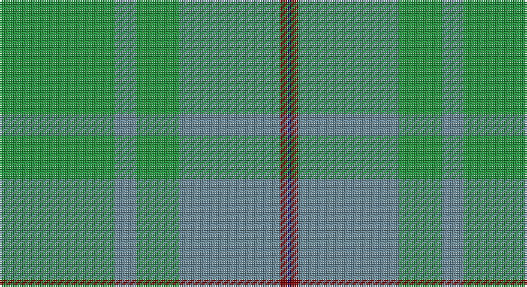

This page is one **sett** — a single exact thread-count. It belongs to the [tartan](/setts/g32t6g12t28r2db1/)
(the same proportion at any scale), whose colour order is pattern [BRBGBG](/stripes/brbgbg/).

Sourced from register-of-tartans.  It is a [6 stripe tartan](/stripes/stripes6/).

Original link https://www.tartanregister.gov.uk/tartanDetails.aspx?ref=3286

## Also known as

This cloth is also recorded under:

- Palm Beach Gardens Police (Corporate

2 attestations — the source records this cloth was collapsed from (oldest owns this page)

<ul>
<li>01/01/1994 — Palm Beach Gardens Police (register-of-tartans, <a href="https://www.tartanregister.gov.uk/tartanDetails.aspx?ref=3286">record</a>)</li>
<li>1994 — Palm Beach Gardens Police (Corporate (tartans-authority, <a href="http://www.tartansauthority.com/tartan-ferret/display/5521/">record</a>)</li>
</ul>

## Register references

External register numbers recorded for this tartan.

- Scottish Register of Tartans: [3286](https://www.tartanregister.gov.uk/tartanDetails.aspx?ref=3286)
- Scottish Tartans Authority (ITI): 5521

## Thread count
G/64 B12 G24 B56 DR4 DB/2

One full sett is **258 threads**.

## Palette

Palette: <strong>Tartan Register</strong> <small style="color:#888">(2 of 4 colours)</small>
<table><thead><tr><th>Colour</th><th>Threads</th><th>Shade</th><th>Base</th><th>OKLCh</th></tr></thead><tbody><tr><td>G/</td><td style="text-align:right;font-variant-numeric:tabular-nums">64</td><td><code style="background-color:#20943C;">#20943C</code> <small style="color:#888">#20943C</small></td><td>G <code style="background-color:#006100;">#006100</code></td><td><small style="color:#888">oklch(58.5% 0.161 146.9)</small></td></tr><tr><td>B</td><td style="text-align:right;font-variant-numeric:tabular-nums">12</td><td><code style="background-color:#688898;">#688898</code> <small style="color:#888">#688898</small></td><td>B <code style="background-color:#2A418A;">#2A418A</code></td><td><small style="color:#888">oklch(60.8% 0.044 230.0)</small></td></tr><tr><td>G</td><td style="text-align:right;font-variant-numeric:tabular-nums">24</td><td><code style="background-color:#20943C;">#20943C</code> <small style="color:#888">#20943C</small></td><td>G <code style="background-color:#006100;">#006100</code></td><td><small style="color:#888">oklch(58.5% 0.161 146.9)</small></td></tr><tr><td>B</td><td style="text-align:right;font-variant-numeric:tabular-nums">56</td><td><code style="background-color:#688898;">#688898</code> <small style="color:#888">#688898</small></td><td>B <code style="background-color:#2A418A;">#2A418A</code></td><td><small style="color:#888">oklch(60.8% 0.044 230.0)</small></td></tr><tr><td>DR</td><td style="text-align:right;font-variant-numeric:tabular-nums">4</td><td><code style="background-color:#880000;">#880000</code> <small style="color:#888">#880000</small></td><td>R <code style="background-color:#CC0000;">#CC0000</code></td><td><small style="color:#888">oklch(39.4% 0.162 29.2)</small></td></tr><tr><td>DB/</td><td style="text-align:right;font-variant-numeric:tabular-nums">2</td><td><code style="background-color:#1C0070;">#1C0070</code> <small style="color:#888">#1C0070</small></td><td>B <code style="background-color:#2A418A;">#2A418A</code></td><td><small style="color:#888">oklch(26.3% 0.162 277.1)</small></td></tr></tbody></table>

# Sample pattern

## Nearest tartans

The nearest existing variants by ΔTartan distance, with this tartan at the top so the swatches line up against it.

ΔTartan

Tartan

Sett

—

<a href="/ttd/edit/#slug=g32t6g12t28r2db1~x2">Palm Beach Gardens Police</a> <a class="nn-out" href="/variants/s6/g32t6g12t28r2db1~x2/" title="open its dictionary page">↗</a>

1.04

<a href="/ttd/edit/#slug=g40w2y5gi5y15~x2&amp;base=g32t6g12t28r2db1~x2">Castle Bay (Fashion)</a> <a class="nn-out" href="/variants/s5/g40w2y5gi5y15~x2/" title="open its dictionary page">↗</a>

1.67

<a href="/ttd/edit/#slug=ly10g30gi25g30k2g3~x2&amp;base=g32t6g12t28r2db1~x2">Gordon Cumming (Artefact)</a> <a class="nn-out" href="/variants/s6/ly10g30gi25g30k2g3~x2/" title="open its dictionary page">↗</a>

1.78

<a href="/ttd/edit/#slug=g27gi14dt2gi2ly2~x4&amp;base=g32t6g12t28r2db1~x2">Irving of Bonshaw</a> <a class="nn-out" href="/variants/s5/g27gi14dt2gi2ly2~x4/" title="open its dictionary page">↗</a>

1.89

<a href="/ttd/edit/#slug=y36g19y4g31b2r3b2r3g12~x2&amp;base=g32t6g12t28r2db1~x2">O'Brien (Scotch Corner)</a> <a class="nn-out" href="/variants/s9/y36g19y4g31b2r3b2r3g12~x2/" title="open its dictionary page">↗</a>

1.89

<a href="/ttd/edit/#slug=g49t21k3t3w3~x2&amp;base=g32t6g12t28r2db1~x2">Irvine of Drum (Clan)</a> <a class="nn-out" href="/variants/s5/g49t21k3t3w3~x2/" title="open its dictionary page">↗</a>

1.98

<a href="/ttd/edit/#slug=g38n8b3db4n12lo1g4n1~x2&amp;base=g32t6g12t28r2db1~x2">Del Forno Wolf (Personal)</a> <a class="nn-out" href="/variants/s8/g38n8b3db4n12lo1g4n1~x2/" title="open its dictionary page">↗</a>

2.12

<a href="/ttd/edit/#slug=r3n34db4g47lb3~x2&amp;base=g32t6g12t28r2db1~x2">Exabyte</a> <a class="nn-out" href="/variants/s5/r3n34db4g47lb3~x2/" title="open its dictionary page">↗</a>

2.21

<a href="/ttd/edit/#slug=n8g20w4r1~x5&amp;base=g32t6g12t28r2db1~x2">Farooq (Personal)</a> <a class="nn-out" href="/variants/s4/n8g20w4r1~x5/" title="open its dictionary page">↗</a>

2.27

<a href="/ttd/edit/#slug=t3k3t21g49t21k3t3w3~x2&amp;base=g32t6g12t28r2db1~x2">Irvine of Drum</a> <a class="nn-out" href="/variants/s8/t3k3t21g49t21k3t3w3~x2/" title="open its dictionary page">↗</a>

2.28

<a href="/ttd/edit/#slug=n8o74lb8n42o11dp2o16n4&amp;base=g32t6g12t28r2db1~x2">Orkney Slate (Fashion)</a> <a class="nn-out" href="/variants/s8/n8o74lb8n42o11dp2o16n4/" title="open its dictionary page">↗</a>

## Neighbour map

Every grey dot is one of 14360 variants placed by the first two principal components of the ΔTartan feature space (44% of its variance). Red is this tartan; blue dots are its nearest — click one to open its page.

<svg viewBox="0 0 640 380" role="img" style="max-width:100%;height:auto;border:1px solid #e0e0e0;border-radius:4px;display:block" xmlns="http://www.w3.org/2000/svg"><image href="/nn/cloud.v1.png" width="640" height="380"/><a href="/variants/s5/g40w2y5gi5y15~x2/"><circle cx="463.2" cy="238.1" r="4" fill="#3465a4"><title>Castle Bay (Fashion)</title></circle></a><a href="/variants/s6/ly10g30gi25g30k2g3~x2/"><circle cx="418.1" cy="261.9" r="4" fill="#3465a4"><title>Gordon Cumming (Artefact)</title></circle></a><a href="/variants/s5/g27gi14dt2gi2ly2~x4/"><circle cx="424.6" cy="250.7" r="4" fill="#3465a4"><title>Irving of Bonshaw</title></circle></a><a href="/variants/s9/y36g19y4g31b2r3b2r3g12~x2/"><circle cx="410.4" cy="213.0" r="4" fill="#3465a4"><title>O'Brien (Scotch Corner)</title></circle></a><a href="/variants/s5/g49t21k3t3w3~x2/"><circle cx="451.6" cy="226.9" r="4" fill="#3465a4"><title>Irvine of Drum (Clan)</title></circle></a><a href="/variants/s8/g38n8b3db4n12lo1g4n1~x2/"><circle cx="488.7" cy="180.4" r="4" fill="#3465a4"><title>Del Forno Wolf (Personal)</title></circle></a><a href="/variants/s5/r3n34db4g47lb3~x2/"><circle cx="380.5" cy="226.2" r="4" fill="#3465a4"><title>Exabyte</title></circle></a><a href="/variants/s4/n8g20w4r1~x5/"><circle cx="414.7" cy="231.7" r="4" fill="#3465a4"><title>Farooq (Personal)</title></circle></a><a href="/variants/s8/t3k3t21g49t21k3t3w3~x2/"><circle cx="367.3" cy="200.9" r="4" fill="#3465a4"><title>Irvine of Drum</title></circle></a><a href="/variants/s8/n8o74lb8n42o11dp2o16n4/"><circle cx="524.1" cy="194.2" r="4" fill="#3465a4"><title>Orkney Slate (Fashion)</title></circle></a><circle cx="455.7" cy="225.9" r="5" fill="#c00000"/></svg>

ID: /variants/s6/g32t6g12t28r2db1~x2/
