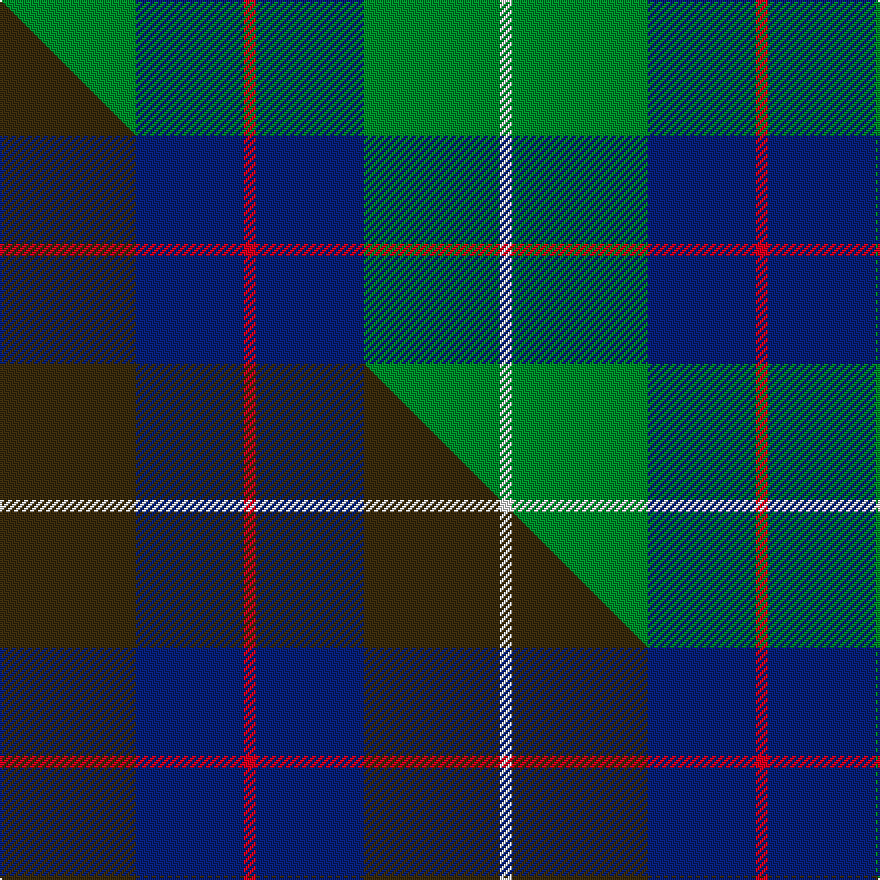

This page is one **sett** — a single exact thread-count. It belongs to the [tartan](/setts/g34db27r3db27g34w3/)
(the same proportion at any scale), whose colour order is pattern [GBRBGW](/stripes/gbrbgw/).

Part of the [London Regiment](/tartans/london-regiment/) tartan — the named design grouping this sett with its other cloths.

Sourced from tartans-authority.  It is a [6 stripe tartan](/stripes/stripes6/).

Original link http://www.tartansauthority.com/tartan-ferret/display/6097/

## Register references

External register numbers recorded for this tartan.

- Scottish Tartans Authority (ITI): 6097

## Thread count
G/68 DB54 R6 DB54 G68 W/6

One full sett is **438 threads**.

## Palette
<table><thead><tr><th>Colour</th><th>Shade</th><th>OKLCh</th></tr></thead><tbody><tr><td>DB</td><td><code style="background-color:#082077;">#082077</code> <small style="color:#888">#082077</small></td><td><small style="color:#888">oklch(30.0% 0.149 265.1)</small></td></tr><tr><td>G</td><td><code style="background-color:#008B2A;">#008B2A</code> <small style="color:#888">#008B2A</small></td><td><small style="color:#888">oklch(55.4% 0.170 145.9)</small></td></tr><tr><td>R</td><td><code style="background-color:#D60020;">#D60020</code> <small style="color:#888">#D60020</small></td><td><small style="color:#888">oklch(55.2% 0.224 25.5)</small></td></tr><tr><td>W</td><td><code style="background-color:#F7F7F7;">#F7F7F7</code> <small style="color:#888">#F7F7F7</small></td><td><small style="color:#888">oklch(97.6% 0.000 89.9)</small></td></tr></tbody></table>

# Sample pattern

## Compared to the master

This cloth is one sett of its design; the master sett (the exemplar the design is anchored on) is below for comparison.

Its **ΔTartan distance** from the master is **2.86** — the same measure the nearest-tartans table ranks by (0 is identical; a re-scale of the same cloth is near 0, a recolour or a different proportion further).

<figure class="master-compare" style="margin:0">

this sett
master sett ★

<figcaption style="color:#888;font-size:smaller">One weave of this sett against the <a href="/setts/dy34db27r3db27dy34w3/">master sett ★</a>, split on the diagonal: a shared proportion runs seamlessly across it with only the shades shifting; a different proportion breaks on it.</figcaption>
</figure>

## Nearest variants

The nearest existing variants by ΔTartan distance, with this cloth at the top so the swatches line up against it.

ΔTartan

Threads

Variant

Sett

—

438

<a href="/variants/s6/g34db27r3db27g34w3~x2/">London Regiment (Military)</a>

<a href="/ttd/edit/#slug=g4db12r3db12g32w4~x2&amp;base=g34db27r3db27g34w3~x2" title="compare in the TTD">0.63</a>

252

<a href="/variants/s6/g4db12r3db12g32w4~x2/">MacIntyre Hunting (VS)</a>

<a href="/ttd/edit/#slug=g4db12r3db12g32w4&amp;base=g34db27r3db27g34w3~x2" title="compare in the TTD">0.63</a>

126

<a href="/variants/s6/g4db12r3db12g32w4/">MacIntyre L</a>

<a href="/ttd/edit/#slug=dg4db12r3db12dg32w4~x2&amp;base=g34db27r3db27g34w3~x2" title="compare in the TTD">0.63</a>

252

<a href="/variants/s6/dg4db12r3db12dg32w4~x2/">MacIntyre</a>

<a href="/ttd/edit/#slug=db8dr4db24g35lb4g8&amp;base=g34db27r3db27g34w3~x2" title="compare in the TTD">0.88</a>

150

<a href="/variants/s6/db8dr4db24g35lb4g8/">Heritage Tartan, The</a>

<a href="/ttd/edit/#slug=db5w3db36g38y5g5~x2&amp;base=g34db27r3db27g34w3~x2" title="compare in the TTD">1.24</a>

348

<a href="/variants/s6/db5w3db36g38y5g5~x2/">St. Andrew Society, Sao Paulo (Corp)</a>

<a href="/ttd/edit/#slug=w4g28db18r4db18y3~x2&amp;base=g34db27r3db27g34w3~x2" title="compare in the TTD">1.57</a>

286

<a href="/variants/s6/w4g28db18r4db18y3~x2/">MacIntyre, Inglis</a>

<a href="/ttd/edit/#slug=db4w1db12g12db1g4~x2&amp;base=g34db27r3db27g34w3~x2" title="compare in the TTD">1.89</a>

120

<a href="/variants/s6/db4w1db12g12db1g4~x2/">Unidentified Tweed</a>

<a href="/ttd/edit/#slug=g1b8g8r1g8b8w1~x4&amp;base=g34db27r3db27g34w3~x2" title="compare in the TTD">1.96</a>

272

<a href="/variants/s7/g1b8g8r1g8b8w1~x4/">MacKinnon Hunting</a>

<a href="/ttd/edit/#slug=g1b8g8r1g8b8w1~x2&amp;base=g34db27r3db27g34w3~x2" title="compare in the TTD">1.96</a>

136

<a href="/variants/s7/g1b8g8r1g8b8w1~x2/">MacKinnon Hunting</a>

<a href="/ttd/edit/#slug=g47r3g6db35y3~x2&amp;base=g34db27r3db27g34w3~x2" title="compare in the TTD">2.21</a>

276

<a href="/variants/s5/g47r3g6db35y3~x2/">Gracie</a>

## Neighbour map

Every grey dot is one of 13620 variants placed by the first two principal components of the ΔTartan feature space (42% of its variance). Red is this tartan; blue dots are its nearest — click one to open its page.

<svg viewBox="0 0 640 380" role="img" style="max-width:100%;height:auto;border:1px solid #e0e0e0;border-radius:4px;display:block" xmlns="http://www.w3.org/2000/svg"><image href="/nn/cloud.v1.png" width="640" height="380"/><a href="/variants/s6/g4db12r3db12g32w4~x2/"><circle cx="297.7" cy="211.6" r="4" fill="#3465a4"><title>MacIntyre Hunting (VS)</title></circle></a><a href="/variants/s6/g4db12r3db12g32w4/"><circle cx="297.7" cy="211.6" r="4" fill="#3465a4"><title>MacIntyre L</title></circle></a><a href="/variants/s6/dg4db12r3db12dg32w4~x2/"><circle cx="328.7" cy="216.8" r="4" fill="#3465a4"><title>MacIntyre</title></circle></a><a href="/variants/s6/db8dr4db24g35lb4g8/"><circle cx="318.7" cy="243.1" r="4" fill="#3465a4"><title>Heritage Tartan, The</title></circle></a><a href="/variants/s6/db5w3db36g38y5g5~x2/"><circle cx="315.9" cy="214.0" r="4" fill="#3465a4"><title>St. Andrew Society, Sao Paulo (Corp)</title></circle></a><a href="/variants/s6/w4g28db18r4db18y3~x2/"><circle cx="235.9" cy="214.5" r="4" fill="#3465a4"><title>MacIntyre, Inglis</title></circle></a><a href="/variants/s6/db4w1db12g12db1g4~x2/"><circle cx="348.5" cy="244.7" r="4" fill="#3465a4"><title>Unidentified Tweed</title></circle></a><a href="/variants/s7/g1b8g8r1g8b8w1~x4/"><circle cx="316.9" cy="253.7" r="4" fill="#3465a4"><title>MacKinnon Hunting</title></circle></a><a href="/variants/s7/g1b8g8r1g8b8w1~x2/"><circle cx="316.9" cy="253.7" r="4" fill="#3465a4"><title>MacKinnon Hunting</title></circle></a><a href="/variants/s5/g47r3g6db35y3~x2/"><circle cx="359.6" cy="203.1" r="4" fill="#3465a4"><title>Gracie</title></circle></a><circle cx="301.4" cy="239.4" r="5" fill="#c00000"/><text x="320" y="376" text-anchor="middle" font-size="11" fill="#999">ground</text><text x="11" y="190" text-anchor="middle" font-size="11" fill="#999" transform="rotate(-90 11 190)">complexity</text></svg>

ID: /variants/s6/g34db27r3db27g34w3~x2/
