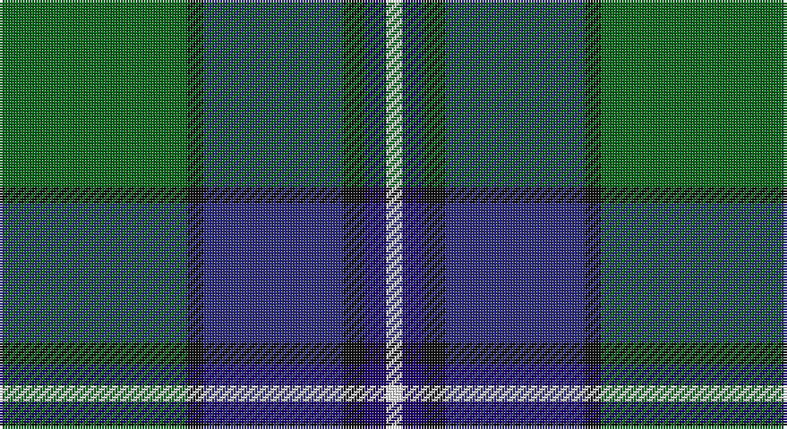

This page is one **sett** — a single exact thread-count. It belongs to the [tartan](/setts/g35k3dbi26k4db4w3/)
(the same proportion at any scale), whose colour order is pattern [GKBKBW](/stripes/gkbkbw/).

Sourced from tartans-authority.  It is a [6 stripe tartan](/stripes/stripes6/).

Original link http://www.tartansauthority.com/tartan-ferret/display/3813/

2 attestations — the source records this cloth was collapsed from (oldest owns this page)

<ul>
<li>2002 — Pride of Yorkland (Fashion) (tartans-authority, <a href="http://www.tartansauthority.com/tartan-ferret/display/3813/">record</a>)</li>
<li>undated — Pride of Yorkland (register-of-tartans, <a href="https://www.tartanregister.gov.uk/tartanDetails.aspx?ref=5084">record</a>)</li>
</ul>

## Register references

External register numbers recorded for this tartan.

- Scottish Register of Tartans: [5084](https://www.tartanregister.gov.uk/tartanDetails.aspx?ref=5084)
- Scottish Tartans Authority (ITI): 3813

## Thread count
G/70 K6 DB52 K8 DBa8 W/6

One full sett is **224 threads**.

## Palette

Palette: <strong>Tartan Register</strong>
<table><thead><tr><th>Colour</th><th>Threads</th><th>Shade</th><th>Base</th><th>OKLCh</th></tr></thead><tbody><tr><td>G/</td><td style="text-align:right;font-variant-numeric:tabular-nums">70</td><td><code style="background-color:#006818;">#006818</code> <small style="color:#888">#006818</small></td><td>G <code style="background-color:#006100;">#006100</code></td><td><small style="color:#888">oklch(45.0% 0.142 145.0)</small></td></tr><tr><td>K</td><td style="text-align:right;font-variant-numeric:tabular-nums">6</td><td><code style="background-color:#101010;">#101010</code> <small style="color:#888">#101010</small></td><td>K <code style="background-color:#000000;">#000000</code></td><td><small style="color:#888">oklch(17.3% 0.000 89.9)</small></td></tr><tr><td>DB</td><td style="text-align:right;font-variant-numeric:tabular-nums">52</td><td><code style="background-color:#2C2C80;">#2C2C80</code> <small style="color:#888">#2C2C80</small></td><td>B <code style="background-color:#2A418A;">#2A418A</code></td><td><small style="color:#888">oklch(35.0% 0.138 276.6)</small></td></tr><tr><td>K</td><td style="text-align:right;font-variant-numeric:tabular-nums">8</td><td><code style="background-color:#101010;">#101010</code> <small style="color:#888">#101010</small></td><td>K <code style="background-color:#000000;">#000000</code></td><td><small style="color:#888">oklch(17.3% 0.000 89.9)</small></td></tr><tr><td>DBa</td><td style="text-align:right;font-variant-numeric:tabular-nums">8</td><td><code style="background-color:#1C0070;">#1C0070</code> <small style="color:#888">#1C0070</small></td><td>B <code style="background-color:#2A418A;">#2A418A</code></td><td><small style="color:#888">oklch(26.3% 0.162 277.1)</small></td></tr><tr><td>W/</td><td style="text-align:right;font-variant-numeric:tabular-nums">6</td><td><code style="background-color:#FCFCFC;">#FCFCFC</code> <small style="color:#888">#FCFCFC</small></td><td>W <code style="background-color:#F7F7F7;">#F7F7F7</code></td><td><small style="color:#888">oklch(99.1% 0.000 89.9)</small></td></tr></tbody></table>

# Sample pattern

## Nearest tartans

The nearest existing variants by ΔTartan distance, with this tartan at the top so the swatches line up against it.

ΔTartan

Tartan

Sett

—

<a href="/ttd/edit/#slug=g35k3dbi26k4db4w3~x2">Pride of Yorkland (Fashion)</a> <a class="nn-out" href="/variants/s6/g35k3dbi26k4db4w3~x2/" title="open its dictionary page">↗</a>

0.50

<a href="/ttd/edit/#slug=k5g32db32r3db3ly3~x2&amp;base=g35k3dbi26k4db4w3~x2">Carmichael</a> <a class="nn-out" href="/variants/s6/k5g32db32r3db3ly3~x2/" title="open its dictionary page">↗</a>

0.77

<a href="/ttd/edit/#slug=k3db3g23db21w2~x2&amp;base=g35k3dbi26k4db4w3~x2">Douglas Clan Tartan</a> <a class="nn-out" href="/variants/s5/k3db3g23db21w2~x2/" title="open its dictionary page">↗</a>

0.84

<a href="/ttd/edit/#slug=r1g9db9k1db1w1~x6&amp;base=g35k3dbi26k4db4w3~x2">Irving of Glentulchan</a> <a class="nn-out" href="/variants/s6/r1g9db9k1db1w1~x6/" title="open its dictionary page">↗</a>

0.85

<a href="/ttd/edit/#slug=k7db4dg31db3ly2db27lb4~x2&amp;base=g35k3dbi26k4db4w3~x2">Wishart Htg (Clan)</a> <a class="nn-out" href="/variants/s7/k7db4dg31db3ly2db27lb4~x2/" title="open its dictionary page">↗</a>

0.86

<a href="/ttd/edit/#slug=r6db27t2g2t2g30w4~x2&amp;base=g35k3dbi26k4db4w3~x2">MX-5 Owners' Club</a> <a class="nn-out" href="/variants/s7/r6db27t2g2t2g30w4~x2/" title="open its dictionary page">↗</a>

0.87

<a href="/ttd/edit/#slug=k2ly1g10db10w1~x6&amp;base=g35k3dbi26k4db4w3~x2">Turnbull Hunting (1983) #2</a> <a class="nn-out" href="/variants/s5/k2ly1g10db10w1~x6/" title="open its dictionary page">↗</a>

0.87

<a href="/ttd/edit/#slug=b11k4g4m1g4k1r1~x4&amp;base=g35k3dbi26k4db4w3~x2">Ednie (Personal)</a> <a class="nn-out" href="/variants/s7/b11k4g4m1g4k1r1~x4/" title="open its dictionary page">↗</a>

0.88

<a href="/ttd/edit/#slug=db3g13t1r3t1db10ly1~x2&amp;base=g35k3dbi26k4db4w3~x2">Heckenberg Htg (Personal)</a> <a class="nn-out" href="/variants/s7/db3g13t1r3t1db10ly1~x2/" title="open its dictionary page">↗</a>

0.89

<a href="/ttd/edit/#slug=db20k6lo4db3g20w2~x2&amp;base=g35k3dbi26k4db4w3~x2">DeLoughery (Personal)</a> <a class="nn-out" href="/variants/s6/db20k6lo4db3g20w2~x2/" title="open its dictionary page">↗</a>

0.90

<a href="/ttd/edit/#slug=k1dbi1g8db8w1~x4&amp;base=g35k3dbi26k4db4w3~x2">Douglas, Green (Wilsons)</a> <a class="nn-out" href="/variants/s5/k1dbi1g8db8w1~x4/" title="open its dictionary page">↗</a>

## Neighbour map

Every grey dot is one of 14360 variants placed by the first two principal components of the ΔTartan feature space (44% of its variance). Red is this tartan; blue dots are its nearest — click one to open its page.

<svg viewBox="0 0 640 380" role="img" style="max-width:100%;height:auto;border:1px solid #e0e0e0;border-radius:4px;display:block" xmlns="http://www.w3.org/2000/svg"><image href="/nn/cloud.v1.png" width="640" height="380"/><a href="/variants/s6/k5g32db32r3db3ly3~x2/"><circle cx="250.5" cy="189.2" r="4" fill="#3465a4"><title>Carmichael</title></circle></a><a href="/variants/s5/k3db3g23db21w2~x2/"><circle cx="258.5" cy="213.5" r="4" fill="#3465a4"><title>Douglas Clan Tartan</title></circle></a><a href="/variants/s6/r1g9db9k1db1w1~x6/"><circle cx="239.0" cy="191.0" r="4" fill="#3465a4"><title>Irving of Glentulchan</title></circle></a><a href="/variants/s7/k7db4dg31db3ly2db27lb4~x2/"><circle cx="246.6" cy="169.8" r="4" fill="#3465a4"><title>Wishart Htg (Clan)</title></circle></a><a href="/variants/s7/r6db27t2g2t2g30w4~x2/"><circle cx="242.4" cy="159.2" r="4" fill="#3465a4"><title>MX-5 Owners' Club</title></circle></a><a href="/variants/s5/k2ly1g10db10w1~x6/"><circle cx="215.3" cy="205.5" r="4" fill="#3465a4"><title>Turnbull Hunting (1983) #2</title></circle></a><a href="/variants/s7/b11k4g4m1g4k1r1~x4/"><circle cx="212.9" cy="195.3" r="4" fill="#3465a4"><title>Ednie (Personal)</title></circle></a><a href="/variants/s7/db3g13t1r3t1db10ly1~x2/"><circle cx="236.2" cy="179.4" r="4" fill="#3465a4"><title>Heckenberg Htg (Personal)</title></circle></a><a href="/variants/s6/db20k6lo4db3g20w2~x2/"><circle cx="206.5" cy="204.1" r="4" fill="#3465a4"><title>DeLoughery (Personal)</title></circle></a><a href="/variants/s5/k1dbi1g8db8w1~x4/"><circle cx="219.0" cy="218.1" r="4" fill="#3465a4"><title>Douglas, Green (Wilsons)</title></circle></a><circle cx="252.4" cy="188.9" r="5" fill="#c00000"/></svg>

ID: /variants/s6/g35k3dbi26k4db4w3~x2/
