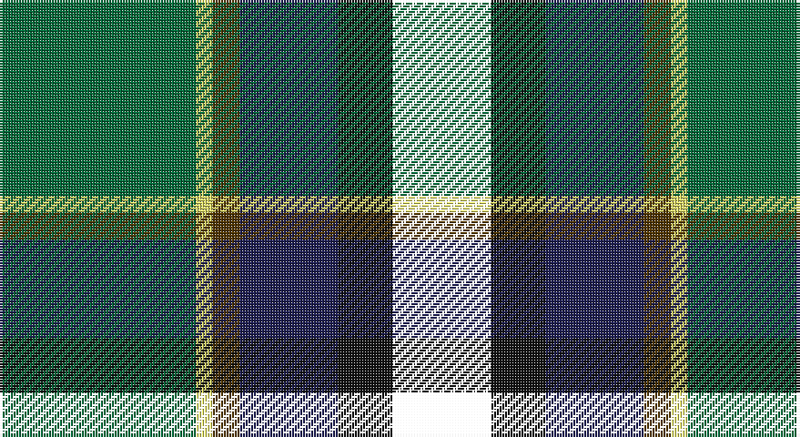

This page is one **sett** — a single exact thread-count. It belongs to the [tartan](/setts/g36ly3dy5db18ki10k18/)
(the same proportion at any scale), whose colour order is pattern [GYGBKK](/stripes/gygbkk/).

Part of the [Dobson](/tartans/dobson/) tartan — the named design grouping this sett with its other cloths.

Sourced from house-of-tartan.  It is a [6 stripe tartan](/stripes/stripes6/).

Original link http://www.house-of-tartan.scotland.net/house/TartanViewjs.asp?colr=Def&tnam=10943

## Provenance

Earliest known date: 2013 Designed by Kelly Dobson Matson for the personal use of the Dobson Family, Palm Bay, Florida, a family of bagpipers, who wish to wear their own tartan while they play. The colours are favoured colours chosen by the majority of the family.

## Thread count
G/72 LY6 T10 DB36 K20 OG/36

One full sett is **252 threads**.

## Palette

Palette: <strong>Logan (The Scottish Gael, 1831)</strong> <small style="color:#888">(2 of 5 colours)</small>
<table><thead><tr><th>Colour</th><th>Threads</th><th>Shade</th><th>Base</th><th>OKLCh</th></tr></thead><tbody><tr><td>G/</td><td style="text-align:right;font-variant-numeric:tabular-nums">72</td><td><code style="background-color:#006838;">#006838</code> <small style="color:#888">#006838</small></td><td>G <code style="background-color:#006100;">#006100</code></td><td><small style="color:#888">oklch(45.4% 0.114 154.4)</small></td></tr><tr><td>LY</td><td style="text-align:right;font-variant-numeric:tabular-nums">6</td><td><code style="background-color:#E4E068;">#E4E068</code> <small style="color:#888">#E4E068</small></td><td>Y <code style="background-color:#F2BF00;">#F2BF00</code></td><td><small style="color:#888">oklch(88.6% 0.142 107.2)</small></td></tr><tr><td>T</td><td style="text-align:right;font-variant-numeric:tabular-nums">10</td><td><code style="background-color:#503500;">#503500</code> <small style="color:#888">#503500</small></td><td>G <code style="background-color:#006100;">#006100</code></td><td><small style="color:#888">oklch(35.2% 0.074 77.3)</small></td></tr><tr><td>DB</td><td style="text-align:right;font-variant-numeric:tabular-nums">36</td><td><code style="background-color:#1C1C50;">#1C1C50</code> <small style="color:#888">#1C1C50</small></td><td>B <code style="background-color:#2A418A;">#2A418A</code></td><td><small style="color:#888">oklch(26.2% 0.093 277.9)</small></td></tr><tr><td>K</td><td style="text-align:right;font-variant-numeric:tabular-nums">20</td><td><code style="background-color:#101010;">#101010</code> <small style="color:#888">#101010</small></td><td>K <code style="background-color:#000000;">#000000</code></td><td><small style="color:#888">oklch(17.3% 0.000 89.9)</small></td></tr><tr><td>/</td><td style="text-align:right;font-variant-numeric:tabular-nums">36</td><td><code style="background-color:;"></code> <small style="color:#888"></small></td><td> <code style="background-color:;"></code></td><td><small style="color:#888"></small></td></tr></tbody></table>

# Sample pattern

## Compared to the master

This cloth is one sett of its design; the master sett (the exemplar the design is anchored on) is below for comparison.

<figure style="margin:0"><figcaption style="color:#888;font-size:smaller">this sett</figcaption></figure>
<figure style="margin:0"><figcaption style="color:#888;font-size:smaller"><a href="/setts/g15lo1do2db5k4dg5/">master sett →</a></figcaption></figure>

## Nearest tartans

The nearest existing variants by ΔTartan distance, with this tartan at the top so the swatches line up against it.

ΔTartan

Tartan

Sett

—

<a href="/ttd/edit/#slug=g36ly3dy5db18ki10k18~x2">Dobson Name Tartan</a> <a class="nn-out" href="/variants/s6/g36ly3dy5db18ki10k18~x2/" title="open its dictionary page">↗</a>

0.81

<a href="/ttd/edit/#slug=r5k12ly2dg25ly2db12t5~x2&amp;base=g36ly3dy5db18ki10k18~x2">James</a> <a class="nn-out" href="/variants/s7/r5k12ly2dg25ly2db12t5~x2/" title="open its dictionary page">↗</a>

0.87

<a href="/variants/s7/g16lb3g3ki10db12r2k3~x2/">MacLean, Donald Personal Tartan</a>

0.99

<a href="/ttd/edit/#slug=r2k6ly1dg12ly1db6lr2~x4&amp;base=g36ly3dy5db18ki10k18~x2">James (Personal)</a> <a class="nn-out" href="/variants/s7/r2k6ly1dg12ly1db6lr2~x4/" title="open its dictionary page">↗</a>

1.07

<a href="/ttd/edit/#slug=r3g3db4g17k13dt26w3~x2&amp;base=g36ly3dy5db18ki10k18~x2">Royal Burgh of Peebles (District)</a> <a class="nn-out" href="/variants/s7/r3g3db4g17k13dt26w3~x2/" title="open its dictionary page">↗</a>

1.07

<a href="/ttd/edit/#slug=ly2dy20k10db3dg20lb2~x2&amp;base=g36ly3dy5db18ki10k18~x2">Morris of Balgonie Htg (Personal)</a> <a class="nn-out" href="/variants/s6/ly2dy20k10db3dg20lb2~x2/" title="open its dictionary page">↗</a>

1.09

<a href="/ttd/edit/#slug=w2db20r3k10g20lo2~x2&amp;base=g36ly3dy5db18ki10k18~x2">Morris of Eddergoll (Personal)</a> <a class="nn-out" href="/variants/s6/w2db20r3k10g20lo2~x2/" title="open its dictionary page">↗</a>

1.10

<a href="/ttd/edit/#slug=w5k26ly2dg24dt7k3r3~x2&amp;base=g36ly3dy5db18ki10k18~x2">Cornish Hunting District Tartan</a> <a class="nn-out" href="/variants/s7/w5k26ly2dg24dt7k3r3~x2/" title="open its dictionary page">↗</a>

1.10

<a href="/ttd/edit/#slug=r3w2dy10dg37k12db21w2~x2&amp;base=g36ly3dy5db18ki10k18~x2">Jones, The</a> <a class="nn-out" href="/variants/s7/r3w2dy10dg37k12db21w2~x2/" title="open its dictionary page">↗</a>

1.11

<a href="/ttd/edit/#slug=db3r2db18k6dg18ly2g3~x2&amp;base=g36ly3dy5db18ki10k18~x2">McComb</a> <a class="nn-out" href="/variants/s7/db3r2db18k6dg18ly2g3~x2/" title="open its dictionary page">↗</a>

1.20

<a href="/ttd/edit/#slug=r2k8ly1k8g13db13lo1r2~x2&amp;base=g36ly3dy5db18ki10k18~x2">Sey (Name)</a> <a class="nn-out" href="/variants/s8/r2k8ly1k8g13db13lo1r2~x2/" title="open its dictionary page">↗</a>

## Neighbour map

Every grey dot is one of 14360 variants placed by the first two principal components of the ΔTartan feature space (44% of its variance). Red is this tartan; blue dots are its nearest — click one to open its page.

<svg viewBox="0 0 640 380" role="img" style="max-width:100%;height:auto;border:1px solid #e0e0e0;border-radius:4px;display:block" xmlns="http://www.w3.org/2000/svg"><image href="/nn/cloud.v1.png" width="640" height="380"/><a href="/variants/s7/r5k12ly2dg25ly2db12t5~x2/"><circle cx="143.2" cy="166.2" r="4" fill="#3465a4"><title>James</title></circle></a><a href="/variants/s7/g16lb3g3ki10db12r2k3~x2/"><circle cx="129.8" cy="197.4" r="4" fill="#3465a4"><title>MacLean, Donald Personal Tartan</title></circle></a><a href="/variants/s7/r2k6ly1dg12ly1db6lr2~x4/"><circle cx="163.3" cy="170.6" r="4" fill="#3465a4"><title>James (Personal)</title></circle></a><a href="/variants/s7/r3g3db4g17k13dt26w3~x2/"><circle cx="155.6" cy="191.2" r="4" fill="#3465a4"><title>Royal Burgh of Peebles (District)</title></circle></a><a href="/variants/s6/ly2dy20k10db3dg20lb2~x2/"><circle cx="157.8" cy="190.6" r="4" fill="#3465a4"><title>Morris of Balgonie Htg (Personal)</title></circle></a><a href="/variants/s6/w2db20r3k10g20lo2~x2/"><circle cx="138.7" cy="182.4" r="4" fill="#3465a4"><title>Morris of Eddergoll (Personal)</title></circle></a><a href="/variants/s7/w5k26ly2dg24dt7k3r3~x2/"><circle cx="196.0" cy="164.1" r="4" fill="#3465a4"><title>Cornish Hunting District Tartan</title></circle></a><a href="/variants/s7/r3w2dy10dg37k12db21w2~x2/"><circle cx="199.2" cy="154.6" r="4" fill="#3465a4"><title>Jones, The</title></circle></a><a href="/variants/s7/db3r2db18k6dg18ly2g3~x2/"><circle cx="177.1" cy="182.7" r="4" fill="#3465a4"><title>McComb</title></circle></a><a href="/variants/s8/r2k8ly1k8g13db13lo1r2~x2/"><circle cx="147.9" cy="170.0" r="4" fill="#3465a4"><title>Sey (Name)</title></circle></a><circle cx="148.6" cy="191.5" r="5" fill="#c00000"/></svg>

ID: /variants/s6/g36ly3dy5db18ki10k18~x2/
