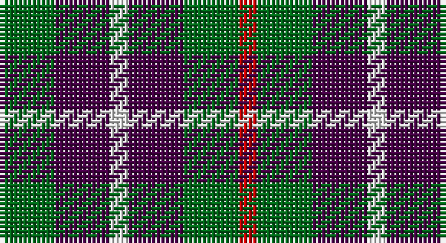

This page is one **sett** — a single exact thread-count. It belongs to the [tartan](/setts/g3dp3w1dp3g3r1/)
(the same proportion at any scale), whose colour order is pattern [GBWBGR](/stripes/gbwbgr/).

Sourced from register-of-tartans.  It is a [6 stripe tartan](/stripes/stripes6/).

Original link https://www.tartanregister.gov.uk/tartanDetails.aspx?ref=4680

## Register references

External register numbers recorded for this tartan.

- Scottish Register of Tartans: [4680](https://www.tartanregister.gov.uk/tartanDetails.aspx?ref=4680)
- Scottish Tartans Authority (ITI): 1459
- Scottish Tartans World Register: 1459

## Thread count
G/12 DP12 LN4 DP12 G12 R/4

One full sett is **96 threads**.

## Palette

Palette: <strong>Tartan Register</strong>
<table><thead><tr><th>Colour</th><th>Threads</th><th>Shade</th><th>Base</th><th>OKLCh</th></tr></thead><tbody><tr><td>G/</td><td style="text-align:right;font-variant-numeric:tabular-nums">12</td><td><code style="background-color:#006818;">#006818</code> <small style="color:#888">#006818</small></td><td>G <code style="background-color:#006100;">#006100</code></td><td><small style="color:#888">oklch(45.0% 0.142 145.0)</small></td></tr><tr><td>DP</td><td style="text-align:right;font-variant-numeric:tabular-nums">12</td><td><code style="background-color:#440044;">#440044</code> <small style="color:#888">#440044</small></td><td>B <code style="background-color:#2A418A;">#2A418A</code></td><td><small style="color:#888">oklch(27.1% 0.125 328.4)</small></td></tr><tr><td>LN</td><td style="text-align:right;font-variant-numeric:tabular-nums">4</td><td><code style="background-color:#E0E0E0;">#E0E0E0</code> <small style="color:#888">#E0E0E0</small></td><td>W <code style="background-color:#F7F7F7;">#F7F7F7</code></td><td><small style="color:#888">oklch(90.7% 0.000 89.9)</small></td></tr><tr><td>DP</td><td style="text-align:right;font-variant-numeric:tabular-nums">12</td><td><code style="background-color:#440044;">#440044</code> <small style="color:#888">#440044</small></td><td>B <code style="background-color:#2A418A;">#2A418A</code></td><td><small style="color:#888">oklch(27.1% 0.125 328.4)</small></td></tr><tr><td>G</td><td style="text-align:right;font-variant-numeric:tabular-nums">12</td><td><code style="background-color:#006818;">#006818</code> <small style="color:#888">#006818</small></td><td>G <code style="background-color:#006100;">#006100</code></td><td><small style="color:#888">oklch(45.0% 0.142 145.0)</small></td></tr><tr><td>R/</td><td style="text-align:right;font-variant-numeric:tabular-nums">4</td><td><code style="background-color:#C80000;">#C80000</code> <small style="color:#888">#C80000</small></td><td>R <code style="background-color:#CC0000;">#CC0000</code></td><td><small style="color:#888">oklch(52.3% 0.215 29.2)</small></td></tr></tbody></table>

# Sample pattern

## Nearest tartans

The nearest existing variants by ΔTartan distance, with this tartan at the top so the swatches line up against it.

ΔTartan

Tartan

Sett

—

<a href="/ttd/edit/#slug=g3dp3w1dp3g3r1~x4">Wilson's No.113</a> <a class="nn-out" href="/variants/s6/g3dp3w1dp3g3r1~x4/" title="open its dictionary page">↗</a>

1.08

<a href="/ttd/edit/#slug=g6dp3k3dp3k3dp3g6r2~x2&amp;base=g3dp3w1dp3g3r1~x4">Wilson's No.137</a> <a class="nn-out" href="/variants/s8/g6dp3k3dp3k3dp3g6r2~x2/" title="open its dictionary page">↗</a>

1.24

<a href="/ttd/edit/#slug=dp3k3dp3dg6ly2~x2&amp;base=g3dp3w1dp3g3r1~x4">Austin (Wilson's No 173)</a> <a class="nn-out" href="/variants/s5/dp3k3dp3dg6ly2~x2/" title="open its dictionary page">↗</a>

1.25

<a href="/ttd/edit/#slug=p3k3p3g6r2~x2&amp;base=g3dp3w1dp3g3r1~x4">Austin / Wilson's No 137</a> <a class="nn-out" href="/variants/s5/p3k3p3g6r2~x2/" title="open its dictionary page">↗</a>

1.31

<a href="/variants/s8/dg6dp3ki3dp3ki3dp3dg6k2~x2/">Wilson's No.173</a>

1.32

<a href="/ttd/edit/#slug=k13dy28lo13dy28k18w18k13~x2&amp;base=g3dp3w1dp3g3r1~x4">Boxer Beauty</a> <a class="nn-out" href="/variants/s7/k13dy28lo13dy28k18w18k13~x2/" title="open its dictionary page">↗</a>

1.33

<a href="/ttd/edit/#slug=k5lo5w1lo5k5r1~x10&amp;base=g3dp3w1dp3g3r1~x4">Canyon County Idaho Sheriff</a> <a class="nn-out" href="/variants/s6/k5lo5w1lo5k5r1~x10/" title="open its dictionary page">↗</a>

1.34

<a href="/ttd/edit/#slug=p3k3p3g6ly2~x2&amp;base=g3dp3w1dp3g3r1~x4">Austin / Wilson's No 173</a> <a class="nn-out" href="/variants/s5/p3k3p3g6ly2~x2/" title="open its dictionary page">↗</a>

1.41

<a href="/ttd/edit/#slug=db2g4ly1db1r2~x12&amp;base=g3dp3w1dp3g3r1~x4">Creek Indian Nation</a> <a class="nn-out" href="/variants/s5/db2g4ly1db1r2~x12/" title="open its dictionary page">↗</a>

1.43

<a href="/ttd/edit/#slug=dt6k6dt6r14ly3~x2&amp;base=g3dp3w1dp3g3r1~x4">Chivas Regal</a> <a class="nn-out" href="/variants/s5/dt6k6dt6r14ly3~x2/" title="open its dictionary page">↗</a>

1.47

<a href="/ttd/edit/#slug=dr5g6y2g6dr5db6dr2~x2&amp;base=g3dp3w1dp3g3r1~x4">Gleneagles Group</a> <a class="nn-out" href="/variants/s7/dr5g6y2g6dr5db6dr2~x2/" title="open its dictionary page">↗</a>

## Neighbour map

Every grey dot is one of 14360 variants placed by the first two principal components of the ΔTartan feature space (44% of its variance). Red is this tartan; blue dots are its nearest — click one to open its page.

<svg viewBox="0 0 640 380" role="img" style="max-width:100%;height:auto;border:1px solid #e0e0e0;border-radius:4px;display:block" xmlns="http://www.w3.org/2000/svg"><image href="/nn/cloud.v1.png" width="640" height="380"/><a href="/variants/s8/g6dp3k3dp3k3dp3g6r2~x2/"><circle cx="131.8" cy="296.9" r="4" fill="#3465a4"><title>Wilson's No.137</title></circle></a><a href="/variants/s5/dp3k3dp3dg6ly2~x2/"><circle cx="93.5" cy="305.8" r="4" fill="#3465a4"><title>Austin (Wilson's No 173)</title></circle></a><a href="/variants/s5/p3k3p3g6r2~x2/"><circle cx="85.0" cy="295.3" r="4" fill="#3465a4"><title>Austin / Wilson's No 137</title></circle></a><a href="/variants/s8/dg6dp3ki3dp3ki3dp3dg6k2~x2/"><circle cx="136.0" cy="301.9" r="4" fill="#3465a4"><title>Wilson's No.173</title></circle></a><a href="/variants/s7/k13dy28lo13dy28k18w18k13~x2/"><circle cx="83.4" cy="299.3" r="4" fill="#3465a4"><title>Boxer Beauty</title></circle></a><a href="/variants/s6/k5lo5w1lo5k5r1~x10/"><circle cx="186.7" cy="255.3" r="4" fill="#3465a4"><title>Canyon County Idaho Sheriff</title></circle></a><a href="/variants/s5/p3k3p3g6ly2~x2/"><circle cx="71.1" cy="290.4" r="4" fill="#3465a4"><title>Austin / Wilson's No 173</title></circle></a><a href="/variants/s5/db2g4ly1db1r2~x12/"><circle cx="144.2" cy="274.7" r="4" fill="#3465a4"><title>Creek Indian Nation</title></circle></a><a href="/variants/s5/dt6k6dt6r14ly3~x2/"><circle cx="160.5" cy="269.8" r="4" fill="#3465a4"><title>Chivas Regal</title></circle></a><a href="/variants/s7/dr5g6y2g6dr5db6dr2~x2/"><circle cx="131.6" cy="313.6" r="4" fill="#3465a4"><title>Gleneagles Group</title></circle></a><circle cx="148.6" cy="298.4" r="5" fill="#c00000"/></svg>

ID: /variants/s6/g3dp3w1dp3g3r1~x4/
