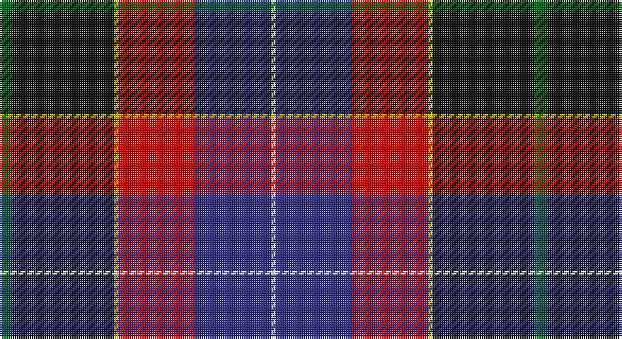

This page is one **sett** — a single exact thread-count. It belongs to the [tartan](/setts/g3k24ly1r18db18w1/)
(the same proportion at any scale), whose colour order is pattern [GKYRBW](/stripes/gkyrbw/).

Sourced from tartans-authority.  It is a [6 stripe tartan](/stripes/stripes6/).

Original link http://www.tartansauthority.com/tartan-ferret/display/11213/

## Register references

External register numbers recorded for this tartan.

- Scottish Register of Tartans: [11213](https://www.tartanregister.gov.uk/tartanDetails?ref=11213)
- Scottish Tartans Authority (ITI): 11213

## Thread count
G/6 K48 Y2 R36 DB36 W/2

One full sett is **252 threads**.

## Palette

Palette: <strong>Tartan Register</strong>
<table><thead><tr><th>Colour</th><th>Threads</th><th>Shade</th><th>Base</th><th>OKLCh</th></tr></thead><tbody><tr><td>G/</td><td style="text-align:right;font-variant-numeric:tabular-nums">6</td><td><code style="background-color:#006818;">#006818</code> <small style="color:#888">#006818</small></td><td>G <code style="background-color:#006100;">#006100</code></td><td><small style="color:#888">oklch(45.0% 0.142 145.0)</small></td></tr><tr><td>K</td><td style="text-align:right;font-variant-numeric:tabular-nums">48</td><td><code style="background-color:#101010;">#101010</code> <small style="color:#888">#101010</small></td><td>K <code style="background-color:#000000;">#000000</code></td><td><small style="color:#888">oklch(17.3% 0.000 89.9)</small></td></tr><tr><td>Y</td><td style="text-align:right;font-variant-numeric:tabular-nums">2</td><td><code style="background-color:#FCCC00;">#FCCC00</code> <small style="color:#888">#FCCC00</small></td><td>Y <code style="background-color:#F2BF00;">#F2BF00</code></td><td><small style="color:#888">oklch(86.2% 0.176 91.5)</small></td></tr><tr><td>R</td><td style="text-align:right;font-variant-numeric:tabular-nums">36</td><td><code style="background-color:#C80000;">#C80000</code> <small style="color:#888">#C80000</small></td><td>R <code style="background-color:#CC0000;">#CC0000</code></td><td><small style="color:#888">oklch(52.3% 0.215 29.2)</small></td></tr><tr><td>DB</td><td style="text-align:right;font-variant-numeric:tabular-nums">36</td><td><code style="background-color:#2C2C80;">#2C2C80</code> <small style="color:#888">#2C2C80</small></td><td>B <code style="background-color:#2A418A;">#2A418A</code></td><td><small style="color:#888">oklch(35.0% 0.138 276.6)</small></td></tr><tr><td>W/</td><td style="text-align:right;font-variant-numeric:tabular-nums">2</td><td><code style="background-color:#FCFCFC;">#FCFCFC</code> <small style="color:#888">#FCFCFC</small></td><td>W <code style="background-color:#F7F7F7;">#F7F7F7</code></td><td><small style="color:#888">oklch(99.1% 0.000 89.9)</small></td></tr></tbody></table>

# Sample pattern

## Nearest tartans

The nearest existing variants by ΔTartan distance, with this tartan at the top so the swatches line up against it.

ΔTartan

Tartan

Sett

—

<a href="/ttd/edit/#slug=g3k24ly1r18db18w1~x2">Hegarty, Philip David (Personal)</a> <a class="nn-out" href="/variants/s6/g3k24ly1r18db18w1~x2/" title="open its dictionary page">↗</a>

0.55

<a href="/ttd/edit/#slug=dg3k24lo1r18db18w1~x2&amp;base=g3k24ly1r18db18w1~x2">Hegarty, Philip David (Personal)</a> <a class="nn-out" href="/variants/s6/dg3k24lo1r18db18w1~x2/" title="open its dictionary page">↗</a>

1.11

<a href="/ttd/edit/#slug=dbi4ly1r28db25k10dbi5k3~x2&amp;base=g3k24ly1r18db18w1~x2">McKnight (Personal)</a> <a class="nn-out" href="/variants/s7/dbi4ly1r28db25k10dbi5k3~x2/" title="open its dictionary page">↗</a>

1.13

<a href="/ttd/edit/#slug=ly4dg18db4o8db8r21w1~x2&amp;base=g3k24ly1r18db18w1~x2">G P Bathija (Shikarpur, Sindh)</a> <a class="nn-out" href="/variants/s7/ly4dg18db4o8db8r21w1~x2/" title="open its dictionary page">↗</a>

1.20

<a href="/ttd/edit/#slug=ly3db3k2db18k26r21g2lb3~x2&amp;base=g3k24ly1r18db18w1~x2">Loch Etive</a> <a class="nn-out" href="/variants/s8/ly3db3k2db18k26r21g2lb3~x2/" title="open its dictionary page">↗</a>

1.24

<a href="/ttd/edit/#slug=dp18k7g5r4g7k1ly2~x2&amp;base=g3k24ly1r18db18w1~x2">Regent</a> <a class="nn-out" href="/variants/s7/dp18k7g5r4g7k1ly2~x2/" title="open its dictionary page">↗</a>

1.25

<a href="/ttd/edit/#slug=k7dbi4r31db3ly2db27lb4~x2&amp;base=g3k24ly1r18db18w1~x2">Wishart Dress (Clan)</a> <a class="nn-out" href="/variants/s7/k7dbi4r31db3ly2db27lb4~x2/" title="open its dictionary page">↗</a>

1.29

<a href="/ttd/edit/#slug=w3g2r21k26db18k2db3ly3~x2&amp;base=g3k24ly1r18db18w1~x2">Loch Etive</a> <a class="nn-out" href="/variants/s8/w3g2r21k26db18k2db3ly3~x2/" title="open its dictionary page">↗</a>

1.30

<a href="/ttd/edit/#slug=p18k7g5r4g7k1ly2~x2&amp;base=g3k24ly1r18db18w1~x2">Regent</a> <a class="nn-out" href="/variants/s7/p18k7g5r4g7k1ly2~x2/" title="open its dictionary page">↗</a>

1.34

<a href="/ttd/edit/#slug=db37g27r22w1dp6ly5~x2&amp;base=g3k24ly1r18db18w1~x2">Palazzo Bloise (Personal)</a> <a class="nn-out" href="/variants/s6/db37g27r22w1dp6ly5~x2/" title="open its dictionary page">↗</a>

1.35

<a href="/ttd/edit/#slug=dt3dg1r24dt16db28w3~x2&amp;base=g3k24ly1r18db18w1~x2">Diaspora</a> <a class="nn-out" href="/variants/s6/dt3dg1r24dt16db28w3~x2/" title="open its dictionary page">↗</a>

## Neighbour map

Every grey dot is one of 14360 variants placed by the first two principal components of the ΔTartan feature space (44% of its variance). Red is this tartan; blue dots are its nearest — click one to open its page.

<svg viewBox="0 0 640 380" role="img" style="max-width:100%;height:auto;border:1px solid #e0e0e0;border-radius:4px;display:block" xmlns="http://www.w3.org/2000/svg"><image href="/nn/cloud.v1.png" width="640" height="380"/><a href="/variants/s6/dg3k24lo1r18db18w1~x2/"><circle cx="211.8" cy="149.0" r="4" fill="#3465a4"><title>Hegarty, Philip David (Personal)</title></circle></a><a href="/variants/s7/dbi4ly1r28db25k10dbi5k3~x2/"><circle cx="225.0" cy="136.1" r="4" fill="#3465a4"><title>McKnight (Personal)</title></circle></a><a href="/variants/s7/ly4dg18db4o8db8r21w1~x2/"><circle cx="149.2" cy="146.6" r="4" fill="#3465a4"><title>G P Bathija (Shikarpur, Sindh)</title></circle></a><a href="/variants/s8/ly3db3k2db18k26r21g2lb3~x2/"><circle cx="157.9" cy="136.8" r="4" fill="#3465a4"><title>Loch Etive</title></circle></a><a href="/variants/s7/dp18k7g5r4g7k1ly2~x2/"><circle cx="215.0" cy="170.7" r="4" fill="#3465a4"><title>Regent</title></circle></a><a href="/variants/s7/k7dbi4r31db3ly2db27lb4~x2/"><circle cx="199.4" cy="127.5" r="4" fill="#3465a4"><title>Wishart Dress (Clan)</title></circle></a><a href="/variants/s8/w3g2r21k26db18k2db3ly3~x2/"><circle cx="152.9" cy="133.1" r="4" fill="#3465a4"><title>Loch Etive</title></circle></a><a href="/variants/s7/p18k7g5r4g7k1ly2~x2/"><circle cx="185.6" cy="151.0" r="4" fill="#3465a4"><title>Regent</title></circle></a><a href="/variants/s6/db37g27r22w1dp6ly5~x2/"><circle cx="212.5" cy="139.8" r="4" fill="#3465a4"><title>Palazzo Bloise (Personal)</title></circle></a><a href="/variants/s6/dt3dg1r24dt16db28w3~x2/"><circle cx="242.9" cy="159.1" r="4" fill="#3465a4"><title>Diaspora</title></circle></a><circle cx="196.4" cy="141.3" r="5" fill="#c00000"/></svg>

ID: /variants/s6/g3k24ly1r18db18w1~x2/
