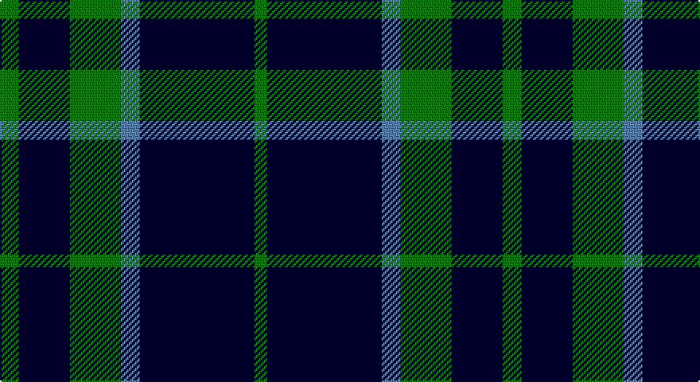

This page is one **sett** — a single exact thread-count. It belongs to the [tartan](/setts/g3k8g8t3k18g2/)
(the same proportion at any scale), whose colour order is pattern [GKBGKG](/stripes/gkbgkg/).

Sourced from weddslist.  It is a [6 stripe tartan](/stripes/stripes6/).

Original link http://www.weddslist.com/cgi-bin/tartans/pg.pl?source=sts

## Thread count
G/12 DB32 G32 B12 DB72 G/8

One full sett is **316 threads**.

## Palette

Palette: <strong>custom</strong>
<table><thead><tr><th>Colour</th><th>Threads</th><th>Shade</th><th>Base</th><th>OKLCh</th></tr></thead><tbody><tr><td>G/</td><td style="text-align:right;font-variant-numeric:tabular-nums">12</td><td><code style="background-color:#008000;">#008000</code> <small style="color:#888">#008000</small></td><td>G <code style="background-color:#006100;">#006100</code></td><td><small style="color:#888">oklch(52.0% 0.177 142.5)</small></td></tr><tr><td>DB</td><td style="text-align:right;font-variant-numeric:tabular-nums">32</td><td><code style="background-color:#000030;">#000030</code> <small style="color:#888">#000030</small></td><td>K <code style="background-color:#000000;">#000000</code></td><td><small style="color:#888">oklch(14.0% 0.097 264.1)</small></td></tr><tr><td>G</td><td style="text-align:right;font-variant-numeric:tabular-nums">32</td><td><code style="background-color:#008000;">#008000</code> <small style="color:#888">#008000</small></td><td>G <code style="background-color:#006100;">#006100</code></td><td><small style="color:#888">oklch(52.0% 0.177 142.5)</small></td></tr><tr><td>B</td><td style="text-align:right;font-variant-numeric:tabular-nums">12</td><td><code style="background-color:#5480B0;">#5480B0</code> <small style="color:#888">#5480B0</small></td><td>B <code style="background-color:#2A418A;">#2A418A</code></td><td><small style="color:#888">oklch(58.8% 0.089 251.5)</small></td></tr><tr><td>DB</td><td style="text-align:right;font-variant-numeric:tabular-nums">72</td><td><code style="background-color:#000030;">#000030</code> <small style="color:#888">#000030</small></td><td>K <code style="background-color:#000000;">#000000</code></td><td><small style="color:#888">oklch(14.0% 0.097 264.1)</small></td></tr><tr><td>G/</td><td style="text-align:right;font-variant-numeric:tabular-nums">8</td><td><code style="background-color:#008000;">#008000</code> <small style="color:#888">#008000</small></td><td>G <code style="background-color:#006100;">#006100</code></td><td><small style="color:#888">oklch(52.0% 0.177 142.5)</small></td></tr></tbody></table>

# Sample pattern

## Nearest tartans

The nearest existing variants by ΔTartan distance, with this tartan at the top so the swatches line up against it.

ΔTartan

Tartan

Sett

—

<a href="/ttd/edit/#slug=g3k8g8t3k18g2~x4">Kincardine City</a> <a class="nn-out" href="/variants/s6/g3k8g8t3k18g2~x4/" title="open its dictionary page">↗</a>

1.44

<a href="/ttd/edit/#slug=k2g11k26b11k2~x2&amp;base=g3k8g8t3k18g2~x4">Campbell of Loch Awe</a> <a class="nn-out" href="/variants/s5/k2g11k26b11k2~x2/" title="open its dictionary page">↗</a>

1.46

<a href="/ttd/edit/#slug=k16g15k4t12k22w2k6~x2&amp;base=g3k8g8t3k18g2~x4">Frame (Edinburgh) (Personal)</a> <a class="nn-out" href="/variants/s7/k16g15k4t12k22w2k6~x2/" title="open its dictionary page">↗</a>

1.48

<a href="/ttd/edit/#slug=db1g12db4lb1db4g4db1~x4&amp;base=g3k8g8t3k18g2~x4">St. Dennis &amp; Cranley School</a> <a class="nn-out" href="/variants/s7/db1g12db4lb1db4g4db1~x4/" title="open its dictionary page">↗</a>

1.53

<a href="/ttd/edit/#slug=k2db11k26g11k2~x2&amp;base=g3k8g8t3k18g2~x4">Campbell of Lochawe</a> <a class="nn-out" href="/variants/s5/k2db11k26g11k2~x2/" title="open its dictionary page">↗</a>

1.56

<a href="/ttd/edit/#slug=dg4db12r3db12dg32lb4&amp;base=g3k8g8t3k18g2~x4">MacIntyre L</a> <a class="nn-out" href="/variants/s6/dg4db12r3db12dg32lb4/" title="open its dictionary page">↗</a>

1.56

<a href="/ttd/edit/#slug=m4k28b3k3b25k3~x2&amp;base=g3k8g8t3k18g2~x4">Slanj (Corporate)</a> <a class="nn-out" href="/variants/s6/m4k28b3k3b25k3~x2/" title="open its dictionary page">↗</a>

1.57

<a href="/ttd/edit/#slug=k10t1k2t1k4t10g1t2~x4&amp;base=g3k8g8t3k18g2~x4">Martin's Own</a> <a class="nn-out" href="/variants/s8/k10t1k2t1k4t10g1t2~x4/" title="open its dictionary page">↗</a>

1.57

<a href="/ttd/edit/#slug=db8g2db8g15lb2~x4&amp;base=g3k8g8t3k18g2~x4">Hamilton Green Hunting</a> <a class="nn-out" href="/variants/s5/db8g2db8g15lb2~x4/" title="open its dictionary page">↗</a>

1.59

<a href="/ttd/edit/#slug=k36w3k10w3g28r6k18~x2&amp;base=g3k8g8t3k18g2~x4">Wild Highlanders (Corporate)</a> <a class="nn-out" href="/variants/s7/k36w3k10w3g28r6k18~x2/" title="open its dictionary page">↗</a>

1.61

<a href="/ttd/edit/#slug=lr3k3lr3k10r1~x6&amp;base=g3k8g8t3k18g2~x4">Burberry Blue</a> <a class="nn-out" href="/variants/s5/lr3k3lr3k10r1~x6/" title="open its dictionary page">↗</a>

## Neighbour map

Every grey dot is one of 14360 variants placed by the first two principal components of the ΔTartan feature space (44% of its variance). Red is this tartan; blue dots are its nearest — click one to open its page.

<svg viewBox="0 0 640 380" role="img" style="max-width:100%;height:auto;border:1px solid #e0e0e0;border-radius:4px;display:block" xmlns="http://www.w3.org/2000/svg"><image href="/nn/cloud.v1.png" width="640" height="380"/><a href="/variants/s5/k2g11k26b11k2~x2/"><circle cx="350.1" cy="245.0" r="4" fill="#3465a4"><title>Campbell of Loch Awe</title></circle></a><a href="/variants/s7/k16g15k4t12k22w2k6~x2/"><circle cx="305.1" cy="233.6" r="4" fill="#3465a4"><title>Frame (Edinburgh) (Personal)</title></circle></a><a href="/variants/s7/db1g12db4lb1db4g4db1~x4/"><circle cx="369.2" cy="225.6" r="4" fill="#3465a4"><title>St. Dennis &amp; Cranley School</title></circle></a><a href="/variants/s5/k2db11k26g11k2~x2/"><circle cx="323.1" cy="235.0" r="4" fill="#3465a4"><title>Campbell of Lochawe</title></circle></a><a href="/variants/s6/dg4db12r3db12dg32lb4/"><circle cx="301.0" cy="219.4" r="4" fill="#3465a4"><title>MacIntyre L</title></circle></a><a href="/variants/s6/m4k28b3k3b25k3~x2/"><circle cx="323.2" cy="228.3" r="4" fill="#3465a4"><title>Slanj (Corporate)</title></circle></a><a href="/variants/s8/k10t1k2t1k4t10g1t2~x4/"><circle cx="309.6" cy="209.0" r="4" fill="#3465a4"><title>Martin's Own</title></circle></a><a href="/variants/s5/db8g2db8g15lb2~x4/"><circle cx="282.4" cy="272.2" r="4" fill="#3465a4"><title>Hamilton Green Hunting</title></circle></a><a href="/variants/s7/k36w3k10w3g28r6k18~x2/"><circle cx="328.7" cy="209.9" r="4" fill="#3465a4"><title>Wild Highlanders (Corporate)</title></circle></a><a href="/variants/s5/lr3k3lr3k10r1~x6/"><circle cx="351.1" cy="237.5" r="4" fill="#3465a4"><title>Burberry Blue</title></circle></a><circle cx="338.2" cy="249.5" r="5" fill="#c00000"/></svg>

ID: /variants/s6/g3k8g8t3k18g2~x4/
