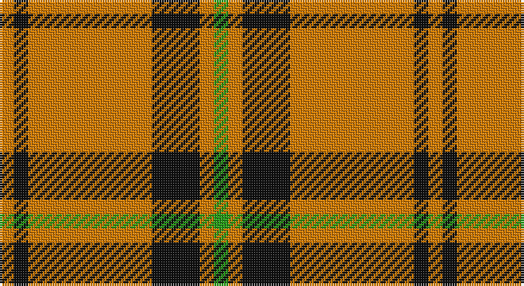

This page is one **sett** — a single exact thread-count. It belongs to the [tartan](/setts/g3lo3k10lo26k3lo3/)
(the same proportion at any scale), whose colour order is pattern [GYKYKY](/stripes/gykyky/).

Sourced from register-of-tartans.  It is a [6 stripe tartan](/stripes/stripes6/).

Original link https://www.tartanregister.gov.uk/tartanDetails.aspx?ref=5544

## Register references

External register numbers recorded for this tartan.

- Scottish Register of Tartans: [5544](https://www.tartanregister.gov.uk/tartanDetails.aspx?ref=5544)
- Scottish Tartans Authority (ITI): 7504

## Thread count
O/6 K6 O52 K20 O6 G/6

One full sett is **180 threads**.

## Palette

Palette: <strong>Tartan Register</strong>
<table><thead><tr><th>Colour</th><th>Threads</th><th>Shade</th><th>Base</th><th>OKLCh</th></tr></thead><tbody><tr><td>O/</td><td style="text-align:right;font-variant-numeric:tabular-nums">6</td><td><code style="background-color:#D87C00;">#D87C00</code> <small style="color:#888">#D87C00</small></td><td>Y <code style="background-color:#F2BF00;">#F2BF00</code></td><td><small style="color:#888">oklch(67.3% 0.155 61.8)</small></td></tr><tr><td>K</td><td style="text-align:right;font-variant-numeric:tabular-nums">6</td><td><code style="background-color:#101010;">#101010</code> <small style="color:#888">#101010</small></td><td>K <code style="background-color:#000000;">#000000</code></td><td><small style="color:#888">oklch(17.3% 0.000 89.9)</small></td></tr><tr><td>O</td><td style="text-align:right;font-variant-numeric:tabular-nums">52</td><td><code style="background-color:#D87C00;">#D87C00</code> <small style="color:#888">#D87C00</small></td><td>Y <code style="background-color:#F2BF00;">#F2BF00</code></td><td><small style="color:#888">oklch(67.3% 0.155 61.8)</small></td></tr><tr><td>K</td><td style="text-align:right;font-variant-numeric:tabular-nums">20</td><td><code style="background-color:#101010;">#101010</code> <small style="color:#888">#101010</small></td><td>K <code style="background-color:#000000;">#000000</code></td><td><small style="color:#888">oklch(17.3% 0.000 89.9)</small></td></tr><tr><td>O</td><td style="text-align:right;font-variant-numeric:tabular-nums">6</td><td><code style="background-color:#D87C00;">#D87C00</code> <small style="color:#888">#D87C00</small></td><td>Y <code style="background-color:#F2BF00;">#F2BF00</code></td><td><small style="color:#888">oklch(67.3% 0.155 61.8)</small></td></tr><tr><td>G/</td><td style="text-align:right;font-variant-numeric:tabular-nums">6</td><td><code style="background-color:#289C18;">#289C18</code> <small style="color:#888">#289C18</small></td><td>G <code style="background-color:#006100;">#006100</code></td><td><small style="color:#888">oklch(60.6% 0.191 141.6)</small></td></tr></tbody></table>

# Sample pattern

## Nearest tartans

The nearest existing variants by ΔTartan distance, with this tartan at the top so the swatches line up against it.

ΔTartan

Tartan

Sett

—

<a href="/ttd/edit/#slug=g3lo3k10lo26k3lo3~x2">Volkswagen Orange Trim</a> <a class="nn-out" href="/variants/s6/g3lo3k10lo26k3lo3~x2/" title="open its dictionary page">↗</a>

0.00

<a href="/ttd/edit/#slug=lo26k10lo3g3lo3k3~x6&amp;base=g3lo3k10lo26k3lo3~x2">Volkswagen Orange Trim (Fashion)</a> <a class="nn-out" href="/variants/s6/lo26k10lo3g3lo3k3~x6/" title="open its dictionary page">↗</a>

1.27

<a href="/ttd/edit/#slug=o38w9o3dr9w3~x2&amp;base=g3lo3k10lo26k3lo3~x2">Loch Tummel</a> <a class="nn-out" href="/variants/s5/o38w9o3dr9w3~x2/" title="open its dictionary page">↗</a>

1.36

<a href="/ttd/edit/#slug=ly1k4ly1k4ly11r1ly1~x4&amp;base=g3lo3k10lo26k3lo3~x2">Baileville (Personal)</a> <a class="nn-out" href="/variants/s7/ly1k4ly1k4ly11r1ly1~x4/" title="open its dictionary page">↗</a>

1.40

<a href="/ttd/edit/#slug=w15dy15w15dy80r6&amp;base=g3lo3k10lo26k3lo3~x2">Coca Cola (Corporate)</a> <a class="nn-out" href="/variants/s5/w15dy15w15dy80r6/" title="open its dictionary page">↗</a>

1.40

<a href="/ttd/edit/#slug=k4o2r2o2k2o15ly2~x4&amp;base=g3lo3k10lo26k3lo3~x2">Welsh, National</a> <a class="nn-out" href="/variants/s7/k4o2r2o2k2o15ly2~x4/" title="open its dictionary page">↗</a>

1.41

<a href="/ttd/edit/#slug=ly1k4ly1k4ly11m1ly1~x4&amp;base=g3lo3k10lo26k3lo3~x2">Baillieville</a> <a class="nn-out" href="/variants/s7/ly1k4ly1k4ly11m1ly1~x4/" title="open its dictionary page">↗</a>

1.42

<a href="/ttd/edit/#slug=dy38w9dy3k9w3~x2&amp;base=g3lo3k10lo26k3lo3~x2">Loch Tummel</a> <a class="nn-out" href="/variants/s5/dy38w9dy3k9w3~x2/" title="open its dictionary page">↗</a>

1.45

<a href="/ttd/edit/#slug=w7dy7w7dy40r3~x2&amp;base=g3lo3k10lo26k3lo3~x2">Coca Cola</a> <a class="nn-out" href="/variants/s5/w7dy7w7dy40r3~x2/" title="open its dictionary page">↗</a>

1.52

<a href="/ttd/edit/#slug=w11r40g13r5g12r5~x2&amp;base=g3lo3k10lo26k3lo3~x2">Makhtoum</a> <a class="nn-out" href="/variants/s6/w11r40g13r5g12r5~x2/" title="open its dictionary page">↗</a>

1.52

<a href="/ttd/edit/#slug=lo4k6lo1k1lo16k2~x2&amp;base=g3lo3k10lo26k3lo3~x2">Monoch Airline</a> <a class="nn-out" href="/variants/s6/lo4k6lo1k1lo16k2~x2/" title="open its dictionary page">↗</a>

## Neighbour map

Every grey dot is one of 14360 variants placed by the first two principal components of the ΔTartan feature space (44% of its variance). Red is this tartan; blue dots are its nearest — click one to open its page.

<svg viewBox="0 0 640 380" role="img" style="max-width:100%;height:auto;border:1px solid #e0e0e0;border-radius:4px;display:block" xmlns="http://www.w3.org/2000/svg"><image href="/nn/cloud.v1.png" width="640" height="380"/><a href="/variants/s6/lo26k10lo3g3lo3k3~x6/"><circle cx="385.2" cy="196.1" r="4" fill="#3465a4"><title>Volkswagen Orange Trim (Fashion)</title></circle></a><a href="/variants/s5/o38w9o3dr9w3~x2/"><circle cx="406.8" cy="198.6" r="4" fill="#3465a4"><title>Loch Tummel</title></circle></a><a href="/variants/s7/ly1k4ly1k4ly11r1ly1~x4/"><circle cx="334.4" cy="174.5" r="4" fill="#3465a4"><title>Baileville (Personal)</title></circle></a><a href="/variants/s5/w15dy15w15dy80r6/"><circle cx="444.0" cy="198.1" r="4" fill="#3465a4"><title>Coca Cola (Corporate)</title></circle></a><a href="/variants/s7/k4o2r2o2k2o15ly2~x4/"><circle cx="344.2" cy="182.9" r="4" fill="#3465a4"><title>Welsh, National</title></circle></a><a href="/variants/s7/ly1k4ly1k4ly11m1ly1~x4/"><circle cx="329.7" cy="174.1" r="4" fill="#3465a4"><title>Baillieville</title></circle></a><a href="/variants/s5/dy38w9dy3k9w3~x2/"><circle cx="381.5" cy="193.6" r="4" fill="#3465a4"><title>Loch Tummel</title></circle></a><a href="/variants/s5/w7dy7w7dy40r3~x2/"><circle cx="454.2" cy="197.0" r="4" fill="#3465a4"><title>Coca Cola</title></circle></a><a href="/variants/s6/w11r40g13r5g12r5~x2/"><circle cx="327.5" cy="217.2" r="4" fill="#3465a4"><title>Makhtoum</title></circle></a><a href="/variants/s6/lo4k6lo1k1lo16k2~x2/"><circle cx="445.2" cy="190.9" r="4" fill="#3465a4"><title>Monoch Airline</title></circle></a><circle cx="385.2" cy="196.1" r="5" fill="#c00000"/></svg>

ID: /variants/s6/g3lo3k10lo26k3lo3~x2/
