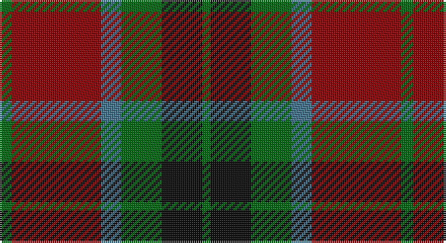

This page is one **sett** — a single exact thread-count. It belongs to the [tartan](/setts/g3r22t5g10k10g2/)
(the same proportion at any scale), whose colour order is pattern [GKGBRG](/stripes/gkgbrg/).

Part of the [Strathspey](/tartans/strathspey/) tartan — the named design grouping this sett with its other cloths.

Sourced from tartans-authority.  It is a [6 stripe tartan](/stripes/stripes6/).

Original link http://www.tartansauthority.com/tartan-ferret/display/777/

## Also known as

This cloth is also recorded under:

- Strathspey Estate Check
- Strathspey, Check

2 attestations — the source records this cloth was collapsed from (oldest owns this page)

<ul>
<li>1975 — Strathspey (Fashion) (tartans-authority, <a href="http://www.tartansauthority.com/tartan-ferret/display/777/">record</a>)</li>
<li>undated — Strathspey, Check (weddslist, <a href="http://www.weddslist.com/cgi-bin/tartans/pg.pl?source=sts">record</a>)</li>
</ul>

## Register references

External register numbers recorded for this tartan.

- Scottish Tartans Authority (ITI): 777

## Thread count
G/6 DR44 B10 G20 K20 G/4

One full sett is **198 threads**.

## Palette

Palette: <strong>Tartan Register</strong> <small style="color:#888">(3 of 4 colours)</small>
<table><thead><tr><th>Colour</th><th>Threads</th><th>Shade</th><th>Base</th><th>OKLCh</th></tr></thead><tbody><tr><td>G/</td><td style="text-align:right;font-variant-numeric:tabular-nums">6</td><td><code style="background-color:#006818;">#006818</code> <small style="color:#888">#006818</small></td><td>G <code style="background-color:#006100;">#006100</code></td><td><small style="color:#888">oklch(45.0% 0.142 145.0)</small></td></tr><tr><td>DR</td><td style="text-align:right;font-variant-numeric:tabular-nums">44</td><td><code style="background-color:#880000;">#880000</code> <small style="color:#888">#880000</small></td><td>R <code style="background-color:#CC0000;">#CC0000</code></td><td><small style="color:#888">oklch(39.4% 0.162 29.2)</small></td></tr><tr><td>B</td><td style="text-align:right;font-variant-numeric:tabular-nums">10</td><td><code style="background-color:#48748C;">#48748C</code> <small style="color:#888">#48748C</small></td><td>B <code style="background-color:#2A418A;">#2A418A</code></td><td><small style="color:#888">oklch(53.7% 0.061 233.4)</small></td></tr><tr><td>G</td><td style="text-align:right;font-variant-numeric:tabular-nums">20</td><td><code style="background-color:#006818;">#006818</code> <small style="color:#888">#006818</small></td><td>G <code style="background-color:#006100;">#006100</code></td><td><small style="color:#888">oklch(45.0% 0.142 145.0)</small></td></tr><tr><td>K</td><td style="text-align:right;font-variant-numeric:tabular-nums">20</td><td><code style="background-color:#101010;">#101010</code> <small style="color:#888">#101010</small></td><td>K <code style="background-color:#000000;">#000000</code></td><td><small style="color:#888">oklch(17.3% 0.000 89.9)</small></td></tr><tr><td>G/</td><td style="text-align:right;font-variant-numeric:tabular-nums">4</td><td><code style="background-color:#006818;">#006818</code> <small style="color:#888">#006818</small></td><td>G <code style="background-color:#006100;">#006100</code></td><td><small style="color:#888">oklch(45.0% 0.142 145.0)</small></td></tr></tbody></table>

# Sample pattern

## Compared to the master

This cloth is one sett of its design; the master sett (the exemplar the design is anchored on) is below for comparison.

<figure style="margin:0"><figcaption style="color:#888;font-size:smaller">this sett</figcaption></figure>
<figure style="margin:0"><figcaption style="color:#888;font-size:smaller"><a href="/setts/do1w1k1w1do1w1k1w1dt1/">master sett →</a></figcaption></figure>

## Nearest tartans

The nearest existing variants by ΔTartan distance, with this tartan at the top so the swatches line up against it.

ΔTartan

Tartan

Sett

—

<a href="/ttd/edit/#slug=g3r22t5g10k10g2~x2">Strathspey (Fashion)</a> <a class="nn-out" href="/variants/s6/g3r22t5g10k10g2~x2/" title="open its dictionary page">↗</a>

0.58

<a href="/ttd/edit/#slug=g4r28db6g10k10g3~x2&amp;base=g3r22t5g10k10g2~x2">Canadian Autumn</a> <a class="nn-out" href="/variants/s6/g4r28db6g10k10g3~x2/" title="open its dictionary page">↗</a>

0.83

<a href="/ttd/edit/#slug=dg12b6dg6r15k1r1k2~x2&amp;base=g3r22t5g10k10g2~x2">(2) Cook</a> <a class="nn-out" href="/variants/s7/dg12b6dg6r15k1r1k2~x2/" title="open its dictionary page">↗</a>

0.89

<a href="/ttd/edit/#slug=lb2dr12g6dr1n6dr1~x4&amp;base=g3r22t5g10k10g2~x2">Fraser Green</a> <a class="nn-out" href="/variants/s6/lb2dr12g6dr1n6dr1~x4/" title="open its dictionary page">↗</a>

0.95

<a href="/ttd/edit/#slug=do24g2do5lo14g2lo5dy17do2~x2&amp;base=g3r22t5g10k10g2~x2">Loch Rannoch Trade Tartan</a> <a class="nn-out" href="/variants/s8/do24g2do5lo14g2lo5dy17do2~x2/" title="open its dictionary page">↗</a>

0.96

<a href="/ttd/edit/#slug=r3db12r4g18r6k2~x2&amp;base=g3r22t5g10k10g2~x2">Eyre (Personal)</a> <a class="nn-out" href="/variants/s6/r3db12r4g18r6k2~x2/" title="open its dictionary page">↗</a>

0.98

<a href="/ttd/edit/#slug=t4dy28g6t12k12t3~x2&amp;base=g3r22t5g10k10g2~x2">MacTavish Hunting</a> <a class="nn-out" href="/variants/s6/t4dy28g6t12k12t3~x2/" title="open its dictionary page">↗</a>

1.01

<a href="/ttd/edit/#slug=r8g2r12k6r3db3g24k2~x2&amp;base=g3r22t5g10k10g2~x2">McInery (Personal)</a> <a class="nn-out" href="/variants/s8/r8g2r12k6r3db3g24k2~x2/" title="open its dictionary page">↗</a>

1.05

<a href="/ttd/edit/#slug=db7r26db7dg24ly2~x2&amp;base=g3r22t5g10k10g2~x2">McCarthy, Old</a> <a class="nn-out" href="/variants/s5/db7r26db7dg24ly2~x2/" title="open its dictionary page">↗</a>

1.06

<a href="/ttd/edit/#slug=dg12g6dg6r15k1r1k2~x2&amp;base=g3r22t5g10k10g2~x2">Cook (Name)</a> <a class="nn-out" href="/variants/s7/dg12g6dg6r15k1r1k2~x2/" title="open its dictionary page">↗</a>

1.07

<a href="/ttd/edit/#slug=t3dy26g4t13k13t2~x2&amp;base=g3r22t5g10k10g2~x2">MacTavish Hunting Clan Tartan</a> <a class="nn-out" href="/variants/s6/t3dy26g4t13k13t2~x2/" title="open its dictionary page">↗</a>

## Neighbour map

Every grey dot is one of 14360 variants placed by the first two principal components of the ΔTartan feature space (44% of its variance). Red is this tartan; blue dots are its nearest — click one to open its page.

<svg viewBox="0 0 640 380" role="img" style="max-width:100%;height:auto;border:1px solid #e0e0e0;border-radius:4px;display:block" xmlns="http://www.w3.org/2000/svg"><image href="/nn/cloud.v1.png" width="640" height="380"/><a href="/variants/s6/g4r28db6g10k10g3~x2/"><circle cx="267.4" cy="227.4" r="4" fill="#3465a4"><title>Canadian Autumn</title></circle></a><a href="/variants/s7/dg12b6dg6r15k1r1k2~x2/"><circle cx="274.9" cy="211.3" r="4" fill="#3465a4"><title>(2) Cook</title></circle></a><a href="/variants/s6/lb2dr12g6dr1n6dr1~x4/"><circle cx="287.9" cy="212.9" r="4" fill="#3465a4"><title>Fraser Green</title></circle></a><a href="/variants/s8/do24g2do5lo14g2lo5dy17do2~x2/"><circle cx="277.2" cy="206.8" r="4" fill="#3465a4"><title>Loch Rannoch Trade Tartan</title></circle></a><a href="/variants/s6/r3db12r4g18r6k2~x2/"><circle cx="215.3" cy="224.8" r="4" fill="#3465a4"><title>Eyre (Personal)</title></circle></a><a href="/variants/s6/t4dy28g6t12k12t3~x2/"><circle cx="237.6" cy="231.6" r="4" fill="#3465a4"><title>MacTavish Hunting</title></circle></a><a href="/variants/s8/r8g2r12k6r3db3g24k2~x2/"><circle cx="281.0" cy="201.8" r="4" fill="#3465a4"><title>McInery (Personal)</title></circle></a><a href="/variants/s5/db7r26db7dg24ly2~x2/"><circle cx="274.0" cy="241.6" r="4" fill="#3465a4"><title>McCarthy, Old</title></circle></a><a href="/variants/s7/dg12g6dg6r15k1r1k2~x2/"><circle cx="252.7" cy="191.8" r="4" fill="#3465a4"><title>Cook (Name)</title></circle></a><a href="/variants/s6/t3dy26g4t13k13t2~x2/"><circle cx="251.6" cy="215.6" r="4" fill="#3465a4"><title>MacTavish Hunting Clan Tartan</title></circle></a><circle cx="251.6" cy="226.8" r="5" fill="#c00000"/></svg>

ID: /variants/s6/g3r22t5g10k10g2~x2/
