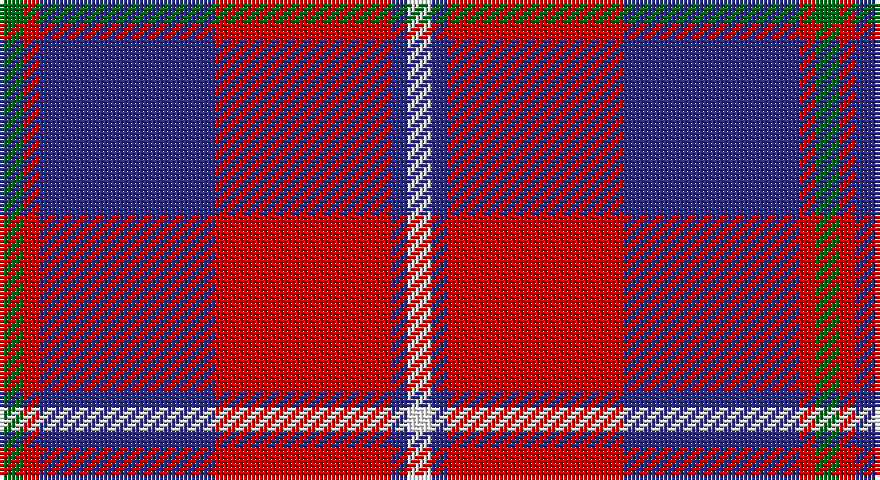

This page is one **sett** — a single exact thread-count. It belongs to the [tartan](/setts/g3r2db22r22db2w3/)
(the same proportion at any scale), whose colour order is pattern [GRBRBW](/stripes/grbrbw/).

Part of the [Galloway](/tartans/galloway/) tartan — the named design grouping this sett with its other cloths.

Sourced from register-of-tartans.  It is a [6 stripe tartan](/stripes/stripes6/).

Original link https://www.tartanregister.gov.uk/tartanDetails.aspx?ref=1306

## Also known as

This cloth is also recorded under:

- Galloway Family
- Galloway Green
- Galloway Red
- Galloway, Green
- Galloway, Red

2 attestations — the source records this cloth was collapsed from (oldest owns this page)

<ul>
<li>01/01/1950 — Galloway Red (register-of-tartans, <a href="https://www.tartanregister.gov.uk/tartanDetails.aspx?ref=1306">record</a>)</li>
<li>1950 — Galloway, Red (District) (tartans-authority, <a href="http://www.tartansauthority.com/tartan-ferret/display/843/">record</a>)</li>
</ul>

## Register references

External register numbers recorded for this tartan.

- Scottish Register of Tartans: [1306](https://www.tartanregister.gov.uk/tartanDetails.aspx?ref=1306)
- Scottish Tartans Authority (ITI): 843
- Scottish Tartans World Register: 843

## Thread count
G/6 R4 DB44 R44 DB4 W/6

One full sett is **204 threads**.

## Palette

Palette: <strong>Tartan Register</strong>
<table><thead><tr><th>Colour</th><th>Threads</th><th>Shade</th><th>Base</th><th>OKLCh</th></tr></thead><tbody><tr><td>G/</td><td style="text-align:right;font-variant-numeric:tabular-nums">6</td><td><code style="background-color:#006818;">#006818</code> <small style="color:#888">#006818</small></td><td>G <code style="background-color:#006100;">#006100</code></td><td><small style="color:#888">oklch(45.0% 0.142 145.0)</small></td></tr><tr><td>R</td><td style="text-align:right;font-variant-numeric:tabular-nums">4</td><td><code style="background-color:#C80000;">#C80000</code> <small style="color:#888">#C80000</small></td><td>R <code style="background-color:#CC0000;">#CC0000</code></td><td><small style="color:#888">oklch(52.3% 0.215 29.2)</small></td></tr><tr><td>DB</td><td style="text-align:right;font-variant-numeric:tabular-nums">44</td><td><code style="background-color:#2C2C80;">#2C2C80</code> <small style="color:#888">#2C2C80</small></td><td>B <code style="background-color:#2A418A;">#2A418A</code></td><td><small style="color:#888">oklch(35.0% 0.138 276.6)</small></td></tr><tr><td>R</td><td style="text-align:right;font-variant-numeric:tabular-nums">44</td><td><code style="background-color:#C80000;">#C80000</code> <small style="color:#888">#C80000</small></td><td>R <code style="background-color:#CC0000;">#CC0000</code></td><td><small style="color:#888">oklch(52.3% 0.215 29.2)</small></td></tr><tr><td>DB</td><td style="text-align:right;font-variant-numeric:tabular-nums">4</td><td><code style="background-color:#2C2C80;">#2C2C80</code> <small style="color:#888">#2C2C80</small></td><td>B <code style="background-color:#2A418A;">#2A418A</code></td><td><small style="color:#888">oklch(35.0% 0.138 276.6)</small></td></tr><tr><td>W/</td><td style="text-align:right;font-variant-numeric:tabular-nums">6</td><td><code style="background-color:#FCFCFC;">#FCFCFC</code> <small style="color:#888">#FCFCFC</small></td><td>W <code style="background-color:#F7F7F7;">#F7F7F7</code></td><td><small style="color:#888">oklch(99.1% 0.000 89.9)</small></td></tr></tbody></table>

# Sample pattern

## Compared to the master

This cloth is one sett of its design; the master sett (the exemplar the design is anchored on) is below for comparison.

<figure style="margin:0"><figcaption style="color:#888;font-size:smaller">this sett</figcaption></figure>
<figure style="margin:0"><figcaption style="color:#888;font-size:smaller"><a href="/setts/r3b2w35b35r2g3/">master sett →</a></figcaption></figure>

## Nearest tartans

The nearest existing variants by ΔTartan distance, with this tartan at the top so the swatches line up against it.

ΔTartan

Tartan

Sett

—

<a href="/ttd/edit/#slug=g3r2db22r22db2w3~x2">Galloway Red</a> <a class="nn-out" href="/variants/s6/g3r2db22r22db2w3~x2/" title="open its dictionary page">↗</a>

0.71

<a href="/ttd/edit/#slug=dg2r1db16r16db1ly2~x2&amp;base=g3r2db22r22db2w3~x2">Galloway Dress (Yellow Line)</a> <a class="nn-out" href="/variants/s6/dg2r1db16r16db1ly2~x2/" title="open its dictionary page">↗</a>

0.90

<a href="/ttd/edit/#slug=k3r11db3w1db3w1~x4&amp;base=g3r2db22r22db2w3~x2">Suntan (Masai Shuka) (District?)</a> <a class="nn-out" href="/variants/s6/k3r11db3w1db3w1~x4/" title="open its dictionary page">↗</a>

0.91

<a href="/ttd/edit/#slug=k4b32r30b2w5k2~x2&amp;base=g3r2db22r22db2w3~x2">Masai Shuka 17 (Artefact)</a> <a class="nn-out" href="/variants/s6/k4b32r30b2w5k2~x2/" title="open its dictionary page">↗</a>

0.97

<a href="/ttd/edit/#slug=w2db3r24db15w6db3ly2~x2&amp;base=g3r2db22r22db2w3~x2">Fazzolettone (Fashion?)</a> <a class="nn-out" href="/variants/s7/w2db3r24db15w6db3ly2~x2/" title="open its dictionary page">↗</a>

0.98

<a href="/ttd/edit/#slug=k1r7k1r7db16g1~x2&amp;base=g3r2db22r22db2w3~x2">Robinson, dress</a> <a class="nn-out" href="/variants/s6/k1r7k1r7db16g1~x2/" title="open its dictionary page">↗</a>

0.99

<a href="/ttd/edit/#slug=db1r16db6ly4db6w1~x4&amp;base=g3r2db22r22db2w3~x2">Superfast Ferries (Corporate)</a> <a class="nn-out" href="/variants/s6/db1r16db6ly4db6w1~x4/" title="open its dictionary page">↗</a>

1.02

<a href="/ttd/edit/#slug=g2r1db16r16db1ly2~x2&amp;base=g3r2db22r22db2w3~x2">Galloway dress</a> <a class="nn-out" href="/variants/s6/g2r1db16r16db1ly2~x2/" title="open its dictionary page">↗</a>

1.05

<a href="/ttd/edit/#slug=k1r7k1r7db16g1~x4&amp;base=g3r2db22r22db2w3~x2">Robinson Dress (Pendleton) #1</a> <a class="nn-out" href="/variants/s6/k1r7k1r7db16g1~x4/" title="open its dictionary page">↗</a>

1.08

<a href="/ttd/edit/#slug=db2r2db28k11r27w2r2~x2&amp;base=g3r2db22r22db2w3~x2">Americana - 1978 #2 (Fashion)</a> <a class="nn-out" href="/variants/s7/db2r2db28k11r27w2r2~x2/" title="open its dictionary page">↗</a>

1.16

<a href="/ttd/edit/#slug=db16w2db3ly4db3w2db10r35db4~x2&amp;base=g3r2db22r22db2w3~x2">Mercer Personal Tartan</a> <a class="nn-out" href="/variants/s9/db16w2db3ly4db3w2db10r35db4~x2/" title="open its dictionary page">↗</a>

## Neighbour map

Every grey dot is one of 14360 variants placed by the first two principal components of the ΔTartan feature space (44% of its variance). Red is this tartan; blue dots are its nearest — click one to open its page.

<svg viewBox="0 0 640 380" role="img" style="max-width:100%;height:auto;border:1px solid #e0e0e0;border-radius:4px;display:block" xmlns="http://www.w3.org/2000/svg"><image href="/nn/cloud.v1.png" width="640" height="380"/><a href="/variants/s6/dg2r1db16r16db1ly2~x2/"><circle cx="307.5" cy="167.7" r="4" fill="#3465a4"><title>Galloway Dress (Yellow Line)</title></circle></a><a href="/variants/s6/k3r11db3w1db3w1~x4/"><circle cx="264.9" cy="178.8" r="4" fill="#3465a4"><title>Suntan (Masai Shuka) (District?)</title></circle></a><a href="/variants/s6/k4b32r30b2w5k2~x2/"><circle cx="284.0" cy="163.1" r="4" fill="#3465a4"><title>Masai Shuka 17 (Artefact)</title></circle></a><a href="/variants/s7/w2db3r24db15w6db3ly2~x2/"><circle cx="239.4" cy="159.2" r="4" fill="#3465a4"><title>Fazzolettone (Fashion?)</title></circle></a><a href="/variants/s6/k1r7k1r7db16g1~x2/"><circle cx="324.1" cy="182.0" r="4" fill="#3465a4"><title>Robinson, dress</title></circle></a><a href="/variants/s6/db1r16db6ly4db6w1~x4/"><circle cx="278.6" cy="169.1" r="4" fill="#3465a4"><title>Superfast Ferries (Corporate)</title></circle></a><a href="/variants/s6/g2r1db16r16db1ly2~x2/"><circle cx="315.8" cy="172.7" r="4" fill="#3465a4"><title>Galloway dress</title></circle></a><a href="/variants/s6/k1r7k1r7db16g1~x4/"><circle cx="328.3" cy="182.9" r="4" fill="#3465a4"><title>Robinson Dress (Pendleton) #1</title></circle></a><a href="/variants/s7/db2r2db28k11r27w2r2~x2/"><circle cx="269.8" cy="168.9" r="4" fill="#3465a4"><title>Americana - 1978 #2 (Fashion)</title></circle></a><a href="/variants/s9/db16w2db3ly4db3w2db10r35db4~x2/"><circle cx="300.6" cy="135.3" r="4" fill="#3465a4"><title>Mercer Personal Tartan</title></circle></a><circle cx="276.5" cy="179.6" r="5" fill="#c00000"/></svg>

ID: /variants/s6/g3r2db22r22db2w3~x2/
