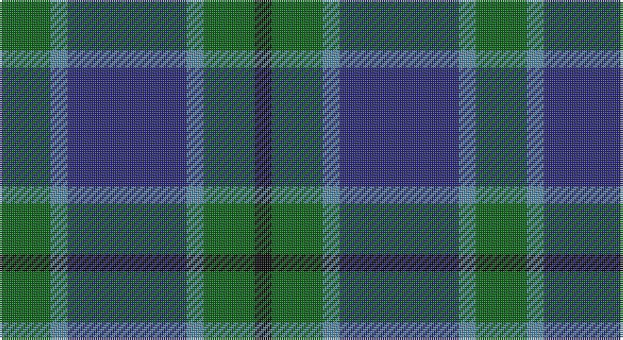

This page is one **sett** — a single exact thread-count. It belongs to the [tartan](/setts/g3t1db7t1g3k1/)
(the same proportion at any scale), whose colour order is pattern [GBBBGK](/stripes/gbbbgk/).

Part of the [Scott](/tartans/scott/) tartan — the named design grouping this sett with its other cloths.

Sourced from register-of-tartans.  It is a [6 stripe tartan](/stripes/stripes6/).

Original link https://www.tartanregister.gov.uk/tartanDetails.aspx?ref=3699

## Also known as

This cloth is also recorded under:

- Scott Black and White Personal
- Scott Clan/Family
- Scott Green
- Scott Red
- Scott, Green
- Scott, Sir Walter
- Scott, red

## Register references

External register numbers recorded for this tartan.

- Scottish Register of Tartans: [3699](https://www.tartanregister.gov.uk/tartanDetails.aspx?ref=3699)
- Scottish Tartans Authority (ITI): 50
- Scottish Tartans World Register: 50

## Thread count
G/24 B8 DBa56 B8 G24 K/8

One full sett is **224 threads**.

## Palette

Palette: <strong>Tartan Register</strong>
<table><thead><tr><th>Colour</th><th>Threads</th><th>Shade</th><th>Base</th><th>OKLCh</th></tr></thead><tbody><tr><td>G/</td><td style="text-align:right;font-variant-numeric:tabular-nums">24</td><td><code style="background-color:#006818;">#006818</code> <small style="color:#888">#006818</small></td><td>G <code style="background-color:#006100;">#006100</code></td><td><small style="color:#888">oklch(45.0% 0.142 145.0)</small></td></tr><tr><td>B</td><td style="text-align:right;font-variant-numeric:tabular-nums">8</td><td><code style="background-color:#5C8CA8;">#5C8CA8</code> <small style="color:#888">#5C8CA8</small></td><td>B <code style="background-color:#2A418A;">#2A418A</code></td><td><small style="color:#888">oklch(61.7% 0.067 235.0)</small></td></tr><tr><td>DBa</td><td style="text-align:right;font-variant-numeric:tabular-nums">56</td><td><code style="background-color:#2C2C80;">#2C2C80</code> <small style="color:#888">#2C2C80</small></td><td>B <code style="background-color:#2A418A;">#2A418A</code></td><td><small style="color:#888">oklch(35.0% 0.138 276.6)</small></td></tr><tr><td>B</td><td style="text-align:right;font-variant-numeric:tabular-nums">8</td><td><code style="background-color:#5C8CA8;">#5C8CA8</code> <small style="color:#888">#5C8CA8</small></td><td>B <code style="background-color:#2A418A;">#2A418A</code></td><td><small style="color:#888">oklch(61.7% 0.067 235.0)</small></td></tr><tr><td>G</td><td style="text-align:right;font-variant-numeric:tabular-nums">24</td><td><code style="background-color:#006818;">#006818</code> <small style="color:#888">#006818</small></td><td>G <code style="background-color:#006100;">#006100</code></td><td><small style="color:#888">oklch(45.0% 0.142 145.0)</small></td></tr><tr><td>K/</td><td style="text-align:right;font-variant-numeric:tabular-nums">8</td><td><code style="background-color:#101010;">#101010</code> <small style="color:#888">#101010</small></td><td>K <code style="background-color:#000000;">#000000</code></td><td><small style="color:#888">oklch(17.3% 0.000 89.9)</small></td></tr></tbody></table>

# Sample pattern

## Compared to the master

This cloth is one sett of its design; the master sett (the exemplar the design is anchored on) is below for comparison.

<figure style="margin:0"><figcaption style="color:#888;font-size:smaller">this sett</figcaption></figure>
<figure style="margin:0"><figcaption style="color:#888;font-size:smaller"><a href="/setts/w6k6w2k1w1k1w2k6w6k1w2/">master sett →</a></figcaption></figure>

## Nearest tartans

The nearest existing variants by ΔTartan distance, with this tartan at the top so the swatches line up against it.

ΔTartan

Tartan

Sett

—

<a href="/ttd/edit/#slug=g3t1db7t1g3k1~x8">Scott Green (Sir Walter)</a> <a class="nn-out" href="/variants/s6/g3t1db7t1g3k1~x8/" title="open its dictionary page">↗</a>

0.46

<a href="/ttd/edit/#slug=o1b7k4b1g7b1~x4&amp;base=g3t1db7t1g3k1~x8">Flower of Scotland Commemorative Tartan</a> <a class="nn-out" href="/variants/s6/o1b7k4b1g7b1~x4/" title="open its dictionary page">↗</a>

0.46

<a href="/ttd/edit/#slug=o1b7k4b1g7b1~x2&amp;base=g3t1db7t1g3k1~x8">Flower of Scotland MINI Tartan</a> <a class="nn-out" href="/variants/s6/o1b7k4b1g7b1~x2/" title="open its dictionary page">↗</a>

0.82

<a href="/ttd/edit/#slug=g8b1g1k6db6k1~x4&amp;base=g3t1db7t1g3k1~x8">Graham of Menteith</a> <a class="nn-out" href="/variants/s6/g8b1g1k6db6k1~x4/" title="open its dictionary page">↗</a>

0.88

<a href="/ttd/edit/#slug=k3g22db3g3db19r3~x2&amp;base=g3t1db7t1g3k1~x8">Davidson, Half</a> <a class="nn-out" href="/variants/s6/k3g22db3g3db19r3~x2/" title="open its dictionary page">↗</a>

1.02

<a href="/ttd/edit/#slug=g8t1g1k6db6k1~x4&amp;base=g3t1db7t1g3k1~x8">Graham of Menteith (Clan)</a> <a class="nn-out" href="/variants/s6/g8t1g1k6db6k1~x4/" title="open its dictionary page">↗</a>

1.09

<a href="/ttd/edit/#slug=g7db1g1k4dp4k1~x4&amp;base=g3t1db7t1g3k1~x8">MacArthur of Milton (Clan)</a> <a class="nn-out" href="/variants/s6/g7db1g1k4dp4k1~x4/" title="open its dictionary page">↗</a>

1.11

<a href="/ttd/edit/#slug=g3db1g8db7k3ly1~x2&amp;base=g3t1db7t1g3k1~x8">Trafalgar (Fashion)</a> <a class="nn-out" href="/variants/s6/g3db1g8db7k3ly1~x2/" title="open its dictionary page">↗</a>

1.11

<a href="/ttd/edit/#slug=g24db6t3k6db12k15g4~x2&amp;base=g3t1db7t1g3k1~x8">Blaylock Annandale (Name)</a> <a class="nn-out" href="/variants/s7/g24db6t3k6db12k15g4~x2/" title="open its dictionary page">↗</a>

1.12

<a href="/ttd/edit/#slug=dg1db5dg1k5dg6ly1~x2&amp;base=g3t1db7t1g3k1~x8">MacKay (Bonner)</a> <a class="nn-out" href="/variants/s6/dg1db5dg1k5dg6ly1~x2/" title="open its dictionary page">↗</a>

1.13

<a href="/ttd/edit/#slug=r3b25k16b3g25b3~x2&amp;base=g3t1db7t1g3k1~x8">Flower of Scotland</a> <a class="nn-out" href="/variants/s6/r3b25k16b3g25b3~x2/" title="open its dictionary page">↗</a>

## Neighbour map

Every grey dot is one of 14360 variants placed by the first two principal components of the ΔTartan feature space (44% of its variance). Red is this tartan; blue dots are its nearest — click one to open its page.

<svg viewBox="0 0 640 380" role="img" style="max-width:100%;height:auto;border:1px solid #e0e0e0;border-radius:4px;display:block" xmlns="http://www.w3.org/2000/svg"><image href="/nn/cloud.v1.png" width="640" height="380"/><a href="/variants/s6/o1b7k4b1g7b1~x4/"><circle cx="238.7" cy="253.6" r="4" fill="#3465a4"><title>Flower of Scotland Commemorative Tartan</title></circle></a><a href="/variants/s6/o1b7k4b1g7b1~x2/"><circle cx="238.7" cy="253.6" r="4" fill="#3465a4"><title>Flower of Scotland MINI Tartan</title></circle></a><a href="/variants/s6/g8b1g1k6db6k1~x4/"><circle cx="220.5" cy="251.3" r="4" fill="#3465a4"><title>Graham of Menteith</title></circle></a><a href="/variants/s6/k3g22db3g3db19r3~x2/"><circle cx="291.7" cy="239.9" r="4" fill="#3465a4"><title>Davidson, Half</title></circle></a><a href="/variants/s6/g8t1g1k6db6k1~x4/"><circle cx="218.0" cy="249.8" r="4" fill="#3465a4"><title>Graham of Menteith (Clan)</title></circle></a><a href="/variants/s6/g7db1g1k4dp4k1~x4/"><circle cx="233.2" cy="249.7" r="4" fill="#3465a4"><title>MacArthur of Milton (Clan)</title></circle></a><a href="/variants/s6/g3db1g8db7k3ly1~x2/"><circle cx="248.7" cy="248.4" r="4" fill="#3465a4"><title>Trafalgar (Fashion)</title></circle></a><a href="/variants/s7/g24db6t3k6db12k15g4~x2/"><circle cx="212.9" cy="249.2" r="4" fill="#3465a4"><title>Blaylock Annandale (Name)</title></circle></a><a href="/variants/s6/dg1db5dg1k5dg6ly1~x2/"><circle cx="213.0" cy="266.7" r="4" fill="#3465a4"><title>MacKay (Bonner)</title></circle></a><a href="/variants/s6/r3b25k16b3g25b3~x2/"><circle cx="210.3" cy="231.2" r="4" fill="#3465a4"><title>Flower of Scotland</title></circle></a><circle cx="249.7" cy="253.0" r="5" fill="#c00000"/></svg>

ID: /variants/s6/g3t1db7t1g3k1~x8/
