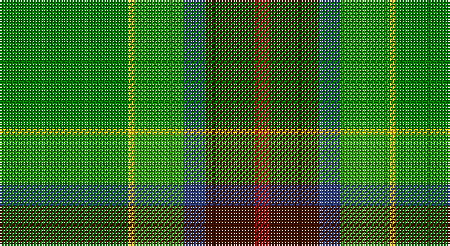

This page is one **sett** — a single exact thread-count. It belongs to the [tartan](/setts/g42ly2gi16db7dr16r5/)
(the same proportion at any scale), whose colour order is pattern [GYGBBR](/stripes/gygbbr/).

Sourced from weddslist.  It is a [6 stripe tartan](/stripes/stripes6/).

Original link http://www.weddslist.com/cgi-bin/tartans/pg.pl?source=sts

## Thread count
Ga/84 Y4 G32 B14 DR32 R/10

One full sett is **258 threads**.

## Palette

Palette: <strong>custom</strong>
<table><thead><tr><th>Colour</th><th>Threads</th><th>Shade</th><th>Base</th><th>OKLCh</th></tr></thead><tbody><tr><td>Ga/</td><td style="text-align:right;font-variant-numeric:tabular-nums">84</td><td><code style="background-color:#008000;">#008000</code> <small style="color:#888">#008000</small></td><td>G <code style="background-color:#006100;">#006100</code></td><td><small style="color:#888">oklch(52.0% 0.177 142.5)</small></td></tr><tr><td>Y</td><td style="text-align:right;font-variant-numeric:tabular-nums">4</td><td><code style="background-color:#F0C000;">#F0C000</code> <small style="color:#888">#F0C000</small></td><td>Y <code style="background-color:#F2BF00;">#F2BF00</code></td><td><small style="color:#888">oklch(82.7% 0.169 90.5)</small></td></tr><tr><td>G</td><td style="text-align:right;font-variant-numeric:tabular-nums">32</td><td><code style="background-color:#30A010;">#30A010</code> <small style="color:#888">#30A010</small></td><td>G <code style="background-color:#006100;">#006100</code></td><td><small style="color:#888">oklch(61.9% 0.195 140.5)</small></td></tr><tr><td>B</td><td style="text-align:right;font-variant-numeric:tabular-nums">14</td><td><code style="background-color:#304080;">#304080</code> <small style="color:#888">#304080</small></td><td>B <code style="background-color:#2A418A;">#2A418A</code></td><td><small style="color:#888">oklch(39.4% 0.109 270.2)</small></td></tr><tr><td>DR</td><td style="text-align:right;font-variant-numeric:tabular-nums">32</td><td><code style="background-color:#401000;">#401000</code> <small style="color:#888">#401000</small></td><td>B <code style="background-color:#2A418A;">#2A418A</code></td><td><small style="color:#888">oklch(25.3% 0.079 39.9)</small></td></tr><tr><td>R/</td><td style="text-align:right;font-variant-numeric:tabular-nums">10</td><td><code style="background-color:#C00000;">#C00000</code> <small style="color:#888">#C00000</small></td><td>R <code style="background-color:#CC0000;">#CC0000</code></td><td><small style="color:#888">oklch(50.7% 0.208 29.2)</small></td></tr></tbody></table>

# Sample pattern

## Nearest tartans

The nearest existing variants by ΔTartan distance, with this tartan at the top so the swatches line up against it.

ΔTartan

Tartan

Sett

—

<a href="/ttd/edit/#slug=g42ly2gi16db7dr16r5~x2">Waterford</a> <a class="nn-out" href="/variants/s6/g42ly2gi16db7dr16r5~x2/" title="open its dictionary page">↗</a>

1.25

<a href="/ttd/edit/#slug=g4n2gi24dy10ly12r1ly12gi2~x2&amp;base=g42ly2gi16db7dr16r5~x2">Jolley (Personal)</a> <a class="nn-out" href="/variants/s8/g4n2gi24dy10ly12r1ly12gi2~x2/" title="open its dictionary page">↗</a>

1.32

<a href="/ttd/edit/#slug=lo9g18t9r1w1db1~x4&amp;base=g42ly2gi16db7dr16r5~x2">T.H.E. C.O.G. USA (Corporate)</a> <a class="nn-out" href="/variants/s6/lo9g18t9r1w1db1~x4/" title="open its dictionary page">↗</a>

1.38

<a href="/ttd/edit/#slug=gi4r3gi24k1w7k1g24ly3~x2&amp;base=g42ly2gi16db7dr16r5~x2">Layton, Mervin</a> <a class="nn-out" href="/variants/s8/gi4r3gi24k1w7k1g24ly3~x2/" title="open its dictionary page">↗</a>

1.40

<a href="/ttd/edit/#slug=dg23r7g25ly5dg17k5ly1w1r1~x2&amp;base=g42ly2gi16db7dr16r5~x2">Cates Hunting (Clan)</a> <a class="nn-out" href="/variants/s9/dg23r7g25ly5dg17k5ly1w1r1~x2/" title="open its dictionary page">↗</a>

1.48

<a href="/variants/s8/g22r3k1g2r3t16ki3ly2~x4/">Stirling, University of Corporate Univ Tartan</a>

1.50

<a href="/ttd/edit/#slug=g22r3w1g2r3t16k3ly2~x4&amp;base=g42ly2gi16db7dr16r5~x2">Stirling University (Corporate)</a> <a class="nn-out" href="/variants/s8/g22r3w1g2r3t16k3ly2~x4/" title="open its dictionary page">↗</a>

1.51

<a href="/ttd/edit/#slug=gi18g6dy3w1dy3w1t6db6~x2&amp;base=g42ly2gi16db7dr16r5~x2">Iroquois Falls Centenary (Commem.)</a> <a class="nn-out" href="/variants/s8/gi18g6dy3w1dy3w1t6db6~x2/" title="open its dictionary page">↗</a>

1.56

<a href="/ttd/edit/#slug=r3db6ly2db15g12dg39w3~x2&amp;base=g42ly2gi16db7dr16r5~x2">Wagland (Name)</a> <a class="nn-out" href="/variants/s7/r3db6ly2db15g12dg39w3~x2/" title="open its dictionary page">↗</a>

1.56

<a href="/ttd/edit/#slug=dg3y2g12o11w1dg1ly3~x2&amp;base=g42ly2gi16db7dr16r5~x2">Braemar House</a> <a class="nn-out" href="/variants/s7/dg3y2g12o11w1dg1ly3~x2/" title="open its dictionary page">↗</a>

1.58

<a href="/ttd/edit/#slug=dg70ly6y28g56y5g11y5g11lo12&amp;base=g42ly2gi16db7dr16r5~x2">Dalwhinnie</a> <a class="nn-out" href="/variants/s9/dg70ly6y28g56y5g11y5g11lo12/" title="open its dictionary page">↗</a>

## Neighbour map

Every grey dot is one of 14360 variants placed by the first two principal components of the ΔTartan feature space (44% of its variance). Red is this tartan; blue dots are its nearest — click one to open its page.

<svg viewBox="0 0 640 380" role="img" style="max-width:100%;height:auto;border:1px solid #e0e0e0;border-radius:4px;display:block" xmlns="http://www.w3.org/2000/svg"><image href="/nn/cloud.v1.png" width="640" height="380"/><a href="/variants/s8/g4n2gi24dy10ly12r1ly12gi2~x2/"><circle cx="206.9" cy="138.8" r="4" fill="#3465a4"><title>Jolley (Personal)</title></circle></a><a href="/variants/s6/lo9g18t9r1w1db1~x4/"><circle cx="268.5" cy="172.2" r="4" fill="#3465a4"><title>T.H.E. C.O.G. USA (Corporate)</title></circle></a><a href="/variants/s8/gi4r3gi24k1w7k1g24ly3~x2/"><circle cx="218.5" cy="121.0" r="4" fill="#3465a4"><title>Layton, Mervin</title></circle></a><a href="/variants/s9/dg23r7g25ly5dg17k5ly1w1r1~x2/"><circle cx="248.2" cy="134.8" r="4" fill="#3465a4"><title>Cates Hunting (Clan)</title></circle></a><a href="/variants/s8/g22r3k1g2r3t16ki3ly2~x4/"><circle cx="249.9" cy="125.0" r="4" fill="#3465a4"><title>Stirling, University of Corporate Univ Tartan</title></circle></a><a href="/variants/s8/g22r3w1g2r3t16k3ly2~x4/"><circle cx="249.9" cy="124.2" r="4" fill="#3465a4"><title>Stirling University (Corporate)</title></circle></a><a href="/variants/s8/gi18g6dy3w1dy3w1t6db6~x2/"><circle cx="189.1" cy="154.9" r="4" fill="#3465a4"><title>Iroquois Falls Centenary (Commem.)</title></circle></a><a href="/variants/s7/r3db6ly2db15g12dg39w3~x2/"><circle cx="271.6" cy="154.6" r="4" fill="#3465a4"><title>Wagland (Name)</title></circle></a><a href="/variants/s7/dg3y2g12o11w1dg1ly3~x2/"><circle cx="158.3" cy="158.9" r="4" fill="#3465a4"><title>Braemar House</title></circle></a><a href="/variants/s9/dg70ly6y28g56y5g11y5g11lo12/"><circle cx="206.3" cy="164.8" r="4" fill="#3465a4"><title>Dalwhinnie</title></circle></a><circle cx="240.0" cy="160.8" r="5" fill="#c00000"/></svg>

ID: /variants/s6/g42ly2gi16db7dr16r5~x2/
