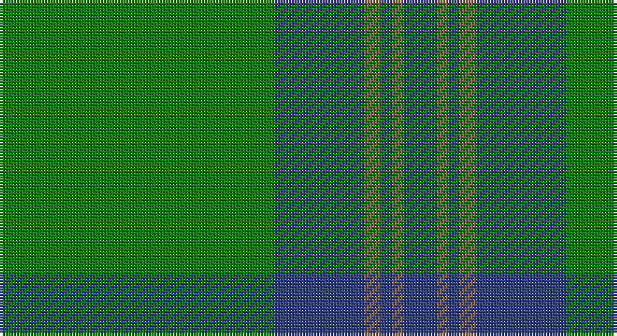

This page is one **sett** — a single exact thread-count. It belongs to the [tartan](/setts/g49db16o3db2o2db6/)
(the same proportion at any scale), whose colour order is pattern [BRBRBG](/stripes/brbrbg/).

Sourced from weddslist.  It is a [6 stripe tartan](/stripes/stripes6/).

Original link http://www.weddslist.com/cgi-bin/tartans/pg.pl?source=sts

## Thread count
G/98 B32 LT6 B4 LT4 B/12

One full sett is **202 threads**.

## Palette

Palette: <strong>custom</strong>
<table><thead><tr><th>Colour</th><th>Threads</th><th>Shade</th><th>Base</th><th>OKLCh</th></tr></thead><tbody><tr><td>G/</td><td style="text-align:right;font-variant-numeric:tabular-nums">98</td><td><code style="background-color:#008000;">#008000</code> <small style="color:#888">#008000</small></td><td>G <code style="background-color:#006100;">#006100</code></td><td><small style="color:#888">oklch(52.0% 0.177 142.5)</small></td></tr><tr><td>B</td><td style="text-align:right;font-variant-numeric:tabular-nums">32</td><td><code style="background-color:#304080;">#304080</code> <small style="color:#888">#304080</small></td><td>B <code style="background-color:#2A418A;">#2A418A</code></td><td><small style="color:#888">oklch(39.4% 0.109 270.2)</small></td></tr><tr><td>LT</td><td style="text-align:right;font-variant-numeric:tabular-nums">6</td><td><code style="background-color:#806050;">#806050</code> <small style="color:#888">#806050</small></td><td>R <code style="background-color:#CC0000;">#CC0000</code></td><td><small style="color:#888">oklch(51.7% 0.049 47.8)</small></td></tr><tr><td>B</td><td style="text-align:right;font-variant-numeric:tabular-nums">4</td><td><code style="background-color:#304080;">#304080</code> <small style="color:#888">#304080</small></td><td>B <code style="background-color:#2A418A;">#2A418A</code></td><td><small style="color:#888">oklch(39.4% 0.109 270.2)</small></td></tr><tr><td>LT</td><td style="text-align:right;font-variant-numeric:tabular-nums">4</td><td><code style="background-color:#806050;">#806050</code> <small style="color:#888">#806050</small></td><td>R <code style="background-color:#CC0000;">#CC0000</code></td><td><small style="color:#888">oklch(51.7% 0.049 47.8)</small></td></tr><tr><td>B/</td><td style="text-align:right;font-variant-numeric:tabular-nums">12</td><td><code style="background-color:#304080;">#304080</code> <small style="color:#888">#304080</small></td><td>B <code style="background-color:#2A418A;">#2A418A</code></td><td><small style="color:#888">oklch(39.4% 0.109 270.2)</small></td></tr></tbody></table>

# Sample pattern

## Nearest tartans

The nearest existing variants by ΔTartan distance, with this tartan at the top so the swatches line up against it.

ΔTartan

Tartan

Sett

—

<a href="/ttd/edit/#slug=g49db16o3db2o2db6~x2">Royal and Ancient, The</a> <a class="nn-out" href="/variants/s6/g49db16o3db2o2db6~x2/" title="open its dictionary page">↗</a>

0.90

<a href="/ttd/edit/#slug=g49db16dy3db2dy2db6~x2&amp;base=g49db16o3db2o2db6~x2">Royal and Ancient, The</a> <a class="nn-out" href="/variants/s6/g49db16dy3db2dy2db6~x2/" title="open its dictionary page">↗</a>

1.23

<a href="/ttd/edit/#slug=g44db9r2db9g2~x2&amp;base=g49db16o3db2o2db6~x2">Tyrconnell (Personal)</a> <a class="nn-out" href="/variants/s5/g44db9r2db9g2~x2/" title="open its dictionary page">↗</a>

1.31

<a href="/ttd/edit/#slug=g50db20k3db2o2db5~x2&amp;base=g49db16o3db2o2db6~x2">St Andrews Hotel, Golf Resort, and SPA</a> <a class="nn-out" href="/variants/s6/g50db20k3db2o2db5~x2/" title="open its dictionary page">↗</a>

1.32

<a href="/ttd/edit/#slug=g50db20k3db2dy2db5~x2&amp;base=g49db16o3db2o2db6~x2">St Andrews Old Course Hotel Corporate Tartan</a> <a class="nn-out" href="/variants/s6/g50db20k3db2dy2db5~x2/" title="open its dictionary page">↗</a>

1.55

<a href="/ttd/edit/#slug=gi16dg1lg4dg41lg1dg6g2dg2~x2&amp;base=g49db16o3db2o2db6~x2">Semper</a> <a class="nn-out" href="/variants/s8/gi16dg1lg4dg41lg1dg6g2dg2~x2/" title="open its dictionary page">↗</a>

1.60

<a href="/ttd/edit/#slug=dg32k6dg4k8r1k2~x4&amp;base=g49db16o3db2o2db6~x2">Fife, Duke Of</a> <a class="nn-out" href="/variants/s6/dg32k6dg4k8r1k2~x4/" title="open its dictionary page">↗</a>

1.64

<a href="/ttd/edit/#slug=g44k2g2k2g3k12db10r3~x2&amp;base=g49db16o3db2o2db6~x2">Celtic (New) Corporate Sport Tartan</a> <a class="nn-out" href="/variants/s8/g44k2g2k2g3k12db10r3~x2/" title="open its dictionary page">↗</a>

1.68

<a href="/ttd/edit/#slug=gi16dg1y4dg41y1dg6g2dg2~x2&amp;base=g49db16o3db2o2db6~x2">Semper</a> <a class="nn-out" href="/variants/s8/gi16dg1y4dg41y1dg6g2dg2~x2/" title="open its dictionary page">↗</a>

1.78

<a href="/ttd/edit/#slug=g47r3g6db35ly3~x2&amp;base=g49db16o3db2o2db6~x2">Gracie</a> <a class="nn-out" href="/variants/s5/g47r3g6db35ly3~x2/" title="open its dictionary page">↗</a>

1.78

<a href="/ttd/edit/#slug=r3g22db16g14r2g6ly1~x2&amp;base=g49db16o3db2o2db6~x2">Scottish Scouts</a> <a class="nn-out" href="/variants/s7/r3g22db16g14r2g6ly1~x2/" title="open its dictionary page">↗</a>

## Neighbour map

Every grey dot is one of 14360 variants placed by the first two principal components of the ΔTartan feature space (44% of its variance). Red is this tartan; blue dots are its nearest — click one to open its page.

<svg viewBox="0 0 640 380" role="img" style="max-width:100%;height:auto;border:1px solid #e0e0e0;border-radius:4px;display:block" xmlns="http://www.w3.org/2000/svg"><image href="/nn/cloud.v1.png" width="640" height="380"/><a href="/variants/s6/g49db16dy3db2dy2db6~x2/"><circle cx="484.8" cy="209.7" r="4" fill="#3465a4"><title>Royal and Ancient, The</title></circle></a><a href="/variants/s5/g44db9r2db9g2~x2/"><circle cx="512.3" cy="221.4" r="4" fill="#3465a4"><title>Tyrconnell (Personal)</title></circle></a><a href="/variants/s6/g50db20k3db2o2db5~x2/"><circle cx="416.1" cy="173.6" r="4" fill="#3465a4"><title>St Andrews Hotel, Golf Resort, and SPA</title></circle></a><a href="/variants/s6/g50db20k3db2dy2db5~x2/"><circle cx="446.9" cy="189.2" r="4" fill="#3465a4"><title>St Andrews Old Course Hotel Corporate Tartan</title></circle></a><a href="/variants/s8/gi16dg1lg4dg41lg1dg6g2dg2~x2/"><circle cx="503.0" cy="153.0" r="4" fill="#3465a4"><title>Semper</title></circle></a><a href="/variants/s6/dg32k6dg4k8r1k2~x4/"><circle cx="529.9" cy="209.0" r="4" fill="#3465a4"><title>Fife, Duke Of</title></circle></a><a href="/variants/s8/g44k2g2k2g3k12db10r3~x2/"><circle cx="419.3" cy="165.0" r="4" fill="#3465a4"><title>Celtic (New) Corporate Sport Tartan</title></circle></a><a href="/variants/s8/gi16dg1y4dg41y1dg6g2dg2~x2/"><circle cx="512.2" cy="157.8" r="4" fill="#3465a4"><title>Semper</title></circle></a><a href="/variants/s5/g47r3g6db35ly3~x2/"><circle cx="363.9" cy="213.0" r="4" fill="#3465a4"><title>Gracie</title></circle></a><a href="/variants/s7/r3g22db16g14r2g6ly1~x2/"><circle cx="407.9" cy="202.5" r="4" fill="#3465a4"><title>Scottish Scouts</title></circle></a><circle cx="470.2" cy="201.7" r="5" fill="#c00000"/></svg>

ID: /variants/s6/g49db16o3db2o2db6~x2/
