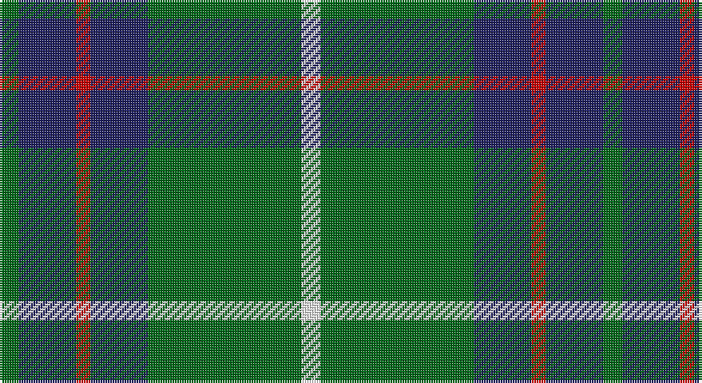

This page is one **sett** — a single exact thread-count. It belongs to the [tartan](/setts/g4db12r3db12g32w4/)
(the same proportion at any scale), whose colour order is pattern [GBRBGW](/stripes/gbrbgw/).

Sourced from register-of-tartans.  It is a [6 stripe tartan](/stripes/stripes6/).

Original link https://www.tartanregister.gov.uk/tartanDetails.aspx?ref=2485

## Provenance

Earliest known date: 1800 There is a doublet in Kingussie Museum dated 1800 in this tartan. It also appeared in the Vestiarium Scoticum (1842).

## Also known as

This cloth is also recorded under:

- MacIntyre
- MacIntyre Hunting
- MacIntyre LC

3 attestations — the source records this cloth was collapsed from (oldest owns this page)

<ul>
<li>01/01/1840 — MacIntyre Hunting (VS) (register-of-tartans, <a href="https://www.tartanregister.gov.uk/tartanDetails.aspx?ref=2485">record</a>)</li>
<li>1840 — MacIntyre - 1842 (VS) (Clan) (tartans-authority, <a href="http://www.tartansauthority.com/tartan-ferret/display/743/">record</a>)</li>
<li>undated — MacIntyre Hunting Clan Tartan (house-of-tartan, <a href="http://www.house-of-tartan.scotland.net/house/TartanViewjs.asp?colr=Def&tnam=743">record</a>)</li>
</ul>

## Register references

External register numbers recorded for this tartan.

- Scottish Register of Tartans: [2485](https://www.tartanregister.gov.uk/tartanDetails.aspx?ref=2485)
- Scottish Tartans Authority (ITI): 743
- Scottish Tartans World Register: 743

## Thread count
G/8 DB24 R6 DB24 G64 W/8

One full sett is **252 threads**.

## Palette

Palette: <strong>Tartan Register</strong>
<table><thead><tr><th>Colour</th><th>Threads</th><th>Shade</th><th>Base</th><th>OKLCh</th></tr></thead><tbody><tr><td>G/</td><td style="text-align:right;font-variant-numeric:tabular-nums">8</td><td><code style="background-color:#006818;">#006818</code> <small style="color:#888">#006818</small></td><td>G <code style="background-color:#006100;">#006100</code></td><td><small style="color:#888">oklch(45.0% 0.142 145.0)</small></td></tr><tr><td>DB</td><td style="text-align:right;font-variant-numeric:tabular-nums">24</td><td><code style="background-color:#202060;">#202060</code> <small style="color:#888">#202060</small></td><td>B <code style="background-color:#2A418A;">#2A418A</code></td><td><small style="color:#888">oklch(28.9% 0.111 276.9)</small></td></tr><tr><td>R</td><td style="text-align:right;font-variant-numeric:tabular-nums">6</td><td><code style="background-color:#C80000;">#C80000</code> <small style="color:#888">#C80000</small></td><td>R <code style="background-color:#CC0000;">#CC0000</code></td><td><small style="color:#888">oklch(52.3% 0.215 29.2)</small></td></tr><tr><td>DB</td><td style="text-align:right;font-variant-numeric:tabular-nums">24</td><td><code style="background-color:#202060;">#202060</code> <small style="color:#888">#202060</small></td><td>B <code style="background-color:#2A418A;">#2A418A</code></td><td><small style="color:#888">oklch(28.9% 0.111 276.9)</small></td></tr><tr><td>G</td><td style="text-align:right;font-variant-numeric:tabular-nums">64</td><td><code style="background-color:#006818;">#006818</code> <small style="color:#888">#006818</small></td><td>G <code style="background-color:#006100;">#006100</code></td><td><small style="color:#888">oklch(45.0% 0.142 145.0)</small></td></tr><tr><td>W/</td><td style="text-align:right;font-variant-numeric:tabular-nums">8</td><td><code style="background-color:#FCFCFC;">#FCFCFC</code> <small style="color:#888">#FCFCFC</small></td><td>W <code style="background-color:#F7F7F7;">#F7F7F7</code></td><td><small style="color:#888">oklch(99.1% 0.000 89.9)</small></td></tr></tbody></table>

# Sample pattern

## Nearest tartans

The nearest existing variants by ΔTartan distance, with this tartan at the top so the swatches line up against it.

ΔTartan

Tartan

Sett

—

<a href="/ttd/edit/#slug=g4db12r3db12g32w4~x2">MacIntyre Hunting (VS)</a> <a class="nn-out" href="/variants/s6/g4db12r3db12g32w4~x2/" title="open its dictionary page">↗</a>

0.71

<a href="/ttd/edit/#slug=g40k15b10k10ly3~x2&amp;base=g4db12r3db12g32w4~x2">U.S. Border Patrol (Corporate)</a> <a class="nn-out" href="/variants/s5/g40k15b10k10ly3~x2/" title="open its dictionary page">↗</a>

0.75

<a href="/ttd/edit/#slug=db8r4db24g35lb4g8&amp;base=g4db12r3db12g32w4~x2">Heritage Tartan, The</a> <a class="nn-out" href="/variants/s6/db8r4db24g35lb4g8/" title="open its dictionary page">↗</a>

0.79

<a href="/ttd/edit/#slug=dg4db12r3db12dg32lb4&amp;base=g4db12r3db12g32w4~x2">MacIntyre L</a> <a class="nn-out" href="/variants/s6/dg4db12r3db12dg32lb4/" title="open its dictionary page">↗</a>

0.83

<a href="/ttd/edit/#slug=k5g2k5g2db8g25w4~x2&amp;base=g4db12r3db12g32w4~x2">Keppoch</a> <a class="nn-out" href="/variants/s7/k5g2k5g2db8g25w4~x2/" title="open its dictionary page">↗</a>

0.86

<a href="/ttd/edit/#slug=r3g10r3g14db16g3ly2~x2&amp;base=g4db12r3db12g32w4~x2">Cameron of Lochiel (Hunting)</a> <a class="nn-out" href="/variants/s7/r3g10r3g14db16g3ly2~x2/" title="open its dictionary page">↗</a>

0.88

<a href="/ttd/edit/#slug=db5w3db36g38ly5g5~x2&amp;base=g4db12r3db12g32w4~x2">St. Andrew Society, Sao Paulo (Corp)</a> <a class="nn-out" href="/variants/s6/db5w3db36g38ly5g5~x2/" title="open its dictionary page">↗</a>

0.93

<a href="/ttd/edit/#slug=r2db32g14db5g16w2~x2&amp;base=g4db12r3db12g32w4~x2">Connacht Irish District Tartan</a> <a class="nn-out" href="/variants/s6/r2db32g14db5g16w2~x2/" title="open its dictionary page">↗</a>

1.03

<a href="/ttd/edit/#slug=r3dg10r3dg14db16dg3ly2&amp;base=g4db12r3db12g32w4~x2">Cameron Hunting</a> <a class="nn-out" href="/variants/s7/r3dg10r3dg14db16dg3ly2/" title="open its dictionary page">↗</a>

1.05

<a href="/ttd/edit/#slug=dg4db12r3db12dg32w4~x2&amp;base=g4db12r3db12g32w4~x2">MacIntyre</a> <a class="nn-out" href="/variants/s6/dg4db12r3db12dg32w4~x2/" title="open its dictionary page">↗</a>

1.08

<a href="/ttd/edit/#slug=db1k1db8ly1g12ly1db8k1db1~x2&amp;base=g4db12r3db12g32w4~x2">Rowan</a> <a class="nn-out" href="/variants/s9/db1k1db8ly1g12ly1db8k1db1~x2/" title="open its dictionary page">↗</a>

## Neighbour map

Every grey dot is one of 14360 variants placed by the first two principal components of the ΔTartan feature space (44% of its variance). Red is this tartan; blue dots are its nearest — click one to open its page.

<svg viewBox="0 0 640 380" role="img" style="max-width:100%;height:auto;border:1px solid #e0e0e0;border-radius:4px;display:block" xmlns="http://www.w3.org/2000/svg"><image href="/nn/cloud.v1.png" width="640" height="380"/><a href="/variants/s5/g40k15b10k10ly3~x2/"><circle cx="279.6" cy="217.2" r="4" fill="#3465a4"><title>U.S. Border Patrol (Corporate)</title></circle></a><a href="/variants/s6/db8r4db24g35lb4g8/"><circle cx="284.6" cy="229.3" r="4" fill="#3465a4"><title>Heritage Tartan, The</title></circle></a><a href="/variants/s6/dg4db12r3db12dg32lb4/"><circle cx="301.0" cy="219.4" r="4" fill="#3465a4"><title>MacIntyre L</title></circle></a><a href="/variants/s7/k5g2k5g2db8g25w4~x2/"><circle cx="296.9" cy="187.5" r="4" fill="#3465a4"><title>Keppoch</title></circle></a><a href="/variants/s7/r3g10r3g14db16g3ly2~x2/"><circle cx="259.6" cy="225.9" r="4" fill="#3465a4"><title>Cameron of Lochiel (Hunting)</title></circle></a><a href="/variants/s6/db5w3db36g38ly5g5~x2/"><circle cx="293.6" cy="202.5" r="4" fill="#3465a4"><title>St. Andrew Society, Sao Paulo (Corp)</title></circle></a><a href="/variants/s6/r2db32g14db5g16w2~x2/"><circle cx="323.1" cy="202.9" r="4" fill="#3465a4"><title>Connacht Irish District Tartan</title></circle></a><a href="/variants/s7/r3dg10r3dg14db16dg3ly2/"><circle cx="263.4" cy="230.7" r="4" fill="#3465a4"><title>Cameron Hunting</title></circle></a><a href="/variants/s6/dg4db12r3db12dg32w4~x2/"><circle cx="323.0" cy="226.7" r="4" fill="#3465a4"><title>MacIntyre</title></circle></a><a href="/variants/s9/db1k1db8ly1g12ly1db8k1db1~x2/"><circle cx="296.9" cy="177.8" r="4" fill="#3465a4"><title>Rowan</title></circle></a><circle cx="294.7" cy="211.8" r="5" fill="#c00000"/></svg>

ID: /variants/s6/g4db12r3db12g32w4~x2/
