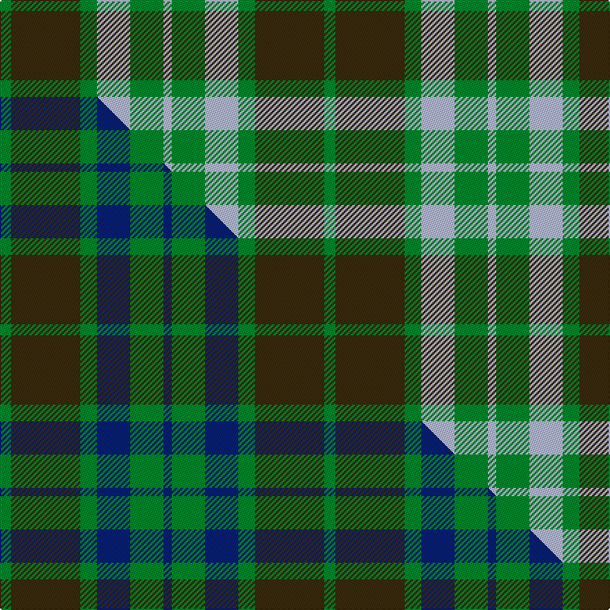

This page is one **sett** — a single exact thread-count. It belongs to the [tartan](/setts/g4dy25g6lb12g12lb3/)
(the same proportion at any scale), whose colour order is pattern [GGGWGW](/stripes/gggwgw/).

Part of the [Canadian Fancy](/tartans/canadian-fancy/) tartan — the named design grouping this sett with its other cloths.

Sourced from tartans-authority.  It is a [6 stripe tartan](/stripes/stripes6/).

Original link https://www.tartanregister.gov.uk/tartanDetails.aspx?ref=124

Dataset <small>— provenance for this record, inherited from the source manifest</small>

<dl class="dataset-prov">
<dt>source</dt><dd><a href="/sources/tartans-authority/">Scottish Tartans Authority</a></dd>
<dt>data captured from</dt><dd><a href="https://github.com/thetartan/tartan-database/blob/master/data/tartans-authority/data.csv">https://github.com/thetartan/tartan-database/blob/master/data/tartans-authority/data.csv</a></dd>
<dt>data date</dt><dd>circa 1970 <small>(this record)</small></dd>
<dt>licence</dt><dd><a href="https://creativecommons.org/licenses/by-nc-nd/4.0/">CC BY-NC-ND 4.0</a></dd>
</dl>

Capture chain <small>— the hands this data passed through, oldest first; each capture carries its own licence</small>

<ol class="capture-chain">
<li><a href="https://www.tartansauthority.com/">Scottish Tartans Authority</a> <small>the heritage body's archive — its tartan-ferret record browser is retired (links repaired to the SRT, above)</small></li>
<li><a href="https://github.com/thetartan/tartan-database">thetartan/tartan-database</a> <small>2016-2017</small> · <a href="https://creativecommons.org/licenses/by-nc-nd/4.0/">CC BY-NC-ND 4.0</a> <small>Levko Kravets's frozen compilation — the capture we vendored, and where its CC licence text came from</small></li>
<li>this dictionary <small>captured 2026-06-10 · commit 5bf86c7566</small> <small>each re-capture is a git commit to data/sources</small></li>
</ol>

## Register references

External register numbers recorded for this tartan.

- Scottish Tartans Authority (ITI): 124

## Thread count
G/8 DY50 G12 LB24 G24 LB/6

One full sett is **234 threads**.

## Palette
<table><thead><tr><th>Colour</th><th>Shade</th><th>OKLCh</th></tr></thead><tbody><tr><td>LB</td><td><code style="background-color:#B5BBDE;">#B5BBDE</code> <small style="color:#888">#B5BBDE</small></td><td><small style="color:#888">oklch(79.9% 0.050 277.6)</small></td></tr><tr><td>G</td><td><code style="background-color:#008B2A;">#008B2A</code> <small style="color:#888">#008B2A</small></td><td><small style="color:#888">oklch(55.4% 0.170 145.9)</small></td></tr><tr><td>DY</td><td><code style="background-color:#3A2B0D;">#3A2B0D</code> <small style="color:#888">#3A2B0D</small></td><td><small style="color:#888">oklch(30.0% 0.049 82.0)</small></td></tr></tbody></table>

# Sample pattern

## Compared to the master

This cloth is one sett of its design; the master sett (the exemplar the design is anchored on) is below for comparison.

Its **ΔTartan distance** from the master is **0.18** — the same measure the nearest-tartans table ranks by (0 is identical; a re-scale of the same cloth is near 0, a recolour or a different proportion further).

<figure class="master-compare" style="margin:0">

this sett
master sett ★

<figcaption style="color:#888;font-size:smaller">One weave of this sett against the <a href="/setts/g4dy25g6db12g12db3/">master sett ★</a>, split on the diagonal: a shared proportion runs seamlessly across it with only the shades shifting; a different proportion breaks on it.</figcaption>
</figure>

## Nearest tartan variants

The nearest existing variants by ΔTartan distance, with this cloth at the top so the swatches line up against it.

ΔTartan

Threads

Variant

Sett

—

234

<a href="/variants/s6/g4dy25g6lb12g12lb3~x2/">Canadian Fancy (Fashion)</a>

<a href="/ttd/edit/#slug=g4dy25g6db12g12db3~x2&amp;base=g4dy25g6lb12g12lb3~x2" title="compare in the TTD">0.18</a>

234

<a href="/variants/s6/g4dy25g6db12g12db3~x2/">Canadian Fancy</a>

<a href="/ttd/edit/#slug=dg2ly14dg8ly3dg12db2~x2&amp;base=g4dy25g6lb12g12lb3~x2" title="compare in the TTD">1.52</a>

156

<a href="/variants/s6/dg2ly14dg8ly3dg12db2~x2/">Confederate Infantry</a>

<a href="/ttd/edit/#slug=dy28g2dy4db18g23db2g3ly4~x2&amp;base=g4dy25g6lb12g12lb3~x2" title="compare in the TTD">1.79</a>

272

<a href="/variants/s8/dy28g2dy4db18g23db2g3ly4~x2/">Eastern Western Motor Group, Dalbraith</a>

<a href="/ttd/edit/#slug=r3g10r3g14db16g3y2~x2&amp;base=g4dy25g6lb12g12lb3~x2" title="compare in the TTD">2.13</a>

194

<a href="/variants/s7/r3g10r3g14db16g3y2~x2/">Cameron of Lochiel (Hunting)</a>

<a href="/ttd/edit/#slug=r3g10r3g14db16g3y2&amp;base=g4dy25g6lb12g12lb3~x2" title="compare in the TTD">2.13</a>

97

<a href="/variants/s7/r3g10r3g14db16g3y2/">Cameron Hunting</a>

<a href="/ttd/edit/#slug=r3g10r3g14db16g3dy2~x2&amp;base=g4dy25g6lb12g12lb3~x2" title="compare in the TTD">2.13</a>

194

<a href="/variants/s7/r3g10r3g14db16g3dy2~x2/">Cameron Hunting Clan Tartan</a>

<a href="/ttd/edit/#slug=g4lb31g7dr14g11dr3~x2&amp;base=g4dy25g6lb12g12lb3~x2" title="compare in the TTD">2.70</a>

266

<a href="/variants/s6/g4lb31g7dr14g11dr3~x2/">Gleneagles USA (Dalgleish)</a>

<a href="/ttd/edit/#slug=dy1r1dy2db11g5db1g8r1~x4~g2408144&amp;base=g4dy25g6lb12g12lb3~x2" title="compare in the TTD">2.73</a>

232

<a href="/variants/s8/dy1r1dy2db11g5db1g8r1~x4~g2408144/">New Mexico, State of</a>

<a href="/ttd/edit/#slug=g25dr4db24dr21g25dr4db2~x2&amp;base=g4dy25g6lb12g12lb3~x2" title="compare in the TTD">2.89</a>

366

<a href="/variants/s7/g25dr4db24dr21g25dr4db2~x2/">Glasgow, Rock and Wheel</a>

<a href="/ttd/edit/#slug=b2w2y7dg14b2w2~x2&amp;base=g4dy25g6lb12g12lb3~x2" title="compare in the TTD">3.00</a>

108

<a href="/variants/s6/b2w2y7dg14b2w2~x2/">Cairngorm</a>

## Neighbour map

Every grey dot is one of 13620 variants placed by the first two principal components of the ΔTartan feature space (42% of its variance). Red is this tartan; blue dots are its nearest — click one to open its page.

<svg viewBox="0 0 640 380" role="img" style="max-width:100%;height:auto;border:1px solid #e0e0e0;border-radius:4px;display:block" xmlns="http://www.w3.org/2000/svg"><image href="/nn/cloud.v1.png" width="640" height="380"/><a href="/variants/s6/g4dy25g6db12g12db3~x2/"><circle cx="298.2" cy="278.9" r="4" fill="#3465a4"><title>Canadian Fancy</title></circle></a><a href="/variants/s6/dg2ly14dg8ly3dg12db2~x2/"><circle cx="306.3" cy="262.2" r="4" fill="#3465a4"><title>Confederate Infantry</title></circle></a><a href="/variants/s8/dy28g2dy4db18g23db2g3ly4~x2/"><circle cx="269.9" cy="209.2" r="4" fill="#3465a4"><title>Eastern Western Motor Group, Dalbraith</title></circle></a><a href="/variants/s7/r3g10r3g14db16g3y2~x2/"><circle cx="279.0" cy="230.7" r="4" fill="#3465a4"><title>Cameron of Lochiel (Hunting)</title></circle></a><a href="/variants/s7/r3g10r3g14db16g3y2/"><circle cx="279.0" cy="230.7" r="4" fill="#3465a4"><title>Cameron Hunting</title></circle></a><a href="/variants/s7/r3g10r3g14db16g3dy2~x2/"><circle cx="277.4" cy="230.0" r="4" fill="#3465a4"><title>Cameron Hunting Clan Tartan</title></circle></a><a href="/variants/s6/g4lb31g7dr14g11dr3~x2/"><circle cx="279.2" cy="245.7" r="4" fill="#3465a4"><title>Gleneagles USA (Dalgleish)</title></circle></a><a href="/variants/s8/dy1r1dy2db11g5db1g8r1~x4~g2408144/"><circle cx="246.7" cy="193.7" r="4" fill="#3465a4"><title>New Mexico, State of</title></circle></a><a href="/variants/s7/g25dr4db24dr21g25dr4db2~x2/"><circle cx="312.6" cy="254.9" r="4" fill="#3465a4"><title>Glasgow, Rock and Wheel</title></circle></a><a href="/variants/s6/b2w2y7dg14b2w2~x2/"><circle cx="252.8" cy="232.4" r="4" fill="#3465a4"><title>Cairngorm</title></circle></a><circle cx="254.5" cy="264.6" r="5" fill="#c00000"/><text x="320" y="376" text-anchor="middle" font-size="11" fill="#999">ground</text><text x="11" y="190" text-anchor="middle" font-size="11" fill="#999" transform="rotate(-90 11 190)">complexity</text></svg>

ID: /variants/s6/g4dy25g6lb12g12lb3~x2/
