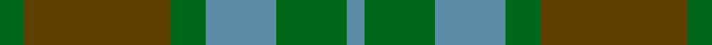
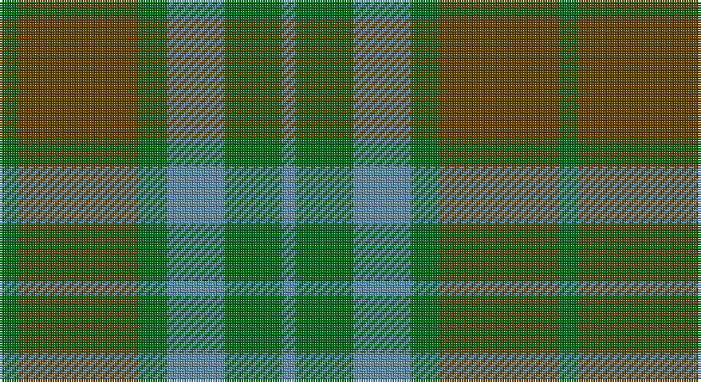

This page is one **sett** — a single exact thread-count. It belongs to the [tartan](/setts/g4dy25g6t12g12t3/)
(the same proportion at any scale), whose colour order is pattern [BGBGGG](/stripes/bgbggg/).

Sourced from register-of-tartans.  It is a [6 stripe tartan](/stripes/stripes6/).

Original link https://www.tartanregister.gov.uk/tartanDetails.aspx?ref=547

2 attestations — the source records this cloth was collapsed from (oldest owns this page)

<ul>
<li>01/01/1970 — Canadian Fancy (register-of-tartans, <a href="https://www.tartanregister.gov.uk/tartanDetails.aspx?ref=547">record</a>)</li>
<li>circa 1970 — Canadian Fancy (Fashion) (tartans-authority, <a href="http://www.tartansauthority.com/tartan-ferret/display/124/">record</a>)</li>
</ul>

## Register references

External register numbers recorded for this tartan.

- Scottish Register of Tartans: [547](https://www.tartanregister.gov.uk/tartanDetails.aspx?ref=547)
- Scottish Tartans Authority (ITI): 124
- Scottish Tartans World Register: 124

## Thread count
G/8 T50 G12 B24 G24 B/6

One full sett is **234 threads**.

## Palette

Palette: <strong>Tartan Register</strong>
<table><thead><tr><th>Colour</th><th>Threads</th><th>Shade</th><th>Base</th><th>OKLCh</th></tr></thead><tbody><tr><td>G/</td><td style="text-align:right;font-variant-numeric:tabular-nums">8</td><td><code style="background-color:#006818;">#006818</code> <small style="color:#888">#006818</small></td><td>G <code style="background-color:#006100;">#006100</code></td><td><small style="color:#888">oklch(45.0% 0.142 145.0)</small></td></tr><tr><td>T</td><td style="text-align:right;font-variant-numeric:tabular-nums">50</td><td><code style="background-color:#604000;">#604000</code> <small style="color:#888">#604000</small></td><td>G <code style="background-color:#006100;">#006100</code></td><td><small style="color:#888">oklch(39.8% 0.083 76.8)</small></td></tr><tr><td>G</td><td style="text-align:right;font-variant-numeric:tabular-nums">12</td><td><code style="background-color:#006818;">#006818</code> <small style="color:#888">#006818</small></td><td>G <code style="background-color:#006100;">#006100</code></td><td><small style="color:#888">oklch(45.0% 0.142 145.0)</small></td></tr><tr><td>B</td><td style="text-align:right;font-variant-numeric:tabular-nums">24</td><td><code style="background-color:#5C8CA8;">#5C8CA8</code> <small style="color:#888">#5C8CA8</small></td><td>B <code style="background-color:#2A418A;">#2A418A</code></td><td><small style="color:#888">oklch(61.7% 0.067 235.0)</small></td></tr><tr><td>G</td><td style="text-align:right;font-variant-numeric:tabular-nums">24</td><td><code style="background-color:#006818;">#006818</code> <small style="color:#888">#006818</small></td><td>G <code style="background-color:#006100;">#006100</code></td><td><small style="color:#888">oklch(45.0% 0.142 145.0)</small></td></tr><tr><td>B/</td><td style="text-align:right;font-variant-numeric:tabular-nums">6</td><td><code style="background-color:#5C8CA8;">#5C8CA8</code> <small style="color:#888">#5C8CA8</small></td><td>B <code style="background-color:#2A418A;">#2A418A</code></td><td><small style="color:#888">oklch(61.7% 0.067 235.0)</small></td></tr></tbody></table>

# Sample pattern

## Nearest tartans

The nearest existing variants by ΔTartan distance, with this tartan at the top so the swatches line up against it.

ΔTartan

Tartan

Sett

—

<a href="/ttd/edit/#slug=g4dy25g6t12g12t3~x2">Canadian Fancy</a> <a class="nn-out" href="/variants/s6/g4dy25g6t12g12t3~x2/" title="open its dictionary page">↗</a>

0.88

<a href="/ttd/edit/#slug=g4o25g6t12g12t3~x2&amp;base=g4dy25g6t12g12t3~x2">Canadian Fancy</a> <a class="nn-out" href="/variants/s6/g4o25g6t12g12t3~x2/" title="open its dictionary page">↗</a>

1.23

<a href="/ttd/edit/#slug=dt1dy1dt7dy5y7lr1~x4&amp;base=g4dy25g6t12g12t3~x2">Dewar (WCWM)</a> <a class="nn-out" href="/variants/s6/dt1dy1dt7dy5y7lr1~x4/" title="open its dictionary page">↗</a>

1.34

<a href="/ttd/edit/#slug=g7dy6dt7dy1dt2~x6&amp;base=g4dy25g6t12g12t3~x2">Bright of Garth (Personal)</a> <a class="nn-out" href="/variants/s5/g7dy6dt7dy1dt2~x6/" title="open its dictionary page">↗</a>

1.35

<a href="/ttd/edit/#slug=g7y6n7y1n2~x6&amp;base=g4dy25g6t12g12t3~x2">Bright of Garth (Personal)</a> <a class="nn-out" href="/variants/s5/g7y6n7y1n2~x6/" title="open its dictionary page">↗</a>

1.46

<a href="/ttd/edit/#slug=yi12dg2yi2dg2yi2dy8y8dy1~x2&amp;base=g4dy25g6t12g12t3~x2">Ancient Universal (Fashion?)</a> <a class="nn-out" href="/variants/s8/yi12dg2yi2dg2yi2dy8y8dy1~x2/" title="open its dictionary page">↗</a>

1.58

<a href="/ttd/edit/#slug=db3dy7g2y2g14dy2g2db3~x2&amp;base=g4dy25g6t12g12t3~x2">Daks (Loden)</a> <a class="nn-out" href="/variants/s8/db3dy7g2y2g14dy2g2db3~x2/" title="open its dictionary page">↗</a>

1.60

<a href="/ttd/edit/#slug=t3dg1t10dg4dy10t2~x4&amp;base=g4dy25g6t12g12t3~x2">Rob Roy (Film) (Corporate)</a> <a class="nn-out" href="/variants/s6/t3dg1t10dg4dy10t2~x4/" title="open its dictionary page">↗</a>

1.65

<a href="/ttd/edit/#slug=g1dy8g8r1g8dy8w1~x2&amp;base=g4dy25g6t12g12t3~x2">MacKinnon Hunting Clan Tartan</a> <a class="nn-out" href="/variants/s7/g1dy8g8r1g8dy8w1~x2/" title="open its dictionary page">↗</a>

1.65

<a href="/ttd/edit/#slug=g1o8g8r1g8o8w1~x4&amp;base=g4dy25g6t12g12t3~x2">MacKinnon, hunting</a> <a class="nn-out" href="/variants/s7/g1o8g8r1g8o8w1~x4/" title="open its dictionary page">↗</a>

1.66

<a href="/ttd/edit/#slug=g5k2g28k10dy26db4g4~x2&amp;base=g4dy25g6t12g12t3~x2">John Telfar Dunbar/Hunting Tartan</a> <a class="nn-out" href="/variants/s7/g5k2g28k10dy26db4g4~x2/" title="open its dictionary page">↗</a>

## Neighbour map

Every grey dot is one of 14360 variants placed by the first two principal components of the ΔTartan feature space (44% of its variance). Red is this tartan; blue dots are its nearest — click one to open its page.

<svg viewBox="0 0 640 380" role="img" style="max-width:100%;height:auto;border:1px solid #e0e0e0;border-radius:4px;display:block" xmlns="http://www.w3.org/2000/svg"><image href="/nn/cloud.v1.png" width="640" height="380"/><a href="/variants/s6/g4o25g6t12g12t3~x2/"><circle cx="315.4" cy="295.0" r="4" fill="#3465a4"><title>Canadian Fancy</title></circle></a><a href="/variants/s6/dt1dy1dt7dy5y7lr1~x4/"><circle cx="256.3" cy="273.3" r="4" fill="#3465a4"><title>Dewar (WCWM)</title></circle></a><a href="/variants/s5/g7dy6dt7dy1dt2~x6/"><circle cx="292.6" cy="333.0" r="4" fill="#3465a4"><title>Bright of Garth (Personal)</title></circle></a><a href="/variants/s5/g7y6n7y1n2~x6/"><circle cx="302.2" cy="335.7" r="4" fill="#3465a4"><title>Bright of Garth (Personal)</title></circle></a><a href="/variants/s8/yi12dg2yi2dg2yi2dy8y8dy1~x2/"><circle cx="283.4" cy="227.7" r="4" fill="#3465a4"><title>Ancient Universal (Fashion?)</title></circle></a><a href="/variants/s8/db3dy7g2y2g14dy2g2db3~x2/"><circle cx="329.5" cy="256.6" r="4" fill="#3465a4"><title>Daks (Loden)</title></circle></a><a href="/variants/s6/t3dg1t10dg4dy10t2~x4/"><circle cx="334.1" cy="266.3" r="4" fill="#3465a4"><title>Rob Roy (Film) (Corporate)</title></circle></a><a href="/variants/s7/g1dy8g8r1g8dy8w1~x2/"><circle cx="353.0" cy="282.1" r="4" fill="#3465a4"><title>MacKinnon Hunting Clan Tartan</title></circle></a><a href="/variants/s7/g1o8g8r1g8o8w1~x4/"><circle cx="334.8" cy="268.5" r="4" fill="#3465a4"><title>MacKinnon, hunting</title></circle></a><a href="/variants/s7/g5k2g28k10dy26db4g4~x2/"><circle cx="333.4" cy="234.6" r="4" fill="#3465a4"><title>John Telfar Dunbar/Hunting Tartan</title></circle></a><circle cx="302.4" cy="289.8" r="5" fill="#c00000"/></svg>

ID: /variants/s6/g4dy25g6t12g12t3~x2/
